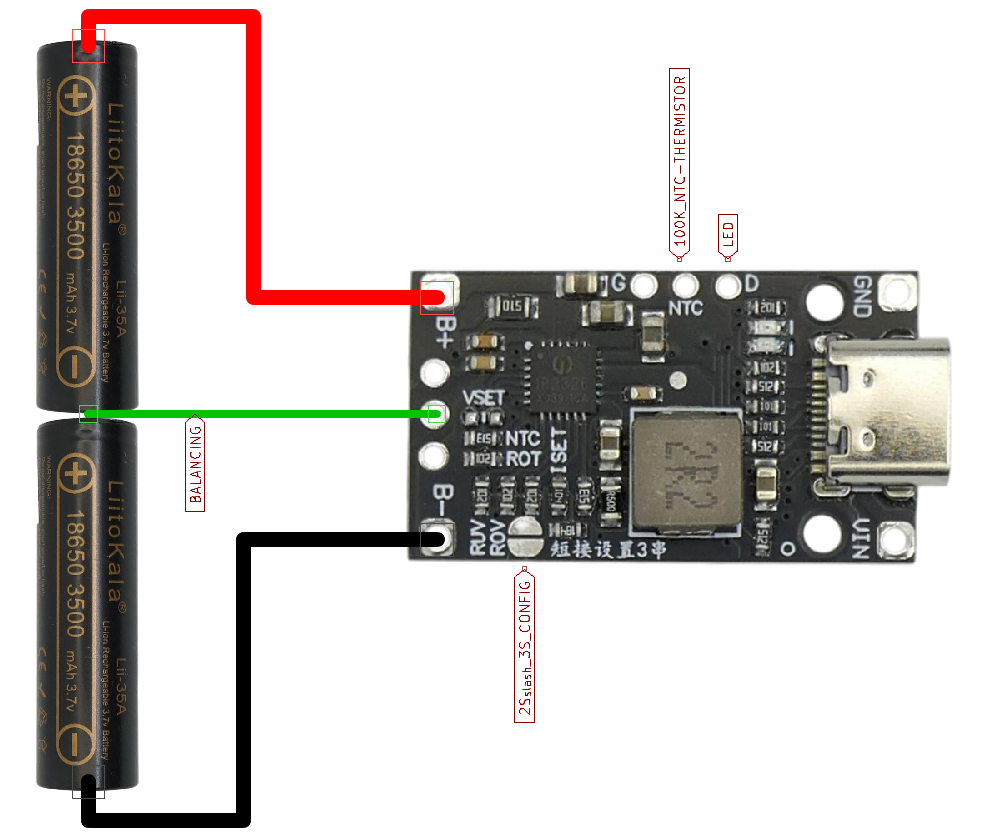
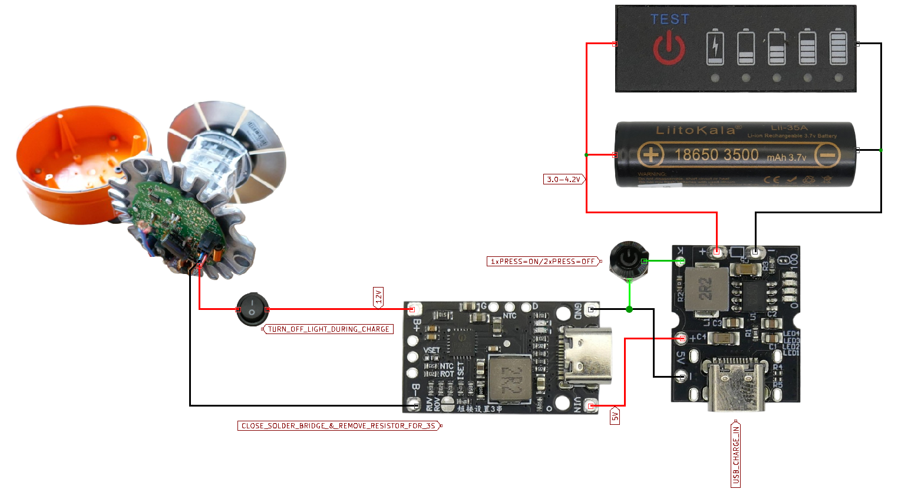
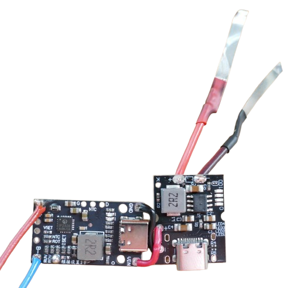
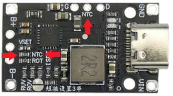
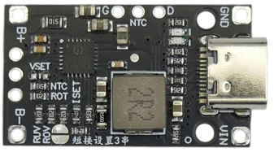

# IP2326

> 15W Boost Charger With 94% Efficiency For 2S/3S LiIon Battery Packs

IP2326 from Injonic is a highly efficient boost converter that takes 5V USB input and boosts it to 8.4 (2S) or 12.6V (3S) at a maximum of 15W. It includes balancing (for 2S batteries, not for 3S configuration) and can charge 2S or 3S batteries from USB power supplies.   

Use Cases:

* **Charging:**    
  Add USB-C charging capabilities to any **LiIon** battery pack in **2S** or **3S** configuration (with support for fast charge protocols).   

    

* **Boost-Converter:**     
  Use the chip to boost an input voltage of 4.5-9.5V to 8.4V or 12.6V. Here is a [use case](https://done.land/components/power/powersupplies/battery/chargers/charge-discharge/ip5306/mh-cd42/portableemergencylight/) where a single LiIon 18650 [drives a professional 12V emergency light](https://done.land/components/power/powersupplies/battery/chargers/charge-discharge/ip5306/mh-cd42/portableemergencylight/). 

  
    

## Overview
At its heart, IP2326 is a highly efficient synchronous boost converter with a 500kHz switching frequency and a built-in power MOSFET. It accepts a voltage in the range of 4.5-9.5V and boosts it to 8V or 12V output voltage.

Since it is a LiIon **charger** (and not just a boost converter), it supports **CC/CV** charging features and includes all fundamental battery protection features (such as over-current and over-discharge protection).

### Efficiency
IP2326 is an example of modern power management chips that feature a much better efficiency than classic boost converters, and therefore do not produce excessive heat.

The efficiency is 94% at 8V/1A output, and drops slightly to 92% at 1.5A. Generally, conversion efficiency is in a range of 91-94%, depending on charging current, voltage difference, and state of charge:   

* The higher the voltage difference between input and output, the lower the efficiency.
* The higher the output current, the lower the efficiency.

Even at 5V input and 8.2V/2A (16.4W) and 12.4V/1.2A (14.9W) output, the efficiency remains better than 90%. That is quite remarkable. With higher input voltages, efficiency raises:

| Input Voltage | Output | Efficiency |
| --- | --- | --- |
| 5V | 12.4V/1.0A | 90.5% |
| 7V | 12.4V/1.0A | 93% |
| 9V | 12.4V/1.0A | 94.5% |

The [datasheet](materials/ip2326_datasheet.pdf) provides detailed graphs.

### Important Pins

IP2326 can be configured via external resistors. Optionally, the chip also supports *I2C* and can be configured by a microcontroller, overriding any existing external configuration resistors.

Here are the most important pins:

* **2S/3S:**    
  With its pin `CON_SEL`, it can be switched from **2S** to **3S** configuration.    
* **LED:**    
  Pin `LED` connects to an optional charging indicator LED, and `BAT_STAT` provides a digital signal for the charging state.   
* **Standby:**    
  The enable pin `EN` can be pulled to ground to temporarily disable the charger:

    | State | Power Consumption |
    | --- | --- |
    | EN=`LOW` | 3uA |
    | EN=`HIGH` | 20mA |

### Creative Use-Cases

Since IP2326 at its core is a highly efficient **boost** converter, you can create amazingly powerful boost solutions with it.

For example, to run **12V** devices (up to 12W) from a single *LiIon* cell, here is a simple and very affordable combination:

* **[X-150](https://done.land/components/power/powersupplies/battery/chargers/charge-discharge/ip5306/x-150/):**    
  handles all the charging and discharging for **1S** LiIon cells and provides strong and stable 5V output. It is based on (based on [IP5306](https://done.land/components/power/powersupplies/battery/chargers/charge-discharge/ip5306/).       
* **LX-LISC:**    
  This popular board uses the **IP2326**. In **3S** configuration, it boosts the 5V from **X-150** to **12V 1A** output. 

### Caveats

Using a boost converter implies high input current for a given output power.

- Example: Delivering 12 V at 1 A (12 W) requires about 12 W / 5 V ≈ 2.4 A from a 5 V source; including losses, plan for roughly 3 A input current.
- Higher current magnifies every milliohm: wiring, connectors, and battery holders cause voltage drops that can destabilize operation.
- Boost stages are especially sensitive to input/source resistance, so minimize it.

### Practical wiring guidance

- Use short, adequately thick power leads to keep resistance and voltage drop low. For expected 3A, this should be at least **AWG 22**, with **AWG 18** giving extra margin.
- Avoid spring-based battery holders; their contact resistance is often high and variable under load. Prefer solid contacts or welded connections.

### Symptoms of excessive voltage drop

- **Input side:**    
  If the source voltage sags below the converter’s valid range, the controller may refuse to start or enter a fault state (e.g., blinking LED).
- **Output side:**   
   Voltage drop in output wiring can make the controller “see” less battery voltage than actual, prematurely terminating or throttling charging.

### Recommended connections

- For charging packs with IP2326-based boards, solder power connections directly. For cell assemblies, use nickel strips with spot welding, then solder the strip ends to the board.
- If removable packs are required, use low-resistance connectors such as XT30 or XT60 that can sustain the expected current with minimal loss.

## Input
IP2326 accepts any voltage in the range of 4.5-9.5V. 

USB 5V is just one of many options. You can also connect an ordinary power supply (and not use the charging feature). The chip is smart enough to request higher voltages from USB PD when available.

The large input voltage range is important because IP2326 is a **boost** converter (raises the input voltage): boosting works most efficiently when the input and output voltage differences are small.

### Fast Charge Input
If you connect a USB power source with fast charge capabilities, IP2326 requests higher voltages in these scenarios:

| Battery Voltage | Configuration | Action |
| --- | --- | --- |
| <6.2V | 2S | use 5V |
| <6.8V | 2S| request 5.4V input |
| <7.8V | 2S| request 6V input |
| <7.8V | 2S| request 6V input |
| >7.8V | 2S | request 7V input |
| <9V | 3S | use 5V |
| <10.5V | 3S | request 7V input |
| >10.5V | 3S | request 9V input |

> [!IMPORTANT]
> When IP2326 is powered on, it first tests the input power supply for fast charge capabilities. This is why there is a brief delay of 3-4 seconds before IP2326 starts supplying power. If the input does not respond to fast charge protocol requests, IP2326 uses the supplied input voltage.

#### Over-Current Protection

If the input voltage drops (i.e. due to a weak input power supply), IP2326 reduces the output current to prevent overloading the input supply. 

This way, in a classic powerbank scenario, anything from weak and cheap 5V wall warts to powerful USB PD supplies can be used, and IP2326 dynamically adjusts its current to the input supply capabilities.

IP2326 has a number of additional protections built-in, i.e. over-voltage and short circuit-protections.

## Output
The output voltage is available through two dedicated pins. Whether IP2326 delivers 8V or 12V is defined by pin `CON_SEL`. This way you can configure **2S** and **3S** battery packs. If you use IP2326 solely as boost converter for non-charging purposes, make sure you configure it to the appropriate output voltage.

### 8V or 12V?

There are breakout boards like *LX_LISC* that provide a solder bridge so you can configure the output voltage yourself. And there are other breakout boards that are preconfigured for **2S** *or* **3S**.

For **LX_LISC** boards, here is how you configure the output voltage:

  

| Configuration  | Changes on the board |
| --- | --- |
| 2S | - clear the large solder bridge  - add a 180 kΩ resistor to the solder pad next to the large solder bridge |
| 3S | - close the large solder bridge with a blob of solder - remove the 180 kΩ SMB resistor next to it |

> [!TIP]
> Since it is much easier to **remove** a SMB resistor than to add one, it is best to stock the LX_LISC **2S** variant unless you already know which configuration you need.     

### Output Current

The maximum output current is 1.5A, however this current is limited by the maximum **input** power (15W):

* **Input Voltage:**    
  The higher the input voltage, the more efficient is the conversion, and the more current you can draw.
* **Output Voltage:**    
  Likewise, a *2S* configuration (8V) typically needs less boosting than a *3S* configuration, so in a *2S* configuration you again get closer to the maximum 1.5A output. 

Even in demanding scenarios (boosting 5V input to 12V output), you can expect to receive an output of around 1A.

## Battery Balancing
IP2326 comes with built-in balancing capabilities for **2S** battery configurations. There is **no balancing for 3S** batteries.

* **3S Balancing:**    
  You may come across schematics that show balancing for 3S batteries, with an additional balancer wire connected to the configuration solder pad. This is dangerous nonsense and can damage the board. 

  For 3S batteries, you need to add a dedicated 3S BMS board that takes care of balancing. IP2326 can only balance 2S batteries.

* **Balancing Current:**    
  The balancing current of the built-in 2S balancing is in the range of 20-40mA. That is enough for balancing two **equal batteries at equal state-of-charge** and make sure they don't drift. 

  However, if you connect two batteries with substantially different charging state (one full, one empty), or even different capacities, it may take a very (very) long time until IP2326 has balanced the cells.    

  The balancing current is determined by `Rcb` (should be >100 Ohm). *Icb = Vcb / Rcb*.

> [!NOTE]
> You may come across YouTube videos claiming that IP2326 balancing does not work. That's wrong and caused by user errors, either trying to balance 3S configurations (which isn't supported), or trying to balance cells with absurdly different state-of-charge and capacities.   

### Temperature Protection
The chip monitors its temperature and turns off when it exceeds 135C.

### NTC Probe
An external 100K NTC thermistor can be connected to monitor the battery pack temperature. 

* If no thermistor is used, `NTC` is pulled low via a 51K resistor. 
* If a suitable thermistor is connected, IP2326 sends a 20 µA sensing current and analyzes the voltage drop:

| `NTC` pin voltage | Action |
| --- | --- |
| <0.43V  | stop charging, high temperature |
| <0.56V | hot battery, reduce charging rate by 50% |
| <1.32V | normal |
| >1.32V | stop charging, freezing |

To enable an external NTC thermistor, the default **51K** resistor must be replaced with a resistor that matches the thermistor in use, i.e. 100K thermistor (B=4100) requires a **82K** replacement resistor.

On the *LX-LISC* board, the resistor that needs to be replaced is labeled `NTC`:

  

> [!IMPORTANT]
> Just connect the thermistor and leaving the default 51K resistor unchanged is no option: the sensed temperatures would be shifted to the lower end by around 10-20C. Now IP2326 would likely invoke *freezing* protection at low room temperature.

## Pins and Adjustments

### 2S / 3S-Charging

| `CON_SEL` | Mode | Output Voltage |
| --- | --- | --- |
| floating/unconnected | **2S** |  6.0-8.2V |
| via a 1K resistor to `GND` |  **3S** | 9.0-12.4V |

  

### Charging

Charging can be adjusted via external resistors:

| Adjustment | Pin | Default (floating) | Adjustments |
| --- | --- | --- | --- |
| CC Current | `ISET` | | 120K-60K= 0.75A-1.5A |
| CV Voltage | `VSET` | 8.4/12.6V | 1K-120K= 8.1/12.3V-8.3/12.5V
| Charging Voltage Range | `CON_SEL` | 2S | 1K to `GND` for 3S |
| Input Undervoltage Threshold | `VIN_UVSET` | 4.65V | 120K-1K= 4.45-4.25V |
| Input Overvoltage Threshold | `VIN_OVSET` | 8.75V | 120K-68K= 8.4-8.0V 1K=disabled |
| Charging Timeout | `TIME_SET` | 24h | 68K=4h 120K=12h 1K=no timeout |

On the *LX-LISC* board, the relevant resistors are clearly labeled:

  

| LX-LISC Label | Pin | Description |
| --- | --- | --- |
| `ISET` | `ISET` | sets the maximum constant current charge rate |
| `VSET` | `VSET`| sets the battery voltage |
| `RUV` | `VIN_UVSET` | defines the input voltage drop threshold that triggers reducing the charging current |
| `ROV` |  `VIN_OVSET` | defines the input voltage threshold that stops charging due to over-voltage |
| `ROT` | `TIME_SET` | sets the charging timeout or disables it |

## Charging Details

If the charger is left connected to the battery after it is fully charged, the charger automatically resumes charging when the battery voltage drops below 8.0V (2S) or 12.0V (3S).

| Battery Configuration | Dead Battery | Undervoltage | Constant Current (`ISET`) | Constant Voltage |
| --- | --- | --- | --- | --- |
| 2S | <3.7V | <6V | 6.0-8.3V | 8.4V (`VSET`) |
| 3S | <3.7V | <9V  | 9.0-12.5V | 12.6V (`VSET`) |

| Charging Mode | Charging Current |
| --- | --- |
| Dead Battery | 50mA |
| Undervoltage | 100mA |
| Constant Current | defined by `ISET`  |
| Constant Voltage | <200mA: pauses 30s, then tests whether stop charging voltage is reached  |

## Materials

[IP2326 Datasheet](materials/ip2326_datasheet.pdf)    

> Tags: LX-LISC, Battery Management, BMS, Power Management, Charging, Powerbank, Boost-Converter, 2S, 3S

[Visit Page on Website](https://done.land/components/power/powersupplies/battery/chargers/charge/powermanagementics/ip2326?941088081818254701) - created 2025-08-17 - last edited 2025-08-22
