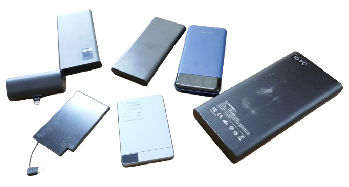
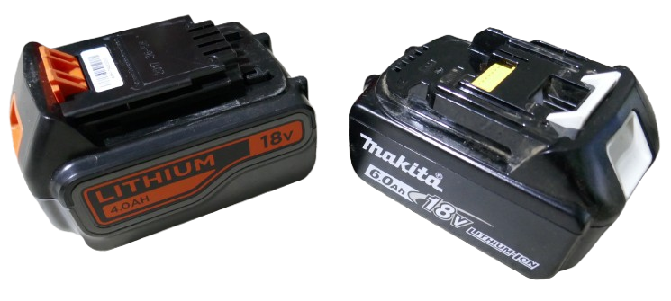
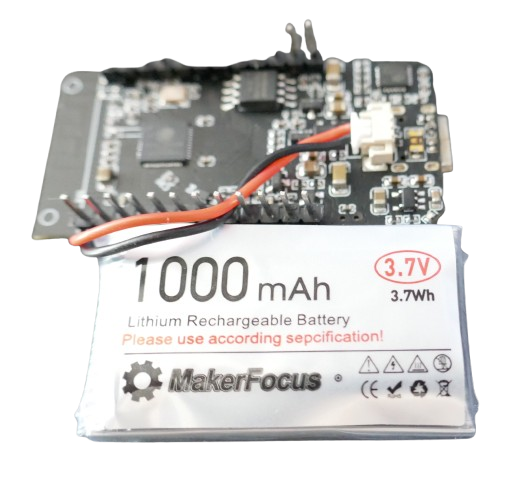
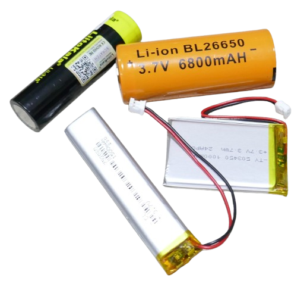
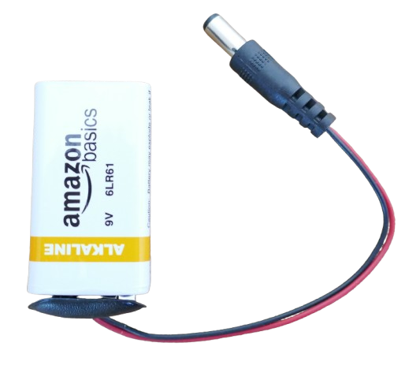
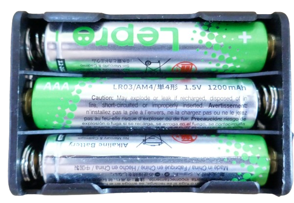
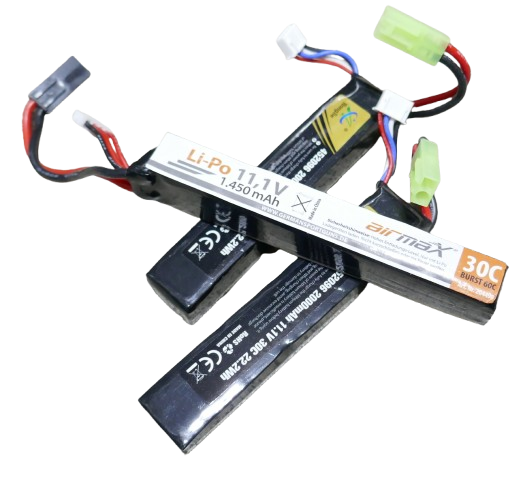
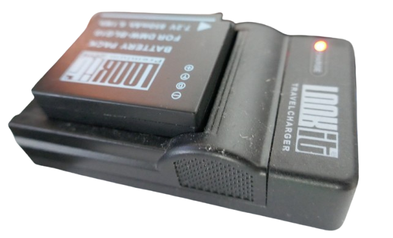
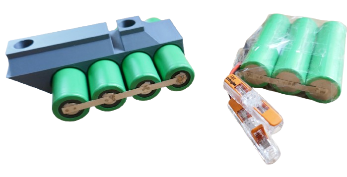
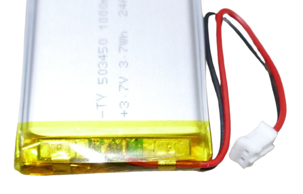

# Powerbank 

> Turning Batteries Into Powerbanks

Powerbanks are a safe and convenient way for supplying portable energy, and they come in many shapes and forms. USB powerbanks today are the most common type:

Batteries for your favorite gardening tool are often powerbanks, too, just with higher voltages and better current capabilities.

And when you equip your portable microcontroller project with a rechargeable battery, you are essentially building your own custom powerbank:

## Understanding Powerbanks

To fully understand what a powerbank **is** (and how you can **test**, **judge** and even build them yourself), let's have a closer look at its components.

All components found in a powerbank can also surface individually:

### Battery Cell 
A battery cell is a single battery of a given chemistry. 

The battery voltage is always determined by its cell chemistry, so i.e. all *LiIon* batteries have the same *3.7V* nominal voltage. The chemistry also determines whether the battery is rechargeable or not.

You can use raw battery cells in many devices, i.e. flashlights or radios. Primary batteries like this 9V block battery are exactly the same use case, just an example for a *non-rechargeable* battery chemistry:

### Battery Pack
A battery pack is a combination of many battery cells. 

The battery cells can be connected **in series** (to increase voltage) and/or **in parallel** to increase capacity.

The most common form are battery holders for primary batteries:

Here, *AA*- or *AAA* batteries are connected **in series**, and three *AAA* primary batteries deliver a total of *4.5V*.

The same occurs in rechargeable battery packs. In RC (Drones, Airsoft, etc.), *LiPo* cells are combined to battery packs that deliver 7.4V (two LiPo cells) or 11.1V (3 LiPo cells).

 

Legacy devices (i.e. cameras) started this concept with their proprietary (and typically grossly overpriced) battery packs that required equally expensive proprietary chargers:

Inside powerbanks (commercial as well as DIY), individual battery cells are often connected using nickel strips and spot welding:

  
### Protection and Safety
Some batteries and battery packs already come with a BMS (battery management system) built-in. With LiPo cells, you often see an electronic board under the plastic wrapping:

This is a BMS and protects the battery from over-charge and over-discharge. It also protects *you* from fire in case of accidental short circuits over overloads (but won't protect you from fire hazards due to mechanical damage).

In other battery types, the BMS may be present but is hard to see. For example, 18650 LiIon cells may or may not have a BMS built-in. If they do, it is located below the anode. You can't see it, but you can *measure* it: 18650 batteries with BMS are slightly longer (69-71mm versus 65mm).

#### Dangerous Battery Packs
Battery packs designed for drones, RC, etc. can be very dangerous: they typically do not have a built-in BMS. Since they store huge amounts of energy, they can be a significant fire and explosion risk.

That's why it is recommended to place such batteries in a specialized non-flammable bag during charging, and **never charge unattended**.

## Definition

Powerbanks are a combination of four features:

* **Battery/Battery Pack:**     
  One or more **rechargeable** battery cells, connected in series and/or in parallel, to deliver raw internal voltage and energy.
* **Charger:**    
  Electronics to safely charge the battery cells with a given charging voltage. This charging unit changes the input voltage internally to whatever voltage is required for the given battery chemistry and its state of charge. 
  
  For example, **empty** lithium cells require a constant current. Almost **fully recharged** cells require a constant voltage. 
  
  The charging unit sometimes also takes care of cell balancing, making sure each battery cell is at equal voltage. In other cases, the BMS is taking care of balancing.
* **Discharger:**    
  Electronics to transform the raw battery voltage (which can significantly fluctuate due to state of charge) to a **stabilized output voltage**. USB-Powerbanks for example output *5V*, and often support additional voltages through **USB Power Delivery** and similar protocols.
* **Safety/BMS:**    
  Electronics to protect the battery cells from mishandling. BMS makes sure cells won't over-charge or be discharged beyond a safe level.

  **Note:** Even if the cells you are using in a battery pack have their own built-in BMS, any battery pack needs its own. Cell-level BMSes are not designed to protect entire battery packs made of many cells. 

## Optional Components

Typically, *powerbanks* also include the following *optional* components:

* **Visuals:** *LED Bars*, *digital displays*, etc. to indicate the  *state of charge*.
* **Button:** manually turns on the power output. Most powerbanks automatically detect when you connect a load, however with small loads this may fail. 

> Tags: Powerbank, Battery, BMS, Charger

[Visit Page on Website](https://done.land/components/power/powersupplies/battery/powerbank?340059051703244602) - created 2024-05-02 - last edited 25-08-15
