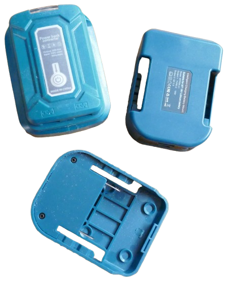
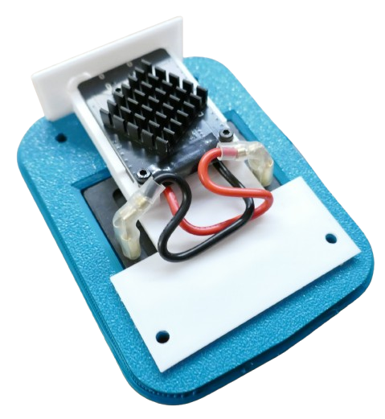

# 45W Makita USB PD Charger 

> Designing a 45W Charger/Discharger for 18V Makita Tool Batteries

With a minimum of parts, let's create a powerful 45W charger/discharger for 18V [Makita](https://done.land/components/power/powersupplies/battery/toolbatteries/makita/) [tool batteries](https://done.land/components/power/powersupplies/battery/toolbatteries/):

* Output 45W USB PD at up to 20V - enough to power laptops and fast-charge just about anything.
* Charge your Makita tool battery from any USB power supply (including 12V car electric)

## Overview

There are plenty of affordable Makita tool battery adapters that provide USB output. While they are nice-looking, they are of limited use.

* **5V Only:** cheap electronic components provide only 5V USB output at 1.5A (7.5W). 
* **No Quick Charge:** No support for quick charging protocols, USB PD, or voltage negotiation.
* cannot run devices that require more than 5V (i.e. laptops).
* **No Charging:** these adapters are one-way and can only output power. You cannot use them to **charge** your Makita battery.

### Modern IP2369 to the Rescue

Modern power management ICs like the [IP2369](https://done.land/components/power/powersupplies/battery/chargers/charge-discharge/ip2369/)...

* support various battery configurations and chemistries, including the **5S LiIon** configuration used by 18V Makita tool batteries. So they are **perfectly suited for Makita** tool batteries.
* are available on very affordable breakout boards with a small footprint, like the [Nouying/DYKB](https://done.land/components/power/powersupplies/battery/chargers/charge-discharge/ip2369/nouying45w/). Breakout boards are flat, have a small foot print (no clumsy coils or capacitors), and are very affordable (€3.80/piece is what I paid). 
* work as a buck **and** boost converter and support all USB PD voltages (including 20V), regardless of battery voltage

### Universal Makita Battery Charger
Since IP2360 works both as a discharger and a charger, you get a universal Makita battery charger completely for free: the USB-C port on the [breakout board](https://done.land/components/power/powersupplies/battery/chargers/charge-discharge/ip2369/nouying45w/) is bidirectional:

* **Discharge:** full USB PD at a max 45W output
* **Charge:** full USB PD at up to 45W charging

You can now charge Makita batteries anywhere, a simple USB power supply is all you need. 

> [!TIP]
> If you want to charge your Makita batteries from 12V car electric or any other fixed DC voltage, get a simple USB PD converter board.

### The Plan

Here are the steps to creating such a device:

1. Configure and test the [Nouying/DYKB](https://done.land/components/power/powersupplies/battery/chargers/charge-discharge/ip2369/nouying45w/) breakout board
2. 3D-print a housing that safely slides onto a Makita tool battery

## Configuring IP2369 Board

The [IP2369](https://done.land/components/power/powersupplies/battery/chargers/charge-discharge/ip2369/) chip can work with a range of different battery configurations and chemistries, so the first crucial step is to **configure it** for the Makita tool battery.

Such batteries use a **5S LiIon** configuration. On the [Nouying/DYKB](https://done.land/components/power/powersupplies/battery/chargers/charge-discharge/ip2369/nouying45w/) board that I am using, the configuration is done via solder bridges.

Typically, these boards are pre-configured for **4S LiIon**. Remove the resistor for **4S**, and put a solder blob onto the solder bridge for **5S**.

* **Careful:**      
  I did not heat up the SMB resistor well enough, so when I removed it, part of the traces were ripped off as well (as you can see in below picture). That's not an issue if you do not plan to configure the board for **4S** later again, but keep in mind that the traces are sensitive.    
* **One Connection Only:**     
  Make sure that you use **only one solder bridge** at any time. So when you put the blob on the **5S** solder bridge, make sure the **4S** pads are no longer connected. All solder bridges together form a resistor, and with more than one bridge closed, the total resistance is lower than expected, leading to a lower-S configuration.    
* **Must Configure!**
  Do not use boards with the default **4S** configuration. While this would work with Makita batteries and in fact produce USB output, you would not be able to charge the battery. At 4S, even an empty Makita battery voltage would be above the 4S cutoff voltage. 

Next, solder two sufficiently thick wires to the **+** and **-** pads. These wires later connect to the Makita battery. They must be thick enough to sustain **3.5A**, so **18 AWG** or lower would be appropriate.

## Designing Housing

You can use any of the Makita housing concepts [discussed earlier](https://done.land/components/power/powersupplies/battery/toolbatteries/makita/). I chose to design my own **3D-printed housing** with [external contact plates](https://done.land/components/power/powersupplies/battery/toolbatteries/makita/#3d-printing-your-own-adapters) in [snap-in design](https://done.land/components/power/powersupplies/battery/toolbatteries/makita/#snap-design).

### Makita Battery Docker
I designed my own Makita battery docker that safely slides onto the battery: 

A standard contact plate can simply be "snapped into" it:

You can **download the stl** file [here](materials/makita_connector.stl).

### PCB Mounting Plate

The [Nouying/DYKB](https://done.land/components/power/powersupplies/battery/chargers/charge-discharge/ip2369/nouying45w/)  is mounted on a separate mounting plate:

The plate provides a push button, a hole for the USB-C connector, and openings for the charging LEDs. Simply insert the PCB with the backside on top, then secure the PCB with three M2 screws.

It is recommended to print this part with **PETG** filament to ensure the material is flexible enough for the push button cover. With more rigid materials like **PLA**, the button may break off.

You can **download the stl** file [here](materials/makita_pcb_holder.stl).

> [!NOTE]
> Make sure the push button cover is freely movable. If there are printing residues preventing it from moving on gentle push, carefully remove these.

The mounting plate slides into the battery dock component printed earlier and applies pressure to the snapped in contact plate, providing additional fixation to it.

### Heat Sink

The PCB backside shows a silvery designated area. You may want to add an extra heat sink to this area of the back side of the PCB. 

During normal operations under load, the PCB can reach temperatures of 60-70C.

### Connecting and Testing
Connect the wires from the PCB to the battery. 

**IMPORTANT:** pay attention to the polarities! If you follow my design, then the battery **+** pole is **opposite** of the PCB **+** pad.

In my prototype design, I chose to use crimp connectors. This is **not a good idea for production** because the connectors are too long and need to be bended. Also, the connection may become loose in rugged environments.

For production adapters I strongly recommend you simply solder the wires to the contact plate pins.

### Performing Test

Once the board is connected to the contact plate pins, and you slide the adapter onto a Makita battery, the adapter is ready for a test.

#### Testing LEDs

The PCB LEDs turn on when you...

* ...connect a large-enough load
* ...press the push button once

The lights should indicate the current Makita battery state-of-charge.

The PCB LEDs turn off when you...

* ...disconnect the load (after a few seconds)
* ...double-press the push button

#### Testing Output
If you own a USB protocol tester, the adapter should support all common USB protocol standards (including USB PD 3.0 at 20V/47.5W).

### Testing Charger

When you connect a USB power supply to the adapter, the adapter should start charging the Makita battery: the built-in LEDs lighten up, one of the LEDs is blinking, and the number of lit LEDs indicates charging process.

Add a USB tester to the line if you want to verify the charging power. With modern USB PD power supplies, the adapter uses 20V and charges with up to 45W (depending on battery state-of-charge, the ratings of the USB cables you use, and the USB power supply you use).

## Adapter Cover

As a final part, a cover closes the housing and applies pressure to the PCB holder which in turn additionally secures the contact plate.

You can **download the stl** file [here](materials/makita_cover.stl).

While you can add heat-set inserts, this is generally not necessary. The 3D print comes with threaded holes for M3 screws, so you can directly insert M3 screws.

> Tags: Tool Battery, Makita, Charger, Discharger, Nouying, DYKB, USB PD

[Visit Page on Website](https://done.land/components/power/powersupplies/battery/toolbatteries/makita/45wmakitausbpdcharger?049165101811250524) - created 2025-10-10 - last edited 2025-10-10
