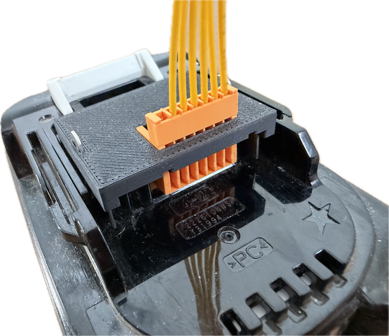
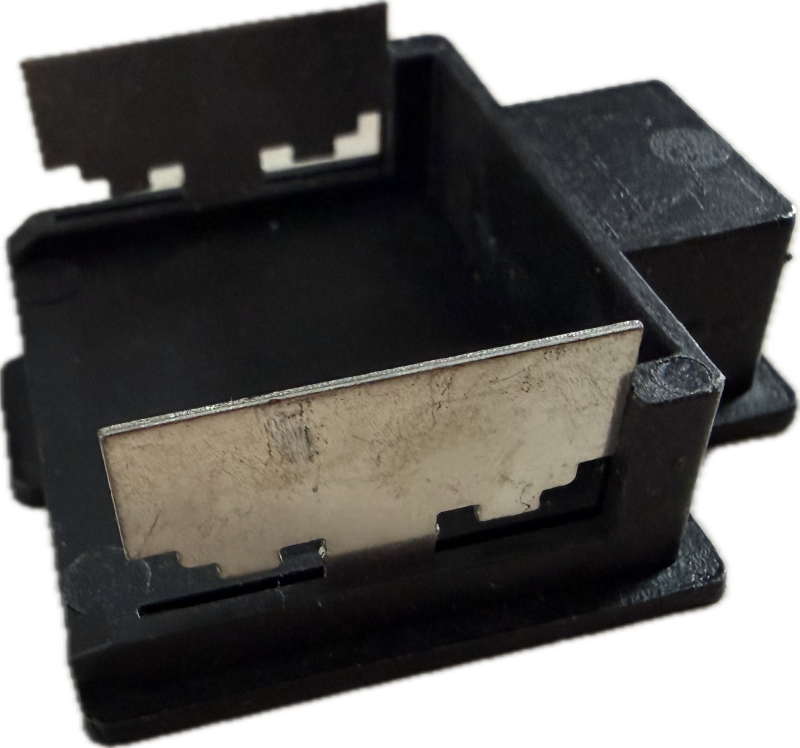
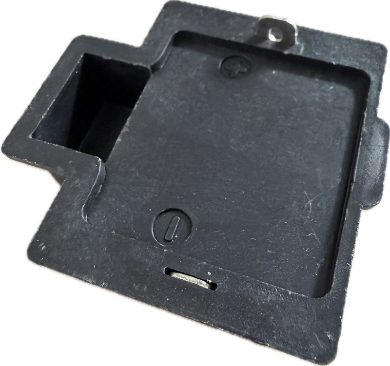
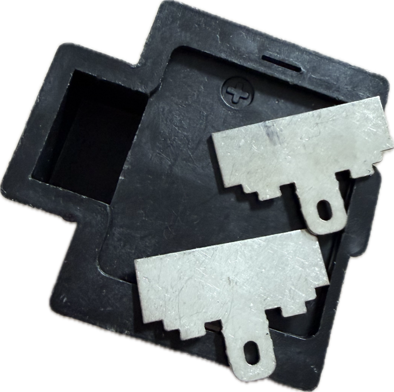
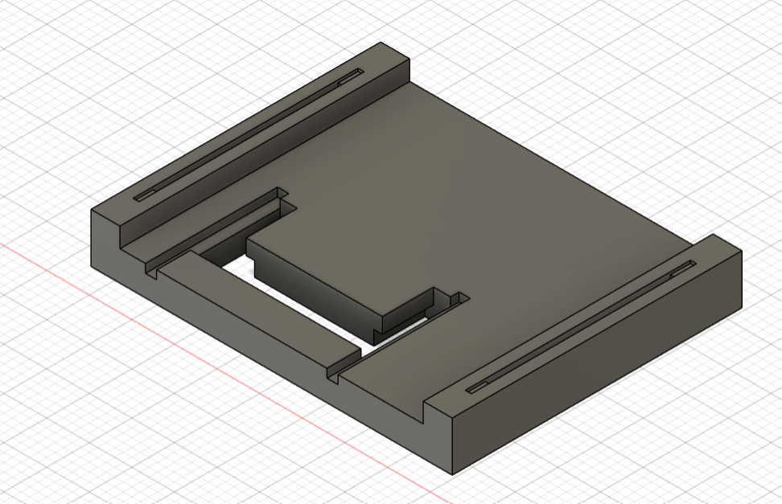
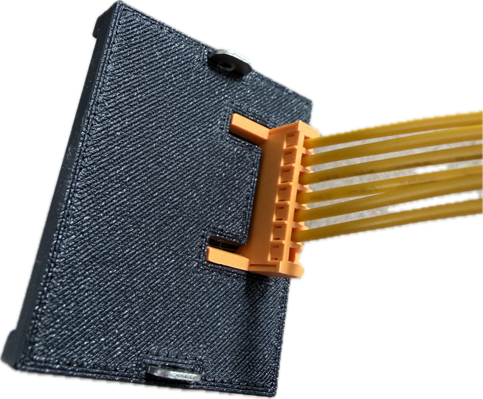
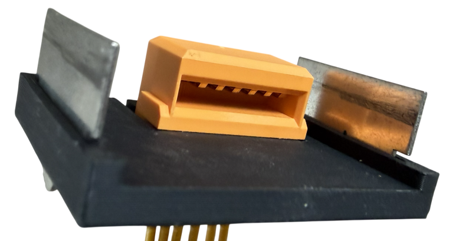
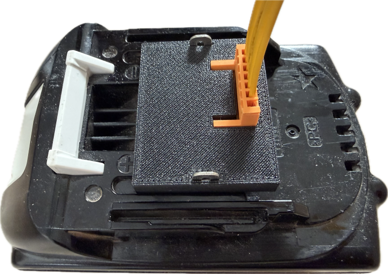

# Fully Integrated Makita Adapter

> Fully integrated Makita Battery Adapter with Digital Interface Connector

The typical simple [contact plates](https://done.land/components/power/powersupplies/battery/toolbatteries/makita/custombatteryadapters/contactplates/) that you can buy for a few bucks are fine for most cases, but once you want to also access the yellow digital interface, or create more sophisticated adapters, they don't work.

By re-purposing the metal contact strips from a basic commercial contact plate, you can print your own Makita contact plates and insert the digital interface plug if needed.

## Bill of Materials

* [Generic Makita Contact Plate](https://done.land/components/power/powersupplies/battery/toolbatteries/makita/custombatteryadapters/contactplates/)      
  You need its metal contacts.    
  Plates exist in different shapes and colors. Use the cheapest one (black, two contacts only):
  
* [Yellow Makita Digital Interface Plug](https://www.google.com/search?q=aliexpress+makita+charger+connector)     
  Optionally needed if you want to access the digital interface.

> Source both for little money at *AliExpress*.

## Pulling Contact Stripes

Pull out the two metal contact stripes from the generic contact plate. The easiest way is to place the plate on firm ground, then push it to the ground: 

This way, the contact is pushed in, pushing out the metal strip from the plastic plate:

Pull out the metal parts.  You'll insert these into your own 3D printed plate later.

## Print Custom Plate
Load [this STL file](materials/makita_integrated_basic.stl) into your slicer, and print it. This gets you the bare custom plate.

## Insert Contact Stripes and Yellow Interface Connector
Firmly insert the metal contact plates you previously harvested from the generic contact plate. Make sure they sit firmly.

If you need access to the digital interface, push the yellow Makita digital interface into the recess in your custom plate. It snaps firmly into place.

That is all. When you slide the adapter plate onto your Makita battery, you now have access to the two load pins and the digital interface.

> Tags: Makita, Adapter, 3D Print, Digital Interface, Integrated

[Visit Page on Website](https://done.land/components/power/powersupplies/battery/toolbatteries/makita/custombatteryadapters/3dprintingadapters/integratedbasic?740570051210262216) - created 2026-05-09 - last edited 2026-05-09
