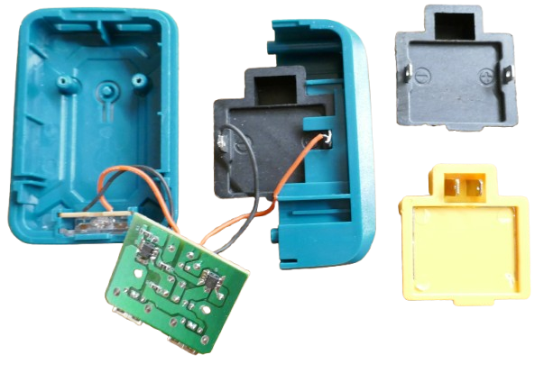
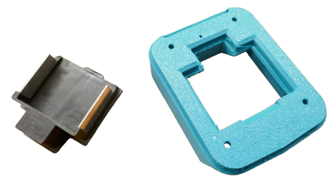
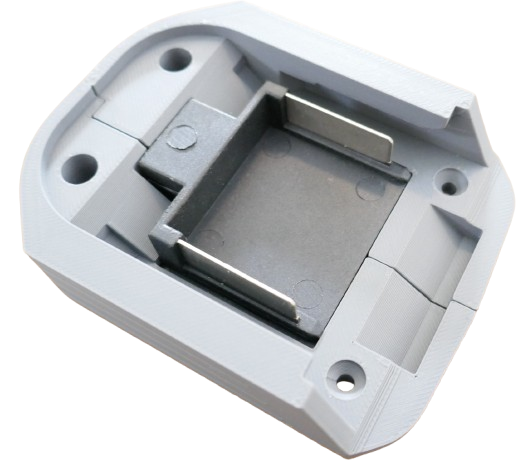

# 3D-Printed Makita Adapters

> Designing and 3D-Printing Custom Adapters

Designing and printing your own Makita adapters is the most flexible and professional approach: you can tailor the adapters exactly to your needs.

You do not need to start your 3D design from scratch. There are excellent open-source templates with editable Fusion files that you can use as a start and then customize as needed.

## Overview

When 3D-printing adapters, you still need the metal contacts. Your design strategy centers around **how** you want to implement the electric contacts.

### Contact Plates: Common but Less Optimal
The easiest approach is to use pre-made contact plates:

You could adpopt the design used by commercial accessoires and embed ("lock in") the contact plate into your 3D design.

### Integrated Adapters
While designs using a separate contact plate are most common for cheap Makita accessoires, it is not the best approach for 3D printing. 

Since you can freely design your adapter, why not **directly** insert the metal parts? This is much easier to design (as you don't have to add spaces that exactly fit the plate, and you no longerneed a two-part design to "lock in" the plate).  

Fitting metal contacts directly to your 3D-printed adapter looks better and creates more rugged adapters. Here are ways to implement the electric contacts:

* **Spade Terminals:**     
  Standard *spade terminals* can serves as "poor mans contact plates".     

      
  
  
* **Repurposing:**    
  Buy generic contact plates, but rather than inserting the entire plate, pull the metal contacts from the plates, then push them into your own adapter.    

     

## Design Approaches

There are four popular 3D-design approaches for custom Makita adapters:

* [Interlock:](https://www.thingiverse.com/thing:5441584)       
  Two parts that can be plugged together and secured by screws. When plugged together, they lock in a contact plate.    
     
* [Snap Design:](https://done.land/components/power/powersupplies/battery/toolbatteries/makita/custombatteryadapters/usecases/45wmakitausbpdcharger/#designing-housing)    
  One part only. The contact plate is "snapped" into it. This is easier to design and print, and has no vertical gap in the housing.    

  This is before assembly: 
    
      

  And this is the result with "snapped-in" contact plate:    

  

  [Here is a sample project](https://done.land/components/power/powersupplies/battery/toolbatteries/makita/custombatteryadapters/usecases/45wmakitausbpdcharger/#designing-housing) including the [3D print files](https://done.land/assets/files/makita_connector.stl).
  
* **Integrated:**    
By pausing the slicer at some layer, inserting the contact plate, and then continuing the print you can *embed* the contact plate safely and permanently into your adapter.

* **All-in-One:**    
  Insert the metal parts directly into your 3D design. This is the most straight-forward approach and gives you the most design flexibility. It is the only option that allows you to add digital interface plugs should you need them.

  * [Repurpose Contact Plate:](https://done.land/components/power/powersupplies/battery/toolbatteries/makita/custombatteryadapters/3dprintingadapters/integratedbasic/)        
  The metal contact stripes in a default contact plate can be pulled out. Simply re-insert them into your 3D print. 
  
    

  * **Spade Terminal (or alike):**    
  Use ubiquous *spade terminal* and insert these into your adapter.

    
  

  

## External 3D Design Files

Friendly users have shared their print files (including editable *Fusion* files) so you don't have to start from scratch. Print the files *as-is*, or use them as a start in your own design software:

* [Adapter with Separate Contact Plate](https://www.thingiverse.com/thing:5441584):      
  Awesome professional design for a complete adapter that uses an external contact plate and secures it in "interlock" mode.     
  
  Comes with different extension housings. Highly recommended.

* [Adapter with Built-In Contacts](https://www.printables.com/model/19968-makita-battery-adapter-barrel-jack/files):    
This design integrates the electrical contacts so you do not need a separate contact plate.     

  Yet now you will need suitable conductive material (metal strips) and a way to insert them into the 3D print.     
* [Contact Plate Only](https://grabcad.com/library/makita-18v-battery-connector-1/files):     
  The electrical contact plate only. Download requires free registration. Purchasing ready-made contact plates is probably a much easier way. 
  
  This download provides you will all the dimensions, and you may want to use this model as a placeholder in your own designs so you can later insert a ready-made contact plate.    

> Tags: Makita, Adapter, 3D Print

[Visit Page on Website](https://done.land/components/power/powersupplies/battery/toolbatteries/makita/custombatteryadapters/3dprintingadapters?369651050908261544) - created 2026-05-03 - last edited 2026-05-07
