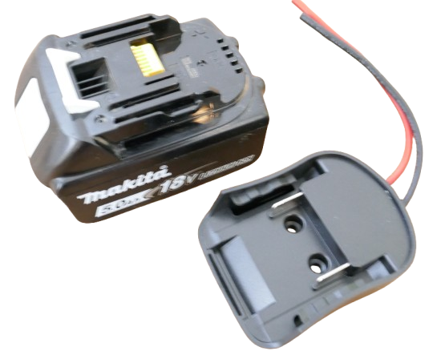
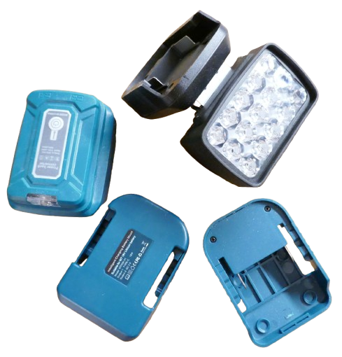
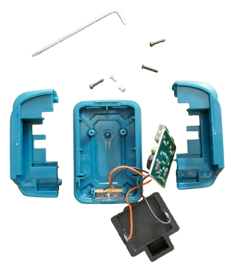
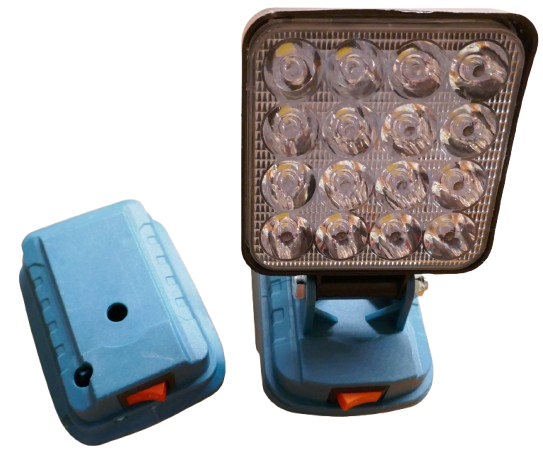

# Pre-Made Makita Adapters

> Using Generic Adapters and Repurposing 3rd Party Adapters

Purchasing ready-to-use Makita adapter housings is the easiest approach, especially if you have no access to a 3D printer:

* **Blank Adapters:**     
  ready-to-use with load wires. Your DIY project must reside **outside** the adapter.

  

  When you slide the adapter onto the battery, the two red and black cables provide you with the raw and unregulated battery power (depending on soc in the range of 15.0V-21.0V).       

  

* **Repurposing Cheap 3rd Party Adapters:**       
There is a rich market for affordable tool battery accessoires (such as chargers, lamps, soldering irons, etc).    

  Many use generic and modular housings that are simply screwed together. They are simple to open and repurpose. Let's take this cheap lamp/USB output. When you unscrew the two torx screws on its side, the housing easily comes apart and exposes its internals.   
  
  As seen below, many of these adapters use the same basic [contact plates](https://done.land/components/power/powersupplies/battery/toolbatteries/makita/custombatteryadapters/contactplates/) that you can purchase individually:

  

* **Empty Housings:**    
  Some vendors of Makita accessoires sell their housings separately, too: 
  * On the right is a cheap 3rd party lamp for Makita batteries.    
  * On the left is the housing which is sold separately. This explains the "holes" in the housing: it was originally designed for the lamp.    

    

    Compare prices wisely. Often, empty housings are only marginally cheaper than the complete accessoire, and it make sense to buy the entire thing, then reuse the other components (i.e. the LED lamp element) elsewhere.   

> Tags: Tool Battery, Makita, Parkside, Einhell, DeWalt, Milwaukee, Bosch, Housing, Adapter

[Visit Page on Website](https://done.land/components/power/powersupplies/battery/toolbatteries/makita/custombatteryadapters/pre-madeadapters?441341050908261544) - created 2026-05-02 - last edited 2026-05-07
