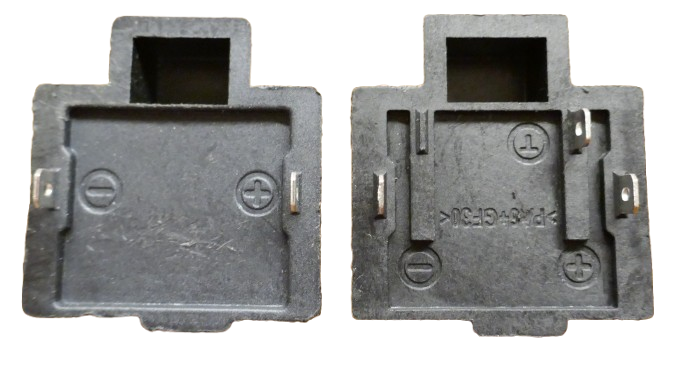
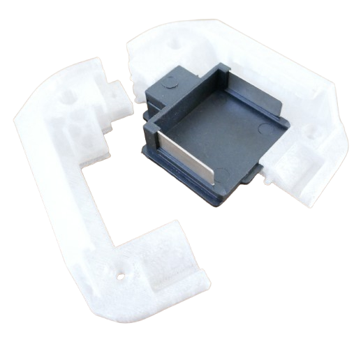
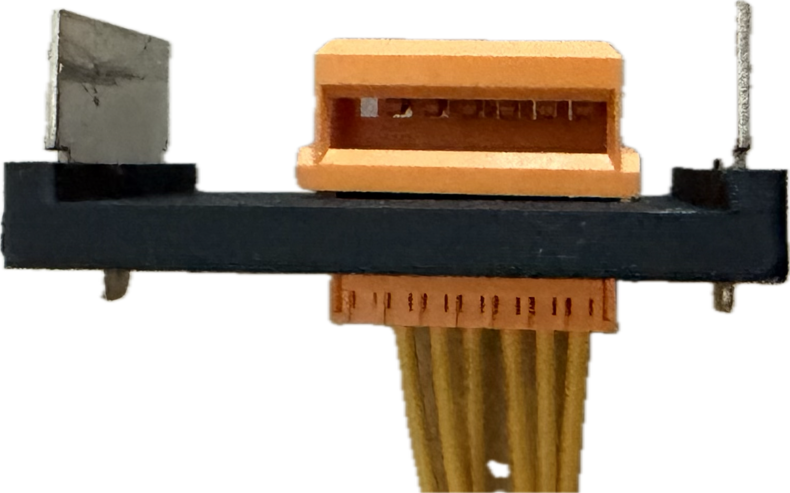
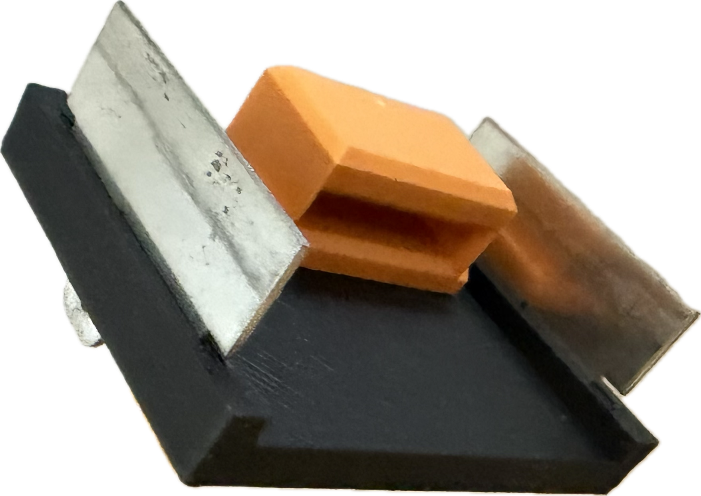
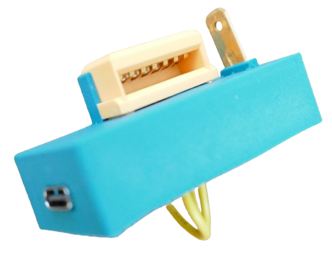

# Makita Battery Adapters

> Building Makita Battery Adapters

For safety, ruggedness and modularity, when designing your own Makita LXT accessoires, do what power tools do: create your own slide-on adapters that can be safely attached to Makita batteries.

## Overview

There are numerous options that you can choose from, depending on how much work you want to invest, and whether you are building just a prototype or need a rugged production tool:

* [**Contact Plates:**](https://done.land/components/power/powersupplies/battery/toolbatteries/makita/makitabatteryadapters/contactplates/)   
  resemble the electric adapter part that slides into the primary battery connectors. Contact plates serve as the core of your self-constructed adapters, and are used inside many commercial 3rd party adapters as well.   
    

  You can source them for little money at *AliExpress*, or [3D-print them yourself](https://grabcad.com/library/makita-18v-battery-connector-1/files).   
   
* [**Pre-Made Adapters:**](https://done.land/components/power/powersupplies/battery/toolbatteries/makita/makitabatteryadapters/pre-madeadapters/)    
  Ready-to-use rugged adapters that deliver the battery power via a cable. Your own DIY components are external and live outside the adapter.    
  
* **Repurposing:**   
  Cheap 3rd party accessoires are often simple to disassemble and can be repurposed for your own projects, providing you with a professional ready-to-use housing that can contain your DIY components if they are small enough.    

      

* **Empty Housings:**    
  Those who sell 3rd party accessoires often also sell their housings separately.    
  
  Just make sure you compare prices: often, empty houses are not much cheaper than the complete accessoire which provides you with spare parts you may want to use in other projects:  

  

* **3D-Print Your Own Adapters:**      
  With access to a 3D printer, design and [print your own adapter housings](https://done.land/components/power/powersupplies/battery/toolbatteries/makita/makitabatteryadapters/3dprintingadapters/) tailored exactly to your needs:    
    * [incorporate pre-made contact plates](https://www.thingiverse.com/thing:5441584) and wrap your own 3D-printed adapter around:        
        
    * use only the metal parts of a pre-made contact plate, and insert them directly into your 3D printed design to [create fully integrated professional adapters](https://www.printables.com/model/19968-makita-battery-adapter-barrel-jack/files):     
      
    * [incorporate the yellow digital interface plugs](https://done.land/components/power/powersupplies/battery/toolbatteries/makita/custombatteryadapters/3dprintingadapters/integratedbasic/) right into your 3D printed housing to also access the Makita digital interface.    
       
    * [use simple spade terminals](https://www.youtube.com/watch?v=kUg9jWvf5FM) and insert them into your 3D print - as seen in this [ArduinoOBI housing](https://shorturl.at/W719g):       
    
      

> Tags: Tool Battery, Makita, Parkside, Einhell, DeWalt, Milwaukee, Bosch, Housing, Adapter

[Visit Page on Website](https://done.land/components/power/powersupplies/battery/toolbatteries/makita/custombatteryadapters?985851101111252031) - created 2025-10-10 - last edited 2026-05-07
