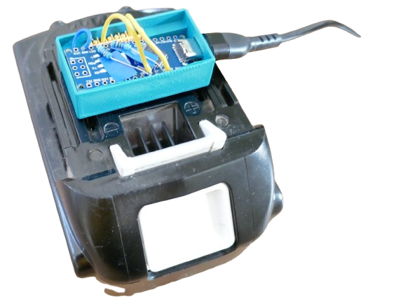
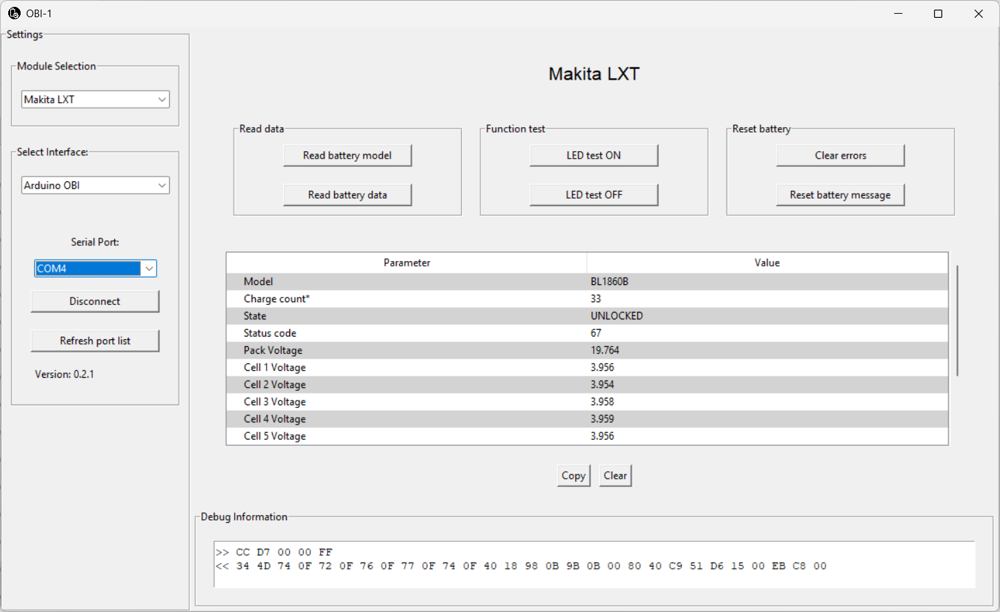
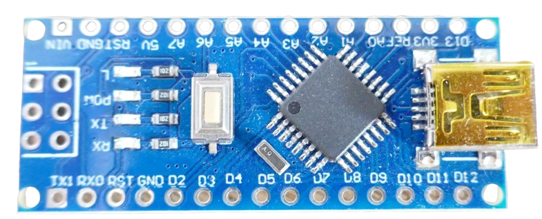
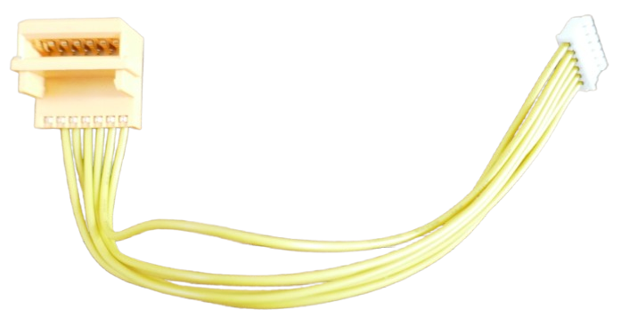
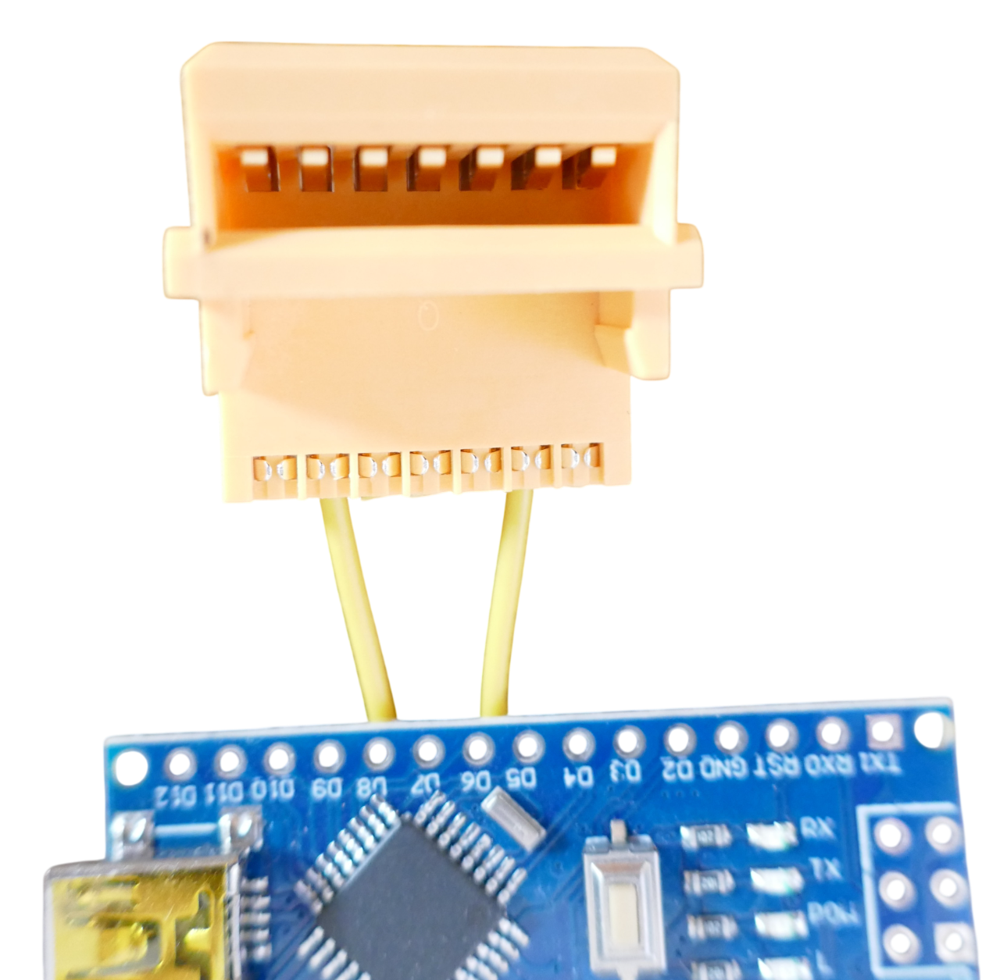
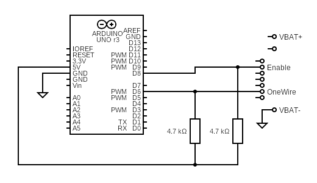
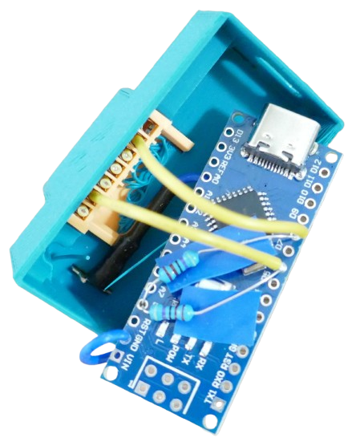

# ArduinoOBI 


> Diagnostic Tool for Makita LTX Batteries to Test, Query, and Unlock

This is the original implementation of a Makita diagnostic dongle (called **[ArduinoOBI](https://github.com/mnh-jansson/open-battery-information/tree/main/ArduinoOBI)**) that connects a Makita LTX battery to a PC. 

It uses the original [Open Battery Information](https://github.com/mnh-jansson/open-battery-information/tree/main) resources and runs on Arduino UNO/Arduino Nano.



This [YouTube Video](https://www.youtube.com/watch?v=kUg9jWvf5FM) guides you through the building and also provides free [free 3D printing files](https://shorturl.at/W719g) for a useful adapter case.


## Overview

The original **[ArduinoOBI](https://github.com/mnh-jansson/open-battery-information/tree/main/ArduinoOBI)** was the first adapter that can query Makita LTX batteries and also **unlock** batteries when they were locked for any reason by the BMS. It is based on the extensive research done by Matthias Jansson. At the core of this project, an *Arduino Nano* is used to interface the Makita LTX 1-wire interface with a PC. 

### PC Software
Since the Arduino is just translating signals, it leaves the processing to a Python-based PC software called [OpenBatteryInformation.exe](https://github.com/mnh-jansson/open-battery-information/releases/latest).



This introduces caveats in respect to supported operating systems, and false virus threat alerts when downloading the executable. 

Since the executable is just a wrapper around a Python script, you can always [download and run the Python script](https://github.com/mnh-jansson/open-battery-information/tree/main/OpenBatteryInformation) directly. If you get the software to run, it is a very convenient way to read your Makita LTX batteries in a lab environment.

## Building Adapter

To build the adapter that connects to your PC, only a few very affordable parts are required:

* **Arduino Nano Clone:**     
  I successfully used a €1.50 Arduino Nano Clone board like this one:
       
  You can also use the original Arduino UNO or Nano boards, of course.

* [Connector Cable](https://www.google.com/search?q=aliexpress+makita+charger+connector).
  Get yourself a Makita Charger replacement connector cable like this one:    

       
  
  It makes it simple to connect your Arduino to the battery.

In addition you need two 4.7kOhm resistors and a spade connector - totalling less than €5.

### Step-By-Step Instructions

Rather than repeating the steps to build the adapter here, I urge you to follow the [original instructions](https://github.com/mnh-jansson/open-battery-information/tree/main/ArduinoOBI), and/or watch this [YouTube Video](https://www.youtube.com/watch?v=kUg9jWvf5FM).

### Wiring Makita Connector

The instructions listed above are well-made. The only part I found confusing was the way how the yellow connector is supposed to be soldered to the Arduino Nano board.

To clarify, here is the pin assignment:


The two pins connect to the Arduino Nano GPIOs `D6` and `D8`:

| GPIO | Connect to |
| --- | --- |
| `D6` | `1-Wire`|
| `D8`| `Enable`| 







### Pull-Up Resistors

Both `D6` and `D8` need to be pulled up to `5V` via two 4.7kOhm resistors. When you solder them, make sure they do not short-circuit components on the board.

### Ground Connection

The Arduino `GND` pin needs to be connected to the Makita Battery `+` connector. You can for example use a crimped spade connector (as suggested in the YouTube video).

## Using ArduinoOBI

Using **ArduinoOBI** is very simple: connect a USB cable to Arduino, connect it to your PC, and slide **ArduinoOBI** onto your Makita LTX battery.


On your PC, launch [OpenBatteryInformation.exe](https://github.com/mnh-jansson/open-battery-information/releases/latest).

> [!CAUTION]
> Windows Defender classifies this download as malware (although it isn't). You can only download and run this software when you disable the *Windows Security Realtime Protection*. That's probably the biggest annoyance with this solution. 


 
In the software window, do this to get up and running:

1. In the two drop-down boxes on the top left, choose *Makita LXT*, and *Arduino OBI*. These are the only available choices anyway.
2. In the *Select Port* list, select the COM port that is assigned to your connected Arduino.  
3. Click *Connect*.
4. In the top center section, click *Read battery model* and *Read battery data* to fill in the data for all items in the list below.

### Unlocking Battery

Occasionally, the internal BMS can **lock** a battery. It is then not usable anymore. Typically, there are good reasons for locking a battery (i.e. defects, overloads, other security-relevant issues), however there are also many reported cases where a battery was locked even though it was perfectly good to go.

In such an event, you can click *Clear Errors* to unlock the battery. 

**Do so on your own risk.** The locking mechanism is a security feature, and unlocking a damaged battery may lead to fire hazard.

## Compiling Firmware

The resources listed above use *ArduinoIDE* to compile and upload the firmware to Arduino Nano.

Since I prefer *platformio*, either [download my ready-to-built platformio ArduinoOBI project](materials/arduinoobi.zip), or follow the steps below.

> [!NOTE]
> The steps below assume that you are familiar with *platformio* and *VSCode* already.


### Manually Creating PlatformIO Project

In *platformio*, create a new project and select the microcontroller you are using. Once the project is created, in the file explorer, adjust the project:

1. Click the file `platform.ini`, and review the settings that were auto-generated for you when you created the project. For my *Arduino Nano Clone*, I used this:

    ````
    [env:nano_old]
    platform  = atmelavr
    board     = nanoatmega328
    framework = arduino
    upload_speed = 57600
    ````

2. In your browser, navigate to [Arduino OBI/main.cpp](https://github.com/mnh-jansson/open-battery-information/blob/v0.2.2/ArduinoOBI/src/main.cpp), then select and copy the source code.     
3. In VSCode, click the file `src\main.cpp` and replace its contents with the source code you just copied.       
4. In VSCode Explorer tree, right-click `lib` and choose `New Folder`. Rename the new folder to `OneWire2`.
4. In your browser, navigate to [ArduinoOBI/lib/OneWire](ArduinoOBI/lib/OneWire). Here you see two files: `OneWire2.cpp` and `OneWire2.h`.
5. Click `OneWire2.cpp`, and copy its source code. Next, in VSCode, in the Explorer tree right-click the folder `OneWire2` that you just created, choose **New File**, and rename the new file to `OneWire2.cpp` (file name casing matters!). Click it, and paste the source code you just copied. Save the file.
6. Repeat the same steps for `OneWire2.h`.
7. In VSCode Explorer tree, right-click the folder `OneWire2` and choose `New Folder`. Rename the new folder to `util`.
8. In your browser, navigate to [ArduinoOBI/lib/OneWire/Util](ArduinoOBI/lib/OneWire/util). Here you see two files: `OneWire_direct_gpio.h` and `OneWire_direct_regtype.h`.
9. Click `OneWire_direct_gpio.h`, and copy its source code. Next, in VSCode, in the Explorer tree right-click the folder `util` that you just created, choose **New File**, and rename the new file to `OneWire_direct_gpio.h` (file name casing matters!). Click it, and paste the source code you just copied. Save the file.
10. Repeat the same steps for `OneWire_direct_regtype.h`.

Now you are set. In platformio, choose *Upload* to compile and upload the firmware onto your microcontroller.

### Materials

* [ArduinoOBI (platformio):](materials/arduinoobi.zip)       
Complete sample project, ready to be built in *platformio*: download and unpack this zip, then in VSCode choose `File / Open Folder`. 


> Tags: Open Battery Information, Arduino, Makita, OBI, BMS

