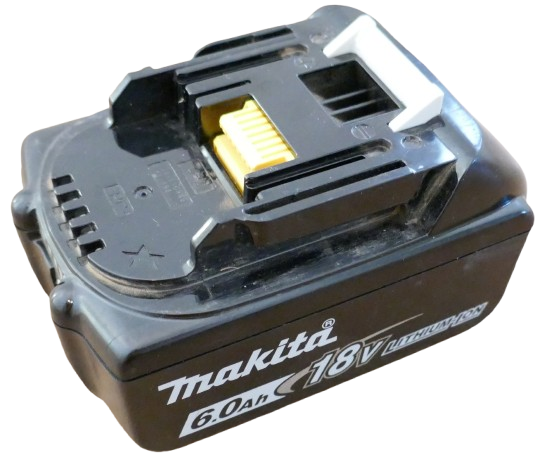
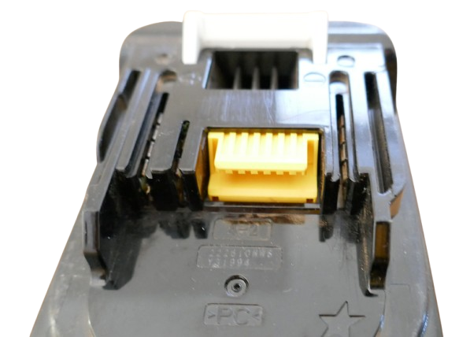
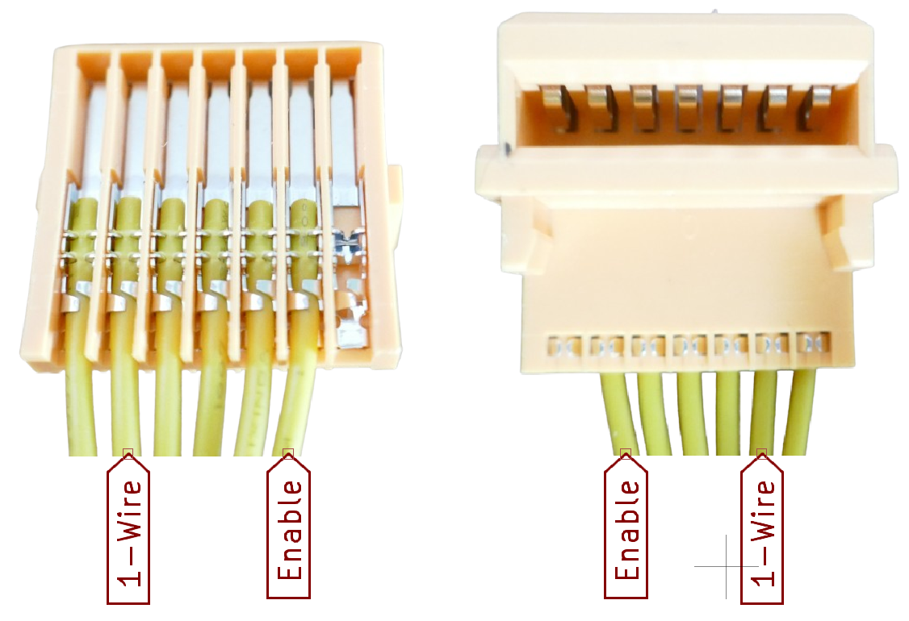
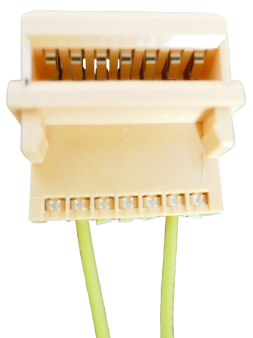

# Makita LTX Digital Interface

> Understanding the Proprietary Makita LTX Digital Service Interface

Makita LTX batteries (18 V tool batteries) use a proprietary one-wire digital interface that allows querying battery details, assessing health, and unlocking locked batteries.



Access the interface via the yellow auxiliary connector on the battery.

## Overview

Makita LTX batteries feature a proprietary, undocumented digital interface. Official chargers like the [DC18RC](https://www.makitatools.com/products/details/DC18RC) and diagnostic tools like the [BTC04](https://www.youtube.com/watch?v=uumwieLu8CE) use this communication channel.[web:1][web:2]



Community reverse-engineering has produced affordable DIY diagnostic tools.

<details><summary>Community Achievements</summary>

**Reverse-engineering timeline:**

* **[2021] Martin Jansson begins protocol analysis**  
  [Battery Hacking](https://martinjansson.netlify.app/posts/makita-battery-post-1) – Initial reverse-engineering work.

* **[2024] Firmware extraction & command discovery**  
  [Command Set Analysis](https://martinjansson.netlify.app/posts/makita-battery-post-1) – Extracted original firmware, identified key commands.

* **[2024] Open Battery Information (OBI)**  
  [Arduino dongle + Python tool](https://github.com/mnh-jansson/open-battery-information) – Complete communication solution.


* **[2025] DIY Diagnostic Tool Tutorial**  
  [Well Done Tips YouTube](https://www.youtube.com/watch?v=kUg9jWvf5FM) – Arduino Nano build with [3D-printed case](https://shorturl.at/W719g).

* **[2025] ESP32 Web Interface**  
  [esp32-makita-bms-reader](https://github.com/Belik1982/esp32-makita-bms-reader) – Standalone web server, no PC required, enhanced data display.

</details>

## Hardware Interface

The 1-Wire interface uses the yellow 7-pin connector. Source cables from [AliExpress](https://www.google.com/search?q=aliexpress+makita+charger+connector).


**Required pins (2nd from each side):**

| Pin | Function | Pull-up |
|-----|----------|---------|
| Enable | Active high (to activate interface) | 4.7 kΩ |
| 1-Wire | Data communication | 4.7 kΩ |



**Key notes:**
- Standard connectors have 6 connected pins (1 missing)
- **Enable** = pin next to missing pin
- **1-Wire** = 2nd pin from opposite side
- **Voltage:** 5 V recommended (3.3 V possible but unstable)
- Remaining pins: unknown function (typically cut)



> [!TIP]  
> Complete protocol reference: [makita-lxt-protocol](https://github.com/rosvall/makita-lxt-protocol)

## 1-Wire Protocol

**Standard Dallas 1-Wire** (16.3 kbps):
- Open-drain bus with 4.7 kΩ pull-up (3-5 V)
- Master reset: 480 µs low → slaves presence: 60-240 µs low
- Bit timing: 60 µs slots (logic 1 = release, 0 = hold low)

### Communication Sequence


1. Reset (500 µs low)
2. Presence (550-650 µs low from battery)
3. Command: cc + command bytes (ex: cc d7 0e 02 = temp)
4. Response: data bytes + 0x06 terminator

> [!NOTE]  
> Source: [makita-lxt-protocol repo](https://github.com/rosvall/makita-lxt-protocol)

**Example:** `cc d7 0e 02` → `9d 0b 06`

## Battery Commands

Batteries use different BMS generations with varying command sets.

### Universal Commands
All types support:
- Battery type
- Capacity  
- Failure codes
- Cycle count

[Details](https://github.com/rosvall/makita-lxt-protocol/blob/main/basic_info_cmd.md)


### Specific Commands
Reading battery information such as cell voltages, temperature, charge level, and battery health indicators requires different commands based on battery type. 


### Type Detection
Follow [BTC04] probing sequence:

| Type | Test Command | Response Check |
|------|--------------|----------------|
| 0 | `cc dc 0b` | Ends with `06` |
| 2 | `cc dc 0a` | *Test mode enabled* |
| 3 | `cc d4 2c 00 02` | Supported |
| 5 | ROM ID byte 3 | < 100 |
| 6 | `cc aa 00` response byte 17 | = 30 (decimal) |


#### Issue Specific Commands
Once you know the battery type, you can use supported commands from the table below. 


**Notes:**
- Types 0,2,3 terminate with `0x06`
- All data: little-endian


| Action | Command | Battery Type | Returned Bytes | Data Type | 
| --- | --- | --- | --- | --- |
| Temperature (1/10K) | `cc d7 0e 00 02` | 0, 2, 3 | 3 | int16  |
|  | `cc 52` | 5 | 2 | int16  |
|  | `cc 10 21`, then `d4` | 6 | 1 | byte<br/>(`t = (-40*x + 9323)/100`)  |
| Voltage<br/>(Pack and Cells) | `cc d7 00 00 0c` | 0, 2, 3 | 13 | 6x int16 |
|  | `31`,`32`,`33`,`34`, or `35`<br/>(cell 1 - 5) | 5 | 2 | int16 |
|  | `cc 10 21`, then `d4`<br/>(10-cell battery) | 6 | 20 | [10x int16](https://github.com/rosvall/makita-lxt-protocol/blob/main/type6.md) |
| Enter Test Mode | `cc d9 96 a5` | 0, 2, 3 | 1 | -|
| Exit Test Mode | `cc d9 ff ff` | 0, 2, 3 | 1 | - |
| Charge Level | `cc d7 19 00 04` | 0 | 5 | int32  |
| Model String | `cc dc 0c` | 0,2 | 16 | string |
| Overdischarge Counter | `cc d4 ba 00 01` | 0 | 2 | byte |
|  | `cc d6 8d 05 01` | 2 | 2 | byte |
|  | `cc d6 09 03 01` | 3 | 2 | byte |
| Overload Counter | `cc d4 8d 00 07` | 0 | 8 | [Bitmask](https://github.com/rosvall/makita-lxt-protocol/blob/main/type0.md) |
|  | `cc d6 5f 05 07` | 0 | 8 | [Bitmask](https://github.com/rosvall/makita-lxt-protocol/blob/main/type2.md) |
|  | `cc d6 5b 03 04` | 3 | 6 | [Bitmask](https://github.com/rosvall/makita-lxt-protocol/blob/main/type3.md) |
| Health | `cc d4 50 01 02` | 0 | 3 | int16 |
|  | `cc d6 04 05 02` | 2 | 3 | int16 |
|  | `cc d6 38 02 02` | 3 | 3 | int16 |


## Calculated Values

The official Makita diagnostic tool [BTC04](https://www.youtube.com/watch?v=uumwieLu8CE) calculates indicators from the raw values:

### State-of-Charge
Scale of 0-7:

  ````
  ratio = charge_level / capacity / 2880

  if ratio == 0:
    sof = 0
  elif ratio < 10:
    sof = 1
  else:
    sof = min(ratio / 10, 7)
  ````

### Overdischarge percentage

Calculated like this:

  ````
  if overdischarge_count > 0 and cycle_count > 0:
    p = 4 + 100 * overdischarge_count / cycle_count
  else:
    p = 0
  ````

### Overload percentage

Calculated as follows:

  ````
  if sum(counters) > 0 and cycle_count > 0:
    p = 4 + 100 * sum(counters) / cycle_count
  else:
    p = 0
  ````

### Health

For batteries of type 0, a pre-calculated *health* value can be queried and is then scaled like this:

````
ratio = health / capacity
if ratio > 80:
  h = 4
else:
  h = ratio / 10 - 5
````

For all other battery types, a *health* value is calculated like this:

  ````
  f_ol = max(overload - 29, 0)
  f_od = max(35 - overdischarge, 0)
  dmg = cycles + cycles * (f_ol + f_od) / 32
  scale = 1000 if capacity in (26, 28, 40, 50) else 600
  h = 4 - dmg / scale
  ````


> Tags: Makita, One-Wire, 1-Wire, OneWire, Digital Interface, LTX, BTC04, DC18RC

[Visit Page on Website](https://done.land/components/power/powersupplies/battery/toolbatteries/makita/makitaltxdigitalinterface?134231121517253207) - created 2025-12-16 - last edited 2025-12-16
