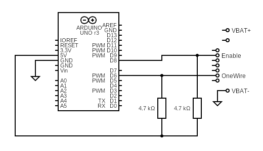

# Hardware (Makita LXT Dongle) 

> Preparing a Microcontroller to Server as a Makita LXT Dongle

The first step for accessing the Makita LXT digital interface is preparing a microcontroller to serve as a "Makita LXT protocol emulator". 

Note that this is not about any firmware yet. Later, you'll be able to choose from a variety of pre-made firmwares. But for now, it is all about hardware.

## Overview

Almost any microcontroller will do, however these four microcontrolles are easiest to use:

* ESP32-C3 SuperMini
* RP2040 Zero
* Arduino Uno
* Arduino Nano

> Other than these microcontrollers may require firmware adjustments later.    

You also need two 4.7 kΩ pull resistors, one 1 kΩ load resistor (at least ¼ W, better use ½ W), and a yellow [Makita charger replacement connector cable](https://www.google.com/search?q=aliexpress+makita+charger+connector).

## 1. Wiring Makita Connector

This is the connector pin assignment:

Connect the two lines to your microcontroller:

| Signal | Arduino | ESP32-C3 SuperMini | RP2040 Zero |
| --- | --- | --- | --- |
| 1-Wire | `6`/`D6` | `1`  | `6` |
| Enable | `8`/`D8` | `0` | `8` |

## 2. Pull‑Up Resistors

Both lines must be pulled up to `3.3V` via 4.7 kΩ resistors. 

When using an Arduino Uno/Nano, pull them up to *5V* - not because Makita requires `5V` (it requires `3.3V`), but because *Arduino* logic thresholds require it.

Or in a nutshell: pull up to the voltage of the microcontroller you use:

* on **3.3V** microcontrollers (i.e. ESP32, RP2040), connect the resistors to the `3.3V` pin   
* on **5V** microcontrollers (i.e. Arduino Uno, Nano), connect the resistors to the `5V` pin

### Caveats

There has been misunderstandings that Makita required `5V` pullups on its data lines - which it absolutely does not. 

Some authors using `3.3V` microcontrollers (i.e. *ESP32*) took great effort in pulling up the lines to `5V` - using additional transistors, level shifters, or even photocouplers. Don't do that. It's dangerous and unnecessary. Only Arduino pulls up to `5V` as a quick and dirty workaround for its own shortcomings.

## Grounding

Microcontroller and Makita battery must share the same ground. Connect the `GND`/`G` pin of your microcontroller to the Makita battery `-` terminal.

A crimped spade connector can be a simple way to attach to the battery terminal.

## Load Resistor

Optionally connect a 1 kΩ load resistor across the Makita battery `+` and `-` terminals. Older Makita batteryies do not seem to always respond to the `Enable` line and may require a load to wake up their BMS.

> Tags: LTX, Makita, ArduinoOBI, Open Battery Information, 1-Wire protocol, Makita Dongle

[Visit Page on Website](https://done.land/components/power/powersupplies/battery/toolbatteries/makita/makitalxtdigitalinterface/1.hardware?446760051708262004) - created 2026-05-07 - last edited 2026-05-07
