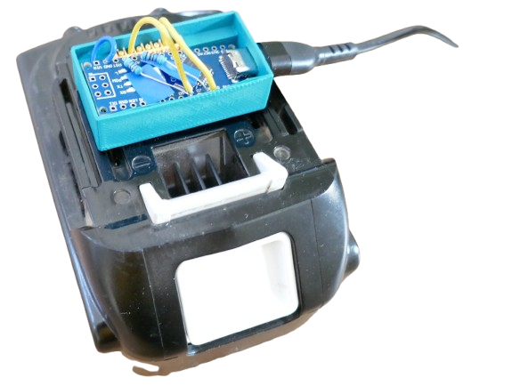

# ArduinoOBI 

> Dongle for Makita LTX Batteries 

After you prepared the hardware (microcontroller), here is how to upload the *ArduinoOBI* firmware and get a working Makita dongle.





> This [YouTube video](https://www.youtube.com/watch?v=kUg9jWvf5FM) explains how to build the adapter and provides free [3D printing files](https://shorturl.at/W719g) for a matching enclosure.


## Uploading Firmware to your Adapter

The original author and also the [YouTube video](https://www.youtube.com/watch?v=kUg9jWvf5FM) uses the *Arduino IDE* to compile and upload the firmware to the Arduino Nano or UNO.  

I prefer *platform.io*, so here is what I did:

1. [download the ready‑to‑build PlatformIO ArduinoOBI project](materials/arduinoobi.zip)
2. Open the folder with the extracted content in *VSCode*.
3. In the *VSCode platformio extension*, click *Build*.


### Manually Creating PlatformIO Project

In *PlatformIO*, create a new project and select your target microcontroller. Once the project is created, adjust it in the file explorer:

1. Open `platform.ini` and review the auto‑generated settings. For an *Arduino Nano Clone*, use:

    ```
    [env:nano_old]
    platform  = atmelavr
    board     = nanoatmega328
    framework = arduino
    upload_speed = 57600
    ````

2. In your browser, open [Arduino OBI/main.cpp](https://github.com/mnh-jansson/open-battery-information/blob/v0.2.2/ArduinoOBI/src/main.cpp) and copy the complete source code.  
3. In VS Code, open `src\main.cpp` and replace its contents with the copied source.  
4. In the VS Code Explorer, right‑click `lib` → **New Folder** and name it `OneWire2`.  
5. In your browser, navigate to `ArduinoOBI/lib/OneWire` where you find `OneWire2.cpp` and `OneWire2.h`.  
6. Open `OneWire2.cpp`, copy the source, then in VS Code create `OneWire2.cpp` inside the `OneWire2` folder (exact file name and casing) and paste the code. Save the file.  
7. Repeat the previous step for `OneWire2.h`.  
8. In the Explorer, right‑click the `OneWire2` folder → **New Folder** and name it `util`.  
9. In your browser, navigate to `ArduinoOBI/lib/OneWire/util`, which contains `OneWire_direct_gpio.h` and `OneWire_direct_regtype.h`.  
10. Copy `OneWire_direct_gpio.h`, then in VS Code create a file with the same name under `OneWire2/util`, paste the contents, and save.  
11. Repeat for `OneWire_direct_regtype.h`.

Now everything is in place; in PlatformIO, choose *Upload* to build and flash the firmware onto your microcontroller.

### Next Steps

To test drive your dongle, run the *OpenBatteryInformation* python script, or run a PowerShell script.

[Visit Page on Website](https://done.land/components/power/powersupplies/battery/toolbatteries/makita/makitalxtdigitalinterface/2.firmware/arduinoobi?648505051009261136) - created 2026-05-08 - last edited 2026-05-08
