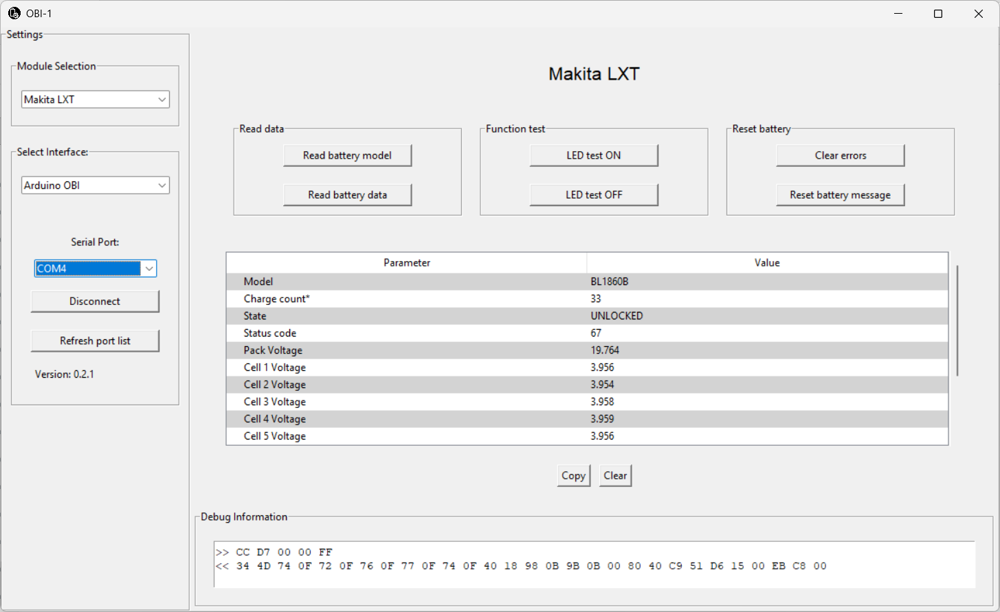

# OpenBatteryInformation Tool 

> Learn how to correctly download and run the OpenBatteryInformation tool

The [OpenBatteryInformation](https://github.com/mnh-jansson/open-battery-information) tool is the software you use with the [ArduinoOBI](https://github.com/mnh-jansson/open-battery-information/tree/main/ArduinoOBI) dongle. 

Getting it to run correctly can be challenging though because it is a Python script embedded in an executable. Many operating systems flag it as malware, and when you run the script directly, essential dependencies may be missing. Below, you learn how to launch the tool correctly.


## Running Binary Application
The tool is available as a stand-alone executable, yet many browsers and operating systems flag it as malware and refuse to download. The tool is benign but its pattern looks suspicious: a python script embedded inside an executable.

If you *must* run the executable, below are PowerShell scripts that help you do so. However, I strongly advise to run the python script below as shown in the next section.


### Downloading Executable

This PowerShell script downloads, unblocks and unzips the file while bypassing browser security:

````powershell
# store binary in TEMP folder:
$rootFolder = $env:temp

# define paths for our project:

# top folder where everything is stored:
$projectRoot = Join-Path -Path $rootFolder -ChildPath OpenBatteryInformation
# path to zip that gets downloaded:
$pathZip = "$projectRoot\obi.zip"

# create folder
$exists = Test-Path $projectRoot
if (!$exists) { $null = New-Item -Path $projectRoot -ItemType Directory -Force }

# download zip from github
$url = 'https://github.com/mnh-jansson/open-battery-information/releases/download/v0.2.2/OBI.exe.zip'
Invoke-WebRequest -Uri $url -UseBasicParsing -OutFile $pathZip

# remove virus alarm:
Unblock-File -Path $pathZip

# unzip file:
Expand-Archive -Path $pathZip -DestinationPath $projectRoot

# open folder
explorer $projectRoot
````
Windows Explorer opens the folder where *openbatteryinformation.exe* was stored. 

### Disabling Anti-Virus (Not Recommended - But Often Required)
Downloading is just the first challenge. Once downloaded, when you launch *openbatteryinformation.exe*, your operating system most likely pops up a virus alert and deletes the file. This is standard procedure on consumer Windows for binaries that contain python scripts, regardless of whether it is malicious or not.

In order to run the file, you must disable "real-time virus protection". I am not walking you through these steps, and it is not recommended. If you do anyway, don't forget to re-enable the protection when you are done.


## Running Python Script Directly

This is the recommended way of running *OpenBatteryInformation* and does not trigger security alerts.

Use this PowerShell script to conveniently download the python source code:

````powershell
# store binary in TEMP folder:
$rootFolder = $env:temp

# define paths for our project:

# top folder where everything is stored:
$projectRoot = Join-Path -Path $rootFolder -ChildPath OpenBatteryInformation
# path to zip that gets downloaded:
$pathZip = "$projectRoot\obiSource.zip"
# path to extracted files:
$pathExtracted = "$projectRoot\obiSourceFolder"


# create folder
$exists = Test-Path $projectRoot
if ($exists)
{
  Write-Warning "Project folder exists: $projectRoot"
  Write-Warning "You need to delete this folder if you want to run this script and freshly rebuild the folder."
  $response = Read-Host 'If you want to delete the folder now, and continue, enter Y and press ENTER'
  if ($response -ne 'y') 
  {
    Write-Warning "Script aborted." 
    return 
  }
  else
  {
     Remove-Item -Path $projectRoot -Recurse
  }
}


$null = New-Item -Path $projectRoot -ItemType Directory -Force

# download zip from github
$url = 'https://github.com/mnh-jansson/open-battery-information/archive/refs/heads/main.zip'
Invoke-WebRequest -Uri $url -UseBasicParsing -OutFile $pathZip

# remove virus alarm:
Unblock-File -Path $pathZip

# unzip file:
Expand-Archive -Path $pathZip -DestinationPath $pathExtracted

# find python sources:
$file = Get-ChildItem -Path $projectRoot -File -Filter main.py -Recurse
$folder = $file.DirectoryName

# move them to the root of our project:
$newFolderPath = Join-Path -Path $projectRoot -ChildPath $file.Directory.Name
Move-Item -Path $folder -Destination $projectRoot

# delete the rest:
Remove-Item -Path $pathExtracted -Recurse

# open the folder with the python script and its dependencies:
explorer $newFolderPath

# set current folder:
Set-Location -Path "$projectRoot\OpenBatteryInformation"
````

### Running Python Script

To run the python script, you need python. Run this line to check whether it is already present:

````powershell
python --version
````

#### Prerequisite #1: Installing Python
If the command **python** isn't found, run this to set up python on Windows (use a newer python version if by the time you read this 3.13 is no longer up-to-date):

````powershell
winget install -e --id Python.Python.3.13
````

Once you successfully installed python, make sure **you close and open the PowerShell console**. That's because the installation changes the environment paths, and you get the new python path only when you re-launch the console. In the **newly launched** console, you should now be able to successfully run `python --version`.

#### Prerequisite #2: Installing Dependencies
The script requires access to the serial port, so in order to run it, you need to first install the *pyserial* library like so:

````powershell
python -m pip install pyserial
````

#### Running Script
Now that you have successfully set up your python environment, you can launch the script. For this, it is crucial that you first set the current directory to the directory with your script, if you haven't done that already. If you ran the PowerShell script that downloads the source code, then the current folder is already set to this directory. Else, set it manually:

````powershell
# this is the path where you downloaded the python script (see above)
Set-Location -Path 'C:\Users\...\Temp\OpenBatteryInformation\OpenBatteryInformation'
````

Finally, launch the script:
````powershell
.\main.py
````

> Do not run the script with an absolute path name.

#### Quick Checklist
Here are common quirks, and why they happen:

* **I try and launch the python script, but can't find "python":**       
  Make sure you have installed and set-up python first.   
* **Lots of error messages when I launch the script:**   
  Make sure you set your own current directory to the directory where the python script is located.    
* **The GUI opens, but I cannot select an interface. The combo box is empty:**    
  Make sure you installed the library **pyserial** before you launch the script.


## Working with OpenBatteryInformation


Your Arduino hardware that you built earlier - **ArduinoOBI** for short - acts as interface between your Makita battery and your PC:
* Connect **ArduinoOBI** via its USB connector to your PC.
* Slide **ArduinoOBI** onto your Makita LXT battery.


### Launch Software
Depending on which route you chose, either launch **OpenBatteryInformation.exe**, or launch **main.py**. This opens the main GUI:




### Connect Software to Battery

In the application window:

1. In **Makita Selection**, select **Makita LXT**. It is the only option available.
2. In **Interface**, select **Arduino OBI**. It is the only option available.     
**NOTE:** If there is *no option at all* in this drop box, then you need to install *pyserial* as a prerequisite for the script.     
3. In the **Select Port** list, choose the COM port assigned to your Arduino.  
4. Click **Connect**.  
5. In the top‑center section, click **Read battery model** and **Read battery data** to populate all details in the list below.

### Unlocking Battery

Occasionally, the internal BMS will **lock** a battery, making it unusable. While lockouts often indicate legitimate issues such as cell defects, overload events, or other safety‑critical faults, there are also many reports of otherwise healthy batteries being locked purely by software. 

In such cases, you can click *Clear Errors* in the software to attempt to unlock the battery.   **Proceed entirely at your own risk:** overriding a safety lock on a damaged battery can lead to overheating or fire.


## Materials

* [ArduinoOBI (platformio):](materials/arduinoobi.zip)       
Complete sample project, ready to be built in *platformio*: download and unpack this zip, then in VSCode choose `File / Open Folder`. 


> Tags: OpenBatteryInformation

[Visit Page on Website](https://done.land/components/power/powersupplies/battery/toolbatteries/makita/makitalxtdigitalinterface/3.software/openbatteryinformation?796887051009261136) - created 2026-05-08 - last edited 2026-05-08
