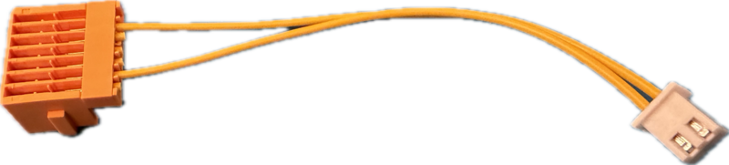
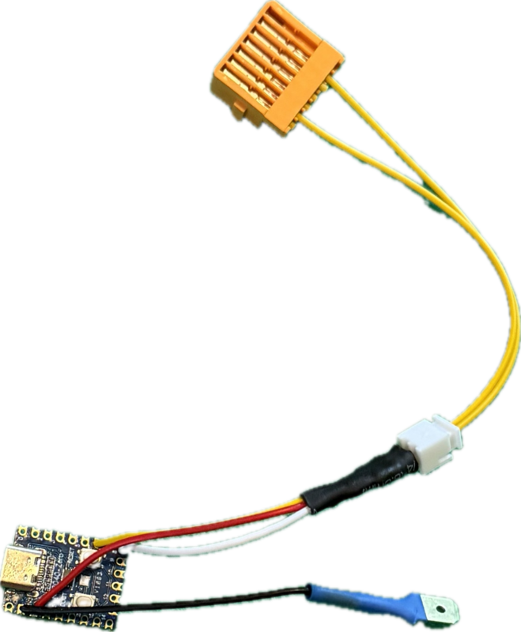
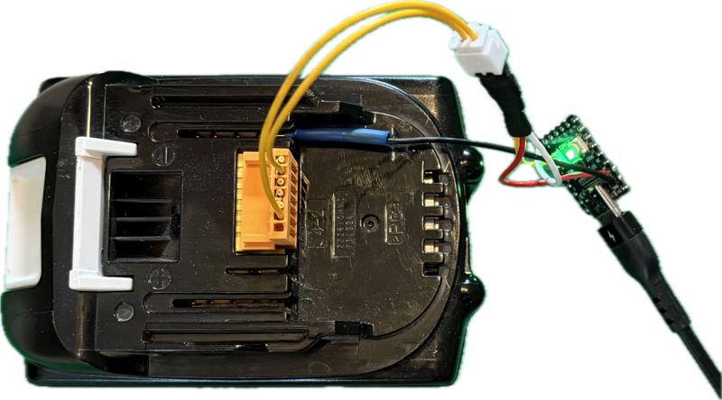
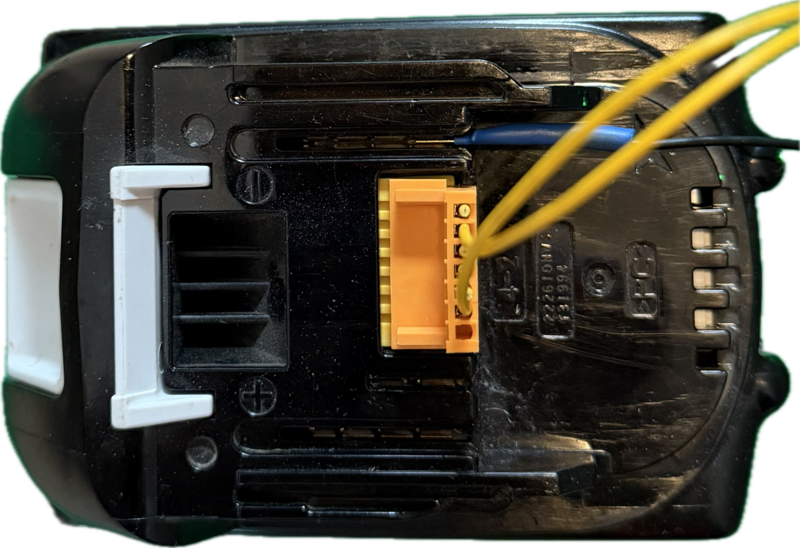
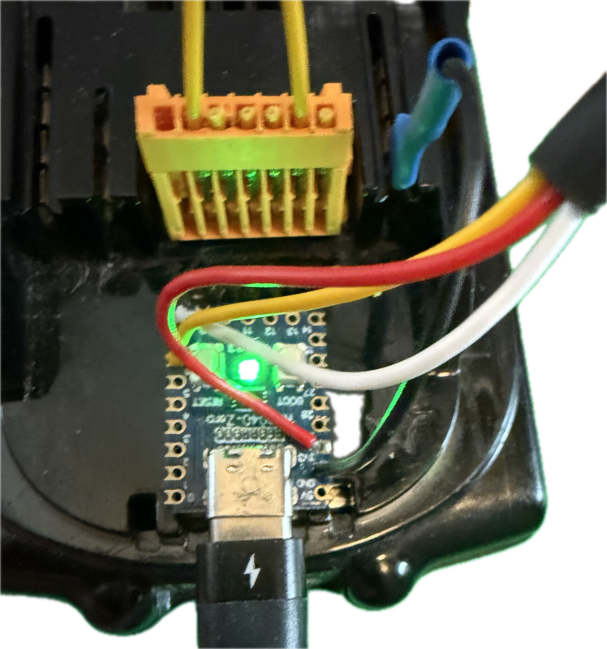
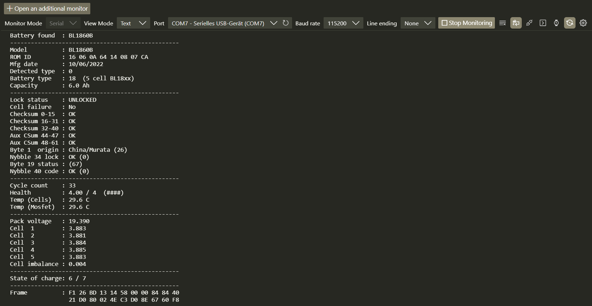

# Proof of Concept for Automatic Makita Battery Unlocker 

> Testing the Automatic Makita Battery Unlocker firmware with the least effort

In this section we'll put the [Automatic Makita Battery Unlocker](https://github.com/synrais/Makita-LXT-Battery-Monitor-Unlocker) to work in the least complex way and with the least parts and dependencies. 

## Bill of Materials

Here is what you need:

### RP2040 Zero (or Clone)

This MCU board is cheap and readily available on *Amazon* and *ALiExpress*. I got mine for €1.50/piece. You can use the *WaveShare* original (more expensive) or a clone. I opted for clones.

> [!NOTE]
> The author also supports *Arduino Uno/Nano* and *ESP32-C3 SuperMini*, however these MCUs are harder to program and lack the built-in RGB LED which is key in this project.

### Yellow Makita Cable

Order a [Makita Yellow Charger Cable](https://www.google.com/search?q=Makita+yellow+charger+connector+terminal+cable), and [configure the cable first](https://done.land/components/power/powersupplies/battery/toolbatteries/makita/makitalxtdigitalinterface/yellowinterfacecable/#configuring-the-cable) by identifying the two required wires, and removing the rest.

This gets you a connector like this:

Continue to [follow the instructions](https://done.land/components/power/powersupplies/battery/toolbatteries/makita/makitalxtdigitalinterface/yellowinterfacecable/#configuring-the-cable) and add the two 4.7 kΩ pullup resistors until you end up with a cable like this:

### Ground Wire

Get yourself a *spade connector* or any other metal strip that can slide into the Makita battery rail for the negative pole.

## Programming the MCU

It is ridiculously simple to program the *RP2040 Zero* - no special skills or tools required:

1. [Download](https://github.com/synrais/Makita-LXT-Battery-Monitor-Unlocker/raw/refs/heads/main/Firmwares/waveshare_rp2040_zero/firmware.uf2) the `firmware.uf2` file to your PC.       
2. Hold down the `BOOT` button on the *RP2040 Zero* while you connect it to your PC. A mass storage device opens in *Windows Explorer*.    
3. Drag&drop the downloaded file `firmware.uf2` into this folder. It automatically closes, the *RP2040 Zero* reboots, and its RGB LED starts pulsing in white color.

## Wiring

Take your [configured](https://done.land/components/power/powersupplies/battery/toolbatteries/makita/makitalxtdigitalinterface/yellowinterfacecable/) yellow Makita plug, and connect its **three wires** like this: 

| Wire | RP2040 Zero Pin |
| --- | --- | 
| 1-Wire | `6` |
| Enable | `8` |
| Pullup | `3.3V` |
| Ground-Wire | `GND` |

Take the ground wire, and connect it to `GND`.

### Correctly Identify Data Lines

It is crucial that you do not confuse the two data pins, so as a reminder, here is the pin assignment again:

Your work should now look similar to this:

## Connecting to Battery

For a first test run, power the MCU by plugging in a USB-C cable. If you...

- ...just want to see the RGB LED in action, any USB power supply will do   
- ...want to also read battery details, connect the MCU via USB to your PC    

Once the MCU powers up, the RGB LED starts pulsating in white.

### Battery Connections

Next, slide the ground wire into the negative load rail of the battery. It is marked **-** on the battery case. **Do not accidentally connect the ground wire to the *positive* rail!**

Then, slide the yellow adapter onto the battery connector. Here is another view from above so you can positively identify all connections:

## Working with the Tool

Now that your tool is ready to work with, you can use it *stand-alone* (with RGB LED feedback only), or connect it to a PC via USB and receive detailed battery information.

### Working with Status LED Only

Once you slide the yellow connector onto the battery, the color of the RGB LED on your *RP2040 Zero* changes. The firmware author [has listed the color codes](https://github.com/synrais/Makita-LXT-Battery-Monitor-Unlocker/blob/main/README.md#status-light-rp2040-zero).

When diagnostics are completed, you should see a **green LED**, indicating that your Makita battery is unlocked and in good health.

### Retrieving Detailed Battery Information

Connect your *RP2040 Zero* via USB to your PC, and open any serial terminal. Set it to 115200 baud. Then repeat the steps above, and connect it to a Makita battery.   

> [!TIP]
> In a terminal window (serial monitor), type (send)  `s` to retrigger a scan and get fresh results.
 

[Visit Page on Website](https://done.land/components/power/powersupplies/battery/toolbatteries/makita/makitalxtdigitalinterface/tools/makitabatteryunlocker/proofofconcept?371545051114263256) - created 2026-05-13 - last edited 2026-05-13
