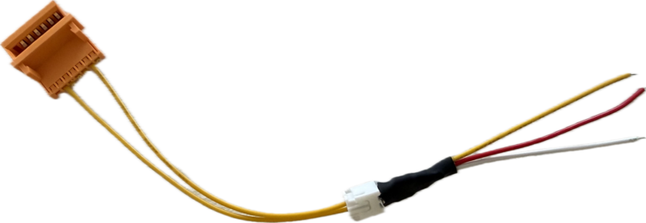
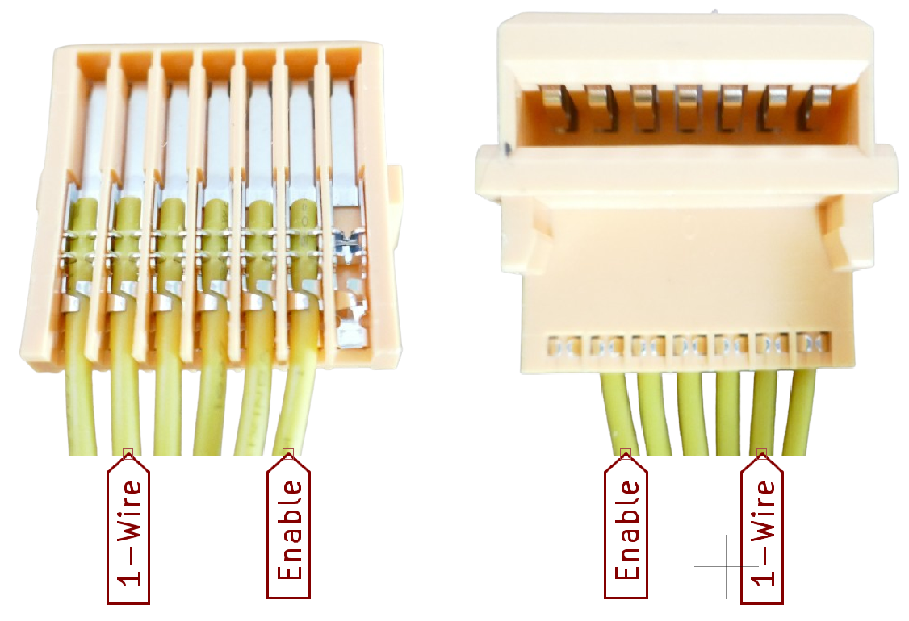
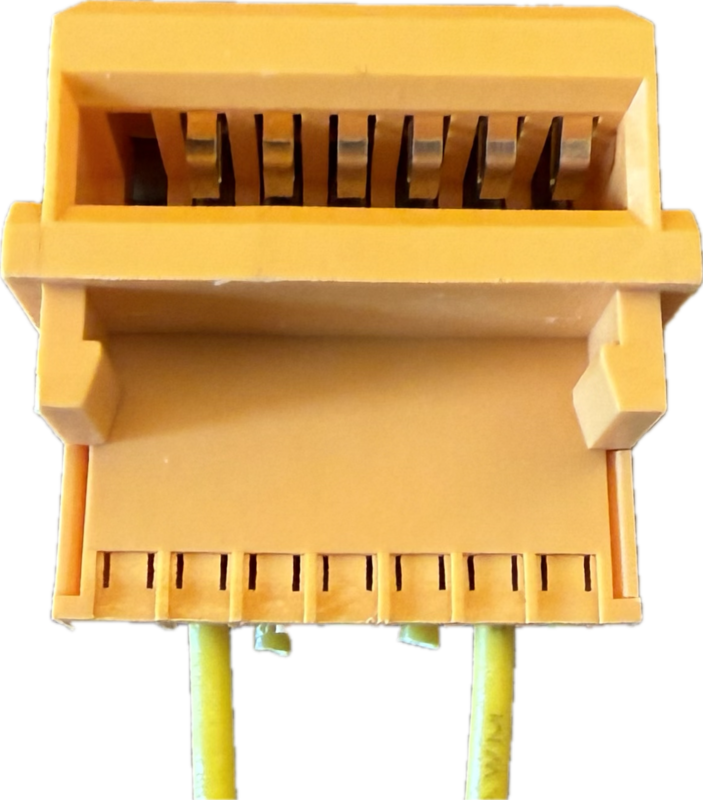
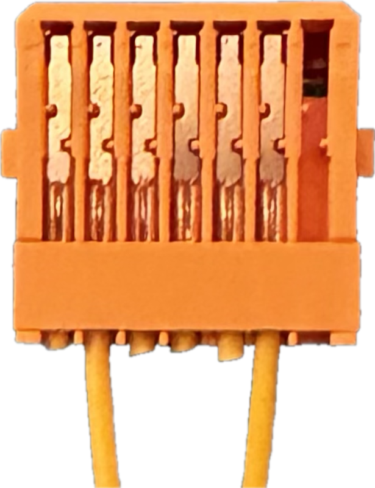
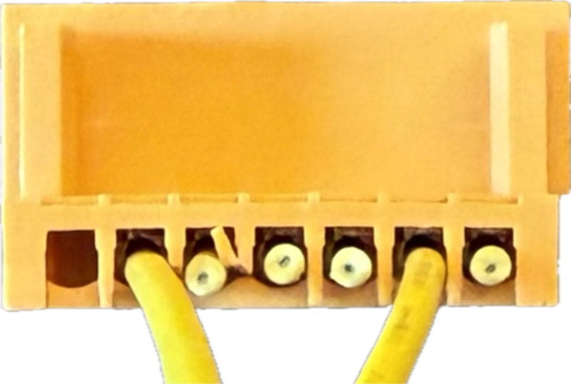
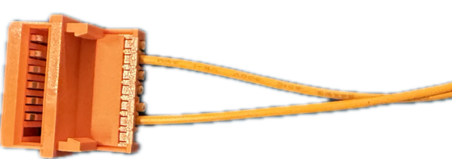
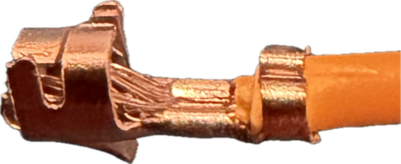
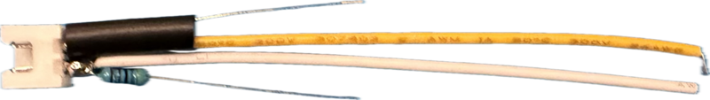
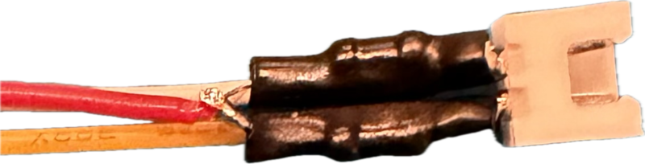
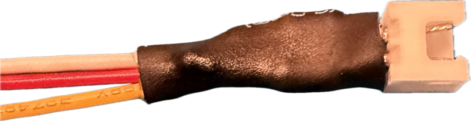

# Makita Yellow Interface Cable

> How to Use the Yellow Makita Interface Cable

In this article you learn how to configure a connector cable for the Makita LXT digital interface:

In a second step, you can integrate the two 4.7 kΩ directly into the corresponding connector which considerably reduces complexity on the MCU side later, providing you with a plug&play 3-wire connector:

## Overview

Makita LXT batteries (18 V tool batteries) feature a yellow interface connector. The way it is constructed, you cannot easily connect wires to it.

To access it reliably, get yourself a [Makita yellow charger connector terminal cable](https://www.google.com/search?q=Makita+yellow+charger+connector+terminal+cable).

These cables are repair parts for Makita chargers and commonly available at *Amazon* or *AliExpress*. They come with a standard 6-pin JST PH 2.0-connector on the other end:

> [!TIP]
> Purchase a 2-pack, they cost roughly as much as a single pack.   

### Default Connector Cable
The standard 7-pin yellow connector cable has six wires attached. On the other end, they are connected to a white 6-pin JST-SM 2.0 (Small Molex-style) female connector.

Of these six wires, only two are needed:

* **Enable** (Pin 6):     
  Must be pulled high before and during communication on pin 2.    
* **1-Wire Data** (Pin 2):    
  1-Wire data communication with specific Makita timings. Standard 1-Wire timing seems to work well enough, too.       

## Configuring the Cable

You can use the standard Makita cable as-is and pick a male 6-pin JST PH 2.0 connector. Since only two out of the six wires are really needed, this is a waste of space and adds complexity though.

That's why I routinely configure the Makita connectors:

* Cut off all non-required wires, leaving only the two wires needed.   
* In simple and very space-constrained scenarios (like *ArduinoOBI*), directly solder the two wires to the MCU board
* In test cases, fit a 2-pin JST-XT 2.56. Its pitch aligns well with typical PCBs.   
* For enclosures, fit a narrower 2-pin JST-PH 2.0 so that the plug is not wider than the neck of the yellow adapter. This ensures you can slide the plug through the mounting hole in your housing.

### 2-Pin JST-XT 2.56
This plug type is readily available, cheap, small, simple to crimp, and fits perfectly the 2.56mm pitch of typical PCBs.

> [!WARNING]
> To reiterate: JST XT is **wider than the yellow connector neck** so if you want to slide the connector through openings in housings that are designed precisely for the yellow connector, choose a narrower plug (i.e. JST-PH 2.0).

## Removing Wires
Out of the six wires, only two are needed: 

Cut off the other four wires.

The two wires remaining are the second wires from each side (pins 2 and 6):

This gives you the yellow Makita plug with two wires attached.

## Fitting JST XT 2.54 Plug

Remove the insulation of the cable ends, and crimp JST XT female connector pins to them.

Slide the connectors into a 2-pin female JST XT housing until they firmly snap into place:

## Fitting Pull-Up Resistors

For communication, both lines must be pulled up. You can place the 4.7 kΩ resistors on the MCU side, but for many use cases, it is much easier and cleaner to directly integrate them into the connector:

### Adding Resistors

Solder 4.7 kΩ resistors to each of the two data pins, and use shrink-tube to safely insulate them:

### Adding Pull-Up Line

Connect both resistors, and solder one wire to it. You can now pull both lines up when you power this wire with *3.3V* (or *5V* for Arduinos).

Add a larger shrink tube to safely enclose everything:

You now have a connector with three wires:

* Data Enable
* 1-Wire
* VCC (pullup voltage)

This lowers complexity on the MCU side considerably. All you need to do now is plug in the yellow Makita connector, and conect the three wires to your MCU -done.

> Tags: Makita, One-Wire, 1-Wire, OneWire, Digital Interface, LXT, Connector, JST-XT, JST-SM

[Visit Page on Website](https://done.land/components/power/powersupplies/battery/toolbatteries/makita/makitalxtdigitalinterface/yellowinterfacecable?745767051212262427) - created 2026-05-11 - last edited 2026-05-11
