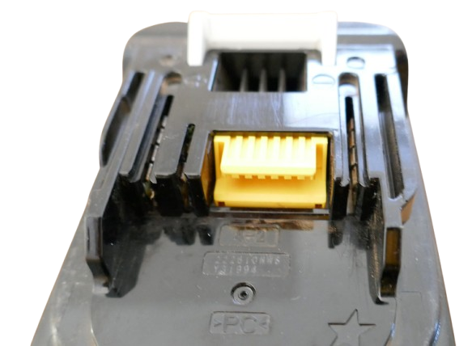

# Makita LXT Digital Interface

> Understanding the Makita LXT Digital Service Interface

Makita LXT batteries (18 V tool batteries) use a proprietary one-wire digital interface that allows querying battery details, assessing health, and unlocking locked batteries. The interface is exposed via the yellow auxiliary connector.

> [!NOTE]
> 3rd party Makita batteries (non-original batteries) typically expose the yellow digital interface connector, but in most cases it is fake and does not work. 

## Overview

The digital interface was originally used exclusively by Makita chargers and diagnostics:  

* **[DC18RC](https://www.makitatools.com/products/details/DC18RC)** (Charger):    
  * Reads battery health and determines if it is safe to charge a battery   
  * Can **lock** a battery when it finds security-relevant issues

* **[BTC04](https://www.youtube.com/watch?v=uumwieLu8CE)** (Battery Diagnosis):    
  * reads battery specs, calculates battery health
  * can **lock** and **unlock** batteries

Accessing the Makita LXT digital interface enables you to do what previously only the official (and expensive) [BTC04](https://www.youtube.com/watch?v=uumwieLu8CE) battery diagnosis could do:

* Evaluate Health and Value    
  - determine the value of a used battery that is on sale or that you want to sell.    
  - identify weak cells that needs to get replaced soon.      
* Identify Issues and Fix them.   
  - detect imbalanced cells: open the battery and manually balance them. 
  - detect severely imbalanced cells: safely assume that a balancer tab is broken, and fix it in a few minutes.    
* Unlock Repaired Battery
  * you fixed a locked battery, and now you want to use it again
  * you want to unlock a locked battery to see if it maybe was a random error that won't repeat 
  

Good reasons - considering that repairing a battery is often not very hard, the batteries are too expensive to not try and repair them, and today, a few dollars worth of hardware can do what previously only an expensive [BTC04](https://www.youtube.com/watch?v=uumwieLu8CE) could do.

### Makita 1-Wire Protocol 

Up until 2024, it was impossible for users to use the Makita LXT digital interface since it was kept a secret: Makita did not publish the protocol details. A single person named *Martin Jansson* changed this by reverse engineering it and open-sourcing the findings:

* Protocol analysis in 2021:     
  [Battery Hacking](https://martinjansson.netlify.app/posts/makita-battery-post-1) – Initial reverse-engineering work.

* Firmware extraction & command discovery in 2024:      
  [Command Set Analysis](https://martinjansson.netlify.app/posts/makita-battery-post-1) – Extracted original firmware, identified key commands.

  

## Using the LXT Interface

To use the digital interface on Makita LXT batteries, three things are needed:

1. **Hardware (Dongle):**   
  Emulates the Makita protocol

2. **Software:**   
  Sends Makita command bytes and receives results from the battery.

3. **User Interface:**    
  Displays battery data and invokes actions (such as battery unlock).

These three things can all be separate items, or combined in one device.

## Hardware

The hardware acts like a "dongle" that translates between the Makita battery and the outside world by emulating the proprietary [Makita 1-Wire protocol](https://github.com/rosvall/makita-lxt-protocol).

To implement this, you need a yellow Makita connector cable (to physically plug into the digital interface on the battery) and a cheap microcontroller (Arduino, ESP32, RP2040, etc. all will do) that runs the firmware that implements the Makita protocol. 

## Software

Sends the documented Makita command bytes to the battery to invoke certain actions (i.e. read battery state, unlock battery, etc.), and interprets the results. 

Some projects have integrated this into the firmware, so no PC is needed. The original project used a separate python script that runs on a PC. Here are available options for you:

### MCU + PC Software   
Microcontroller works as dongle only, separate software communicates through dongle:

* [OpenBatteryInformation](https://github.com/mnh-jansson/open-battery-information) in 2024:  

  

* [Automatic Makita LXT Battery Unlocker](https://github.com/synrais/Makita-LXT-Battery-Monitor-Unlocker) in 2026: 

  

### MCU Stand-Alone
Combines dongle and command logic, both run inside microcontroller:

- [ESP32 Makita BMS Reader](https://github.com/Belik1982/esp32-makita-bms-reader) in 2025    
  uses a web interface, display on your smartphone  

- [Automatic Makita LXT Battery Unlocker](https://github.com/synrais/Makita-LXT-Battery-Monitor-Unlocker) in 2026    
  works fully automatic, uses a RGB LED when running on RP2040 Zero.      
  **Note:** can also send battery data to external software.

User Interface Options, And What To Choose
 

The user interface visualizes the retrieved battery information, and options that you can pick range from "no visualization at all" to "full GUI application":

### PC Software    
If you run your software on a PC anyway, then it is a natural thing to implement the user interface on the PC as well, and display the results as text in a console, or create a dedicated graphical user interface (i.e. dialog window).

* *Advantage:* it is easy to play with the code and explore the protocol.     
* *Disadvantage:* you always need a PC     

This was the original approach adopted by [OpenBatteryInformation](https://github.com/mnh-jansson/open-battery-information) in 2024.

### Web Interface    
Some microcontrollers (like ESP32) are powerful enough to open a WiFi access point and display the data via its own web server. 

You simply connect to it via your smartphone and essentially use your smartphone screen as user interface.

  * *Advantage:* simple setup, rich graphical user interface
  * *Disadvantage:* hassle to connect to the access point

This path was chosen by the first dedicated [ESP32-based implementation](https://github.com/Belik1982/esp32-makita-bms-reader) in 2025. 

### WS2812 RGB LED   
On less powerful microcontrollers, you can use simplified visualizations like a multi-color LED.

*Advantage:* very simple setup, no extra steps or PC needed    
*Disadvantage:* limited information. While you can signal battery state (good/bad, locked/unlocked), and invoke automatic unlocking, you cannot visualize battery information such as cycle count or cell voltages.  

This was the approach taken by the [Automatic Makita LXT Battery Unlocker](https://github.com/synrais/Makita-LXT-Battery-Monitor-Unlocker) in 2026.   

### TFT Display   
Information is displayed on a TFT display controlled directly by the microcontroller. This could be a separate display connected to the microcontroller via I2C or SPI, or a development board with integrated TFT display.   

*Advantage:* very simple setup, all information directly at your fingertips, no extra steps or PC needed     
*Disadvantage:* firmware is specific for a given development board/display type. This can make it harder for community to rebuild/adopt the solution.   

## First Steps

If you want to create your own Makita Digital Service Tool, here is what you should do:

1. Pick a microcontroller and add a few resistors. 
2. Connect a yellow Makita connector to your microcontroller
3. Pick the firmware that suits you best, and upload it to your microcontroller

If the firmware you picked contains the command logic as well, then you are done, and your device is ready-to-use.

If the firmware you picked is just a "dongle" (like *ArduinoOBI*), you have one more step:

4. Connect your microcontroller to a PC via USB cable, then run the software that came with the firmware, or use a custom script that communicates via USBSerial.

> Tags: Makita, One-Wire, 1-Wire, OneWire, Digital Interface, LXT, BTC04, DC18RC

[Visit Page on Website](https://done.land/components/power/powersupplies/battery/toolbatteries/makita/makitalxtdigitalinterface?134231121517253207) - created 2025-12-16 - last edited 2026-05-02
