# Utilizing Makita Batteries

> Creating Compatible Slide-On Battery Connectors to Utilize Makita Tool Batteries

Using heavy-duty tool batteries in your own projects is a surprisingly great idea - after all, such batteries are designed to be attached and detached as needed to various devices. They provide high capacities, are rugged and safe, and available in many households anyway. 

Often, these expensive batteries are used infrequently (i.e. during gardening season). Adding more use cases is cost effective and helps keeping the batteries in good shape.

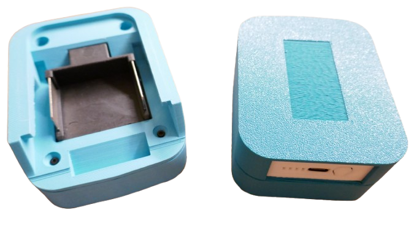

All that is needed is a way to safely connect tool batteries to your own devices. Mimicking the slide-on interface is simple and reliable, and below you find all the instructions.

So why not use the existing tool batteries in your household for DIY projects, too,  whenever you don't need them for your gardening or workshop tools?

> [!NOTE]
> I am focusing on 18V Makita tool batteries simply because that is what I use. The same ideas and strategies apply to any other tool battery from other vendors, and you can use the information below not just for DIY projects, but also to build adapters and converters.    

## Overview

Tool batteries are an interesting power source for DIY projects because...

* they are often already available in many households
* they can be easily attached and detached to tools
* they have large capacities and are powerful.

Since tool batteries are designed to be portable and exchangeable, they already come with a mechanism to be safely attached and detached to devices. 

Whether you want to power your DIY projects, create new accessoires, or construct battery adapters: you just need a way to utilize the slide-on mechanism.

## Using Pre-Made Adapters

Pre-made adapters are ready-to-use and provide you with two wires that expose the battery contacts:

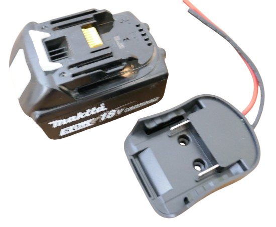

When you slide such adapters onto a tool battery, you get access to the raw battery voltage. For a 5S tool battery, this is in the range of 15-21V, depending on state-of-charge.

Such adapters solely provide battery access. There is no room to accomodate PCBs or parts of your project. So if you opt for this route, your project will be *external* to the adapter in its own housing.

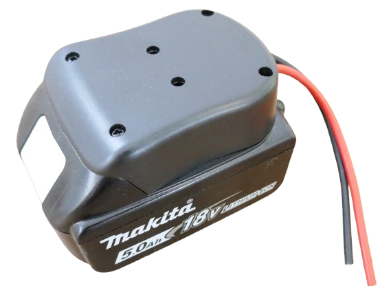

## Repurposing Commercial Tool Battery Accessoires

There is a rich market for tool battery accessoires (such as chargers, lamps, soldering irons, etc). 

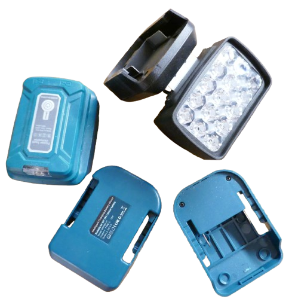

Most of these accessoires use housings that are simply screwed together, and you can easily open and repurpose/enhance them. Here is an example of a simple commercial USB-A charger and lamp:

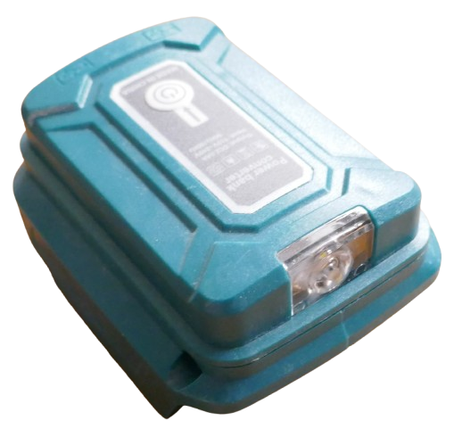

When you unscrew the two torx screws on its side, the housing easily comes apart and exposes its internals:

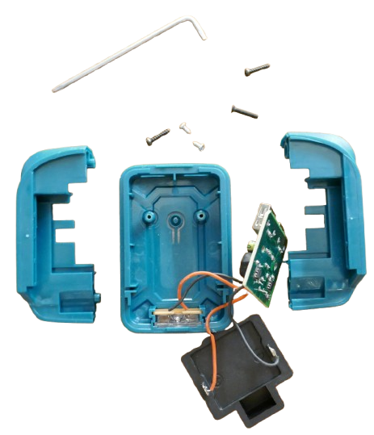

You could now for example replace the built-in PCBs with better ones or use the housing for completely different ideas.

### Ordering Empty Housings

Vendors have recognized the DIY marked and offer empty housings at reduced prices. On the right, you can see an original accessoire, and on the left there is an empty basic housing sold separately.

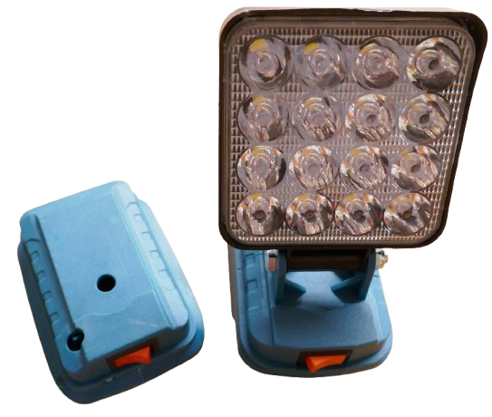

Empty housings often are only marginally cheaper than finished accessoires. It may make more sense to buy the real accessoire, i.e. a lamp, then remove the original content, repurpose the housing, and repurpose the harvested spare parts later in separate projects.

Since empty housings were designed for specific products (and not as a stand-alone housing), they typically come with holes at unexpected locations. These holes were originally used to mount external parts like lamps, or as cable feed. 

## 3D-Printing Your Own Adapters

The most flexible and affordable approach is 3D-printing your own adapter housings - provided you have access to a 3D printer of course. 

> [!NOTE]
> Basic experience in CAD design and familiarity with tools like [Autdesk Fusion](https://www.autodesk.com/products/fusion-360/overview) or similar design tools is benefitial if you want to adjust the designs.

3D designs can include the complete adapter, but most commonly, 3D printing focuses on the housing only. The electrical contacts are inserted as a "standard contact plate" that can be purchased for just a few cents. 

This approach is much more convenient than integrating electrical contacts directly into your 3D print. Many commercial adapters utilize external contact plates inside their housings, too:

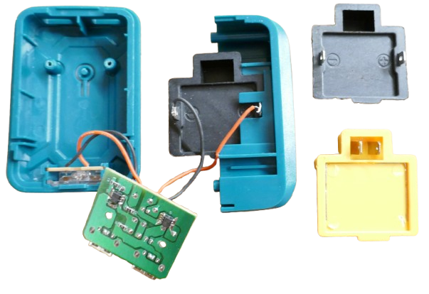
     
* **Contact Plate:**     
  Can be ordered ready-to-use for cents per piece. Available in black and yellow, functionally identical but yellow versions typically 3x the cost. 

  * **2 Contacts:** the most const-effective basic type that exposes the battery power. For most DIY projects, this is all you need.     

    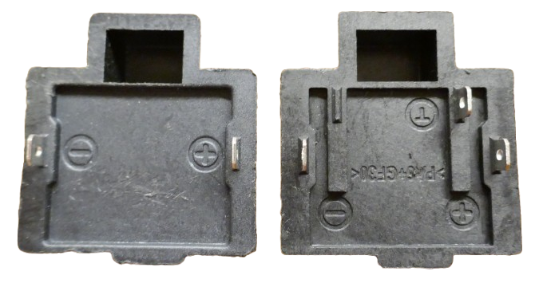
     
  * **3 Contacts:** the 3rd contact provides access to the thermistor (temperature probe) built into the battery which can be useful for power-hungry accessoires where you want to keep an eye on battery temperature.     

    Since 3-contact plates are less common, they are significantly more costly. Do not use such plates unless you really need access to the battery temperature probe.

* **Housing:**     
  3D printing focuses on the housing only. The purpose of the housing is to accommodate your DIY components plus firmly **securing the contact plate**.   
  
### Interlock Design
  
In this design, the contact plate is locked inbetween **two parts of the housing**, then the two parts are scewed together. 
  
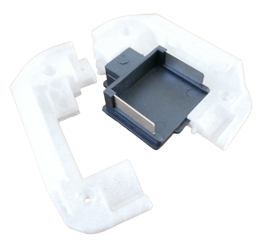   
  
This approach is very common with commercial adapters but leaves an  vertical gap in the housing that can be problematic in rugged environments (moisture, dust). 
    
  
### Snap Design
The housing is designed in one part, and the contact plate is "snapped" into it. Equally secure, but easier to design and print, and without an additional vertical gap in the housing.     
    
    
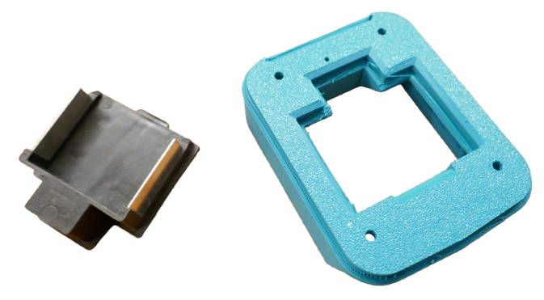 
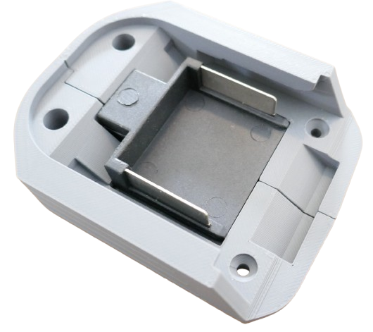

### Integrated Design
Many 3D print slicers allow you to **pause** the print at a given layer. For example, in *Bambu Studio* slice your 3D files, then in the *Preview* tab, move the slider on the right side to the layer where you want a pause, right-click the slider, and in the context menu simply add a **pause** instruction.

This way, you can fully insert the external contact plate into your prints, just as you would do with magnets, then continue the print. 
If done correctly, this seamlessly integrates the contact plates into your housing.

## 3D Print Files

You can easily find free and ready-to-use 3D print files in **stl** format. However, if you want to enhance or change the designs, or adjust tolerances for different printing materials, you need an **editable** format such as *f3d* that you can open and edit in [Autdesk Fusion](https://www.autodesk.com/products/fusion-360/overview) or similar CAD software.

Editable files are harder to find, and licensing often excludes commercial use. Here are three free downloads that I found especially helpful:

* [Adapter with Separate Contact Plate](https://www.thingiverse.com/thing:5441584):      
  Awesome professional design for a complete adapter that uses an external contact plate and secures it in "interlock" mode.     
  
  Comes with different extension housings. Highly recommended.

* [Adapter with Built-In Contacts](https://www.printables.com/model/19968-makita-battery-adapter-barrel-jack/files):    
This design integrates the electrical contacts so you do not need a separate contact plate.     

  Yet now you will need suitable conductive material (metal strips) and a way to insert them into the 3D print.     
* [Contact Plate Only](https://grabcad.com/library/makita-18v-battery-connector-1/files):     
  The electrical contact plate only. Download requires free registration. Purchasing ready-made contact plates is probably a much easier way. 
  
  This download provides you will all the dimensions, and you may want to use this model as a placeholder in your own designs so you can later insert a ready-made contact plate.    

> Tags: Tool Battery, Makita, Parkside, Einhell, DeWalt, Milwaukee, Bosch, Housing, Adapter

[Visit Page on Website](https://done.land/components/power/powersupplies/battery/toolbatteries/makita?985851101111252031) - created 2025-10-10 - last edited 2025-10-10
