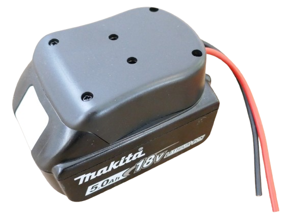
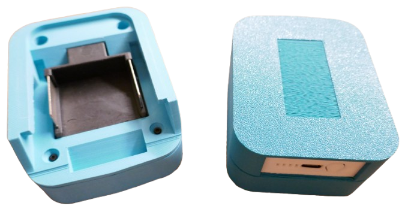
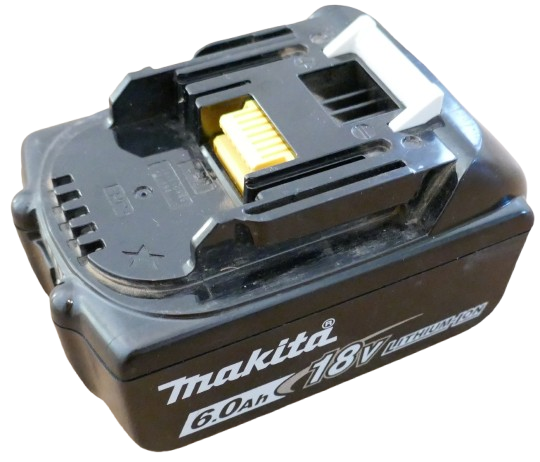
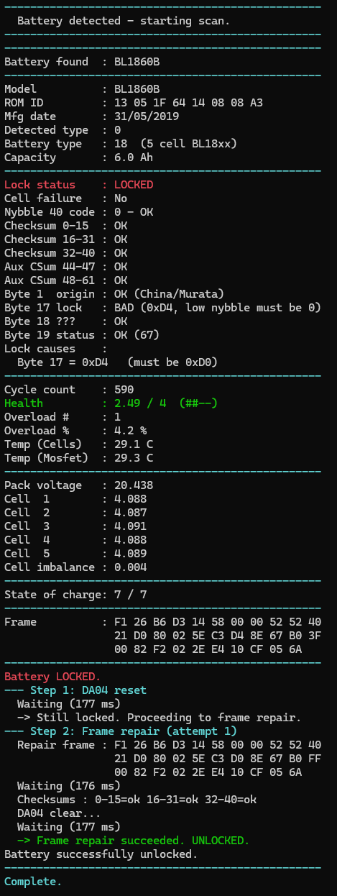
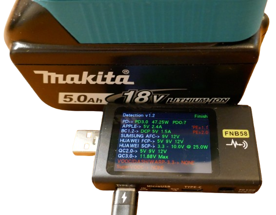
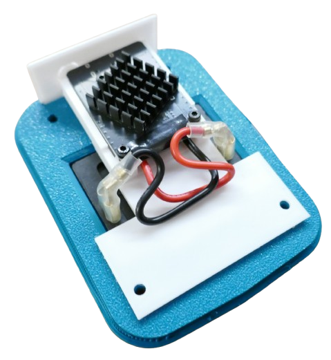
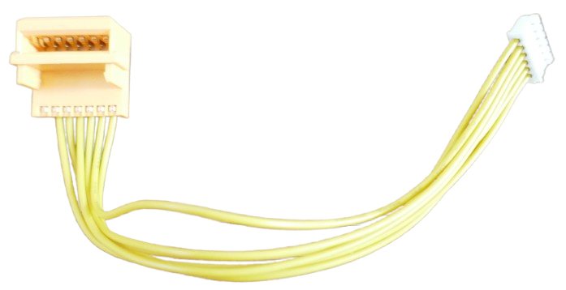

# Using Makita Batteries

> Creating DIY Makita Tools and Querying and Unlocking Makita Battery BMS

Heavy-duty tool batteries (like *Makita*) are an excellent energy source, not just for the actual tools that are designed to use them. In this section we'll look at building custom Makita adapters.

## Overview

Originally, Makita tool batteries were developed for power tools like drills and hecksaws. But at its heart, these batteries are super-powerful general-purpose power supplies.

That's why 3rd parties have long begun to offer additional accessoires that slide on Makita batteries: lamps, radios, soldering irons, you name it.

So why not build your very own Makita accessoires? That's what I am covering in this section.

So let's turn Makita batteries into USB-C powerbanks, build your own chargers that can charge Makita batteries from 12V car electric or any USB power supply, and tap into the secret digital battery interface to examine battery health and unlock dead batteries.

### Custom Adapters

The first step is to [build custom slide-on adapters](https://done.land/components/power/powersupplies/battery/toolbatteries/makita/custombatteryadapters/) so you have a firm and rugged battery connection, just like regular tools do this. 

You can use ready-made contact plates or go all the way and 3D-print your own adapters tailored exactly to your needs.

Why use Makita Tool Batteries for DIY at all?
 

Many of us already own those tool batteries but use them  rarely, i.e. once a year for gardening work, or occasionally to drill a hole. 

Considering the cost of these batteries, that's a waste of your investment, and it's also hurting the batteries: lithium batteries have a surprisingly long life time provided you keep them charged in the 30-70% range. Storing them away, often fully charged at 100%, isn't a good idea because it lets these expensive batteries degrade much faster. 

So expanding the use cases for your tool batteries, and using them more often can actually improve their longevity.

They are an excellent power source for any battery-driven project:

* **High capacity:**   
  they store a lot of energy, much more than typical battery packs.
* **Rugged:**    
  they are designed to safely work in tough environments
* **Safe:**    
  these brand batteries have sophisticated BMSes and all the protections in place that you need for safe operations
* **Fast recharge:**    
  despite their high capacity, they are designed to recharge fast, and safe fast chargers exist
* **Reusable:**    
  they are modular and can easily be switched between projects, maximizing your investment and keeping the batteries in use and healthy.   

### Digital Interface
Did you know that original *LXT 18V Makita batteries* feature a [digital interface](https://done.land/components/power/powersupplies/battery/toolbatteries/makita/makitalxtdigitalinterface/)? That's what the yellow connector is for.

You can [build tools that access the digital interface](https://done.land/components/power/powersupplies/battery/toolbatteries/makita/makitalxtdigitalinterface/) to monitor its cells, determine battery health, and even unlock dead batteries.

## Ideas

Here are just a few examples to get you started:

* **Power Source:**    
  In its simplest form, the adapter provides access to the raw battery power (15.0V - 21.0V, depending on state of charge). Add a voltage regulator for stabilized voltage.    
  * **12V Battery:**    
    By adding a simple buck converter, you can turn a Makita 18V battery into a very powerful 12V battery. Add a typical car adapter, and you can run a huge variety of car accessoires directly off your tool battery.  
  * **High-Capacity USB-C Power Bank:**     
    add a simple USB-PD controller to turn a Makita battery into a large-capacity USB power bank that can power your laptop.   

    
     

* **USB-C Charger:**    
  add a cheap USB-PD 5S charger and build your own USB-C Makita charger that charges your Makita batteries off any USB power supply.    
  
      

* **Battery Diagnostics and Repair:**    
  by accessing the secret digital interface, you can...
  * ...check battery health and find out how good a battery actually still is. You can examine individual cell health, battery balancing, the cycle count, and the battery manufacturing date.    

     

  * ...unlock batteries: if the battery BMS has locked a battery, you can ask it to unlock the battery again. Obviously, you should first assess **why** the BMS has locked a battery, and whether it is safe to unlock and continue to use it.    

     

## Links

There is a vibrant community that open-sourced their findings and provides the ground work to leverage the full potential of Makita batteries. 

Here is a curated list of important links for further reading:

### Makita LXT Battery 

* [Makita Battery Wiki](https://github.com/mnh-jansson/open-battery-information/wiki/Makita)    
* Makita LXT Battery Types:    
  [Type 0](https://github.com/rosvall/makita-lxt-protocol/blob/main/type0.md)  
  [Type 1](https://github.com/rosvall/makita-lxt-protocol/blob/main/type1.md)  
  [Type 2](https://github.com/rosvall/makita-lxt-protocol/blob/main/type2.md)   
  [Type 3](https://github.com/rosvall/makita-lxt-protocol/blob/main/type3.md)   
  [Type 4](https://github.com/rosvall/makita-lxt-protocol/blob/main/type4.md)    
  [Type 5](https://github.com/rosvall/makita-lxt-protocol/blob/main/type5.md)    
  [Type 6](https://github.com/rosvall/makita-lxt-protocol/blob/main/type6.md)  
  
* 3D-printable adapters
   * [Raw Contact Plate](https://grabcad.com/library/makita-18v-battery-connector-1/files)    
   * [Custom Adapter that integrates a separate contact plate](https://www.thingiverse.com/thing:5441584)   
   * [Custom Adapter with embedded contacts](https://www.printables.com/model/19968-makita-battery-adapter-barrel-jack/files)    
   * [Housing with single spade contact for ArduinoOBI](https://shorturl.at/W719g)     

### Makita LXT Digital Interface

#### Research

* [Initial Makita battery hacking by Martin Jansson](https://martinjansson.netlify.app/posts/makita-battery-post-1)     
* [Command Set Analysis by Martin Jansson](https://martinjansson.netlify.app/posts/makita-battery-post-1)   
* [Summary of Protocol Design, Battery Types, and Capabilities](https://github.com/rosvall/makita-lxt-protocol)    

#### Original Makita Equipment Using the Interface

* [Makita DC18RC Charger](https://www.makitatools.com/products/details/DC18RC)    
* [Makita BTC04 Battery Diagnosis](https://www.youtube.com/watch?v=uumwieLu8CE)

#### Projects using Digital Interface

* [OpenBatteryInformation (2024)](https://github.com/mnh-jansson/open-battery-information)    
  * [ArduinoOBI](https://github.com/mnh-jansson/open-battery-information/tree/main/ArduinoOBI)    
    * [Video Tutorial](https://www.youtube.com/watch?v=kUg9jWvf5FM)    
    * [3D Printed Enclosure](https://shorturl.at/W719g)   

  * [Community Issues](https://github.com/mnh-jansson/open-battery-information/issues)    
  
* [ESP32 Makita BMS Reader (2025)](https://github.com/Belik1982/esp32-makita-bms-reader)     
* [Automatic Makita LXT Battery Unlocker (2026)](https://github.com/synrais/Makita-LXT-Battery-Monitor-Unlocker)    

#### Hardware

* [Yellow Makita Digital Interface Cable and Connector](https://www.google.com/search?q=aliexpress+makita+charger+connector)    

   

> Tags: Tool Battery, Makita, Parkside, Einhell, DeWalt, Milwaukee, Bosch, Housing, Adapter

[Visit Page on Website](https://done.land/components/power/powersupplies/battery/toolbatteries/makita?514663051011260518) - created 2026-05-10 - last edited 2026-05-10
