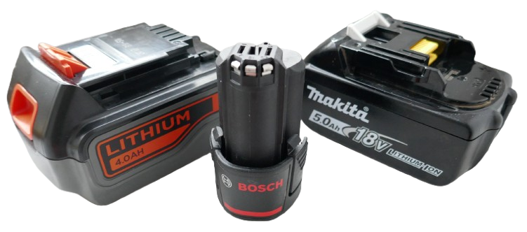
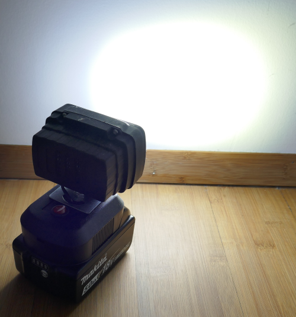
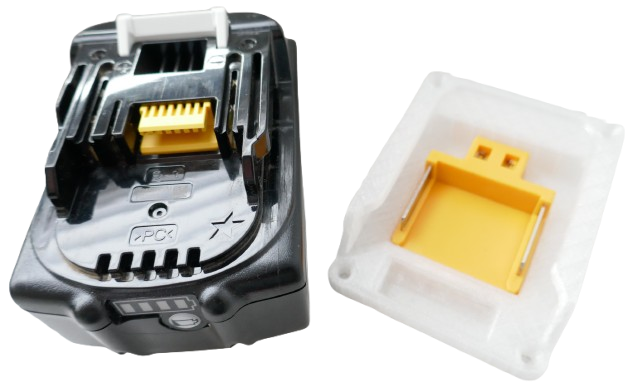
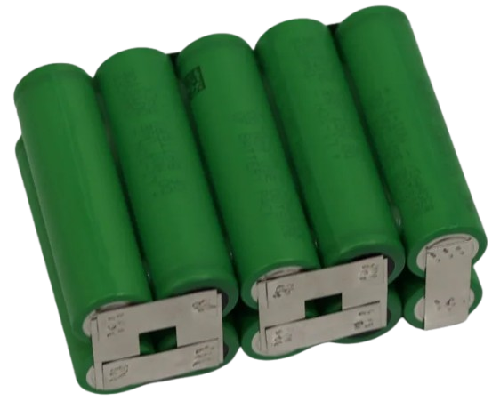
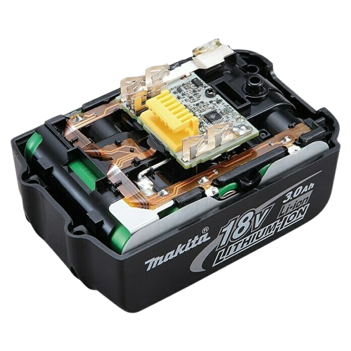
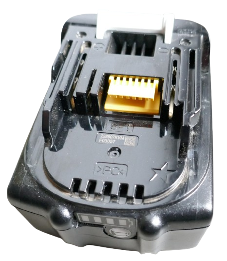
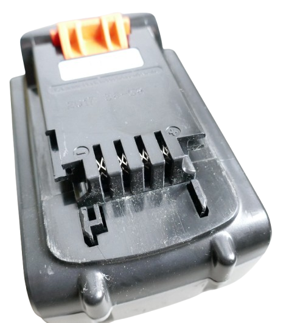
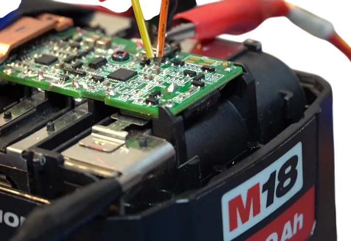

# Tool Batteries

> Using Power Tool Batteries as Energy Source

In many homes you find battery-driven power tools. Such tools are powered by vendor-specific batteries.

These batteries typically have high capacity and can deliver strong currents. 

## Re-Purpose Ideas

Why use such capable (and expensive) batteries exclusively with gardening tools, and have them sit around unused the rest of the time?     

> [!TIP]
> Many people own tool batteries for devices that no longer work or have long been replaced by other brands. Since most tool batteries use vendor-specific connectors, they can't be used for other brands. Repurposing such batteries for your own projects is a very rewarding prpject.     

Here are a number of awesome use-cases that require only little effort. 

* **Build Extensions:**      
  Buy or build extensions that slide on the battery, for example a lamp, a soldering iron, or a 12V cigarette lighter connector to connect car devices.     

  
  

* **Powerbank:**     
  Turn your power tool battery into a high-capacity USB powerbank. Thanks to the high currents typical tool batteries can deliver, you can even run your notebook off it.

* **Charger:**      
  Tird of using vendor-specific stationary chargers? It is simple to build your own chargers that can be supplied by USB or a 12V car cigarette lighter plug.      

* **Adapters:**     
  Add a new adapter to your battery so it fits tools from other vendors, so you can re-purpose your old battery packs when you decided to move to a new brand.      

* **Diagnostics and Repair:**     
  Some vendors have added sophisticated digital interfaces to their batteries, i.e. Makita. While the interface protocol is proprietary and not officially documented, there are [DIY makers that have deciphered the details](https://github.com/mnh-jansson/open-battery-information), so now you can add sophisticated information panels to your battery, check battery health, and even repair dead batteries by resetting their error state.

## Overview

Power tool batteries consist of these parts:

* **Battery Pack:**      
  
  A number of battery cells, typically 18650 LiIon cells, connected in series and in parallel to compose the desired voltage and capacity:

  

  For example, the typical *18V* or *20V* batteries all **5S** battery packs (where five cells are connected in series). The maximum battery pack voltage is *5 x 4.2V = 21V*, the minimum voltage is *5 x 3.0V = 15V*. 

  Note that *18V* and a *20V* battery packs are the same: some vendors (like *Parkside*) choose to advertise with a higher number out of the *15-21V* operational range solely for marketing purposes.

* **BMS (Battery Management System):**      
  A BMS protects the battery cells so they don't explode when they are over-charged or short circuited. 

        
    
  Some BMS can also balance the cells, ensuring they are all on the same voltage.

  The BMS does not stabilize the voltage or charges the battery, both of which is the responsibility of the power tool that uses the battery.      

* **Diagnostics:**      
  Some vendors add additional diagnostics to the battery, for example a thermistor output that enables fast-chargers to monitor the battery cell temperature. 
   
  Other vendors (like Makita) add a sophisticated and proprietary 1-Wire digital interface that can be used to inspect battery health, view the cycles, and even reset error states.

* **Connector:**      
  Most vendors add **proprietary** adapters which is unfortunate. As you see, the battery internals are basically identical across different brands. 
   
  There is no good reason why the battery pack from one vendor shouldn't be used to power a device from another vendor.      

### Not a Powerbank

Tool batteries are **not** a powerbank since they are missing important features:

* **Charger:**      
  Tool batteries have no built-in charger. You need an appropriate external LiIon charger to charge them.      
* **Stabilized Output:**      
  Tool batteries output the raw battery connections, and their voltage can vary significantly, based on battery state of charge.      

  Power tools either don't need stabilized voltage (very power-hungry tools work best when powered directly from the battery without buck- or boost-regulation in the way), or they add their own DC-DC converter.   

### Turning Tool Battery Into Powerbank
If you want to turn a tool battery into a real powerbank-like energy source, simply add the missing parts yourself: there are excellent and very affordable breakout boards that provide both USB-C charging and stabilized USB PD output.

Just make sure the breakout board matches your battery voltage. For typical *18/20V* tool batteries, you need a **5S** breakout board.

> [!NOTE]
> By adding such a breakout board, you are essentially also adding a portable charging solution: you can now use any USB power supply to charge your tool batteries.      

### Turning Tool Battery Into 12V Power Source
Once you add a breakout board for USB PD (Power Delivery) to your tool battery, you can also easily turn it into a powerful fixed-voltage power source.

Just add a USB Trigger Board. These are available for all supported USB PD voltages, i.e. 5,9,12,15,20V and more. With PPT, you could even turn the output into a fully adjustable voltage (in 100mV increments).

## Tool Battery Vendors

There is a wide range of vendors that produce tool batteries, and the following table serves as an example. It is by no means complete.

This table illustrates how typical *18/20V* tool batteries differ between different vendors:

| Vendor       | Model                               | Built-in BMS | Dedicated Balancing          | Notes                                             |
|--------------|--------------------------------------|--------------|------------------------------|--------------------------------------------------|
| Bosch        | ProCore 18V                          | ✅           | ❌                           | Smart communication; thermal monitoring          |
| DeWalt       | XR 18V/20V Max 5Ah                   | ✅           | ❌                           | Proprietary comms; tool/charger handshake        |
| Einhell      | Power X‑Change 18V (2.5–8Ah range)   | ✅           | ✅                            | “Active Battery Management System”; Twin‑Pack    |
| Enerkey      | 5S 18650 Li‑ion                      | ✅           | ✅                           | Tool/drill‑focused BMS                           |
| Enerprof     | 5S 18V Li‑ion                        | ✅           | ✅                           | Standard BMS pack                                |
| JYWD         | 5S 21V (DeWalt‑compatible)           | ✅           | ✅                           | DeWalt‑compatible foot; protection PCB           |
| Makita       | BL1850B 18V 5.0Ah                    | ✅           | ❌                           | Proprietary 1‑wire comms; temp sensing; pack ID  |
| Milwaukee    | M18 RedLithium 5Ah                   | ✅           | ❌                           | MCU/AFE protection; proprietary comms            |
| Parkside     | PAP 20 B1 20V 2Ah                    | ✅           | ✅                            | LED gauge; NTC; dedicated charger contacts       |

There are basically two areas where battery packs from different vendors differ: exposure of additional battery information, and balancing.

### Battery Information

Some vendors include "intelligent" battery telemetry, available through proprietary data protocols and additional connectors, i.e. Makita uses a yellow extra connector in-between the power shoes: 

Most vendors however simply stick to outputting a thermistory value to monitor battery temperature, i.e. Einhell:

      
 
Additional information provided by battery packs is crucial for **fast-charging** only: the charger can find the maximum charging current that can be safely used without heating up the batteries too much.      

They may also be useful to check battery health and repair error states. During normal charging with conservative charging currents (i.e. 1-3C), the extra connectors are not needed though.

So if you plan to design/use your own charger - provided you are not aiming to fast-charge the battery with high currents - this is entirely possible and does not hurt the battery pack.      

Just make sure the charger:

* is a **LiIon** charger for **5S** batteries.
* is not charging with more than **1-3C** current.

> Needless to say: never use a regular power supply to charge batteries.      

### Balancing   
When batteries are connected in series - as is the case with tool batteries - cell balancing can extend the life span and preserve battery capacity. Balancing prevents the “weakest-cell-limits-all” effect during charge and discharge

* **Active Balancing:**      
  No vendor uses active balancing, nor do battery packs expose the balancing contacts for external balancing through the charger.      
* **Passive Balancers:**   
  Some vendors (like Parkside) employ simple per‑cell bleed circuits on the battery PCB. This is combined with charger control that tapers current near end‑of‑charge so the pack’s onboard bleeders can equalize cell‑group voltages.     
* **Other Strategies:**      
  Vendors like Makita aim to prevent significant cell voltage drift in the first place by high cell matching (cells share almost identical specs and charge very similarly, without much drift) and do not use balancing. 

Passive balancing is associated with slower apparent capacity fade and more consistent runtime as packs age, whereas non-balanced systems are more vulnerable to early capacity loss from cell drift; still, manufacturing (cell matching, thermal design) and user conditions can outweigh protocol differences in real-world outcomes.

In any case, I was unable to find statistically relevant data that would indicate that balancing-less battery packs showed faster capacity-loss than those with passive balancing. 

Some enthusiasts nevertheless add their own balancing boards to their battery packs, and top off individual battery cells if battery capacity drops too much.

### Conclusion

All tool batteries are at its heart **BMS-protected battery packs**, despite their vendor-specific connectors and optional monitoring ports.

Key is the battery pack voltage: *18/20V* battery packs, for example, use a **5S** configuration. So you can use any **5S**-compatible breakout boards to charge or discharge them.

> Tags: 18V, 20V, 5S, LiIon, BMS, passive balancing, active balancing, Makita, Parkside, Einhell, DeWalt, Milwaukee, Bosch, thermistor, 1-Wire

[Visit Page on Website](https://done.land/components/power/powersupplies/battery/toolbatteries?218811081428253318) - created 2025-08-27 - last edited 2025-08-27
