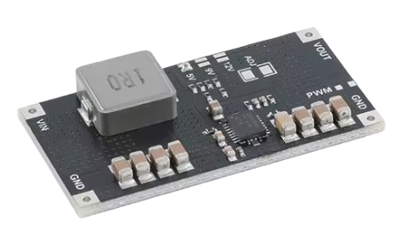
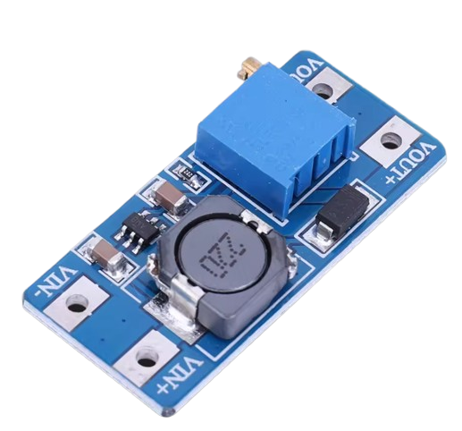
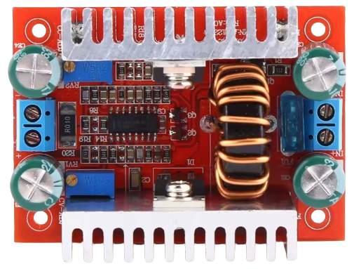
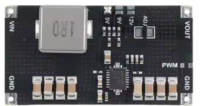
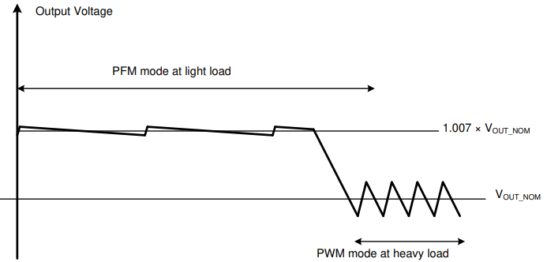

# TPS61088

> Synchronous Boost Converter Boosting 2.7-12V To 4.5-12.6V At Up To 30W And Up To 91% Efficiency

The [TPS61088](materials/tps61088_datasheet.pdf) is an extremely capable synchronous boost converter IC from *Texas Instruments*, operating at an adjustable switching frequency of 200kHz up to 2.2MHz. 

This is a popular breakout board available on AliExpress that uses it:

The TPS61088 is just the very small black IC on that board. Most space is used for the external inductor, solder pads, and some decoupling inductors and configuration resistors. TPS61088 requires only very few external components, and solutions based on it can have an *extremely* small footprint. Still they boost a *1S LiIon battery input* (at around 3V) up to *12V* - at impressive *1.5A/18W*.

## Overview

TPS61088 was designed with *1-2S* LiIon battery cells as input power source in mind. Yet, it can be used with any input voltage in the range of *2.7-12V*. 

| Item | Description |
| --- | --- |
| Input Voltage | 2.7-12V |
| Input Current | 9A max. |
| Output Voltage | 4.5-12.6V |
| Output Power  | 30W max *(depends on voltage gap, heat sink required)* |
| Internal Switch | 10A max |
| Efficiency | up to 92%, improving with higher output currents |
| Switching Mode | PFM, PWM |
| Switching Frequency | 200kHz - 2.2MHz *(adjustable by external resistor)* |
| Quiescent Current | VIN 1 µA VOUT 110 µA |
| Soft Start | programmable via capacitor on pin `SS` *(prevents high inrush currents)* |
| Over-Voltage Protection | 13.2V |
| Under-Voltage Protection | 2.7V raising, 2.4V falling |
| Over-Current Protection | per cycle |
| Thermal Shutdown | yes, 150°C *(released when temperature falls below 130°C)* |

### Size and Performance

TPS61088-based boost converters out-perform most "classic" boost converters, both in **size and output power**.

#### Comparable Size
Boost boards of similar size are much less powerful. Here is a [MT3608](materials/mt3608_datasheet.pdf)-based board with roughly the same dimensions:

Even though the board is often advertised as *"2A boost board"*, the real-world capabilities are much different. Here is a comparison:

| Chip | boosting 3.7V to 12V continuously |
| --- | --- |
| TPS61088 | 18W / 1.5A |
| MT3608 | 3.6W / 0.3A |

Even 3.6W can still be ok when you just need to power a **light load**, such as a microcontroller board. However, if you do need significant output power, *TPS61088* can deliver it whereas most other boards in this form factor cannot.

While you might be intreagued to pick more capable "classic" ICs such as *XL6009*, they often are more capable on their datasheets only: with typical board design and heat sinking, even a *XL6009* yields only a few hundred mA when boosting 3V to 12V. Continuous power draw significantly above 400mA likely results in thermal runaway or droop.

#### Comparable Output Power

Once you try and truly match the continuous boost output power provided by TPS61088, "classic" designs quickly grow in size and require extensive heat sinks: 

This of course is completely unusable for small devices, power converters, or adapters that you may wish to build.

### Caveats
Modern chips like TPS61088 drive next-generation boost converters with impressive specs, yet even the TPS61088 can't defeat physics: the wider the voltage gap that you want bridged, the more work the chip has to do - which comes at a cost:

* **Thermal Management:**    
  TPS61088 yields *up to* **30W** output power, however when the voltage gap is wide, the chip gets hot fast, and you need thermal management (passive heat sink, active fan).    

  At 3V input and 12V output, around 22W are manageable with a passive heat sink. Anything beyond requires an active fan.

* **Brief Instabilities:**    
  If the load isn't drawing a steady current but has current **pulses** (as is the case i.e. with modern smartphones like iPhone 17 when opening apps like *email* that invoke the radio), TPS61088 may exhibit brief voltage fluctuations.

  Whether these matter depends on how sensitive the electronics are that you are powering: a sensitive USB PD output module may reset due to instable voltage, and you see frequent voltage resets and re-negotiations. If you are powering more robust loads like a flashlight or siren, then you most likely won't even notice.

## Performance

TPS61088 has two hard limits: **10A** maximum input current, and **30W** continuous power output. However, the overall performance also depends on the supply voltage and the desired output voltage (voltage gap). 

Testing (with adequate thermal management in place) yields the following results:

| Input Voltage | Output Voltage  | max. Output Current  | max. Output Power  | Ripple (typ, mVpp) |
| --- | --- | --- | --- | --- | 
| 3V | 5V  | 3.78A | 18.9W | 20-73  |
| 3V | 9V | 2.10A | 18.9W | 18-116 |
| 3V | 12V | 1.57A | 18.8W |
| 4V | 5V | 5.04A | 25.2W | 30-68  |
| 5V | 9V | 3.50A | 31.5W | 20-88 |
| 5V | 12V | 2.62A | 31.4W|
| 7V | 9V | 4.90A | 44.1W|
| 7V | 12V | 3.67A | 44.1W  |
| 9V | 12V | 4.72A | 56.6W |

Interestingly enough, the results suggest a clear relationship between input voltage and output power, and the **30W** stated in the datasheet seem to apply for **5V** input voltages only.

Below 5V, TPS61088 yields only **18W**, and with higher input voltages, it reaches as much as **50W**.

> [!NOTE]
> These are raw test results only. The data sheet does not tie the **30W** limit to a specific input voltage, and drawing more than 30W may potentially hurt the chip.   

## TPS61088 Breakout Board

There is a 21x40mm breakout board widely available at AliExpress at around €1.00 when purchased in quantity. It is sold pre-configured for an output voltage of 5V, 9V, or 12V, limits the input current to conservative **9A**, and uses a *1MHz* switching frequency.

### Output Voltage
Sellers offer the same board for varying prices, depending on which output voltage the board is preconfigured, despite the fact that these versions only differ in the location of a solder blob.

If you are friends with soldering, then purchase the cheapest variant, and reconfigure the `5V`, `9V`, `12V` solder pads to your liking. Only one solder pad may be connected at a time.

#### Custom Output Voltage
TPS61088 supports any output voltage in the range of 4.5-12.6V, provided it is at least **2V higher** than the input voltage (less gap may result in a higher-than-expected output voltage).

If you need an output voltage other than 5, 9, or 12V (for which solder pads exist), then leave all three solder pads `5V`, `9V`, `12V` unbridged, and instead solder a resistor (or potentiometer for variable voltage output) to the solder pad `ADJ`.

#### Output Voltage Configuration
The desired output voltage is set by a resistor divider. One resistor is fixed at 56 kΩ. The other one is set by one of the solder bridges (`5V` 182 kΩ, `9V` 360 kΩ, `12V` 504 kΩ), and when you leave them all open, you can solder your own resistor to `ADJ`.

The resistor value is calculated by this formula:

*R = (Vout − Vref) × 56000 / Vref    
Vref =  1.212 V (PFM), 1.186-1.222 V (PWM)*

For example, to produce an output voltage of 6V, here is the formula:

*(**6V** - 1.212V) x 56000Ω / 1.212V =* **221 kΩ**

### PWM vs. PFM Mode
TPS61088 supports both *PWM* (pulse width modulation) and *PFM* (pulse frequency modulation):

* **PWM:**   
  Same beat, wider or narrower pulses to deliver more or less energy; great for predictable noise and clean filtering.    

  PWM’s fixed frequency is predictable and easier to filter; PFM’s variable frequency can create irregular ripple and even audible whine if it dips below ~20 kHz.

  Use PWM for stable frequency needs (audio/RF/precision ADCs) because ripple and EMI are easier to manage and won’t drift into the audible band.   
* **PFM:**    
  Same pulse size, but pulses come more or less often; great for saving power at light loads by skipping pulses or lowering frequency.   

  PWM can waste more at very light loads due to fixed-frequency switching losses. PFM improves light-load efficiency because it simply reduces pulse rate.       

  Use PFM for batteries and improved light-load efficiency since fewer switch events cut switching loss and quiescent current, extending runtime.

By default, the board comes with an open `PWM` solder bridge. That leaves the TPS61088 `MODE` pin floating: TPS61088 automatically selects *PFM* for light loads, and *PWM* for moderate-to-heavy loads.

Closing the pad `PWM` grounds `MODE`, forcing *PWM* regardless of load.

| `PWM` Solder Pad| TPS61088 `MODE` pin | Behavior | Remarks |
| --- | --- | --- | --- |
| open | floating | PFM at light load, PWM when load increases | best battery life with light loads |
| closed | grounded | always PWM | avoid low‑frequency ripple or audible whine into inductors/caps

> Tags: Boost, Voltage, Regulator, Constant Voltage, Constant Current, CV, CC, DC-DC, Whine, Coil Whine

[Visit Page on Website](https://done.land/components/power/powersupplies/dc-dc-converters/boost/tps61088?385649111716250802) - created 2025-11-15 - last edited 2025-11-15
