# ZXDN10

> ZXDN10 S1205SAW 10A/50W 5V Synchronous Buck Converter

The *ZXDN10* (often labeled *ZXDN10 S1205SAW*) is a non-isolated synchronous DC-DC buck power **module** (small PCB) originally manufactured by *ZTE* for use in telecom equipment like base stations and fiber optic systems.

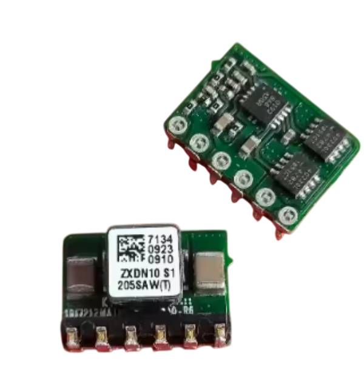

The modules you get are typically salvaged (not new) buck boards that have been placed onto small base PCBs. There is no public datasheet.

> [!NOTE]
> These **used industrial** boards are still massively better than most cheap **factory-new** buck modules.

## Overview

This is an **industrial grade** module which is using excellent brand components and MOSFETs with low Rdson. The module has >90% efficiency and comes with solid output short circuit protection.

It steps down input voltages from 8.3-14V to an adjustable output of 0.6-5.5V, typically set to 5V. The module *ZXDN10* itself can handle higher input voltages. By changing the electrolytic capacitor at the input (*16V* by default, change to *36V*), you can extend the input voltage to *24V* and more.

### Pros

- Stable continuous *5V 10A 50W* output
- good voltage stability
- industrial design
- real output shortcut protection
- output voltage can be adjusted in the range of 0.6-5.5V    
  (typical modules use fixed voltage adjust resistors for 5V but can be changed)
- extendable input voltage range   
  (swap input electrolytic capacitor for a higher voltage version)

### Cons

- High quiescent consumption (>50mA)
- hard to solder (aluminum substrate pcb)
- requires fan >5A output.    
- module is typically salvaged and used
- aluminum substrate pcb does not serve well as a heat sink

### Where to get
The ZXDN10 is sold on sites like AliExpress and Alibaba as **salvaged** (used) parts from ZTE gear, typically, ZXDN10 soldered as piggyback board (daughterboard) onto a primary PCB.

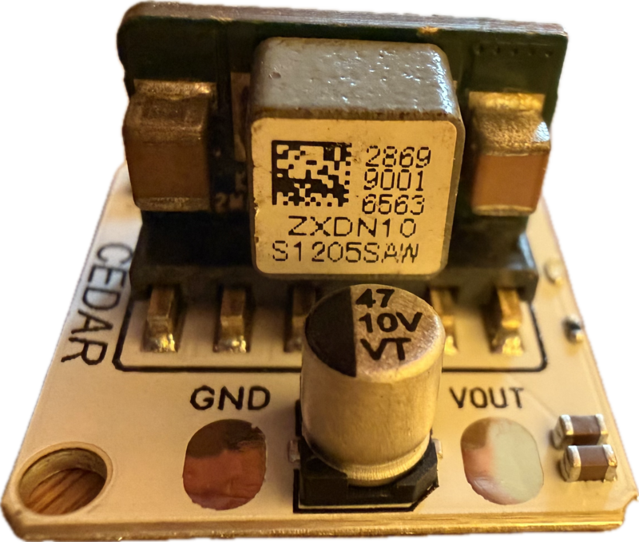

It is popular in hacker and DIY communities for repurposing into DC-ATX power supplies, server boards, and high-current 5V regulators due to its low cost and open-source optimizations.

## Efficiency
The ZXDN10 is a synchronous buck topology with good efficiency for embedded and power electronics applications. Even as salvaged (used) units, it is much better than the typical cheap 2-5A buck converters sold on AliExpress: those have an efficiency of only 85% at 2A, and even lower at 3A which is why these get very hot at comparably low currents.

The ZXDN10 module, in contrast, has a much higher efficiency and can be used up to 5A with no additional cooling. When adding a small 3010 fan, it can be used with up to 10A output.

| Output Current | 1A | 2A | 3A | 4A | 5A | 6A | 7A | 8A | 9A | 10A | 11A |
| --- | --- | --- | --- | --- | --- | --- | --- | --- | --- | --- | --- |
| **Efficiency** | 92.2% | 94.8% | 94.3% | 93.96% | 93.58% | 93.29% | 92.80% | 92.24% | 91.60% | 91.00% | 90.20% |

*(Input: 12V; Output: 5V; [Source](https://blog.iccfish.com/2021/08/02/%E7%9B%98%E4%B8%80%E4%B8%8B%E6%9C%80%E8%BF%91%E6%94%B6%E5%88%B0%E7%9A%84%E4%BA%8C%E6%89%8Bdc%E9%9D%9E%E9%9A%94%E7%A6%BB%E9%99%8D%E5%8E%8B%E6%A8%A1%E5%9D%97/))*

## Schematics

A Chinese blogger has [reverse-engineered](https://blog.iccfish.com/2021/08/02/%E7%9B%98%E4%B8%80%E4%B8%8B%E6%9C%80%E8%BF%91%E6%94%B6%E5%88%B0%E7%9A%84%E4%BA%8C%E6%89%8Bdc%E9%9D%9E%E9%9A%94%E7%A6%BB%E9%99%8D%E5%8E%8B%E6%A8%A1%E5%9D%97/) the module and drawn this schematic:

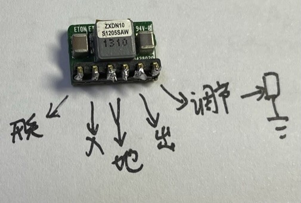

From left to right:

* **Enable:**     
  Turns output on and off
* **Input:**    
  Positive input (8.3-14V)   
* **GND**   
* **Output:**    
  Positive Output (0.6-5.5V)   
* **Voltage Adjust:**    
  Resistor connected to ground. `100Ω` produces 5.0V output. 

## Use Cases

This board is perfect whenever you need **strong 5V** from 12V sources (8.3-14V):      

* **From Batteries:** 
  Ideal for **3S LiIon** and **4S LiFePo4** battery packs. 4S LiFePo4 voltage range is *10.0V-14.8V*, slightly exceeding the modules' maximum 14,0V. However, LiFePo4 voltage settles after charging to around 13.4-13.6V. To be extra safe, replace the input electrolytic capacitor (16V) with a 36V version.         
* **From 12V Power Supplies:**     
  Cheap 12V power supplies can often deliver substantial currents but the output voltage of such supplies may not be very stable and drop considerably under load. With this module, even poorly regulated 12V sources can be turned into stable and powerful 5V output. For example, users repurpose salvaged *DC-ATX* power supplies from PCs to build a strong 5V output.    
* **From USB PD:**    
  Most USB PD sources (power supplies, power banks) can supply 5V only with very limited power (typically 2-3A, 10-15W). The same sources supply 12V at much higher power (i.e. 3-5A, 36-60W).

  By using a USB trigger to get 12V from the USB source, this module can convert the 12V to stable 5V at 6-8A (30-40W).

### Caveats

Repurposed modules are often piggybacked onto a generic motherboard, and vendors use aluminum substrate pcbs that are supposed to act as heat sinks - which they don't really do.Since the *ZXDN10* module is added in a vertical position to the motherboard, its hot components (MOSFETs, inductor) are far away from the aluminum pcb and cannot dissipate heat through it.

If you add a fan, make sure it points to the *ZXDN10*. Do not try and cool the aluminum pcb. Likewise, adding a passive heat sink to the backside of the aluminum pcb isn't doing much good.

Choosing an aluminum substrate pcb wasn't a wise idea after all: it won't help with heat dissipation, yet it makes soldering wires extremely painful: the heat from your soldering iron is immediately dissipated. Use hot plate and/or hot air with a small nozzle instead.

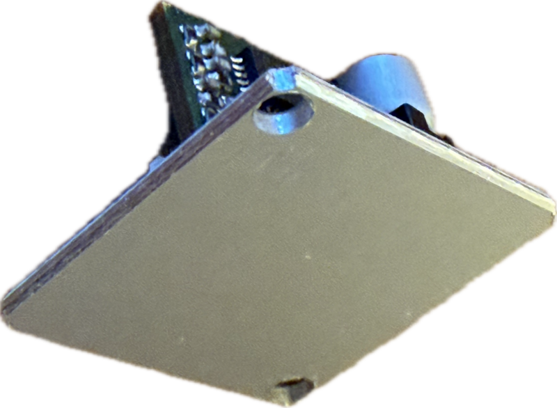

Pre-heat the PCB on a hot plate to 100C, and/or use a hot air station with a small nozzle instead of a classic soldering iron.

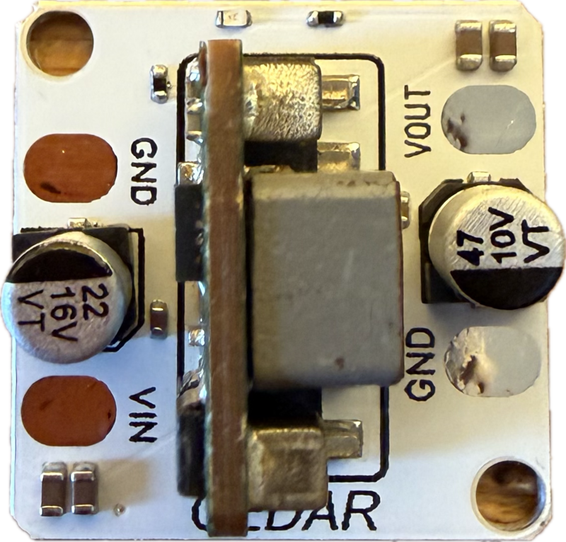

## Example: Convert 12V to 5V 10A

Solder 16-18AWG wires to input and output pads.

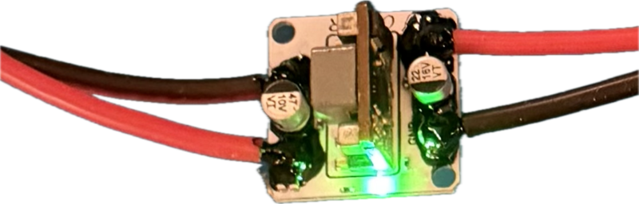

When you supply 12V to the input, on the motherboard a green LED lights up, indicating that the piggyback ZXDN10 is working.

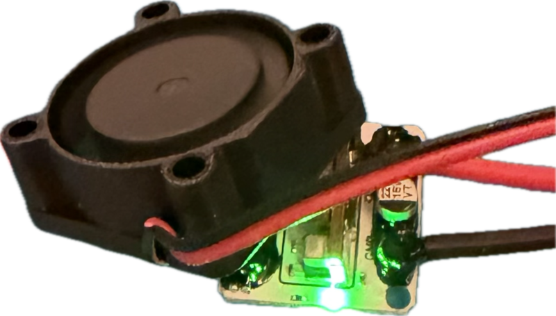

On the output, you now have stable 5V. Up around 5A, the temperature stabilizes naturally at around 60C.

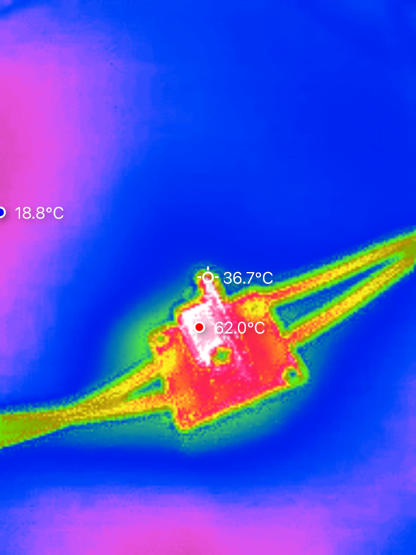

### Drawing More Than 5A

When you exceed 5A, the module continues to work and produces excellent stable 5V. However, it now starts to produce more heat than it can dissipate, and the module temperature continues to gradually rise above 100C.

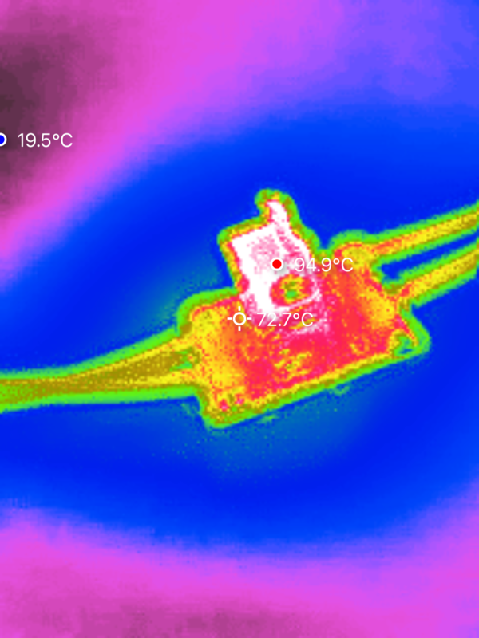

You can solve this issue easily by adding a small 3010 12V fan (connect it to the source side).

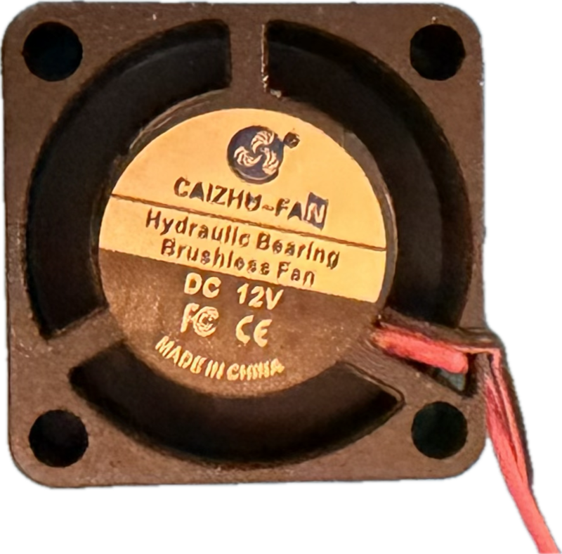

The fan keeps the module temperature reliably below 50C at higher loads:

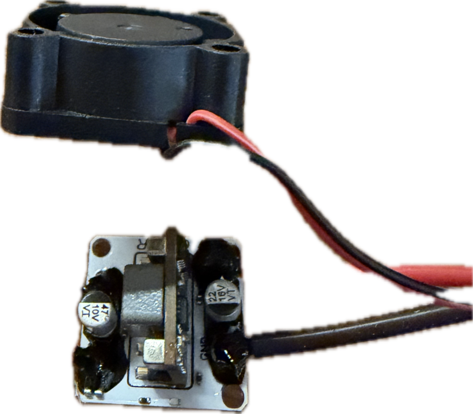

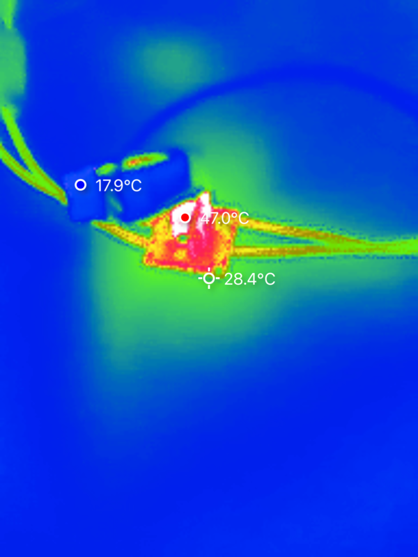   

## USB Strong 5V Output

To produce strong 5V with up to 10A from any USB PD source, use a USB PD trigger board set to 12V.

> [!TIP]
> Most USB PD power sources excel at **20V** and can deliver much more power than at **12V**. If your USB PD power source cannot supply enough current at 12V, you may want to replace the input electrolytic capacitor on the board (rated for 16V) with a different one that is rated for >20V, then use a *20V USB Trigger*.     

### USB PD Trigger Board
I used this small board which is set to 12V by factory design:

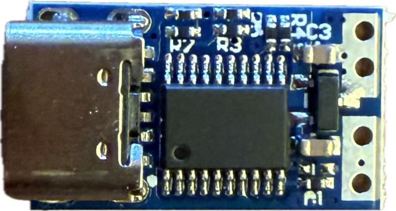

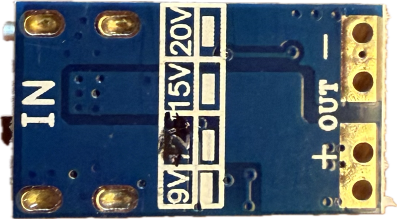

There are plenty of other USB trigger boards to choose from. Some need solder bridges, some have DIP switches. 

> [!IMPORTANT]
> If the trigger board is configurable, make sure you do not set the trigger board to a voltage higher that 12V! Many such boards request the highest available voltage by default, which in many instances can be *20V* or *28V*, and destroy the input electrolytic capacitor (rated for 16V). Replace it with a >20V capacitor if you want to use 20V input.  

### Connections
Connect the output from the USB trigger to the input of the *ZXDN10*. 

Then plug in the USB PD power source into the trigger board. 

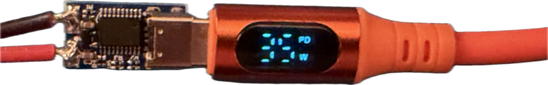

Since the trigger board is just requesting voltages, it typically does not get hot, regardless of currents you draw.

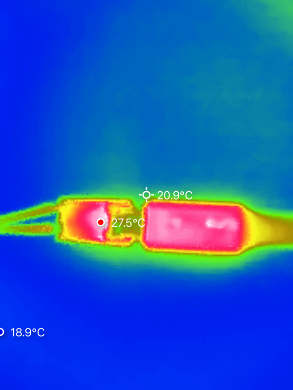

### Maximum Currents
Physical USB-C connectors are typically rated for **5A max**. At 12V and 5A, that's 60W maximum. When you subtract the conversion losses, there are 10.8A (54W) available to the *ZXDN10*. That's fully sufficient to operate it at its max ratings.

A much more relevant question is whether your USB PD supply can supply the requested energy. Even with 100W powerbanks and USB PD PSUs, at 12V they can deliver typically **much less** (often 12V 3A 36W).

When you draw too much current on the 5V side, your USB PD power supply may shut down once the ZXDN10 current draw exceeds its limits.

### Heat Dissipation
The same heat dissipation issues apply here, too, that were discussed earlier. When you exceed 5A output on the 5V side, add a fan:

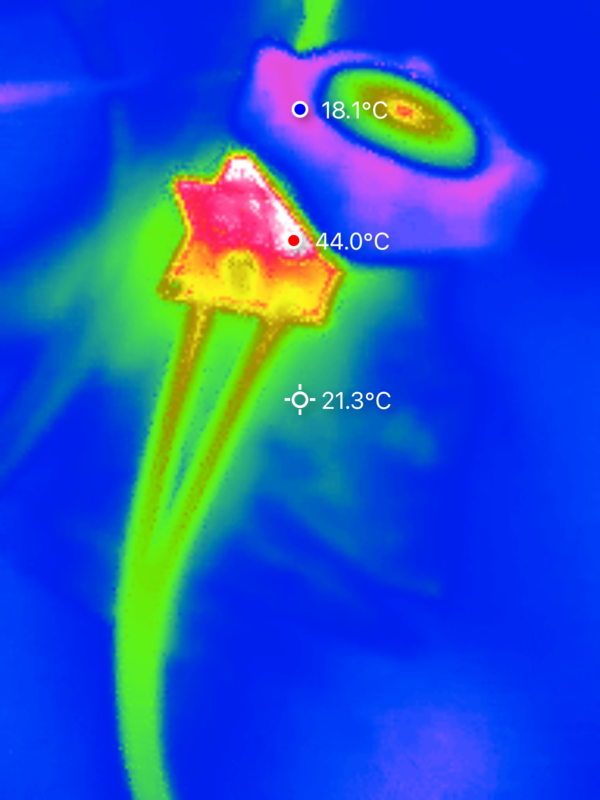

> Tags: Buck, Daughterboard, Synchronous, Step-Down, ZTE, Salvaged, ZXDN10 S1205SAW

[Visit Page on Website](https://done.land/components/power/powersupplies/dc-dc-converters/buck/zxdn10?442270051811262146) - created 2026-05-10 - last edited 2026-05-10
