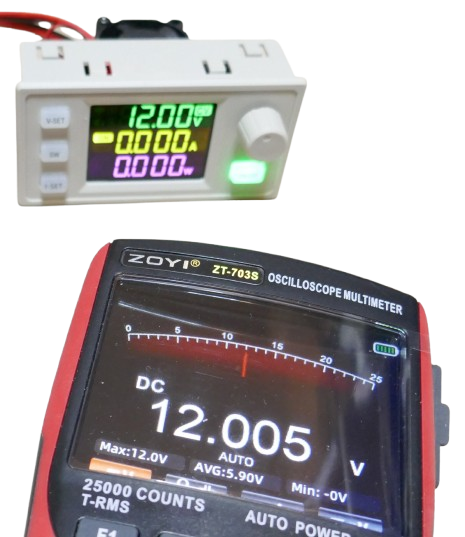
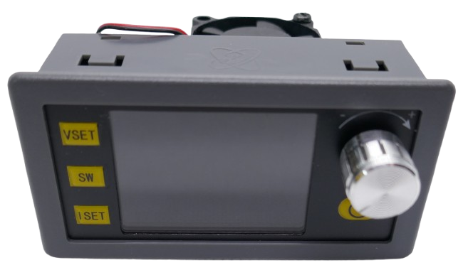
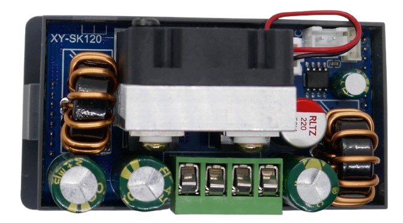
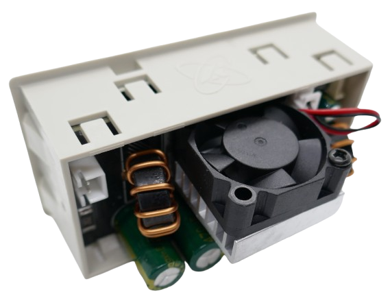
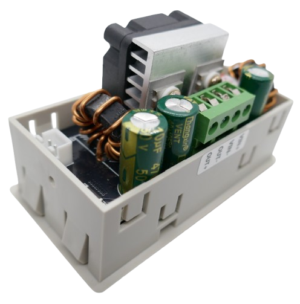
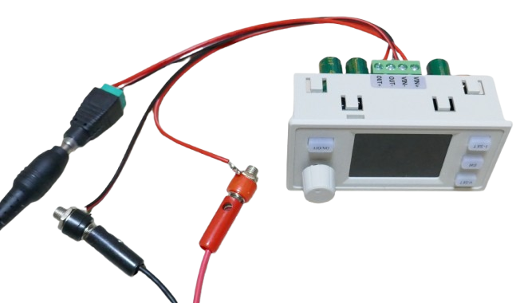

# XY-SK120X

> Powerful and Versatile DC-DC Converter Module with Large Screen and Extensive Configuration Options

The *XY-SK120X* is one of the most affordable and feature-packed **integrated DC-DC converter modules** on the market. This module is a *120W 6A buck-boost converter* supporting input voltages from *6.0-36.0V* and output voltages ranging from *0-36.0V*.

It is priced competitively, often available for under *€10.00* (though typical prices are closer to *€15.00*). At this price, it cannot compete with premium brands (which may cost five times as much), but it offers excellent value for hobbyists and light-duty applications.

## Overview

The *XY-SK120X* has been iteratively improved over time and is now in its **third generation**, reflecting ongoing product support and firmware maturity. 

Notable features include:
- Backlit silicone buttons
- A rotary encoder
- A bright *1.8"* color display, which uses a monochrome LCD with three colored zones layered with transparent foils

### Key Features

- **Powerful:** Despite its small size, the module includes a fan and supports up to *120W*/*6A* output.
- **Connectivity:** Offers external control and data export via a *Modbus-compliant* serial interface. Optional extensions for WiFi and infrared remote control are available.
- **External Temperature Monitoring:** Includes a connector for a *10K NTC 3905B* temperature probe to monitor external loads, such as batteries during charging.
- **Specialized Features:** Supports advanced use cases, such as battery charging/discharging with *anti-backflow protection* and solar applications, including *MPPT*.

### Accuracy

The module displays voltage and current with high precision, offering a voltage resolution of *0.01V*. 

Both voltage and current can be calibrated through the system menu for improved accuracy.

> [!IMPORTANT]
> High-latency control circuits for *constant voltage* and *constant current* modes may cause temporary overshoots, affecting sensitive loads.

### 3rd Generation

The *XY-SK120X* modules currently on the market use a third-generation motherboard with **gold plating** for improved reliability and performance. Build quality is generally good.

There is also a variant called *XY-SK120* (without the **X**), which is slightly cheaper but uses an older board design. 

The *XY-SK120* lacks backlit buttons and uses basic foil buttons instead.

> [!TIP]
> Avoid the older *XY-SK120* model. Ensure you order the *XY-SK120X* variant for the updated features and better design.

### Dimensions

Dimensions for the *XY-SK120X* module are as follows:

| Item                        | Description                  |
|-----------------------------|------------------------------|
| Front size                  | *86mm x 45mm*               |
| Recommended opening size    | *81.6mm x 40.6mm*           |
| Body dimensions             | *81mm x 40mm x 50mm*        |
| Rotary knob height          | *12mm*                      |
| Rotary knob diameter        | *13mm*                      |
| Weight                      | *118g*                      |
| Buzzer                      | Yes, configurable           |
| Fan                         | Yes, activates at *1A* load |

### Limitations

- **Slow Current Feedback:** The constant current feedback mechanism can be slow, resulting in temporary current spikes before regulation stabilizes. This may be unsuitable for very sensitive loads.
  
    

- **Thermal Management:** The integrated heat sink and fan are inadequate for prolonged operation at maximum ratings. For extended high-power use (e.g., battery charging), you will need to either upgrade cooling or reduce the load.

    

### Conclusion

The *XY-SK120X* is an impressive module given its price and capabilities. Its compact design, backlit silicone buttons, and extensive configuration options make it ideal for hobbyists seeking an affordable solution.

Primary use cases include converting generic power supplies into small lab bench power supplies. While it is rated for *120W*, this should be considered a peak rating; continuous operation at maximum output requires better cooling.

The firmware is feature-rich, enabling configuration of nearly every aspect, though the menu system may feel unintuitive for first-time users.

For light-duty applications or hobbyist projects, the *XY-SK120X* delivers exceptional value, provided its limitations are understood and respected.

## Setup

The unit includes four screw terminals on the back:

| Terminal | Description |
| --- | --- |
| VIN+ | *6-36V* input |
| VIN- | *ground* |
| OUT- | *ground* |
| OUT+ | *0-36V* output |

To use the unit as a lab bench power supply, connect *VIN+* and *VIN-* to a power source such as an old *power brick* or other type of *AC adapter*. The power source should be capable of supplying at least *140W* to fully utilize the module's capabilities.

> [!TIP]
> Use an input power supply voltage close to your most commonly used output voltage. DC-DC converters operate most efficiently when the input and output voltages are similar.

Connect *OUT+* and *OUT-* to the appropriate terminals (e.g., *banana plugs* or *XT60* connectors), or connect your load directly.

## Basic Operation

Once input power is connected, the *ON/OFF* button pulsates red, indicating the unit is off. 

The unit is controlled using four buttons. While operation is straightforward, it may not be intuitive at first. Here are the button functions:

| Button  | Purpose |
| --- | --- |
| ON/OFF | *Off (pulsating red):* Short press wakes the unit. *On (solid red):* Short press toggles power output (*on/off*). Long press resets *Ah/Wh metering*. *Off:* Long press sends the unit to sleep mode. |
| Rotary Encoder | Turn to adjust settings. *Not in a setting:* Short press cycles displayed unit. *In a setting:* Short press confirms input. Long press toggles key lock. |
| SW | Short press toggles between input and output voltage. Long press enters/exits system menu. |
| V-SET | *Not in system menu:* Short press enters/exits CV (voltage) settings. *In system menu:* Advances to next setting. Long press enters/exits data group menu. |
| I-SET | *Not in system menu:* Short press enters/exits CC (current) settings. *In system menu:* Returns to previous setting. Long press enters/exits data group menu. |

### Waking the Module

By default, the unit starts in an *off* state (pulsating red light). Press the *ON/OFF* button to activate it.

> [!TIP]
> The system settings allow you to configure whether the unit powers on or remains off after receiving input power.

When activated, the button's light changes to *solid red*, and the screen powers on. The power output remains off until explicitly enabled. The display shows the current settings for *voltage* and *current* (*CV* and *CC*).

### Setting Voltage and Current

- **Output Voltage:**  
  1. Press *V-SET* to enter voltage adjustment mode.  
  2. Use the rotary encoder to change the voltage.  
  3. Press the rotary encoder to shift between digits for finer or coarser adjustments.  
  4. Press *V-SET* again to confirm the voltage.

- **Maximum Current:**  
  1. Press *I-SET* to enter current adjustment mode.  
  2. Use the rotary encoder to adjust the current limit.  
  3. Press the rotary encoder to shift between digits for finer or coarser adjustments.  
  4. Press *I-SET* again to confirm the current limit.

### Turning Output Power On or Off

- **Enable/Disable Power Output:**  
  Press the *ON/OFF* button to supply power to the output using the displayed settings. The button turns green when active. Pressing it again disables the output, and the button light reverts to solid red.

- **Turning the Unit Off:**  
  Long-press the *ON/OFF* button for *>5s* to put the unit into sleep mode. The screen turns off, and the button light resumes pulsating red.

### Data Groups

The module supports ten *data groups*, which allow you to store and quickly access different settings.

1. Long-press *V-SET* to enter the data group menu. The current group displays as *Cd0* through *Cd9*.  
2. Use the rotary encoder to select a data group. The settings for *voltage* and *current* appear on the screen.  
3. Press the rotary encoder to activate the selected group.

### Advanced Functions

#### Constant Power Mode

The module supports *Constant Voltage (CV)*, *Constant Current (CC)*, and *Constant Power (CP)* modes. While CV and CC modes are accessible via dedicated buttons, enabling *CP* requires navigating the system menu. 

> [!WARNING]
> *Constant Power* mode adjusts the output voltage automatically to maintain the specified power. This may result in unexpected voltage levels that could damage connected devices.

To enable *Constant Power* mode:

1. Long-press *SW* to enter the system menu.  
2. Navigate to *-CP-* using the rotary encoder.  
3. Change the setting to *ON* and press the rotary encoder to confirm.  
4. Exit the menu by long-pressing *SW*.  

When *CP* is active, a *CW* icon appears on the display. Adjust *constant power* settings by pressing *I-SET*.

### System Menu Settings

| Setting | Description |
| --- | --- |
| bEP | Enable/disable buzzer. |
| b-L | Adjust LCD brightness. |
| C-F | Set temperature unit (°C or °F). |
| FET | Default rotary adjustment (voltage, current, off). |
| Add | Device address for serial interface. |
| bRE | Baud rate for serial interface. |
| PPT | MPPT mode for solar charging. |
| -CP- | Enable/disable *Constant Power* mode. |
| bCH | *New setting:* Battery Charging Mode |
| bTF | Charging cutoff current. |
| CLU | Calibrate output voltage. |
| CLA | Calibrate output current. |
| ZER0 | Current zero calibration. |
| CL0F | Turn off output during data group changes (recommended). |
| POFF | *New setting:* can turn on the device immediately when input power is connected |
| RET | Restore factory settings. |
| UER | Display firmware version. |

## Protections

The module supports the following protections, with user-configurable thresholds:

| Protection | Supported |
| --- | --- |
| **Over-Current Protection (OCP)** | Yes |
| **Over-Power Protection (OPP)** | Yes | 
| **Under-Voltage Protection (LVP)** | Yes |
| **Over-Voltage Protection (OVP)** | Yes |
| **Over-Temperature Protection (OTP)** | Yes |
| **Over-Timeout Protection (OHP)** | Yes |
| **Over-Capacity Protection (OAP)** | Yes |
| **Over-Energy Protection (OPH)** | Yes |
| **Output Reverse Connection Protection** | No |

### Missing Output Reverse Connection Protection

*Output reverse connection protection* is absent. While this is usually unnecessary for loads that *consume* power, it is critical in scenarios such as using the module as a solar controller. **Ensure correct polarity** when connecting a battery to the output to prevent damage.

### Latency

Certain protections have a significant latency, potentially causing temporary overshoots in current or voltage.

> Tags: Switching, Power Supply, Voltage, Current, Integrated, Module, Charging, Lab Bench

[Visit Page on Website](https://done.land/components/power/powersupplies/dc-dc-converters/plug&playconverters/xy-sk120x?104296011717254359) - created 2025-01-16 - last edited 2025-01-16
