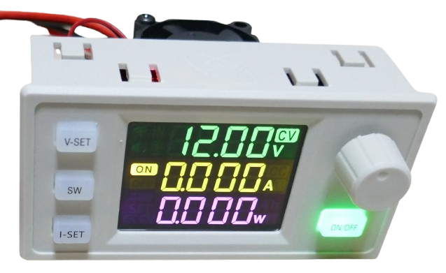

# Plug & Play DC-DC Converter Modules

> Ready-to-integrate DC-DC Converter Modules with Microcontroller, Screen, and User Interface

Completely integrated modules exist that contain a *DC-DC converter* plus everything else required to control it. These modules typically include a microcontroller, screen, buttons, and a rotary controller to configure the DC-DC converter and change its settings.

## Overview

Integrated DC-DC converter modules can turn a simple power supply into a lab bench power supply, battery charger, or solar energy converter. They are available in pure *buck* (lower input voltage), *boost* (raise input voltage), or combined *buck-and-boost* configurations.

*Buck-and-boost* modules are the most versatile as they can be used with almost any readily available power supply or battery, while providing the full voltage range typically needed.

### Protections

An internal microcontroller offers a range of protections that automatically cut power output when limits are exceeded:

* **Over-Current Protection (OCP):** Activates when current exceeds a specified limit. This protects both the power supply from overload and connected loads that are sensitive to excessive current (e.g., LED strips) or faulty (e.g., short circuits).
* **Over-Power Protection (OPP):** Triggered when power (voltage × current) exceeds a set limit. This is useful in situations with fluctuating voltage, and it protects both the power supply and sensitive loads.
* **Under-Voltage Protection (LVP):** Engages when voltage drops below a predefined threshold. This is particularly useful when using a battery as the power source, as it prevents over-discharge.
* **Over-Voltage Protection (OVP):** Activated when voltage exceeds a threshold. Essential when charging batteries, as it prevents overcharging. The flexibility to set a *cut-off voltage* allows for charging different battery chemistries and even charging to a specific *state of charge* (e.g., for long-term storage of *Li-Ion*/*Li-Po* batteries).
* **Over-Temperature Protection (OTP):** Engages when the internal or external temperature exceeds a threshold. This can protect the power supply from overheating (e.g., in hot environments or if a cooling fan fails) and helps monitor the load (e.g., to detect a catastrophic battery failure during charging).
* **Over-Timeout Protection (OHP):** Triggered when the device operates for a specified duration. This adds an extra layer of security during battery charging operations.
* **Over-Capacity Protection (OAP):** Activates when a set amount of energy has been supplied. This allows for precise energy delivery to a battery.
* **Over-Energy Protection (OPH):** Similar to *OAP*, but more precise when the voltage fluctuates (e.g., during battery charging), ensuring the correct amount of energy is delivered.

In addition to these microcontroller-managed protections, discrete components may offer additional *reverse voltage* and *reverse polarity* protection.

> [!IMPORTANT]
> Always consult the specifications as support for these protections may vary across different modules.

### Special Features

Some modules include external interfaces (e.g., serial, WiFi, Bluetooth, IR, remote controls, and more) for data export and/or device control. Certain models allow for configuring the *duty cycle* and support *Maximum Power Point Tracking* (MPPT) for efficient solar charging.

## Use Cases

Plug-and-play DC-DC converter modules are simple to use and suitable for a variety of applications:

* **Lab Bench Power Supply:** Adjustable voltages with definable maximum currents, offering short circuit protection.
* **Battery Charger:** Fully configurable charger adaptable to multiple battery types and chemistries.
* **Solar Converter:** Efficiently harvests energy from solar panels to charge batteries.
* **Battery Capacity Tester:** Safely discharges a battery to a safe level while logging the total energy supplied.
* **Power Meter:** Logs the total power consumed by a device over time.

> Tags: Switching, Power Supply, Voltage, Current

[Visit Page on Website](https://done.land/components/power/powersupplies/dc-dc-converters/plug&playconverters?067798011717254359) - created 2025-01-16 - last edited 2025-01-16
