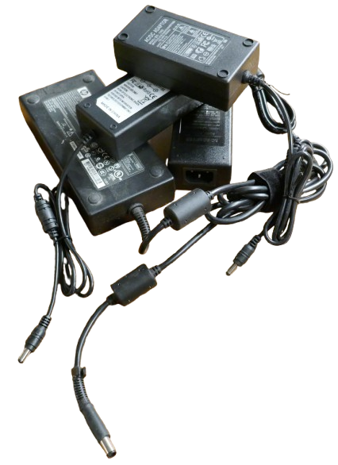
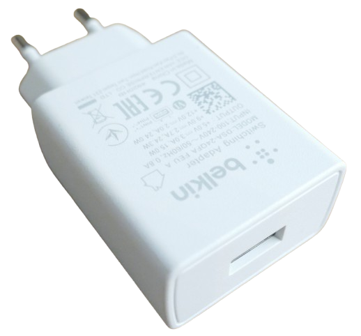
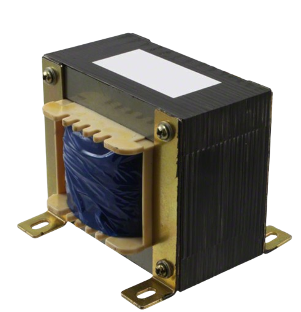
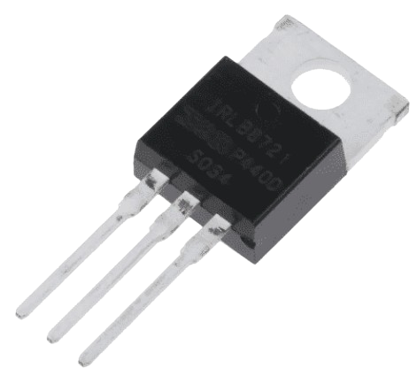
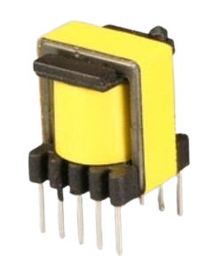
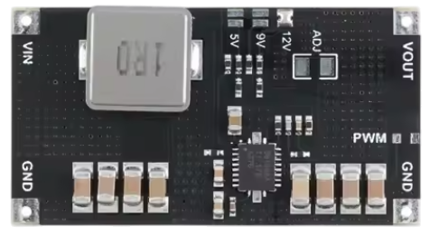
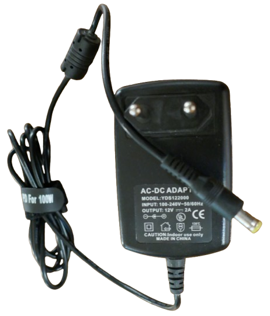

# DC Power Supplies 

> Stable And Regulated DC Power For Lab And Projects

A DC power supply is an electronic device that provides a stable and regulated direct current (DC) voltage. It converts input power to a DC voltage suitable for labs, projects, and electronic devices.

## Overview
When power is generated—by industrial power plants, batteries, solar panels, etc.—it may fluctuate in voltage. If the power is generated by turbines, the power is also AC. Most devices, however, require a stable DC voltage.

*Power supplies* are electronic components that take a wide range of input voltages and convert them to a stable DC output voltage. They may convert *AC* to *DC* if they support AC input, such as when plugged into a household outlet.

## Constant Voltage
The primary function of every power supply is to provide a *Constant Voltage* (*CV*) at the output. Here are some common examples of *CV power supplies*:

* **AC-DC Converter**: These take a fixed *AC* input voltage, and typically use a transformer to lower the voltage to a fixed intermediate voltage. A *rectifier* then converts *AC* to *DC*. The intermediate DC is stabilized using discrete components, or further processed by a *DC-DC converter*.
    * **Examples**: Laptop chargers, USB power supplies, lab bench power supplies, etc. (that take power from *AC mains*)
* **DC-DC Converter**: Often called *switching power supplies* due to their internal switching circuits, these require a *DC* input. A switching power supply can dynamically *lower*, *raise*, or *both* raise and lower the input voltage in a very efficient manner.

   Typically, *DC-DC converters* are used inside devices (including some *AC-DC converters*) to ensure the device receives the appropriate voltage and to make devices compatible with a wide range of input voltages.

### Voltage Regulators
A *DC-DC converter* typically uses *switching technology* (i.e. *Buck* to lower and *Boost* to raise the voltage). *Switching technology* is highly efficient, especially at higher loads, but also more complex.

For *lower loads*, *linear voltage regulators* can be used. These are essentially variable resistors that automatically adjust their resistance to produce a stable output voltage using the simple *voltage divider paradigm*. 

Linear voltage regulators can only *lower* a voltage, and excess energy is converted to heat and wasted. The greater the input and output voltage difference, the less efficient they become. However, they are very affordable and do not produce artifacts like *voltage ripple*, which is why they are typically used for microcontroller development boards and other microelectronics that consume only a few hundred *mA*.

The same basic principle is used with *current-limiting* resistors, such as when powering small *LEDs*. These are even less precise, as they cannot compensate for load fluctuations. For low-current indicator LEDs, they work fine. However, as the current demand increases (e.g., with high-power LEDs or LED strips), *switching power supplies* are used instead.

## Constant Current
More sophisticated power supplies add *Constant Current (CC)* capabilities to their basic *constant voltage* capabilities. These are called *Constant Voltage Constant Current (CV CC)* power supplies. Being able to limit the maximum current is essential in many scenarios:

* **Sensitive Devices**: Some devices, like *LEDs*, have very low internal resistance. When they receive a current that exceeds their limits, they can be damaged.
* **Chargers**: Similar to *LEDs*, *rechargeable batteries* also have very low internal resistance. To charge them, the current must be limited.
* **Safety**: In lab environments, a current limit can be a safety measure to ensure that currents do not exceed safe levels, even if the power supply is connected to faulty circuits.

How does CV CC really work?
 

When you add *constant current* to *constant voltage*, things become a bit more complex. The terms become less accurate, and it might be better to think of them as *maximum voltage* and *maximum current*.

When you set a *constant current* in a *CV CC* power supply, the current is not necessarily constant. If the device requires less current, then less current flows. The power supply does not force the current up to keep it "constant," nor would that make any sense.

Likewise, a *CV CC* power supply does not necessarily maintain a *constant voltage* either. When the current exceeds the threshold, the power supply *lowers* the voltage to whatever is necessary to keep the current constant.

To better understand *CV CC*, consider these two scenarios:

* **Device takes less than CC current**: The *voltage is constant*, and the current is whatever the device draws (this is often called *CV* mode).
* **Device takes more than CC current (or would like to)**: The *current is constant*, and the voltage is lowered as needed to decrease the current flow (this is called *CC* mode).

A *CV CC* power supply operates in *CV* mode until the current exceeds its limit. At that point, it switches to *CC* mode.

This also answers the question, "Are there *CC only* power supplies?" A *CC-only* power supply would be a *CV CC* power supply with a *Buck* (step-down) behavior where the *CV* is set to the input voltage.

## Transformers vs. Switching Power Supplies
A few decades ago, power supplies were typically large, heavy, and expensive. This was due to the use of *large transformers* to transform the input voltage to a different level.

### Transformers

Transformers are still used today because they have distinct advantages:

* **Scalable**: Transformers can be designed to handle any required amount of energy.
* **Linear**: The output voltage waveform is not altered, so there are no noise or artifacts introduced by the voltage transformation. This is beneficial for use cases like *HiFi*, *radio amateurs*, and similar applications, where signal quality is a priority.

However, their disadvantages often outweigh the advantages, especially when signal quality is not a top priority:

* **Heavy**: Transformers require iron parts and many coil windings. The size and weight of the transformer increase with the amount of power required. Transformers for low loads may be small and inexpensive, but as power demands rise, transformers become larger and heavier.
* **Expensive**: Due to the materials required for transformers, they can be expensive.
* **AC Only**: Transformers rely on electromagnetic effects and only work with *AC* input. Most devices, however, require *DC*.

### Switching Power Supply

With the advent of *MOSFET* transistors, fast *switching* became possible, enabling *Buck* and *Boost* converter circuits. 

As a result, *switching power supplies* have become lightweight, small, and affordable.

In *AC adapters*, a small transformer (or sometimes just a rectifier) is used to produce raw DC voltage, which is then processed by the switching power supply to create the desired output voltage.

> [!NOTE]
> While it is possible to send rectified AC directly to a transformerless switching power supply, this requires efficient filtering to handle high voltage spikes. It is often more practical to still use a transformer to lower the incoming voltage. However, switching power supplies allow the transformer to be much smaller and more affordable. This is because switching power supplies operate at very high frequencies, typically above *100kHz*, compared to traditional transformers that operate at *50-60Hz*. At *100kHz*, the transformer can process *2,000 cycles of energy* in the same time a traditional *50Hz* transformer handles just one cycle, drastically reducing the size and material needed for the transformer.

#### Fast Switching

Switching power supplies do not require iron parts and are made with a few affordable electronic components:

* **Buck**: An inductor is placed **in the output path** and stores some of the energy (reducing the voltage). A fast-switching MOSFET interrupts the input power to allow the inductor to release the stored energy. As a result, the output voltage **decreases**.
* **Boost**: The inductor is placed **outside the output path** and stores additional energy without affecting the output. A fast-switching MOSFET interrupts the input power to the inductor and adds energy to the output. The **voltage increases**.

#### Ripple and Artifacts

Switching power supplies typically operate at frequencies ranging from *100 kHz* to *20 MHz*. Due to these high frequencies, the output voltage appears stable to the devices connected to it.

However, when viewed on an oscilloscope, the output from switching power supplies may show *voltage ripple*. The amount of ripple depends on the switching frequency (lesser with higher frequency) and the overall quality of the power supply. High-quality switching power supplies can have ripple as low as *<5mV*, while cheaper DC-DC regulators might produce ripple of *>100mV* or more. Excessive ripple can interfere with sensitive devices, leading to malfunctions.

Generally, the *switching frequency* of a DC-DC converter is an indicator for its quality:

| Frequency Range          | Typical Applications                                         | Advantages                        | Disadvantages                     |
|--------------------------|-------------------------------------------------------------|-----------------------------------|-----------------------------------|
| **20 kHz to 50 kHz**     | Older designs, low-cost devices                             | Easier to design and produce      | Larger inductors and capacitors   |
| **100 kHz to 500 kHz**   | Consumer electronics, general-purpose devices               | Good balance of size and cost     | Moderate design complexity        |
| **500 kHz to several MHz** | High-performance industrial equipment, compact chargers   | Smaller components, higher efficiency | Higher design complexity, increased EMI |
| **20 MHz and above**     | RF-based power conversion, ultra-compact designs            | Extremely small components        | Very high switching losses, difficult EMI management |

A higher switching frequency lowers the requirements for external components: since less energy needs to be stored per cycle, higher-frequency DC-DC converters can be either *smaller* or *more efficient*.

Should I Care About Switching Frequency?
 

In hobby projects, most people typically do not focus much on the switching frequency of *DC-DC converters* or whether they are *fixed* or *variable*. Their primary concern is often affordability and whether the converter provides the desired voltages and currents.

However, understanding switching frequency can be beneficial, especially when designing portable devices where space is limited. Higher switching frequencies can enable significantly smaller designs.

### Why Switching Frequency Matters
Higher switching frequencies allow smaller inductors and capacitors because energy transfer happens more frequently. This reduces the size of energy storage components needed, making it possible to create compact circuits. However, higher frequencies also introduce challenges, such as increased switching losses and the potential for electromagnetic interference (EMI).

### Typical Hobbyist Modules
Most inexpensive hobbyist *DC-DC converters* are *fixed-frequency PWM* converters.

*DC-DC converters* with *fixed-frequency* typically use **PWM** (pulse-width modulation), which you may have encountered in electronics projects for dimming LEDs. Since the frequency is fixed and set well above audible ranges, these converters do not produce annoying hissing sounds (*coil whine*). However, their efficiency drops with *light loads* because the pulse width can only be reduced to a certain extent. The excess energy is dissipated as heat, reducing overall efficiency.

### Variable Switching Frequency
In *DC-DC converters* with *variable-frequency*, **PFM** (pulse-frequency modulation) is commonly used. Here, the pulse width remains constant while the frequency of pulses varies. These converters are more efficient under *light loads* because the frequency can be reduced as needed.

This can be beneficial for scenarios where loads vary considerably or where frequent *idle* states occur. Otherwise, generally *downsizing* the DC-DC converter to support only the maximum load you actually require can improve efficiency, even with fixed-frequency designs.

A potential downside of variable-frequency converters is that when the frequency drops into the audible range, the device may produce a high-pitched hissing sound, also known as **coil whine**. This noise can originate from the circuit's inductors or other components operating at audible frequencies. That's why *variable-frequency* designs are less commonly used in DIY projects.

### High Switching Frequency
Most *DC-DC converter* breakout boards for hobbyists use older, proven chip designs like the *XL4015* or similar.

These designs are cost-effective and reliable but operate at relatively low switching frequencies, typically below *500 kHz*, occasionally at just slightly above *100 kHz*.

As a result, such boards are big and require bulky components, such as large inductors and electrolytic capacitors.

Modern switching regulator technology uses much higher switching frequencies and more advanced chip designs. For example, integrated chips like the *TPS61088* from *Texas Instruments* operate at *1 MHz*, offering much improved efficiency and performance.

Next-generation *DC-DC converter* boards using such chips are significantly smaller while maintaining or exceeding the performance of older designs.

For example, this board is a *30W boost converter* capable of raising a *2.7-10V* input voltage to *12V*:

### Electromagnetic Interference (EMI) and Shielding
Electromagnetic interference (EMI) occurs when high-frequency circuits emit unwanted radio waves, which can interfere with nearby electronics like radios, Wi-Fi, or Bluetooth devices. Poorly designed *high-frequency* converters can even affect sensitive equipment in your home or lab, making EMI shielding essential.

For DIY projects with limited EMI diagnostic tools and no space constraints, it is often best to use bulkier *DC-DC converters* operating in the *100-500 kHz* range. If higher frequencies are needed, consider using professionally designed breakout boards from reputable sources that include proper EMI shielding.

### Choosing the Right Module
Here are some simple guidelines for selecting *DC-DC converters*:
- Select fixed-frequency converters for simplicity and silence.
- Use variable-frequency converters for efficiency with light loads.
- Opt for modern designs if size or efficiency is a priority.
- Check for EMI shielding if operating near sensitive devices.

### Learn More
For detailed technical insights, refer to datasheets or application notes for specific chips, such as the *XL4015* or *TPSxxx* series of chips (or their clones). These documents often include design tips and performance graphs to help you understand the capabilities of the converter.

## Types of Power Supplies

[Switching power supplies](https://done.land/components/power/powersupplies/dc-dc-converters/) are used in a variety of everyday devices:

* **AC Adapter:** Uses the *AC mains* voltage as the primary source. It first converts *AC* to *DC* and then utilizes a transformer and/or a [switching power supply](https://done.land/components/power/powersupplies/dc-dc-converters/) to produce the required voltage for powering or charging devices.   
    * Small adapters for devices with low current requirements:

    

    * *power bricks* that can supply *60-120W* to devices with high power requirements (such as notebooks):

    

    * modular switching power supplies ready to be mounted inside devices. Such modules exist for various power requirements in different sizes and voltages and are often found inside *PC*, as well as in other larger appliances:

    

    * *DIN rail*-mounted switching power supplies are a variant of the above and can easily be added to electrical household installations (i.e. to power sensors, microelectronics, etc.)

    

* **[Battery:](https://done.land/components/power/powersupplies/battery/batterytypes/rechargeable/)** A rechargeable battery can act as a primary power source, such as in *power banks*, or when specifically powering portable devices.
  * **Power Bank:** A power bank incorporates *two* switching power supplies: one designed to [charge the battery](https://done.land/components/power/powersupplies/battery/chargers/charge-discharge/) and the other to discharge it to power external devices.
  * **Charger:** Dedicated *chargers* are engineered to charge specific battery types. These chargers typically include a [DC-DC regulator](https://done.land/components/power/powersupplies/dc-dc-converters/) that provides *constant current* to safely charge the battery.
* **[Solar Chargers:](https://done.land/components/power/powersupplies/solar/)** These systems rely on *two* power sources. Solar panels provide a fluctuating DC input voltage, which the *solar charger* converts into a regulated charging current to charge a [battery](https://done.land/components/power/powersupplies/battery/batterytypes/rechargeable/). The battery acts as a buffer, storing energy for later use. Since the battery voltage also fluctuates based on its *state of charge*, another [DC-DC regulator](https://done.land/components/power/powersupplies/dc-dc-converters/) stabilizes the output voltage as needed.
* **AC Converters:** These devices take a low DC voltage and produce a high AC voltage comparable to *AC mains*, allowing *AC mains* devices to operate on battery power, e.g., as a backup power supply. Internally, they consist of a [switching power supply](https://done.land/components/power/powersupplies/dc-dc-converters/) that steps up the low input voltage to the required high output voltage, combined with a *DC-AC converter* that turns DC into AC. This process is more complex than simple *AC-DC conversion*, which often involves a basic *rectifier*.
* **Lab Bench Power Supply:** A highly configurable power supply for hobbyists, engineers, and researchers, with advanced protections. It can provide a wide range of voltages with high precision and can limit current according to user requirements. This is ideal for experimental scenarios where power must adapt to changing needs, i.e. when trying to simulate a discharging battery at different voltages, or submitting power to various electronic components under test.     

    

* [Electronic Load:](https://done.land/tools/devices/electronicload/) A device commonly used in lab environments to **simulate a load** by consuming a precise and configurable amount of energy. To achieve this, electronic loads incorporate components designed to **dissipate energy**, typically using a combination of **MOSFETs** with sophisticated heat sinks. Additionally, they include various **DC-DC regulator** circuits to ensure that the energy is consumed in a controlled manner, matching the specific requirements of a given test scenario.  
           
    

Here is an overview of devices that use *DC-DC regulators*:

| Use Case                 | DC-DC Regulators | Constant Voltage | Constant Current                | AC Conversion | Remarks                                                                 |
|--------------------------|------------------|------------------|---------------------------------|---------------|-------------------------------------------------------------------------|
| AC Adapter               | 1                | Yes              | No                              | Yes           | Powers DC devices from AC mains                                        |
| High Current Power Supplies | 1             | Yes              | No                              | Yes           | Provides high currents, typically at voltages like *13.8V*, for heavy-duty devices such as radio stations (HAM amateurs) |
| AC Charger               | 1                | Yes              | Yes                             | Yes           | Charges batteries from AC mains                                        |
| Battery Charger          | 1                | Yes              | Yes                             | No            | Charges batteries from DC                                              |
| Battery                  | 1                | Yes              | No                              | No            | Provides battery power                                                 |
| Power Bank               | 2                | Yes              | Yes (for charger); No (for output) | No        | Charges and discharges a battery                                       |
| Solar Charger            | 2                | Yes              | Yes (for charger), No (for output) | No        | Buffers solar energy in a battery and provides battery power           |
| AC Converter             | 1                | Yes              | No (protection circuitry may use it) | Yes       | Converts battery power to AC mains voltage                             |
| Lab Bench Power Supply   | 1                | Yes              | Yes                             | Yes (when powered from AC mains) | Highly configurable, with high-precision output for experimental use cases |
| Electronic Load | 1->4 (depending on features) | Yes | Yes | Yes (when powered from AC mains) | simulates a load by consuming a configurable amount of energy |

## Conclusion

While traditional transformers (*linear power supplies*) are still useful in specific applications requiring linear voltage conversion and high signal integrity, *switching power supplies* have largely replaced them for most modern power supply applications. 

For *DC input*, voltage regulators can dynamically transform a variable input voltage to a stable output voltage using *Buck*, *Boost*, or *Buck-Boost* technology, depending on the requirements. Due to their high switching frequency, if there is a need for *AC-to-DC* conversion, they require much smaller and more affordable transformers.

> Tags: Voltage, Current, Voltage Regulator, Buck, Boost, DC-DC Converter, Switching Power Supply, AC, Transformer, Rectifier, Step-Up, Step-Down, EMI, Switching Frequency, Ripple, Artifacts, AC Adapter, TPS61088

[Visit Page on Website](https://done.land/components/power/powersupplies?431681011016251907) - created 2025-01-15 - last edited 2025-01-15
