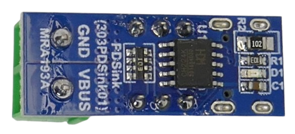
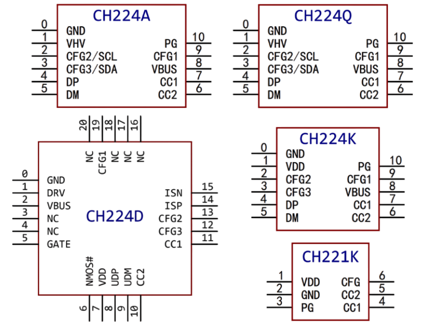

# CH224 USB Trigger

> Affordable USB Trigger Chip for Selecting Fixed Voltages

*CH224* is a chip family specializing on negotiating fixed output voltages from a variety of USB power protocols, including *USB PD*. The basic *CH224K* is well suited for use cases where you need one of the pre-defined voltage steps (*5V*, *9V*, *12V*, *15V*, *20V*) at a maximum of *100W*.

Newer family members like the *CH224A* also support *PD3.2 EPS* (*140W* at a maximum voltage of *48V*), and *CH224Q* also supports *PPS* and *AVS* for delivering **adjustable voltages** in *20/100mV* increments.

## Overview

*CH224* manages **USB Power Delivery (PD) negotiation**, ensuring your device receives the voltage and current it needs. 

* **CH224K**:   
  10-pin *CH224K* is the most popular family member found on many simple and affordable USB trigger boards: it supports **USB PD3.0/2.0** and **BC 1.2**, can request five fixed voltages (*5V*, *9V*, *12V*, *15V*, and *20V*) at up to **100W**, and includes an optional simple-to-use digital interface that makes it easy to interface with external microcontrollers.

* **CH224A:**     
  modern drop-in replacement for *CH224K* with additional *USB PD 3.2 EPR* support for voltages of up to *48V* at a maximum power of *140W*. *I2C* is supported as another interface option.Unfortunately, *CH224A* **does not support *PPS* and *AVS*** (adjustable voltage).
  
* **CH224Q:**    
  
  Adds support for *PPS* and *AVS* which allows voltage selection in *20mV*/*100mV* increments. 

### Variant Overview

| Feature / Model        | **CH221K**                    | **CH224K**                       | **CH224D**                        | **CH224A**                         | **CH224Q**                         |
|-----------------------|-------------------------------|----------------------------------|-----------------------------------|-------------------------------------|-------------------------------------|
| **PD Version**        | PD3.0/2.0                     | PD3.0/2.0                        | PD3.0/2.0                         | PD3.2 EPR              | PD3.2 EPR AVS PPS              |
| **Max Voltage**       | 20V | 20V | 20V | 48V | 48V |
| **Adjustable Voltage** | ❌ | ❌ | ❌ | ❌ | ✔️ |
| **Max Power**         | 100W                  | 100W                   | 100W                      | 140W        | 140W       |
| **Protocols**         | PD                        | PD, BC1.2, AFC, FCP, QC2.0, etc. | PD, BC1.2, AFC, FCP, QC2.0, etc.  | PD, BC1.2, EPR, etc. | PD, BC1.2, EPR, AVS, PPS,  etc. |
| **Voltage Config**    | - Resistor                  | - Resistor - GPIO          | - Resistor - GPIO                  | -Resistor - GPIO - I2C                | -Resistor - GPIO - I2C        |
| **I2C Support (400kHz)**       | ❌                            | ❌                               | ❌                                | ✔️                        | ✔️                       |
| **E-Marker Simulation**      | ❌                            | ✔️                              | ✔️                               | ✔️                                 | ✔️                                 |
| **Max Voltage on pins  `CFG2`/`CFG3`**  | ❌   | 3.7V                               | 5V |    5V | 5V |
| **Special Pins**      | ❌                             | ❌                              | GATE (NMOS), ISP/ISN (current)    | ❌                                   | ❌                                  |
| **Package**           | SOT23-6L                      | ESSOP10                          | QFN20, ESSOP10                    | ESSOP10     | QFN20 |
| **Use Case**          | Consumer Devices  | Trigger Boards  | Trigger Boards    | High-Power Trigger Boards   | High-Power Trigger Boards  |

## Trigger Boards
Trigger boards typically use the affordable 10-pin *CH224K* found in many *USB Trigger Boards*.

It is likely that *CH224K* will be replaced by the pin-compatible *CH224A* in the near future, increasing the power from *100W* to *140W*, and the maximum voltage from *20V* to *48V*, and adding *I2C* support for external microcontrollers. 

| Feature | CH224K | CH224A |
| --- | --- | --- |
| max. Voltage | 20V | 48V |
| max. Power | 100W | 140W |
| I2C | no | yes |

> Note that *CH224A* **does not support adjustable voltage** (*PPS* and *AVR*). Only *CH224Q* allows for freely adjustable voltages in *20/100mV increments*.

### Use Cases
USB trigger boards play an important role in many DIY projects, for example:

- **Custom Power Adapters:** Power portable soldering irons and other high-demand devices at *20V* and up to *100W* from a USB power bank.
- **Car Adapter:** Add a trigger board to a *12V cigarette lighter socket*, and run devices originally designed for automotive use from a USB power source.
- **USB PD Tester:** Control the trigger chip from an external microcontroller to automatically test USB power sources and identify the voltages it can deliver.
- **Lab Bench Power Supply:** Create a (simple) lab bench power supply that can be powered by a USB charger and delivers one of the pre-defined voltages on key press. 

## Voltage Selection

The trigger voltage can be set in three ways:

| Method | CH221K | CH224K/D | CH224A/Q |
| --- | --- | --- | --- |
| Resistor (`CFG1`) |  ✔️ | ✔️ | ✔️ |
| Level (`CFG2`, `CFG3`) | ❌| ✔️ | ✔️ |
| I2C | ❌| ❌| ✔️ |

### Resistance Configuration

In this mode, a single resistor is connected to `CFG1` and `GND`.

| Resistance on CFG1 to GND | Request-voltage |
|---------------------------|-----------------|
| 6.8KΩ                     | 9V              |
| 24KΩ                      | 12V             |
| 56KΩ                      | 15V             |
| NC (*CH224K/D*) / 120KΩ (*CH224A/Q*)                        | 20V             |
| 210KΩ (*CH224A/Q only*) | 28V  |

`CFG2` and `CFG3` are not used.

> With *CH224K/D*, when `CFG1`, `CFG2`, and `CFG3` are left unconnected, the chip defaults to *20V*.

#### CH221K
*CH221K* is the only chip variant that works *differently*: the pin is called `CFG` (not `CFG1`), the resistor must connect to `VDD` (not `GND`), and the resistor values are different:

| Resistance on CFG to VDD | Request-voltage |
|--------------------------|-----------------|
| 10KΩ                     | 5V              |
| 20KΩ                     | 9V              |
| 47KΩ                     | 12V             |
| 100KΩ                    | 15V             |
| 200KΩ                    | 20V             |

### Level Configuration Mode

In this mode, all three `CFGx` pins are used. when `CFG1` is pulled `low`, this digital ("level") mode is enabled: the states of `CFG2` and `CFG3` now determine the trigger voltage:

| CFG1 | CFG2 | CFG3 | Request-voltage |
|------|------|------|-----------------|
| 1    | -    | -    | 5V              |
| 0    | 0    | 0    | 9V              |
| 0    | 0    | 1    | 12V             |
| 0    | 1    | 1    | 15V             |
| 0    | 1    | 0    | 20V             |

*Level configuration mode* is a simple digital protocol for external microcontrollers to control the trigger voltage, requiring just two *GPIOs*:

* **Maximum Pin Voltage:** 
  * **CH224K:**    
    `CFG1`, `CFG2` and `CFG3` **must not exceed 3.7V**
  * all other:   
    `CFG1` **must not exceed 3.7V**  (use a 2KΩ resistor in series for 5V systems)    
    
    `CFG2` and `CFG3` **must not exceed 5.0V**
* **External Pullup/Pulldown Resistors:**     
  * **CH224K/D:**    
  add **external** pullup or pulldown resistors to set `CFG2`and `CFG3` to *defined default states*. Else, while the MCU is still booting, the GPIOs may be in a floating (random) state and can accidentally request high trigger voltages that may damage connected devices. 
  * **CH224A/Q:**    
  uses **built-in pull-up resistors** on `CFG2` and `CFG3` defaulting to *20V output* when not actively configured otherwise.
* **Disabling Level Control:**    
    pull up `CFG1` to `VHV` through 100KΩ resistor
  
### I2C Interface

*CH224A/Q* support the *I2C interface*. Using this interface is mandatory for accessing advanced functionality:
* **CH224A:**    
  * *I2C status* register (`0x09`)    
  * *voltage control* register (`0x0A`, only fixed voltage steps)    
  * *current data* register (`0x50`, maximum available current).
* **CH224Q** adds:    
  * *AVS voltage configuration* register (`0x51`, `0x52`, adjustable voltage above *15V* in *100mV* increments)
  * *PPS voltage configuration* register (`0x53`, adjustable voltage up to *15V* in *25mV* increments)
  * *PD power data* register (`0x60-0x8F`, complete power information) 

For *I2C* details including the register map, [see the datasheet](materials/ch224a_datasheet.pdf).

## E-Marker Simulation

With USB PD protocols, power levels **above 60W** or voltages **above 20V** are only enabled when the USB-C cable contains an **e-marker chip** certifying the cable for these power levels. This is a critical safety feature.

*CH224* can **simulate e-markers**, allowing the use of any USB cable at high power. If you enable e-marker simulation, you lose the built-in cable safety protection and **must ensure the cable can safely carry the required current**.

To enable **e-marker simulation**, connect `CC2` to `GND` using a **1KΩ resistor**.

## Safety Features

* **OVP:** over-voltage protection
* **OTP:** over-temperature protection
* **OVD:** output-voltage detection

## Materials

[CH224/CH221 Datasheet](materials/ch224_datasheet.pdf)

> Tags: USB-C, USB-PD, USB Power Delivery, USB Trigger, E-Marker, Power Supply, CH224K, Voltage Negotiation, Trigger Board, Fixed Voltage, PD Sink, Fast Charging, CH224D, CH221K, E-Marker Simulation, Power Adapter, Car Adapter, USB PD Tester

[Visit Page on Website](https://done.land/components/power/powersupplies/usb/usbtriggers/ch224?581182061730253233) - created 2025-06-29 - last edited 2025-06-29
