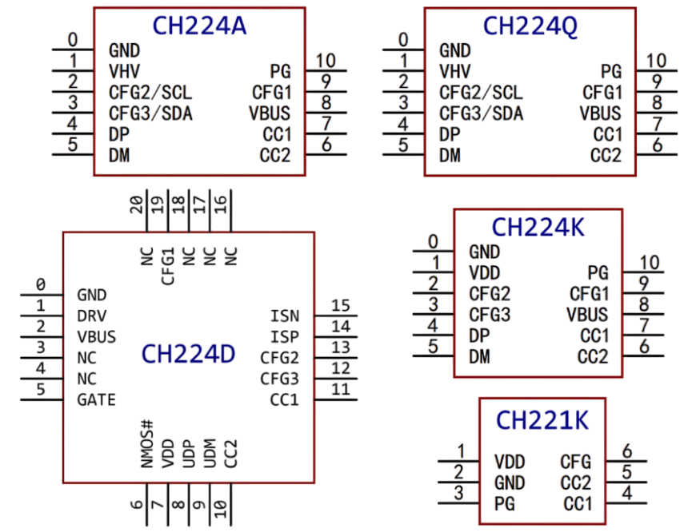
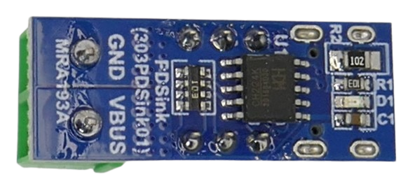
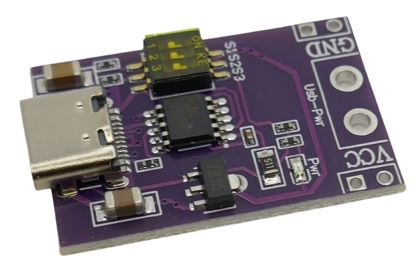

# CH224 USB Sink Controller Chip Family

> Affordable USB Sink Controllers for Requesting USB Voltages From a USB Power Supply 

The **CH224** family is a set of low-cost USB fast‑charge sink controllers that negotiate fixed output voltages from USB‑C PD and other protocols (BC1.2, some “boost” fast‑charge schemes) for loads up to about 100W/140W, depending on model. 

They integrate the PD communication engine, E‑Marker simulation, voltage detection, and basic protection (over‑voltage, over‑temperature), so only minimal external circuitry is needed. 

## Overview

There are currently five CH224 family members:

* **CH221K**:    
  first chip model that surfaced 2018. It can request 5/9/12/15/20V via resistor configuration from USB PD 2.0/3.0. Since it does not use *D+/D-* lines, it can only trigger USB PD, but no legacy USB-A quick charge protocols like QC, VOOC, FCP, etc. It is still in use for its extremely compact design and low cost.      
* **CH224K/D**:   
  In 2019, revised models were released that add full support for USB-A legacy fast charging protocols, including BC1.2. In addition, trigger voltage can now also be set using logic pins, making it much easier to build configurable triggers and further lowering external component count.     
  
  CH224K and CH224D are functionally identical. They differ primarily in package size.     
  **NOTE:** *CH224K* tolerates max. 3.7V at its logic pins and is suitable for 3.3V logic only.     
* **CH224A**:    
  In 2024, CH224A was released as pin-compatible drop-in replacement for CH224K. It adds support for EPR (Extended Power Range), allowing triggering of up to 48V and 140W. Via a simple *I2C* interface, it can now also be controlled by external MCUs.

* **CH224Q:**    
  In 2025, CH224Q was released as the new flagship model. It adds **PPS* (Programmable Power Supply) and *AVS* support (Adjustable Voltage Supply), effectively allowing to request specific voltages rather than fixed USB PD standard voltages. 

  Most notably, this chip can finally read all USB source profiles (PDO lists) offered by the power source via its extended I2C registers. It also supports a new *I2C burst mode* where multiple registers can be polled in one transaction. This can be up to 10x faster than single-byte reads. 

### Comparison Chart

| Feature / Model | CH221K | CH224K | CH224D | CH224A | CH224Q |
|---|---|---|---|---|---|
| Output range | 5-20V | 5-20V | 5-20V | 5-48V | 3.3-48V |
| USB PD | 3.0 | 3.0 | 3.0 | 3.2 EPR | 3.2 EPR |
| PPS | | | | | 3.3-21V@20mV/50mA |
| AVS | | | | | 15-48V 100mV |
| output power | 60W | 100W | 100W | 140W | 140W |
| legacy protocols |  | ✅ | ✅ | ✅ | ✅ |
| E-marker simulation |  | ✅ | ✅ | ✅ | ✅ |
| Trigger via resistor |  ✅ | ✅ | ✅ | ✅ |✅ |
| Trigger via logic pin|  | ✅ | ✅ | ✅ |✅ |
| Trigger via I2C |   |  |  | ✅ |✅ |
| I2C Burst Mode |  |  |  |  | ✅ |
| Package type  | SOT‑23‑6 | ESSOP‑10 | QFN‑20 | EESOP-10/ QFN‑20   | DFN10                                       |
| Pin count                        | 6                                   | 10                                 | 20                                 | 20                                       | 20                                           |

### Use Cases

Here is where these chips are typically used:

* *CH221K*: maximum space constraints, very low-cost
* *CH224K*: being phased out for *CH224A* but still stocked and cheaper.    
  CFG pins max 3.7 V** (3.3 V logic only)       
  

* *CH224D*: simple and cheap USB triggers    
* *CH224A*: high-quality triggers for up to 140W/48V      
  
  

* *CH224Q*: full programmatic control via I2C, fully programmable output voltages   

## Voltage Configuration
Depending on chip model, voltage can be requested in up to three different ways:

| Method | CH221K | CH224K | CH224D | CH224A | CH224Q |
| --- | --- | --- | --- | --- | --- |
| Resistors |  ✅ | ✅ | ✅ | ✅ | ✅ |
| Digital Pins |   | ✅ | ✅ | ✅ | ✅ |
| I2C |  | | | ✅ | ✅ |

### Using Resistors

This is the most basic approach that is supported by all chip models. In this mode, a single resistor is connected to `CFG1` and `GND`.

| Resistance on CFG1 to GND | Request-voltage |
|---------------------------|-----------------|
| none                      | 5V |
| 6.8KΩ                     | 9V              |
| 24KΩ                      | 12V             |
| 56KΩ                      | 15V             |
| NC (*CH224K/D*) / 120KΩ (*CH224A/Q*)                        | 20V             |
| 210KΩ (*CH224A/Q only*) | 28V  |

`CFG2` and `CFG3` are not used.

#### CH221K
*CH221K* being the first chip model of this family, works slightly different: the pin is called `CFG` (not `CFG1`), the resistor must connect to `VDD` (not `GND`), and the resistor values are different:

| Resistance on CFG to VDD | Request-voltage |
|--------------------------|-----------------|
| 10KΩ                     | 5V              |
| 20KΩ                     | 9V              |
| 47KΩ                     | 12V             |
| 100KΩ                    | 15V             |
| 200KΩ                    | 20V             |

### Using Digital Pins

In this mode, all three `CFGx` pins are used. when `CFG1` is pulled `low`, this digital ("level") mode is enabled: the states of `CFG2` and `CFG3` now determine the trigger voltage:

| CFG1 | CFG2 | CFG3 | Request-voltage |
|------|------|------|-----------------|
| 1    | -    | -    | 5V              |
| 0    | 0    | 0    | 9V              |
| 0    | 0    | 1    | 12V             |
| 0    | 1    | 1    | 15V             |
| 0    | 1    | 0    | 20V             |

* **Maximum Pin Voltage:** 
  * **CH224K:**    
    `CFG1`, `CFG2` and `CFG3` **must not exceed 3.7V**
  * all other:   
    `CFG1` **must not exceed 3.7V**  (use a 2KΩ resistor in series for 5V systems)    
    
    `CFG2` and `CFG3` **must not exceed 5.0V**
* **External Pullup/Pulldown Resistors:**     
  * **CH224K/D:**    
  add **external** pullup or pulldown resistors to set `CFG2`and `CFG3` to *defined default states*. Else, while the MCU is still booting, the GPIOs may be in a floating (random) state and can accidentally request high trigger voltages that may damage connected devices. 
  * **CH224A/Q:**    
  uses **built-in pull-up resistors** on `CFG2` and `CFG3` defaulting to *20V output* when not actively configured otherwise.
* **Disabling Level Control:**    
    pull up `CFG1` to `VHV` through 100KΩ resistor
  
### Using I2C Interface

*CH224A/Q* can be controlled via I2C from an external MCU. Via I2C, enhanced functionality is accessible:   
* **CH224A:**    
  * *I2C status* register (`0x09`)    
  * *voltage control* register (`0x0A`, fixed voltage steps)    
  * *current data* register (`0x50`, maximum available current).
* **CH224Q** adds:    
  * *PPS voltage configuration* register (`0x53`, adjustable voltage up to *15V* in *25mV* increments)
  * *AVS voltage configuration* register (`0x51`, `0x52`, adjustable voltage above *15V* in *100mV* increments)
  * *PD power data* register (`0x60-0x8F`, complete power information) 

For *I2C* details including the register map, [see the datasheet](materials/ch224aq_datasheet.pdf).

## E-Marker Simulation

Since CH224 chips support output power >60W, proper power supplies will deliver this power only when the USB cable contains a valid E-marker chip that certifies that the USB cable works safely with this power.

Trigger chips like CH224 are often used inside devices to manage internal power supply, so there are no e-Marker USB cables involved. That's why these chips can **simulate E-markers**, ensuring that an external USB power supply actually delivers the power levels that the chip requests.

When E-marker simulation is enabled, this effectively turns off a useful and important safe guard of the USB ecosystem: you now can use *any* USB cable with *any* of the supported powers, i.e. up to 140W/5A. It is now up to *you* to ensure that requested powers and the cabling involved fit.

To enable **e-marker simulation**, connect `CC2` to `GND` using a **1KΩ resistor**.

## Safety Features

All chip models come with basic security features:

* **OVP:** over-voltage protection
* **OTP:** over-temperature protection
* **OVD:** output-voltage detection

## Materials

* [CH224/CH221 Datasheet](materials/ch224_datasheet.pdf):     
  Comprehensive overview of CH224 chip family including CH221K. Does not cover the latest CH224Q.        
* [CH224A/Q I2C Datasheet](materials/ch224aq_datasheet.pdf):    
  Specific datasheet for CH224A/Q focusing on I2C register maps, schematics, and CH224K replacement options.   

> Tags: USB-C, USB-PD, USB Power Delivery, USB Trigger, E-Marker, Power Supply, CH224K, Voltage Negotiation, Trigger Board, Fixed Voltage, PD Sink, Fast Charging, CH224D, CH221K, E-Marker Simulation, Power Adapter, Car Adapter, USB PD Tester

[Visit Page on Website](https://done.land/components/power/powersupplies/usb/usbtriggers/ch224?581182061730253233) - created 2025-06-29 - last edited 2026-02-25
