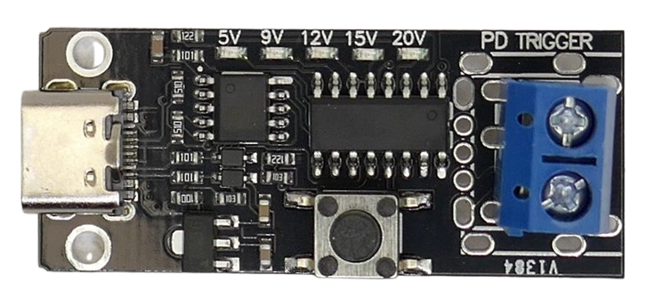

# CH224K USB Trigger Tester

> Sophisticated USB Trigger With Built-In Microcontroller

This breakout board features a *CH224K* USB trigger chip, a microcontroller, and a voltage regulator (for the microcontroller).

The board’s specifications are derived from the chip it uses: *USB PD 3.0, 100W, 5/9/12/15/20V*.

The board has no official name but is often identified by the markings *CMTPC*, *LX-CACPB*, or *LX-CMTPD*. It is widely available on online marketplaces.

What makes this board special is its built-in microcontroller, plus a number of solder pads on its backside that make it easy to customize the board for use as a testing device or even the heart of a simple lab bench power supply.

## Overview

In its simplest mode, the board acts as a conveniently configurable USB trigger board. Rather than fiddling with microscopic DIP switches or manipulating solder bridges, a simple push button can be used to change the trigger voltage.

Dedicated LEDs indicate the currently selected voltage.

This trigger board is the most sophisticated in its class and features a simple microcontroller.

The microcontroller remembers the last voltage setting and re-applies it the next time you power on the board.

### Configuration

On the bottom of the breakout board, there are a number of solder pads for further customization:

| Solder Pad | Description |
| --- | --- |
| PD Only | Disables all non-PD protocols. Only USB-C protocols stay active. Recommended when used as a diagnostic tool specifically for *USB PD*. |
| 5,9,12,15,20V | Contacts for dedicated switches. Recommended when fast and direct voltage switching is required. |
| S1 | Connects to a *lock key*: prevents accidental voltage changes. |
| F1 | Automatically changes voltages from highest to lowest. |
| F2 | Automatically changes voltages from lowest to highest. |
| F1+F2 | Performs voltage tests in a cycle. |

## Safety Feature

This board can change the output voltage by a simple push button press, and when you connect the dedicated voltage buttons on the back of the board, it is even easier to select a given output voltage.

That, however, is also a risk. For example, if you have connected a low-voltage device and accidentally hit the *20V button*, the connected device could be damaged.

That's why the microcontroller firmware offers a *lock mode*: when the `S1` solder bridge is closed, added security is in effect. You can no longer change the voltage on the fly, and the board always uses the voltage that was last set.

To set a new voltage, you must *press and hold* the push button while powering on the board. Only then will voltage selection be available again.

## Usage as a USB PD Test Device

This board can be used to test *USB PD features* of arbitrary USB power sources.

The solder pads `F1` and `F2` can be used to connect test buttons:

* **[`F1`] Highest-to-Lowest:**  
  When the `F1` button is pressed (the solder pad is short-circuited), the board automatically tests all available voltages, starting from highest to lowest.
* **[`F2`] Lowest-to-Highest:**  
  When the `F2` button is pressed (the solder pad is short-circuited), the board automatically tests all available voltages, starting from lowest to highest.
* **Cycling:**  
  When both `F1` and `F2` are pressed/short-circuited, the microcontroller performs infinite cycle testing from lowest to highest voltage (until buttons are released).

You can further customize testing:

* **USB PD Only:**  
  To use only *USB PD* protocols (and exclude all other supported quick charge protocols), close solder pad `PD ONLY`.
* **Speed:**  
  By default, when using `F1`/`F2` test modes, the voltage changes every *0.5 seconds*.
  * When the safety lock is turned on, hold the push button and power on the board to unlock it.
  * Instead of releasing the push button once the first LED flashes, keep the button pressed until *all* LEDs flash. You are now in *time setting* mode.
  * Press the button multiple times to set the new time. Each press adds *0.5 seconds*, and the LEDs show the set time in binary mode.
  * Once you stop pressing the button for more than *3 seconds*, the new time is saved.

> Tags: USB-C, USB-PD, USB Power Delivery, USB Trigger, E-Marker, Power Supply, CH224K, Voltage Negotiation, Trigger Board, e-marker, Fixed Voltage

[Visit Page on Website](https://done.land/components/power/powersupplies/usb/usbtriggers/ch224/usbtriggertester?632883061730253233) - created 2025-06-29 - last edited 2025-06-29
