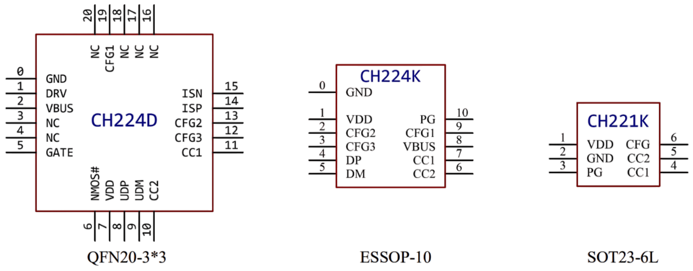

# CH224K USB Trigger

> Affordable USB Trigger Chip for Selecting Fixed Voltages 

*CH224K* is a highly specialized chip found on many simple and affordable USB Trigger breakout boards. It supports USB PD3.0/2.0 and BC 1.2 and can request five fixed voltages (*5V*, *9V*, *12V*, *15V*, and *20V*) at a maximum of *100W*. 

The chip includes *optinal e-marker simulation*: when enabled, you can use generic unmarked USB cables at more than *60W* or *20V* (with the risk attached when accidentally using underrated cables).

## Overview

*CH224* takes care of *USB negotiation* to deliver the voltage and current your device requires. This chip is found on many low-cost *USB trigger board*. Typical use involve supplying power from USB power sources such as power banks or chargers to power-hungry devices :

* **Power Adapters:** power portable soldering irons and other power-intense devices at *20V* and high currents (up to 100W)
* **Car Adapter:** supply *12V* to car electronics, i.e. attach a *12V cigarette lighter plug* so you can power lamps, electric air pumps and a plethora of other devices originally designed to be powered by car electric.

This chip can also be used to build *USB PD Testers* (to check USB power source capabilities) or even simple lab bench power supplies.

Typically this chip isn't used stand-alone but rather as part of ready-to-use USB trigger breakout boards.

### Chip Variants

The *CH224* comes in two variants: *CH224D* and *CH224K*, and there is also a smaller and basic *CH221K* sub type supporting *USB PD* only. 

> The *CH221K* is rarely used in breakout boards and targets device manufacturers which is why it is not discussed in detail below. Refer to the [datasheet](materials/ch224_datasheet.pdf) for more information.

The 10-pin *CH224K* is typically used for *USB trigger boards*.

| Feature                      | CH224D                                | CH224K                                  | CH221K                         |
|------------------------------|---------------------------------------|-----------------------------------------|---------------------------------|
| Supported Protocols          | PD3.0/2.0, BC1.2, others              | PD3.0/2.0, BC1.2, AFC, FCP, QC2.0, etc. | PD only                        |
| Configuration Methods        | Resistor & level configuration        | Resistor & level configuration          | Resistor configuration only     |
| VDD Output                   | Built-in LDO, 4.7V @ 10mA (usable)    | 3.3V, very low current (not for MCU)    | 3.3V, very low current         |
| Special Features             | GATE pin for NMOS, ISP/ISN for current detection | E-Mark simulation, can pair with CH442E for data switching | -                               |
| Input Voltage on CFG2/3      | Up to 5V                              | Up to 3.7V                              | -                              |
| Package                      | QFN20, ESSOP10                        | ESSOP10                                 | SOT23-6L                       |

* **CH224K:**     
   most popular type, supports the widest range of fast-charging protocols (including AFC, FCP, QC2.0, etc.), can use both resistor and level configuration, and can simulate e-markers. Its VDD output is limited to powering configuration pins, not external circuits, which is why many breakout boards come with external LDOs.

* **CH224D:**    
  upgraded version of *CH224K*, featuring a built-in LDO that can supply 4.7V/10mA externally, a GATE pin for NMOS control, and ISP/ISN pins for current detection. It allows higher input voltage on configuration pins (up to 5V)

* **CH221K:**     
  basic version in a very small form factor, supporting only PD protocol and only resistor configuration. 
  

## Voltage Selection

The desired trigger voltage can be set via *analog resistor* or via *digital GPIOs* using the chip pins `CFG1`, `CFG2`, and `CFG3`.

### Resistance Configuration
In this mode, a single *resistor* is connected to `CFG1` and `GND`. 

#### CH224K and CH224D
The resistor needs to be connected to **GND** and `CFG1`:

| Resistance on CFG1 to GND | Request-voltage |
|---------------------|-----------------|
| 6.8KΩ              | 9V             |
| 24KΩ               | 12V            |
| 56KΩ               | 15V            |
| NC                 | 20V            |

In resistance configuration mode, `CFG2` and `CFG3` are not used.

* **Fixed Voltage:**   
  This mode is particularly useful when configuring the chip for **one fixed voltage**. Triggering *20V* is the easiest: simply do not connect *any* `CFGx` pin.
* **Manual Configuration:**   
  Some boards use *DIP switches* or *solder bridges* to allow for selecting the appropriate resistor for a given voltage.

#### CH221K
The resistor needs to be connected to **VDD** (not **GND** as in *CH224*) and `CFG`:

| Resistance on CFG to VDD | Request-voltage |
|-------------------|-----------------|
| 10KΩ             | 5V             |
| 20KΩ             | 9V             |
| 47KΩ             | 12V            |
| 100KΩ            | 15V            |
| 200KΩ            | 20V            |

#### Level Configuration Mode
In this mode, all three `CFGx` work *digitally* and can be connected to a microcontrollers' three *GPIOs* to *dynamically* select the output voltage. 

| CFG1 | CFG2 | CFG3 | Request-voltage |
|------|------|------|-----------------|
| 1    | -    | -    | 5V             |
| 0    | 0    | 0    | 9V             |
| 0    | 0    | 1    | 12V            |
| 0    | 1    | 1    | 15V            |
| 0    | 1    | 0    | 20V            |

* **CH221K:**     
  mode not available
* **CH224K:**   
  `1` (high) can be a voltage **no higher than 3.7V** (ESP32 and other *3.3V* microcontrollers can be used, 5V Arduinos must use a level shifter)
* **CH224D:**   
  `1` (high) can be a voltage **no higher than 5.0V** (5V Arduinos can be used)

> [!IMPORTANT]
> Make sure the `CFGx` pins are in a **defined state** before the MCU has fully booted and taken control, i.e. by pulling them up or down appropriately. Undefined or floating states may accidentally request up to *20V* which might damage connected devices.    

## E-Marker Simulation

With *USB PD protocols*, powers *>60W* and voltages *>20V* are unlocked only when the USB-C cable carries a *e-marker chip* that certifies that the cable is suited for these power levels. This is an important protection and safety feature.

*CH224* can *simulate e-markers*, allowing you to use *any* USB cable with high power. If you enable *e-marker simulation*, you lose built-in safety protection, and it is now your responsibility to guarantee that the USB cables can carry high currents.

To enable *e-marker simulation*, `CC2` must be connected to `GND` using a **1KΩ resistor**.

## Trigger Boards

There is a vast number of affordable *USB trigger boards* using the *CH224K* chip. Most boards predominantly differ in the way how the trigger voltage can be set.

### With Microcontroller (CMTPC/LX-CMTPD)
This trigger board is the most sophisticated and contains a simple microcontroller. 

In its simplest mode, pressing the push button switches to the next higher voltage, and dedicated LEDs indicate the currently selected voltage. The board remembers the last voltage setting and re-applies it the next time it is powered on.

On the bottom of the breakout board, there are a number of solder pads for further customization:

| Solder Pad | Description |
| --- | --- |
| PD Only | disables all non-PD protocols. Only USB-C protocols stay active. Recommended when used as a diagnose tool specifically for *USB PD* |
| 5,9,12,15,20V | contacts for dedicated switches. Recommeded when fast and direct voltage switching is required |
| S1 | Connects to a *lock key*: prevents accidental voltage changes |
| F1 | Automatically changes voltages from highest to lowest |
| F2 | Automatically changes voltages from lowest to highest |
| F1+F2 | Performs voltage tests in a cycle |

#### Conclusion

This board is awesome for complex test scenarios, or as a generic trigger device in your lab. 

If all you want is outputting a fixed voltage, one of the simpler boards may be a much better choice: they are smaller, cost less, and have much lesser room for accidental misconfiguration. 

Being able to change the voltage by a simple button press may be convenient when frequent voltage changes are actually needed, but it can also lead to catastrophic accidents when all you want is supplying a fixed voltage to a specific device, and you accidentally nuked it with over-voltage.

> Tags: USB-C, USB-PD, USB Power Delivery, USB Trigger, E-Marker, Power Supply, CH224K, Voltage Negotiation, Trigger Board, e-marker, Fixed Voltage

