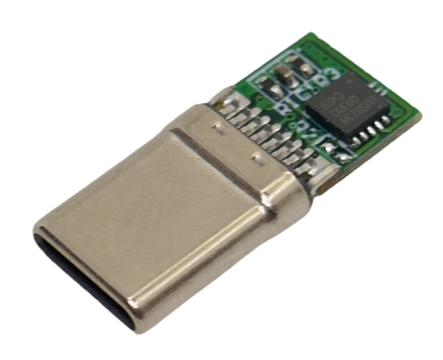
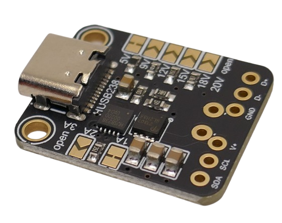
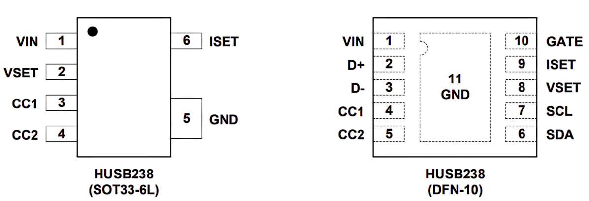

# HUSB238 USB Trigger

> Affordable Fixed-Voltage USB Trigger Chip With I2C Support

*HUSB238* can negotiate fixed output voltages from a variety of USB power protocols, including *USB PD*.

Its unique feature is an *I2C* interface, which is unusual in these entry-level triggering chips.

This is why *HUSB238* cannot only be found in *USB trigger boards* but also boards that expose *I2C* and can be controlled dynamically by microcontrollers.

*HUSB238* supports *USB PD3.0*, but no *PPS*, so it can trigger the typical pre-defined voltage steps (*5V*, *9V*, *12V*, *15V*, *20V*) at a maximum of *100W*. It cannot trigger freely *adjustable voltages*, though.

| Feature                     | HUSB238                                   |
|-----------------------------|-------------------------------------------|
| PD Version                  | USB PD3.0, Type-C v1.4                    |
| Max Power                   | 100W (20V/5A)                             |
| Legacy Protocols            | Apple Divider 3, BC1.2 (SDP, CDP, DCP)    |
| Configuration               | Resistor (VSET/ISET) or I2C               |
| I2C Monitoring/Control      | Yes                                       |
| Protection                  | OVP, UVP, OTP                             |
| Integrated Gate Driver      | Yes (PMOS)                                |
| Dead Battery Support        | Yes                                       |
| e-Marker Simulation         | No                                        |
| Package                     | DFN-10L, SOT33-6L                         |

## Overview

*HUSB238* is typically found in square *DFN-10* packages.

The 10-pin *CH224K* is typically used for USB trigger boards.

## Voltage Selection

The trigger voltage can be set in two ways:

* **Pin `VSET`:**  
  Connect a resistor between pin `VSET` and `GND` to set a fixed voltage. When no resistor is connected, the default voltage is *20V*.

### Resistance Configuration

In this mode, a resistor is connected to `VSET` and `GND` to set the trigger voltage:

| Resistance on `VSET` to GND | Request-voltage |
|-----------------------------|-----------------|
| 0KΩ                         | 5V              |
| 6.04KΩ                      | 9V              |
| 10KΩ                        | 12V             |
| 14KΩ                        | 15V             |
| 17.8KΩ                      | 18V             |
| NC                          | 20V             |

#### Current Setting

Likewise, a resistor can be connected to `ISET` and `GND` to indicate the required *current* in *250mA* increments. If no resistor is connected, the full *3.25A* are available:

| Resistance on `ISET` to GND | Request-current |
|-----------------------------|-----------------|
| 0KΩ                         | 1.25A           |
| 4.53KΩ                      | 1.5A            |
| 7.5KΩ                       | 1.75A           |
| 10.5KΩ                      | 2A              |
| 13.7KΩ                      | 2.25A           |
| 16.5KΩ                      | 2.5A            |
| 19.6KΩ                      | 2.75A           |
| 22.6KΩ                      | 3A              |
| NC                          | 3.25A           |

### I2C Mode

*HUSB238* can communicate with external microcontrollers via its *I2C* interface at address `0x08`.

| Address | Register Name  | Description                         |
|---------|---------------|-------------------------------------|
| 0x00    | PD_STATUS0    | Negotiated voltage/current status   |
| 0x01    | PD_STATUS1    | Additional status info              |
| 0x02    | SRC_PDO_5V    | 5V PDO info from source             |
| 0x03    | SRC_PDO_9V    | 9V PDO info from source             |
| 0x04    | SRC_PDO_12V   | 12V PDO info from source            |
| 0x05    | SRC_PDO_15V   | 15V PDO info from source            |
| 0x06    | SRC_PDO_18V   | 18V PDO info from source            |
| 0x07    | SRC_PDO_20V   | 20V PDO info from source            |
| 0x08    | SRC_PDO       | Select which PDO to request         |
| 0x09    | GO_COMMAND    | Command register (e.g., switch)     |

#### Register Map

For details, see the [I2C Register Map](materials/husb238_i2c_registers.pdf).

#### Libraries

There are several libraries available for *HUSB238* and *Arduino*/*ESP32*:

* [Basic #1:](https://github.com/Duckle29/HUSB238) great for figuring out how I2C control works, or to embed quick code chunks without the need to link an entire external library
* [Basic #2:](https://github.com/luoluomeng/HUSB238Driver/blob/develop/src/HUSB238Driver.cpp) same, essential functionality with least code 
* [Adafruit:](https://github.com/adafruit/Adafruit_HUSB238) production-ready and well documented external library

> [!IMPORTANT]
> *I2C* always has priority over the resistor configuration. The resistors set the baseline default. Once different settings are chosen via *I2C*, these override the resistor settings.

#### Selecting USB Power Supply Setting

It is important to understand how trigger boards actually select a given voltage setting. This depends on the actual capabilities of the USB power source.

* *HUSB238* initially queries all the power profiles supported by the power source.
* It then tries to find the best matching profile for the requested voltage and current:
  * Highest source voltage available that is **equal or lower** than the requested voltage
  * Current is **equal or higher** than the requested current

That's why the real output voltage may fall back to a lower voltage than anticipated.

For example, *12V* is not an official *USB PD* base voltage, but it is supported by most chargers and power banks.

If you come across a USB power source that works strictly by USB PD specification, there may be no power profile for *12V*, just for *9V* and *15V*. In this case, *HUSB238* will always select a voltage **that is lower** than the requested voltage, so you may end up with *9V output voltage*.

## Materials

[HUSB238 Datasheet](materials/usb238_datasheet.pdf)  
[HUSB238 I2C Register Map](materials/husb238_i2c_registers.pdf)

> Tags: USB-C, USB-PD, USB Power Delivery, USB Trigger
