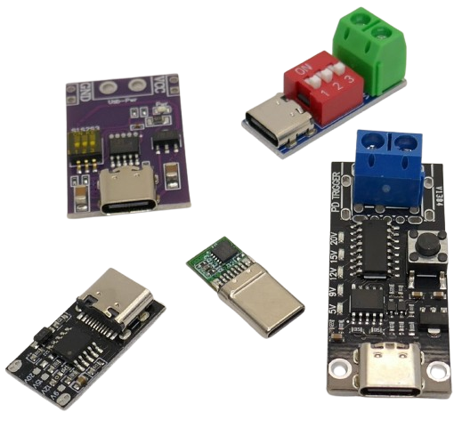

# USB Triggering

> Requesting Specific Voltages From USB (using it as a modern power supply)

Prior to the introduction of *USB PD (Power Delivery) Standards* in 2012, USB always supplied a fixed *5V* voltage. If you needed a voltage different from *5V*, or required currents larger than *500mA*, then USB was no power supply option.

This has changed today: almost all USB power supplies (like wall chargers or power banks) support the flexible *USB PD (Power Delivery) standard*. Your *USB-C* connector can now deliver almost *any voltage* in a wide range, with up to *5A*.

To enable this, you need a way to engage in *USB PD negotiation*. Since the *USB PD* protocol is too complex to be emulated by microcontrollers, very affordable chips exist that specialize in *USB PD negotiation*.

You find these chips for example on *USB Trigger Boards*: such boards connect to your USB power supply via *USB-C* and provide the requested voltage on solder pads. 

The requested voltage can be set in a variety of ways, i.e. via DIP switches, solder bridges, or push buttons. Some *USB Trigger Boards* are pre-configured to a specific output voltage. With such boards you could, for example, power *12V* devices from a USB power bank.

## Overview

To use *USB* as a flexible power source, you need to *negotiate* the requested voltage via one of the protocols supported by your USB power source.

Most USB power sources today support *PD 3.0*, so triggering is possible with almost any USB power source. Simpler or lower-cost power sources may not support higher voltages such as *20V* or above, even if they claim PD compatibility.

To select a **fully adjustable voltage** (and not just fixed voltages such as *9V* or *15V*), protocol extensions like *PPS* (Programmable Power Supply) or *AVS* (Adjustable Voltage Supply) are required. 

These features are *optional* in the USB PD specification, so your power source may or may not support them. If you are unsure, use a USB tester to check which protocols and extensions are available.

> [!TIP]
> If you require less than *36W* of power, *QC 3.0* (Quick Charge 3.0) is also a viable option, as it is widely supported and provides adjustable voltages by design. Another advantage of *QC 3.0* is its much simpler protocol: microcontrollers like Arduino and ESP32 can easily emulate it, and no external trigger hardware is required.

Takeaways:

* PPS is optional in USB PD 3.1 (and 3.0).
* Not all USB PD 3.1 chargers, powerbanks, or devices support PPS.
* Always check product details if you specifically need PPS support
* QC 3.0 supports adjustable voltages, too, but only up to 36W. 
* QC 3.0 uses a simpler protocol that can be directly emulated by MCUs such as Arduino/ESP32

## Suitable USB Protocols

It is important to understand that triggering can only use the protocols and voltage levels that the power source exposes. Today, a wide variety of protocols exist, and chargers and powerbanks often support multiple of these:

| Standard / Protocol            | Supported Voltages (V)      | Max Current (A) | Max Power (W) | Protocol Features / Notes                                         | E-marker Cables Required         |
|-------------------------------|-----------------------------|-----------------|---------------|-------------------------------------------------------------------|--------------------------|
| **USB 1.0 / 2.0**             | 5                           | 0.5             | 2.5           | Fixed voltage                                                     | No                       |
| **USB 3.0 / 3.1**             | 5                           | 0.9             | 4.5           | Fixed voltage                                                     | No                       |
| **USB Battery Charging 1.2**  | 5                           | 1.5             | 7.5           | Fixed voltage                            | No                       |
| **USB Type-C 1.2**            | 5                           | 3               | 15            | Fixed voltage                                   | No (recommended >3A)     |
| **USB PD 1.0**                | 5, 9, 12, 15, 20            | up to 5         | 100           | Fixed steps, up to 100W       | Yes (for >3A/20V)        |
| **USB PD 2.0 / 3.0 (SPR)**    | 5, 9, 15, 20                | up to 5         | 100           | Programmable steps, PPS optional (3.3–21V)                        | Yes (for >3A/20V)        |
| **USB PD 3.1 (EPR)**          | 5, 9, 15, 20, 28, 36, 48    | up to 5         | 240           | Adds EPR (28/36/48V), AVS (15–48V, 100mV steps)                   | Yes (required >100W)     |
| **Qualcomm Quick Charge 2.0** | 5, 9, 12                    | up to 3         | 18            | Proprietary protocol                             | No                       |
| **Qualcomm Quick Charge 3.0** | 3.6–20 (200mV steps)        | up to 3         | 36            | Adjustable voltage, easy MCU emulation, widely supported          | No                       |
| **Qualcomm Quick Charge 4/4+**| 5, 9, 12, 20                | up to 5         | 100           | USB PD compatible, not widely supported                                | Yes (for >3A/20V PD)     |
| **Apple Fast Charge**         | 5, 9, 14.5, 20              | up to 4.7       | 18–96         | Uses USB PD                              | Yes (for >3A/20V)        |
| **Samsung Super Fast Charging**| 5, 9, 15                   | up to 3         | 45            | Uses PPS                            | No (unless >3A/20V PD)   |
| **Huawei SuperCharge**        | 5, 9, 10, 12                | up to 6         | 66            | Proprietary                          | No (proprietary cable)   |
| **Oppo Super VOOC**           | 5, 10, 20                   | up to 12        | 240           | Proprietary, high current                  | Yes (proprietary cable)  |
| **OnePlus Warp Charge**       | 5, 10                       | up to 6.5       | 65            | Proprietary                         | Yes (proprietary cable)  |
| **MediaTek Pump Express**     | 5, 7, 9, 12                 | up to 4.5       | 30            | Proprietary                        | No                       |

* **E-marker cables** are required by the USB spec for any USB-C cable supporting **more than 3A or voltages above 20V**, as well as for all USB PD 3.1 EPR (Extended Power Range) applications.

* Proprietary fast charging (*VOOC, Warp, SuperCharge*) often requires manufacturer-specific cables for full performance, which function similarly to e-marker cables.

* For *Apple Fast Charge* and *Samsung Super Fast Charging*, **e-marker** is only needed if the device draws **more than 3A or uses >20V** (rare for phones/tablets, common for laptops).

> [!IMPORTANT]
> If a given protocol or feature isn't supported by the USB power source you use, triggering may not work or fall back to the next available lower voltage.

### Fixed Voltage Steps
To request one of the fixed voltage steps, these protocols are commonly used in voltage triggering:

| Protocol | Voltages (V) | Power | Remarks |
| --- | --- | --- | --- |
| USB PD 1.0 | 5,9,(12,)15,20 | 60W/3A | superseded by PD 3.0 |
| USB PD 3.0 | 5,9,(12,)15,20 | 100W/5A | widely adopted |
| USB PD 3.1 | 5,9,(12,)15,20 | 100W/5A | widely adopted |
| USB PD 3.1 EPR | 5,9,(12,)15,20,28,36,48 | 240W/5A | less common |
| QC 3.0 (QuickCharge) | 5,9,12,20 | 36W/1.8A | by Qualcomm, commonly supported |

### Adjustable Voltage

*Adjustable* voltage can be requested by one of these protocols/extensions:

| Extension | Voltages (V) | Power | Steps | Remarks | Protocol Requirements |
| --- | --- | --- | --- | --- | --- |
| PPS (Programmable Power Supply) | 3.3–21V | 20mV | also supports *Constant Current* in *50mA* increments (1A minimum) | USB PD 3.0 or better (optional feature) |
| AVS (Adjustable Voltage Supply) | 15-48V | 100mV | no *Constant Current* | USB PD 3.1 or better (optional feature) |
| QC3.0 | 3.6-20V | 200mV | simple protocol, can be emulated by MCUs | part of QuickCharge 3.0 |

#### USB PD (Power Delivery)
*USB PD* the official non-proprietary USB protocol which exists in different versions (1,2,3,3.1,4) and with optional features (PPS, EPR, AVS).

*USB PD* is the industry standard, provides the most power, and includes sophisticated security features. For example, in order to unlock its higher currents, it requires USB-C cables to be equipped with *e-marker* chips. Such cables can then actively expose their ratings, i.e. their maximum current capability.

Without *e-marked cables* (or underrated cables), *USB PD* limits the maximum currents to safe levels.

For DIY projects, when working with USB trigger boards, make sure you use a *e-marked USB-C cable* with the appropriate rating to connect the USB power supply to your trigger board.

#### PPS and PD 3.1 Clarification
*PPS (Programmable Power Supply)* is an *optional* feature within both USB PD 3.0 and USB PD 3.1. Not all PD 3.1-compliant chargers or devices support PPS. Support must be explicitly stated in product documentation, and if in doubt, you can use a USB tester to test the available protocols and extensions. 

PPS enables real-time, fine-grained voltage and current adjustments, which is especially useful for fast charging modern devices. However, a charger or device can be fully PD 3.1 compliant without supporting PPS.

#### QC 3.0 (QuickCharge)
Although *QC3* is an older proprietary protocol developed by *Qualcomm*, today it is widely supported by most chargers and power banks.

QC3 offers *adjustable voltage* via a very simple protocol that can be easily emulated by microcontrollers and does not require cabling with *e-markers*. So no special hardware is needed. On the down side, *QC 3.0* is limited to a maximum of *36W*.

## Triggering Options

There are four popular ways of triggering a voltage:

* **Manual Trigger Boards:**    
Dedicated trigger boards contain all logic required to negotiate a given **fixed** voltage via *USB PD*.     
  * Boards can typically be set manually to a requested fixed voltage (DIP switch, solder bridge, buttons).      
  * Some are set by hardware (via a soldered resistor) to *one specific trigger voltage* (i.e. 12V) and cannot be adjusted.      
  * While trigger boards exist that can also request **adjustable** voltage, these are much more uncommon and expensive

* **Programmable Trigger Boards (I2C):**     
Dedicated breakout boards with an *I2C* interface, allowing MCUs like Arduino or ESP32 to programmatically request a voltage via *USB PD*.
  * Often based on the same *USB PD chips* used by manual trigger boards     
  * Simple and affordable boards support fixed voltages only
  * More sophisticated boards support *PPS* (adjustable voltages)
  * The latest generation of boards also supports *EPR/AVS* for voltages up to *48V* 

* **QuickCharge 3.0:**
[Software emulation](https://github.com/vahidtvj/QC3Control) for *ESP32* and other MCUs to *emulate* the QuickCharge protocol. Requires no specialized *USB PD* hardware.    
  * Allows for **adjustable** voltages in the range of *3.6-20V* at a maximum of *36W*
  * Requires no *e-marker* cables
  * Real limits depend on the USB power source that you use and can be lower (i.e. 12V max)

* **Resistors:**    
Simple *resistors* can be used for limited control, typically to unlock *fast charge* modes with higher currents.     

  * For any voltage above 5V on USB-C, or for true USB Power Delivery or Quick Charge negotiation, a dedicated IC or microcontroller is usually required.    
  * Pure resistor/discrete methods are limited to 5V (USB-C) or basic fast charge signaling (USB-A/B).

  Here is a list of commony-used "resistor hacks":

  | Method                                   | Output Voltage(s) | Max Current | Components Needed         | Notes                                                                 |
  |-------------------------------------------|-------------------|-------------|---------------------------|-----------------------------------------------------------------------|
  | Short D+ and D- (USB-A/B)                 | 5V                | 1.5A+       | Wire or 0Ω resistor       | Works with many Android devices for "fast charge"                     |
  | Apple Divider (USB-A/B)                   | 5V                | 2.1A+       | Resistor dividers         | Specific voltages on D+/D- for Apple devices                          |
  | QC 2.0/3.0 Divider (USB-A)                | 5V–12V (QC2)      | Up to 3A    | Resistor dividers         | Not universally reliable; true QC needs protocol                      |
  | 5.1kΩ on CC (USB-C, non-PD)               | 5V                | 3A          | Two 5.1kΩ resistors       | not really a "hack" but the official way to get at least *5V* out of *USB PD*   |
  
## Specialized ICs

Specialized ICs are required to control *USB PD*:

| IC        | Fixed Voltage | Programmable Voltage (PPS) | I2C Interface | Extended Power Range (>20V, 240W) |
|-----------|--------------|----------------------|---------------|-----------------------------|
| CH224K    | ✔️           | ❌                   | ❌            | ❌                          |
| HUSB238   | ✔️           | ❌                   | ✔️            | ❌                          |
| HUSB238A  | ✔️           | ✔️                   | ✔️            | ✔️                          |
| AP33772   | ✔️           | ✔️                   | ✔️            | ❌                          |
| AP33772S  | ✔️           | ✔️                   | ✔️            | ✔️                          |

### CH224K

The **CH224K** is a low-cost USB Power Delivery (PD) sink controller designed to trigger and negotiate **fixed** voltages from USB-C power sources. It simulates **e-marker chips** and automatically detects VCONN, enabling requests for up to 100W (20V/5A) from compliant USB PD sources.

*CH224K* cannot be used to request **adjustable** voltages (PPS) and has no *I2C* interface. This chip is used by the majority of simple and affordable *manual trigger boards* with fixed voltage steps:

| Feature                    | Details                                                                 |
|----------------------------|-------------------------------------------------------------------------|
| Supported Protocols        | USB PD 3.0/2.0, BC1.2, others                                          |
| Voltage Selection          | DIP switch, jumpers, resistor, or MCU (CFG1–CFG3 pins)                 |
| Output Voltages            | 5V, 9V, 12V, 15V, 20V                                                  |
| Max Power                  | Up to 100W (20V/5A, requires e-marked cable for >3A)                   |
| E-marker Simulation        | Yes (supports high-power negotiation)                                   |
| Power-Good Output          | Yes (PG pin for status indication)                                      |
| Protection                 | Over-voltage, over-temperature                                         |

### HUSB238

The **HUSB238** is a USB Power Delivery (PD) sink controller IC with *I2C* support. This allows microcontrollers (such as Arduino, ESP32, or ATMega328) to dynamically select PD profiles, voltages, and monitor status in real time.

This chip supports **fixed** voltages only and has no support for **adjustable** voltages.

Thanks to its *I2C* interface, *HUSB238* can be found on many affordable breakout boards. Occasionally, this chip is also used on manual trigger boards (in which case the *I2C* interface is inaccessible).

| Feature                    | Details                                                                 |
|----------------------------|-------------------------------------------------------------------------|
| Supported Protocols        | USB PD 3.0/2.0                                                         |
| Voltage Selection          | I2C interface (dynamic), or preset via resistors                        |
| Output Voltages            | 5V, 9V, 12V, 15V, 20V                                                  |
| Max Power                  | Up to 100W (20V/5A, requires e-marked cable for >3A)                   |
| E-marker Simulation        | Yes (negotiates up to 5A if cable supports)                             |
| Microcontroller Required   | No (for preset voltage), Yes (for dynamic control/monitoring)           |
| Power-Good Output          | Yes (PG pin for status indication)                                      |
| Protection                 | Over-voltage, over-current, over-temperature                            |

### HUSB238A
The **HUSB238A** is a direct, pin-compatible upgrade to the HUSB238, offering significant new features—most notably, full support for *USB PD 3.1 EPR* (Extended Power Range) up to *48V/5A* in I2C mode, **as well as *AVS* and *PPS* modes**.

According to [community reports](https://hackaday.io/project/197947-usb-c-power-delivery-31-breakout-with-i2c), the *I2C* mode in the *HUSB238A-BB001-QN16R* variant may present a safety concern:  
In I2C mode, the chip reportedly defaults to requesting *28V* immediately upon startup, before any user configuration is possible. This behavior could potentially damage devices that are not rated for high voltage.

Additionally, users have noted limited I2C control over the output PMOS transistor and a lack of publicly available documentation for critical I2C register maps. Due to these concerns, the referenced [project](https://hackaday.io/project/197947-usb-c-power-delivery-31-breakout-with-i2c) was halted as of October 2024, with the authors stating:

> *We consider this as dangerous behavior and suggest not to use the HUSB238A-BB001-QN16R in I2C mode.*

It is not clear whether these issues are inherent to all HUSB238A chips or specific to certain revisions or implementations. Users are advised to thoroughly test the device in their intended applications and consult the latest manufacturer documentation for updates or errata.

| Feature                | HUSB238           | HUSB238A                   |
|------------------------|-------------------|----------------------------|
| USB PD Version         | 3.0               | 3.1 (EPR, AVS, PPS)        |
| Max Negotiated Voltage | 20V               | 48V (I2C), 28V (GPIO)      |
| PPS/AVS/EPR            | No                | Yes                        |
| Pin Compatibility      | QFN-16, same pins | QFN-16, same pins          |
| Firmware Update Needed | N/A               | Yes, for I2C mode          |

### AP33772

The **AP33772** is a USB Type-C Power Delivery (PD) sink controller IC from Diodes Incorporated that supports *PPS* and *I2C*: a microcontroller (Arduino, ESP32, etc.) can use [software libraries](https://github.com/CentyLab/AP33772-Cpp) to control the *AP3372*. 

Thanks to its *PPS* support, this allows for MCU-controlled programmable output voltages in the PPS range of *3.3-21V*:    
  * **Voltage Steps:**     
    *20mV* voltage increments
  * **Constant Current:**    
    *50mA* current increments for constant current, with a minimum current of *1A*
  * **Integrated Protection:**    
    Built-in over-voltage, over-current, and over-temperature protection, with support for external NTC thermistor for thermal monitoring and derating.
  * **Status & Fault Reporting:**     
    Provides GPIO pins for interrupt/fault signaling and a "Power Good" output for status indication.
  * **Dead Battery Mode:** Supports powering up from a dead battery state, making it suitable for battery-powered devices.
  * **QC4/4+ Compatibility:** Also supports Quick Charge 4/4+ protocol for broader charger compatibility.

| Feature                    | Details                                                                 |
|----------------------------|-------------------------------------------------------------------------|
| Supported Protocols        | USB PD 3.0 (Rev 1.2), PPS, QC4/4+                                       |
| Voltage Selection          | I2C interface (address `0x51`), supports PPS/APDO (20mV steps)                 |
| Output Voltages            | 5V, 9V, 12V, 15V, 20V (PD); 3.3V–21V (PPS, 20mV steps)                  |
| Max Power                  | Up to 100W (20V/5A, requires e-marked cable for >3A)                    |
| E-marker Simulation        | Yes (detects and negotiates up to 5A if cable supports)                 |
| Microcontroller Required   | Yes (for dynamic control/monitoring via I2C)                            |
| Power-Good Output          | Yes (PG pin for status indication)                                      |
| Protection                 | Over-voltage, over-current, over-temperature, NTC support               |
| Dead Battery Mode          | Yes                                                                     |
| Status/Fault Reporting     | Interrupt pin, I2C status registers                                     |
| NRND Status                | Not recommended for new designs (see AP33772S for new projects)         |

> [!IMPORTANT]
> Not Recommended for New Designs: As of 2024, AP33772 is marked NRND (Not Recommended for New Design); the AP33772S is suggested for new projects.

### AP33772S

The *AP33772S* is a **backwards-compatible** successor to the *AP33772*, 

It is a *drop-in replacement*, meaning that it is fully **backwards compatible**, and the *AP33772S* can do everything that the older *AP33772* can do.

In addition, the *AP33772S* adds support for *USB PD 3.1 EPR/AVS* (up to 28V), additional safety features, and more status outputs.

The register map and command set of *AP33772S* have been expanded and modified to support these new features. The I2C slave address remains the same (0x51), and the basic I2C transaction format (start, stop, read/write) is unchanged.

Here is a comparison table:

| Feature / Spec                  | AP33772                                              | AP33772S                                              |
|---------------------------------|------------------------------------------------------|-------------------------------------------------------|
| **USB PD Version**              | USB PD 3.0 (Rev 1.2), PPS, QC4/4+                    | USB PD 3.1 (v1.6), EPR/AVS up to 28V, SPR/PPS up to 21V |
| **Max Supported Voltage**       | 20V (PD), 21V (PPS)                                  | 28V (EPR/AVS), 21V (SPR/PPS)                          |
| **Max Supported Power**         | 100W (20V/5A, e-marker cable required)               | 140W (28V/5A, e-marker cable required for >3A/20V)    |
| **Voltage/Current Steps**       | 20mV (PPS), 50mA (PPS)                               | 20mV (PPS/AVS), 50mA (PPS/AVS)                        |
| **Protection Features**         | OVP, OCP, OTP, UVLO                                  | OVP, UVP, OCP, OTP, moisture detection, NTC support   |
| **Cable Orientation/FLIP Pin**  | No                                                   | Yes                                                   |
| **LED Indicator Pin**           | No                                                   | Yes                                                   |
| **GPIO / Status Outputs**       | Power Good, Interrupt                                | Power Good, Interrupt, FLIP, LED                      |
| **EPR/AVS (PD 3.1) Support**    | No                                                   | Yes                                                   |

> Tags: USB-C, USB-PD, USB Power Delivery, PPS, AVS, Quick Charge, Fast Charging, USB Trigger, E-Marker, DIY Electronics, Power Supply, CH224K, HUSB238, AP33772, AP33772S, I2C, Arduino, ESP32, Voltage Negotiation, Power Protocols, Trigger Board, USB Cable, Fixed Voltage, Adjustable Voltage, Programmable Power Supply

[Visit Page on Website](https://done.land/components/power/powersupplies/usb/usbtriggers?667784060228252731) - created 2025-06-27 - last edited 2025-06-27
