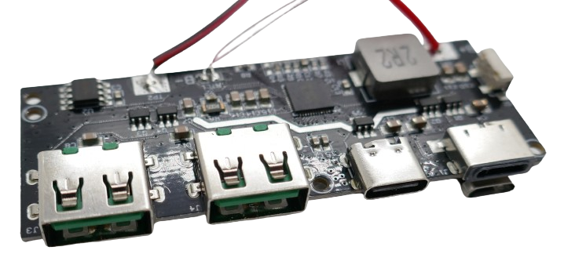
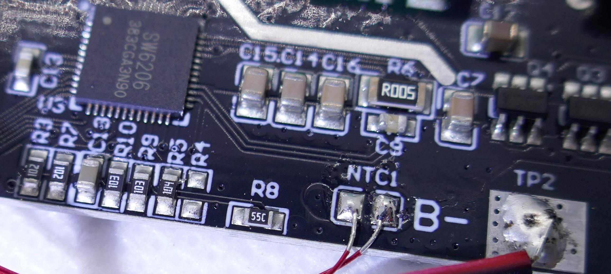
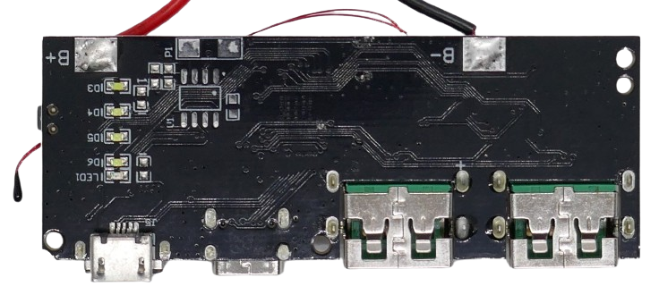

# 22.5W Power Delivery Module

> Turning A Single Battery Into a 22.5W Fast Charge Powerbank

This module can be connected to a *single LiIon* or *LiPo* battery (or *multiple batteries* connected *in parallel*) and delivers a maximum of *22.5W* of *USB power*.

## USB Ports

The board comes with five connectors that can be used concurrently with the entire variety of *USB* devices including *Android* and *iOS*:

* 2x USB-A, output only, supporting QC3/QC2/AFC/FCP/SCP/PE2.0/PE1.1/SFCP/VOOC
* 1x USB-C, input/output supporting PPS/PD3/PD2/QC4+/QC3/QC2/AFC/FCP/SCP/PE2.0/PE1.1/SFCP
* 1x Micro-USB input/output, supporting QC2/AFC/FCP/SCP/PE1.1
* 1x Apple Lightning, input/output, supporting PD Fast Charge at *5V/2.4A*

## Protection Features

The board comes with a presoldered *temperature probe* to protect from *over-temperature*. The probe needs to be mounted close to the attached battery.

The board comes with *over-* and *under-voltage* and *short-circuit* protection. 

## LEDs / Indicators
On the back, *LED1* indicates *fast charge mode*. *LEDs D3, D4, D5, and D6* show the current *state of charge*:

### Charging

*LED* state while *charging:*

| State of Charge | LED |
| --- | --- |
| 100% | all |
| 75% | *D3-D5 on*, *D6 blink* |
| 50% | *D3-D4 on*, *D5 blink* |
| 25% | *D3 on*, *D4 blink* |
| 0% | *D3 blink* |

### Discharging

*LED* state while *discharging:*

| State of Charge | LED |
| --- | --- |
| 100% | all |
| 50-75% | *D3-D5 on* |
| 25-50% | *D3-D4 on* |
| 5-25% | *D3 on* |
| 1-5% | *D3 blink* |
| 0% | *D3 blink* |

## Button

A button on the side can be used to *wake up* or *turn off* the powerbank. 

The powerbank will automatically wake up when a load is connected.

## Setting Battery Capacity
The board comes with a unique *coloumb counter* to show the battery *state of charge*. For it to work, the board needs to "know" the total battery capacity.

The battery capacity is set by resistor *R8* (next to the temperature probe connector). On the board examined, this was a *55C SMD* resistor (*36.5kOhm*, [SMD Code Converter](https://www.hobby-hour.com/electronics/smdcalc.php)).

The formula to calculate the resistor for a given battery capacity is:

*Ohm* = (*x* mA + 2000) x 5 / 3

The presoldered value *36.5kOhm* sets the battery capacity to *20.000mA*:

*(36500 * 3 / 5) - 2000 = 20000*   

## Charging Mode
The board 

## Technical Data

| Item | Description |
| --- | --- |
| Size | 27mm x 72mm |

## Data Sheet

[SW6206 Five-Port Two-Way Fast Charger](materials/sw6206_datasheet.pdf)

> Tags: SW6206, Fast Charge, Charger

