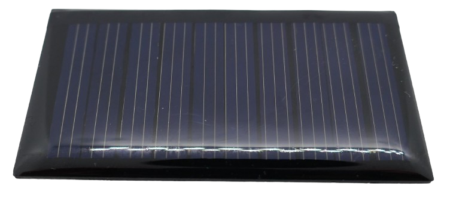
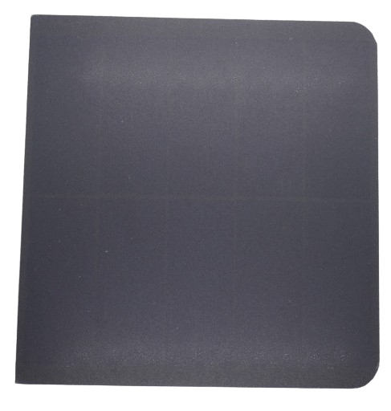
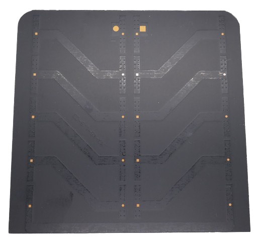
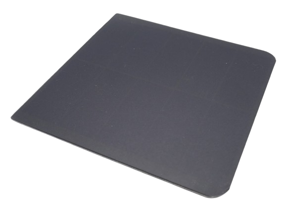
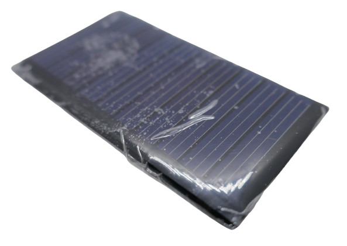

# Solar Panels

> Turning Sunlight Into Electric Current

*Solar panels* (also known as *photovoltaic modules*, which convert light into electrical power) consist of thin layers of either *polycrystalline* or *monocrystalline* silicon.

## Overview
Solar panels come in a wide variety of sizes and shapes, each designed to produce a specific *voltage* under full sunlight. The market offers a range of panels with *different maximum voltages* suited for various needs. For *DIY projects*, common panel voltages include *3V*, *6V*, *9V*, *12V*, and *24V*. In larger systems, designed to power entire households, *18V panels* are frequently used.

In reality, solar panels are designed to produce voltages in multiples of the base cell voltage of *0.5V*. This is because *all solar panels*, regardless of size, shape, or voltage rating, use the *same fundamental solar cells*, each generating about *0.5V* in direct sunlight. These cells, which only produce small currents individually, are typically arranged in patterns visible across the surface of the panel.

### Material and Efficiency
Solar cells are made from silicon, a semiconductor material, and are manufactured in two main types:

* **Polycrystalline:** lower-cost, slightly less efficient
* **Monocrystalline:** higher-cost, more efficient

#### Efficiency Comparison Table

| Temperature (°C) | Polycrystalline Efficiency | Monocrystalline Efficiency |
|------------------|---------------------------|----------------------------|
| -10              | ~17.5% - 20.5%            | ~20% - 23%                 |
| 0                | ~16.5% - 19.5%            | ~19% - 22%                 |
| 10               | ~15.5% - 18.5%            | ~18% - 21%                 |
| 20               | ~14.5% - 17.5%            | ~17% - 20%                 |
| 30               | ~13.5% - 16.5%            | ~16% - 19%                 |
| 40               | ~12.5% - 15.5%            | ~15% - 18%                 |

> [!TIP]
> When planning a solar system, consider your *available space*: if space isn’t a limiting factor, *cheaper but less efficient polycrystalline panels* might be preferable. Though they are less efficient than monocrystalline panels, you can offset this by adding additional polycrystalline panels at the same cost.

### Identifying Fake Offers
Solar panels are now very affordable, but comparing options can be challenging due to exaggerated claims by some vendors. You may come across *300W* panels at suspiciously low prices or sizes that seem too small for their rating. However, *physics* sets firm limitations on energy output. Here’s a quick *plausibility check* to ensure you’re getting the right value:

* **Material Consistency:** While there are minor variations, all panels use similar silicon material, producing between *0.015-0.023W/cm²* (based on area).
* **Constant Sunlight Input:** Sunlight delivers around *1kW/m²* (*1000W/m²*) on a clear day at solar noon in the summer, or *0.1W/cm²*.
* **Efficiency Limits:** No panel can exceed typical efficiency rates of *15-23%*, despite what some sellers might claim. This translates to *0.015-0.023W/cm²*.

### Example Calculation
To estimate realistic wattage for a panel, use this formula based on the *active solar panel area* (the area within the aluminum frames):

**Area** x **Solar Input** x **Efficiency** = **Watts**

Suppose a vendor sells a *monocrystalline panel* with dimensions *90x50cm*. Based on the table above, we can assume an approximate conversion efficiency of *20%* at *20°C*. With an area of *90x50cm = 4500cm²*:

**4500cm²** x *0.1W/cm²* x **20%** = **90W**

If a vendor claims *300W* for this panel, you can be fairly certain that’s an unrealistic figure.

  
Some More Example Calculations For Small DIY Solar Panels

### Small DIY Panels: Testing Vendor Claims

The same approach applies to small DIY panels. For example, let's examine these *polycrystalline* mini solar panels with a size of *53x30mm*:

#### Test 1: Polycrystalline Panels

The vendor claims these cells produce a current of *30mA* at *5V* (*0.03A x 5V = 0.15W*). With a surface area of *5.3cm x 3cm = 16cm²*, and an assumed *polycrystalline* efficiency of about *15%*, we can do a plausibility check to see if this makes sense:

*Area* x *Solar Input* x *Efficiency* = *Watts*

So:

*16cm²* x *0.1W/cm²* x *15%* = *0.24W*

Surprisingly, this is *higher than* the vendor’s claimed *0.15W* output.

#### Identifying the Active Area

This unexpected result underscores the importance of checking the *active area*: although the total size of the panel is *5.3cm x 3cm*, the actual light-converting area is smaller—*4.5cm x 2.3cm*, or *10cm²*.

With the corrected active area, let’s redo the calculation:

*10cm²* x *0.1W/cm²* x *15%* = *0.15W*

Now, we get *0.15W*, matching the vendor’s specification.

#### Test 2: Monocrystalline Panels

*Monocrystalline* panels, known for higher efficiency (up to *23%*), typically cost more. Let’s apply the same check to a larger *monocrystalline* panel:

The vendor states this panel delivers *3W* at *5V*, with a panel size of *12.1cm x 12.5cm*. Upon closer inspection, we note an *inactive rim* of *6.4mm* on each side:

This reduces the active width from *12.5cm* by *2 x 0.64cm* to *11.2cm*, giving an active area of *12.1cm x 11.2cm*, or *135.5cm²*.

#### Plausibility Check

Using a *23%* efficiency (as expected for *monocrystalline* panels), we calculate:

*135.5cm²* x *0.1W/cm²* x *23%* = *3.11W*

This calculation aligns with the vendor's claim, meaning this panel passes the plausibility check.

> [!NOTE]
> Achieving the full calculated energy output in practice depends on many factors, including sunlight conditions and panel quality. However, this plausibility check helps flag impossible specifications, such as a "200W panel" sold for under EUR 10.00 with a 20x20cm size. Only practical testing can confirm if a panel meets its claimed *efficiency*.

# Solar Panel Construction

Large solar panels are made up of multiple basic solar cells. The size of the solar panel determines how many of these fundamental cells are combined. The method of internal connection affects the panel's voltage:

* **Parallel:** The voltage remains constant while the current doubles.
* **Series:** The current remains constant while the voltage doubles.

This connection scheme explains why solar panel voltages are typically multiples of *0.5V*:

* **DIY Solar Cells:** In small DIY projects, solar panels often operate at *6V*. To achieve this voltage, they must consist of at least *12 solar cells* connected in series. Larger solar panels with greater power outputs can connect multiple strings of 12 cells in parallel, which increases the current.
* **Household Systems:** On a larger scale, solar panels commonly have a voltage of *18V*, which typically requires *36 solar cells* in a series connection.

## How Sunshine Turns Into Electricity

*Solar cells* are usually made of *silicon*, a semiconductor. When photons strike the surface, they dislodge electrons, creating a flow of electric charge. 

Without additional measures, these dislodged electrons would move randomly, failing to generate a usable current. However, through specific treatments, *solar panels* ensure that these electrons flow in a *unidirectional* manner, producing a usable electrical *current*.

## Serial and Parallel Connections

You don't have to purchase solar panels that match your exact voltage requirements. By combining multiple panels, you can create customized systems that tailor voltage and current to your specific needs. Essentially, you're continuing the internal design process of solar panels, which already consist of solar cells connected in series and parallel.

By linking solar panels in series and/or in parallel, you can optimize your system accordingly.

> [!IMPORTANT]
> Solar panels are constructed from multiple identical solar cells, meaning they have the **same voltage and current**. These cells can be connected in series and/or in parallel, and the same principle applies to larger panels: as long as all panels are of the same size and type (i.e., same voltage and current), they can be freely combined. However, when mixing *different* panels, you must be cautious to avoid damaging them.

* **Serial Connection:** Use this method for solar panels with **the same wattage**. You can connect a *12V 100W* panel with an *18V 100W* panel. The total voltage will add up to *30V* at *100W*. If the wattages differ, the current is limited to that of the *weakest panel*, causing excess wattage to be wasted and potentially damaging the more powerful panel due to heat and hot spots. Serial strings are also sensitive to *shading*: if one panel is shaded, the entire string behaves as if a lower wattage panel is connected, reducing the current for all panels in that string.
* **Parallel Connection:** This method is suitable for solar panels with **the same voltage**. You can connect an *18V 100W* panel and an *18V 300W* panel. In this case, the currents will add up to deliver *18V at 400W*. If the voltages differ, the overall voltage will be limited to that of the *weakest panel*, and reverse current may flow through other panels, significantly reducing efficiency and potentially damaging them over time. Parallel connections are unaffected by shading: if one panel is shaded, it does not affect the others.

### Ideal Solar Panel Voltage

Ideally, the voltage of a solar panel should be only slightly higher than the voltage you need (or the voltage required for charging a battery). For a *12V system* using *12V batteries*, *18V* solar panels may seem like a suitable choice.

However, this assumption relies on the solar panels being in bright sunlight, which is not always the case. On cloudy days, an *18V solar panel* may output only *7V*—too low for effective battery charging.

To maintain flexibility and maximize energy capture even on cloudy days, consider using solar panels with higher voltages or, more commonly, connect standard solar panels in series. Connecting three *18V panels* provides *54V in bright sunlight* and still yields *21V on very cloudy days*, both of which are sufficiently above the required charging voltage.

### Solar Controller

In the dedicated section on the *solar controller*, we will explore how using solar panels in series with a higher voltage can be advantageous **if you choose an appropriate solar charge controller**:

* **Cheap PWM Charge Controller:** These devices function similarly to *LDO voltage regulators*, converting excess voltage into *heat*. They work best when the incoming voltage from your solar panels is close to the battery charging voltage. Therefore, in budget-friendly *12V systems* with *PWM controllers*, **do not connect panels in series**.
* **Professional MPPT Charge Controller:** These controllers are **significantly more expensive** and operate like *efficient buck converters*. When the incoming voltage is excessively high, they convert it to lower voltages without wasting energy. Additionally, *MPPT* (Maximum Power Point Tracking) technology allows the controller to adjust the duty cycle, ensuring that the solar panel voltage remains at its most efficient point, maximizing energy extraction. When using an *MPPT controller*, connect multiple panels in series to feed higher voltages, such as *36V* (2S) or *54V* (3S). This configuration allows solar panels to deliver adequate voltages for battery charging, even on cloudy days.

## Budget Recommendation

Your available *space* is crucial in determining the best value for your investment.

* **Space is King:** The most important factor is the *overall surface area* available for harvesting sunlight. If you have sufficient space, investing your budget in solar panels is always the best approach.
* **Expensive Tech is Auxiliary:** Enhancing panel efficiency by purchasing more effective but *considerably more expensive* modules and charge controllers should only be considered when space is limited, preventing you from installing enough solar panels.

Here are some calculations that illustrate the significance of space and the costs associated with *reducing space requirements*:

For example, you can reduce *10 cm²* of space to *6.5 cm²* by switching from a *polycrystalline panel* to a *monocrystalline panel*. A *polycrystalline panel* has a *15%* efficiency (yielding *0.015 W/cm²*), while a *monocrystalline panel* boasts a *23%* efficiency (yielding *0.023 W/cm²*). 

Now let's calculate the *cost per watt* for both types of panels:

* **Small, cheap, less efficient:** These panels were purchased in a *10-pack* for a total of *EUR 2.38*. Each panel cost *EUR 0.24* and yielded *0.15 W*, resulting in a cost of *EUR 0.24 divided by 0.15 W = EUR 1.60/W*.
* **Larger, more expensive, more efficient:** These panels were bought in a *5-pack* for a total of *EUR 14.99*. Each panel cost *EUR 3.00* and produced *3 W*, resulting in a cost of *EUR 3.00 divided by 3 W = EUR 1.00/W*.

When choosing between the two panel types, the *cost per watt* calculation favors the larger, more expensive *monocrystalline* panel, which provides the same energy at a *37.5% lower cost*.

### Final Thoughts

A few practical considerations:

#### No Covers Please

Many small *DIY solar panels* come protected with a thin plastic cover. Ensure you remove this before use and avoid placing anything between the solar panel surface and sunlight (e.g., plexiglass covers).

*Solar energy* can be *very powerful* when it directly reaches the *solar panel*. Most materials, even those that appear *transparent* to the human eye, filter out a significant portion of the energetic light spectrum, which can drastically reduce solar panel efficiency.

#### Solar Panels Inside The House

Using *solar panels* indoors is ineffective. Only *natural sunlight* can provide the energy necessary for generating significant currents.

Interestingly, solar panels can perform surprisingly well outdoors, even on cloudy days. However, they are ineffective indoors under artificial light.

> [!NOTE]
> This highlights how efficient artificial light sources have become: they emit light primarily in the *visible* spectrum, filtering out *infrared* and *ultraviolet* ranges that, while invisible to the human eye, carry the most energy for solar panels. Consequently, it is always *dark* for solar panels indoors.

> Tags: Solar Panel, Silicon, Monocrystalline, Polycrystalline, MPPT,

[Visit Page on Website](https://done.land/components/power/solar/solarpanels?150501051702244054) - created 2024-05-01 - last edited 2024-10-26
