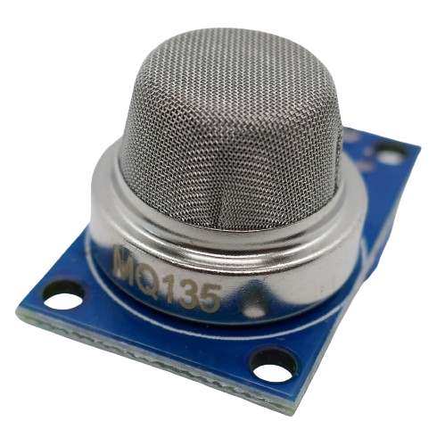
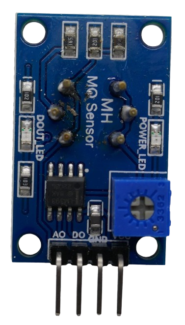

 
# MQ-135 Air Quality

> Roughly Evaluate Air Quality

*MQ-135* is an *air quality* sensor in *MOS technology* and detects a wide range of substances such as *ammoina*, *sulfide*, *benzene*, *smoke*, and other gases.

> [!IMPORTANT]
> One especially important gas to evaluate *air quality* is **not** detected: CO2. Even though the datasheet claims that *CO2* is part of the detected gases, this sensor type can only *indirectly* detect it, and *sensitivity towards CO2* does not seem to be particularly high.

## Overview
*MQ-135* is an *analog* sensor that returns a *voltage reading* representing the *overall gas concentration* of **all** detectable gases.

| Parameter | Value |
| --- | --- |
| Voltage | 5V |
| Heater Current | <950mW |
| Sensitivity (ppm) | ammonia 10-300, benzene 10-1000, ethanol 10-300 |
| Preheat Time | >24h |
| Gas sensing | SnO2 |

### Pins
The raw sensor has six pins:

| Pin | Description |
| --- | --- |
| H/H | apply *5V AC or DC* |
| AA/BB | apply up to *24V DC* in series with a load resistor, and measure *voltage drop* |

Typically, the sensor is mounted on a breakout board with these pins:

| Pin | Description |
| --- | --- |
| AO | analog out: measured sensor voltage |
| DO | digital out: *high* when threshold is exceeded |
| GND | Ground |
| VCC | 5V |

The *threshold* for the *digital output* (*DO*) can be set with a *potentiometer*.

## Materials

[MQ-135 Datasheet](materials/mq135_datasheet.pdf)

> Tags: MQ-135, Air Quality