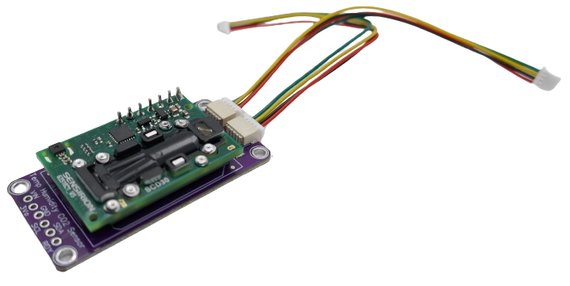
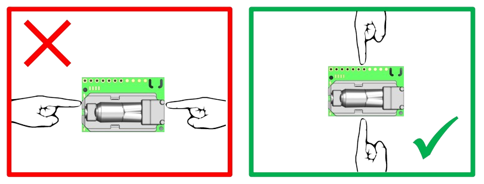
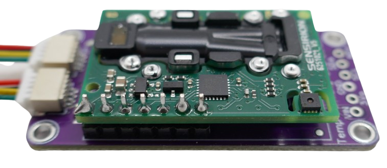
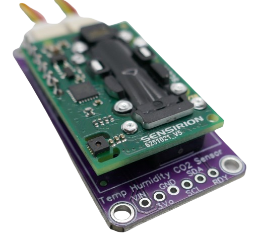
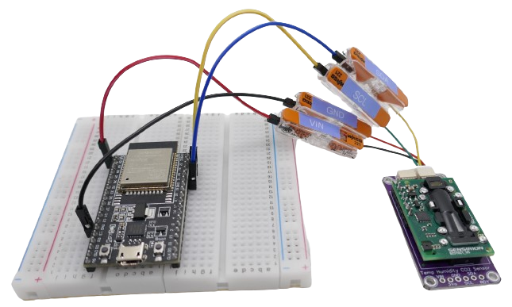

 
# Sensirion SCD30

> Swiss I2C NDIS Sensor For CO2, Temperature And Humidity

The SCD30 is a *digital carbon dioxide* (*CO2*), *temperature*, and *humidity sensor* module developed by *Sensirion*, a Swiss sensor manufacturer. 



It provides accurate and reliable measurements of *CO2 concentration*, *temperature*, and *humidity* in indoor air quality monitoring, HVAC systems, and greenhouse monitoring.

It can be interfaced using *I2C* or *Modbus*. A third option - *PWM* for CO2 concentration output - is experimental and may not be functioning yet.

> [!TIP]
> Price variations are huge with this sensor. You can get it from local vendors for as much as EUR 90 (per piece), and from Asian sources for less than EUR 20 (including a base shield with voltage regulator).    

## Important Precautions
This is a **highly sensitive precision device**. Improper [handling](materials/scd30_precautions.pdf) may damage the device or ruin its factory calibration:


* Never *touch* or *apply force* to the *optical cell* (the black part on top of the green PCB).   
* Always touch the sensor module on the **long side only**. Avoid contact with the metallized parts of the optical cavity *at all times*.





* Never expose the sensor to *dust*, *grease*, or *dirt*.   
* This sensor is *ESD sensitive*: wear grounding strips
* [Position](materials/scd30_designguide.pdf) the sensor board correctly in your sensor housing: use suffiencient *openings* in proximity to the inlets of the sensor module.   


> [!TIP]
> While *electrostatic sparks* can *permanently destroy* the device, touching the wrong parts (or a rough postal delivery) typically "only" void the *factory calibration* of the device, leading to wrong measurement results. A *user calibration* is recommended before you start using the sensor in production.   


## Overview
The [SCD30](https://sensirion.com/products/catalog/SCD30) sensor module uses *non-dispersive infrared* (*NDIR*) technology to directly and specifically measure CO2 levels.

Since this technology is complex, the board is fairly expensive. Price ranges vary (EUR 90 - EUR 20, depending on source). Using the sensor is simple and straight-forward thanks to its *I2C* interface.

|  Parameter  | Value |
| --- | --- |
| Interfaces | UART, I2C |
| DC supply voltage | 3.3-5V |
| Average Current | 19mA |
| max Current during measurement | 75mA |
| I2C Input High | 1.75 - 3V |
| I2C Input Low | -0.3 - 0.9V |
| Modbus Input High | 1.75 - 5.5V |
| Modbus Input Low | -0.3 - 0.9V |
| Output High | 2.4V |
| Output Low | 0.4V |
| Sensor lifetime | 15 years |
| Operating Conditions | <95%RH, <50C |
| Size | 35x23x7mm |
| Weight | 3.4g |


| CO2 Sensor  | Value |
| --- | --- |
| Range | 0-40.000ppm |
| Accuracy | +- 30ppm + 3% |
| Temperature Stability | +-2.5ppm/C |
| Response Time | 20s |
| Operating Conditions | 0-50C |

| Humidity Sensor | Value |
| --- | --- |
| Range | 0-100% |
| Accuracy | +-2% |
| Response Time | 8s |

| Temperature Sensor | Value |
| --- | --- |
| Range | -40 - +70C |
| Accuracy | +-0.3C |
| Response Time | >2s |

### Pins
The *SCD30 sensor module* can be used via its *seven* pins directly. It has *seven* pins. The pin-out is (from *left* to *right* as depicted):



| Pin Number | Label | Description |
| --- | --- | --- |
| 1 | VDD | Supply voltage |
| 2 | GND | Ground |
| 3 | TX/SCL | Transmission line Modbus/I2C clock |
| 4 | RX/SDA | Receive line Modbus/I2C Data |
| 5 | RDY | Data ready pin, *high* when data is ready to be read |
|6 | PWM | PWM output of CO2 concentration (may not be functional) |
| 7 | SEL | Interface select: connect to *VDD* for *Modbus*, floating or *GND* for *I2C* |


## Base Shield
There is a *separate base shield* available that is strongly recommended:

* **Voltage Regulator & Level Shifters:** the base shield makes sure all voltages are translated to *safe levels*. While the *raw sensor module* does accept operating voltages from *3.3-5.5V*, its *I2C* interface is limited to *strictly 3V*.
* **Safe Handling:** the *sensor module* is highly sensitive. Touching it directly can damage it. The *base shield* is larger and can be handled easily without directly touching the sensor module.
* **Stemma Connectors:** the base board comes with solder pins plus *two Stemma QT/Qwiick/JST 1.0* connectors. This makes it easy to connect the sensor (and daisy-chain it with other *I2C* components like a *display*) without soldering.


The picture shows the (smaller green) *sensor board* on top, and the (larger pink) *shield board* underneath it. Both are connected via *seven pins*. The *voltage regulator* chip is covered by the mounted *sensor board*


Companies like *Adafruit* sell [kits](https://www.adafruit.com/product/4867) with *sensor* and *base shield* for around 60 EUR. The combo is available from Asian sources for 20 EUR.


### Base Shield Connections
The *base shield* exposes the *I2C interface only*. If you want to communicate via *Modbus* or read the *PWM* output, you need to directly interface with the *sensor module pins*.

#### Solder Pins...
To connect the base shield with your microcontroller, you can either use the labeled solder pins:




| Pin | Label | Description |
| --- | --- | --- |
| 1 | VIN | 3-5V |
| 2 | 3Vo | 3.3V *output* from internal voltage regulator |
| 3 | GND | Ground |
| 4 | SCL | I2C |
| 5 | SDA | I2C |
| 6 | RDY | *High* when data is ready to be read |


#### ...or Stemma QT / Qwiick / 1.0 JST
Or you use one of the two 4-wire *QWIICK* (*Stemma QT*) connectors.

> [!TIP]
> *Qwiick* and *Stemma QT* are just brand names for the same thing: a *JST 1.0 4-wire connector*. You can get cables with  these connectors from various sources for cheap. Note that the kits sold from Asian sources typically do not include these cables.     


> [!CAUTION]
> Generic *JST 1.0 4-wire connectors* use *random colors*, and colors may vary within a purchased batch. It's strongly recommended that you carefully verify pin assignment and label your connections correctly.    


*Stemma QT*/*Qwiick* connectors use this pin assignment (looking at the connector from the plug perspective, from *left* to *right*, see also labels in picture above):

| Pin | Description |
| 1 | GND: Ground |
| 2 | VDD: microcontroller voltage |
| 3 | SDA: I2C |
| 4 | SCL: I2C |


> [!IMPORTANT]
> When you use the *base shield*, *VDD* is your *logic level (microcontroller) voltage*. Supply *5V* for *Arduino* and *3.3V* for *ESP32*. This way, the *base shield* automatically uses the correct I/O voltage for your *I2C* bus.     


## Test Code

To test the sensor, first setup the hardware, then upload the sample sketch below.

### Hardware Setup

Connect *SDA* and *SCL* to the appropriate *I2C* pins of your microcontroller. *ESP32* typically use *GPIO21* for *SDA*, and *GPIO22* for *SCL*.


Next, connect *GND* to one of the microcontroller *GND* pins, and for *VDD* use your *logic level voltage* (the voltage your microcontroller is using), i.e. connect it to pin *3V3* on *ESP32*, and pin *5V* on *Arduino*.





### Code
There are a number of libraries available for this sensor. The example below uses *SparkFun_SCD30_Arduino_Library* which works both for *Arduino* and *ESP32*:

````c++
#include <Wire.h>
#include "SparkFun_SCD30_Arduino_Library.h" 
SCD30 airSensor;

void setup()  
{
  Wire.begin();          // start I2C
  Serial.begin(9600);    // start serial terminal
  airSensor.begin();     // initialize sensor
}

void loop()  
{
  if (airSensor.dataAvailable()) 
  {
    // return CO2 in ppm (parts per million)
    Serial.print("CO2 (ppm): ");
    Serial.print(airSensor.getCO2());

    // return temperature
    Serial.print(", Temp (C): ");
    Serial.print(airSensor.getTemperature(), 1); 

    // return humidity
    Serial.print(", Humidity (%): ");
    Serial.print(airSensor.getHumidity(), 1); 

    Serial.println();
  }

  // wait for 2 seconds until measuring again:
  delay(2000); 
}
````


### Materials

[Summary Information](materials/scd30_flyer.pdf)    
[Handling Precautions](materials/scd30_precautions.pdf)
[General Handling](materials/scd30_handling.pdf)   
[Datasheet](materials/scd30_datasheet.pdf)    
[Interface Description](materials/scd30_interface.pdf)   
[Field Calibration](materials/scd30_fieldcalibration.pdf)   
[Design Guide](materials/scd30_designguide.pdf)   
[Low Power Mode](materials/scd30_lowpowermode.pdf)   
[Adafruit Example](https://learn.adafruit.com/adafruit-scd30/arduino)    
[Manufacturer SourceCode](https://sensirion.com/resource/software/code/scd30)    
[Calibration Certification](https://sensirion.com/resource/certificate/scd30)   


> Tags: CO2, Sensor, Sensirion, SCD30

[Visit Page on Website](https://done.land/components/sensor/airquality/scd30?691722061105240606) - created 2024-06-04 - last edited 2024-06-05
