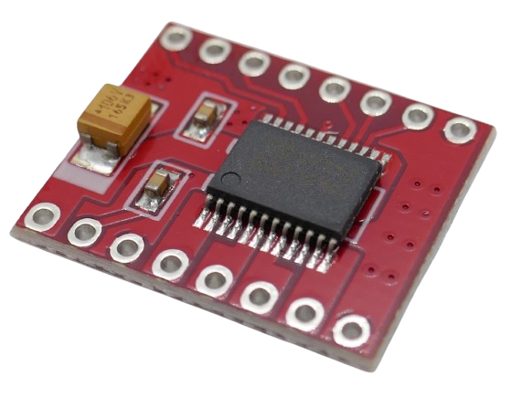

 
# DC Motor Control

> Control Speed And Direction Of DC Motors

*DC Motor Control* chips (and breakout boards) contain logic to control a *DC Motor*:

* **Speed:** Many chips support *PWM* (*pulse width modulation*) or can be controlled by an external *PWM signal* to control the speed of the motor.
* **Reverse Polarity:** They contain transistor circuitry to *reverse the voltage* in order to control the *direction* in which the motor spins

Since most motors require high currents, these chips are typically capable of handling considerable currents. 

Their functionality is not just useful for motors. These chips can in fact be used in a variety of scenarios:

* **LED Dimming:** the *PWM* functionality can be used to dim *led light installations*. 
* **High Load Switching:** If the chips support an external *PWM* signal, they can be used to *switch high loads* with a *GPIO*. This is especially useful since dedicated *MOSFet boards* typically used for switching high loads often do not work efficiently with *3.3V control voltages* and get hot or do not work, whereas many *3.3V motor control chips* are available
* **Reverse Polarity:** Reversing polarity or acting as a *change-over switch* can be useful in a wealth of scenarios, including operating *bi-polar signal LEDs* (that emit different colors based on their polarity). However, one caveat here is that most *motor control chips* require complimentary logic levels on *two* pins to reverse voltage, so if you wanted to control polarity from one *GPIO*, you would need to add a simple *logic inverter*, i.e. by using a *CD4011* or *CD4093*.

> Tags: Reverse Polarity, Switch, MOSFet, PWM, Dimming

[Visit Page on Website](https://done.land/components/signalprocessing/dcmotorcontrol?233516080828245939) - created 2024-08-27 - last edited 2024-08-27
