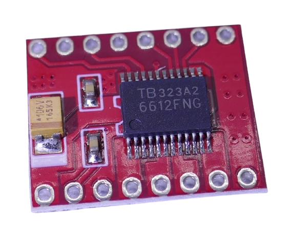

 
# TB6612

> Dual Driver IC For DC Motor

*TB6612* is a dual driver IC for DC motors from *Toshiba*. It comes in a *SSOP* package and is available as a *DIY-friendly* breakout board.

> [!IMPORTANT]
> Since this chip has a *MOS structure*, it is sensitive to electrostatic discharge. Make sure you ground yourself before handling it.

## Technical Specs

| Spec | Description |
| --- | --- |
| Supply Voltage | 2.7-5.5V |
| Supply Current | 1.1-2.2mA |
| Motor Output Voltage | 2.5-13.4V |
| Output Current | 1A (0.4A below 4.5V) |
| Output Peak Current | 2A/20ms at 20% duty cycle, 3.2A/10ms single pulse |
| Response Speed | 24-41ns |
| PWM Frequency | 100kHz |
| Shoot-Through Protection | high to low 50ns, low to high 230ns |
| Low Voltage Detection | 1.9V (2.2V recovery) |
| Thermal shutdown | 175C (20C hysteresis) |

### Notes

*TB6612* can be used with *3.3V* and *5V* microcontrollers. *GPIOs* can directly control the two motor control circuits.

The chip can switch loads of up to 1A at voltages between *4.5-13.4V*, and up to *0.4A* at voltages between *2.5-<4.5V*. The chip by itself has a power dissipation of *0.78W*.

### Shoot-Through Protection
With any semiconductor-based *change-over switch*, it is important to prevent *shoot-through* situations that occur when for a short time, both MOSFet conduct, effectively producing a short circuit.

The *TB6612* uses *delays* to prevent this: when switching *mode pins* from *high* to *low*, there is a *50ns* delay, and when switching from *low* to *high*, there is a *230ns* delay.

> [!NOTE]
> Note that these delays apply to *mode changes only*, i.e. when switching the motor control from clockwise to counter-clockwise direction. These delays do not apply to *high* and *low* levels at the motor output pins (and thus do not apply for *PWM* operation).

## Modes
The *TB6612* supports six different *modes* that are controlled by the motor control pins:

| Mode | AIN1 | AIN2 | BIN1 | BIN2 |
| --- | --- | --- | --- | --- |
| Forward (Motor A) | *high* | *low* | | |
| Forward (Motor B) | | | *high* | *low* |
| Reverse (Motor A) | *low* | *high* | | |
| Reverse (Motor B) | | | *low* | *high* |
| Active Brake (Motor A) | *high* | *high* | | |
| Active Brake (Motor B) | | | *high*|*high* |
| Passive Stop (Motor A) | *low* | *low* | | |
| Passive Stop (Motor B) | | | *low* | *low* | 

In addition, the *speed* can be controlled via a *PWM* signal.    

When the *STBY* pin is *low*, the driver enters a *low-power state*, and both motors receive no current.

## Materials

[Data Sheet](materials/tb6612fng_datasheet.PDF)

> Tags: Motor Control, Reverse Polarity

[Visit Page on Website](https://done.land/components/signalprocessing/dcmotorcontrol/tb6612?394534080828245939) - created 2024-08-27 - last edited 2024-08-27
