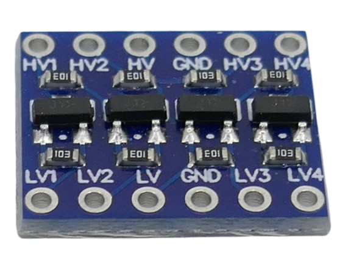
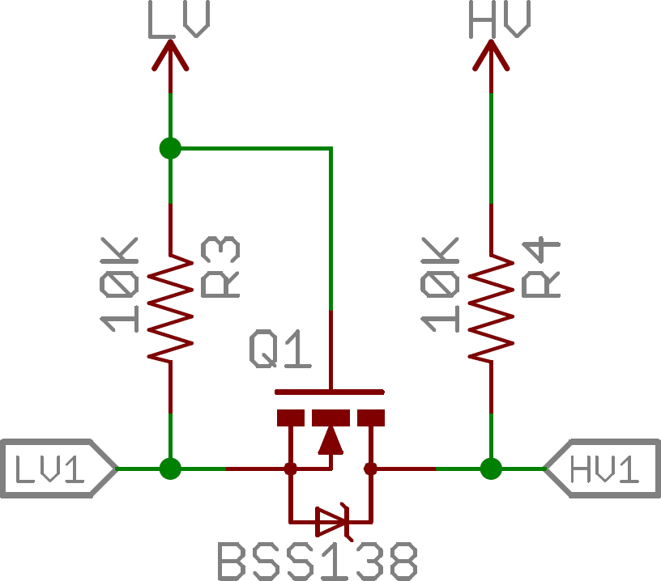

 
# BSS138 Discrete MOSFET Level Shifter

> **Bidirectional 4-Channel Level Shifter for I²C and One-Wire**

BSS138-based 4-channel shifter boards are valued for their **simplicity**, *low cost*, and plug-and-play **bidirectional open-drain compatibility**, especially for I²C and other low- to medium-speed logic buses.

## Typical Applications

These modules are commonly used for:

- I²C and SMBus communications up to *400kHz*
- 1-Wire devices
- Low- and moderate-speed digital signal level conversion (3.3V ↔ 5V, 1.8V ↔ 3.3V, etc.)
- TTL serial interfacing
- Simple GPIO logic translation

## Not Recommended For

Do **not** use this level shifter for signals faster than *400kHz* or those requiring tight timing (for such cases, use devices like the **TXS0108**):

- SPI (Serial Peripheral Interface)
- UART at high speed
- WLED (programmable LED control)

### WLED / WS2812 LED Strips

Popular addressable LED strips are a use case where selecting the appropriate level shifter is important. When such *5V* strips are controlled by *3.3V* microcontrollers, a level shifter is often needed.

> [!NOTE]
> You can get away with using a less suited level shifter (or none at all) when the wire connection to the strip is short, the ground line is separated, and/or the LED strip itself is short. However, once your setup becomes more extensive, 

General purpose bidirectional shifters (like `TXS0108E`) or MOSFET-driven I2C-oriented shifters (like the one discussed here) present significant reliability and performance problems when used to drive addressable LED data lines. Those level shifters are designed for bidirectional, low-power data lines (like I²C or GPIO), but not for protocols requiring strong, fast, one-way signal edges such as NeoPixel/WS28xx LEDs.

For *WLED*/programmable LED, use level shifters based on chips like `SN74AHCT125/245`, `SN74HCT14/04`, or similar fast, unidirectional logic chips.

## Overview

BSS138-based 4-channel shifter boards use **discrete MOSFETs** and are purposely designed for **open-drain environments** such as I²C and 1-Wire. They typically include **built-in 10kΩ pullup resistors**, making them ideal for I²C up to **400kHz**.

### MOSFET-Driven Logic

While this level shifter uses a BSS138 MOSFET, **it is not intended for high-current switching**. Its role is strictly for logic signal translation, not for driving loads or acting as a MOSFET gate driver.

### Body Diode Effects

The use of a MOSFET produces both beneficial and undesirable effects:

- **Leakage Current:**  
  If only one side of the level shifter is powered, a *leakage current* can flow due to the MOSFET's body diode. For example, powering only the low voltage side (while the high voltage side is off) lets current "leak" from low to high—this could unpredictably raise voltages on the unpowered side.
    - This is only an issue if one side is unpowered. If this is of particular concern, **dedicated level shifter ICs** such as the **TXS0108** (not TXB0108) should be considered.
- **Voltage Crossing Support:**  
  The same body diode effect can actually help in cases where the low side voltage briefly exceeds the high side—such as on dynamically configured open-drain buses like I²C. Unlike IC-based level shifters, the MOSFET's diode allows the protocol to continue working in this edge case, though this is more of an accidental advantage than a guaranteed feature.

## Voltage Range

- **Supported Voltages:**  
  Functions with low-side voltages down to 1.8V and high-side voltages up to 10V, offering broad compatibility.
- **Voltage Crossing:**  
  For typical robust operation, the low side should remain below the high side. However, with open-drain protocols like I²C, *voltage crossing* (where the low side briefly exceeds the high side) is "unofficially" supported thanks to the MOSFET body diode—though this is not part of the standard specification and isn't always reliable.

## Materials

[BSS138 Data Sheet](materials/bss138_datasheet.pdf)

> Tags: BSS138, TXS0108E, TXB0108E, Body Diode, I2C, One-Wire, SMBus, MOSFET, Level Shifter, Pull-up Resistor, UART, SPI

[Visit Page on Website](https://done.land/components/signalprocessing/levelshifter/bss138?282467072021255112) - created 2025-07-20 - last edited 2025-07-20
