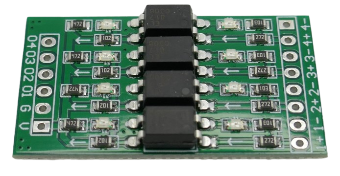
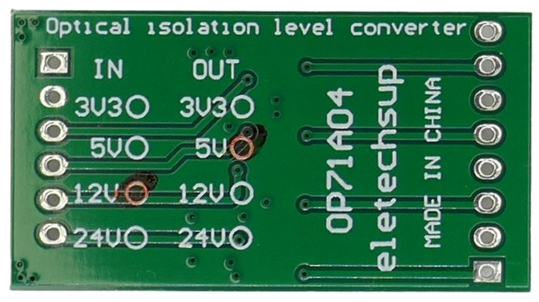
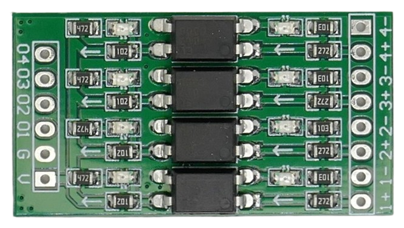
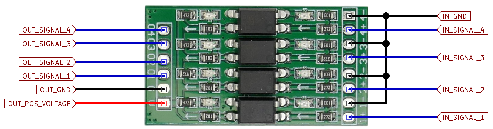
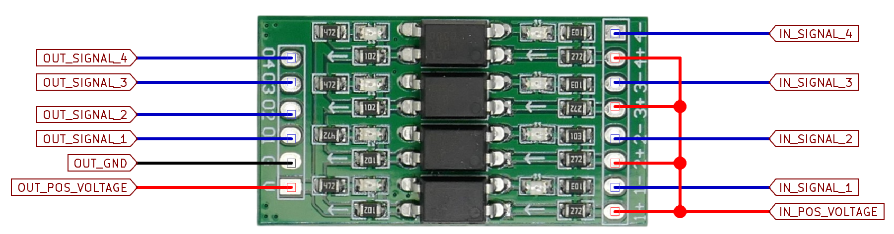
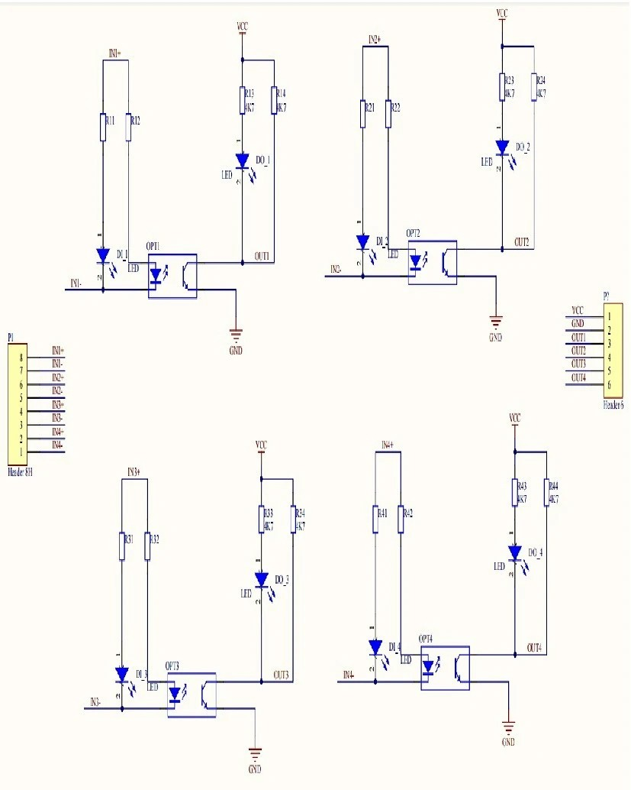

# Eletechsup Level Shifter

> Optical Isolation Level Shifter For Up To 24V

The Chinese company [eletechsup](https://eletechsup.com/) produces a wide range of breakout boards, including the **OP71A04** optically isolated logic level converter.

This board is a **4-channel unidirectional** level shifter based on the **EL817** optocoupler, preconfigured to fixed input and output voltages.

## Overview

This level shifter provides optical isolation between both voltage domains, eliminating any direct electrical connection across them.

This isolation is achieved with optocouplers. Optocouplers switch more slowly than MOSFETs, limiting the maximum signal speed to *10kHz*. Due to this and its **unidirectional** design, this level shifter is not suitable for use with bidirectional and fast interfaces like *I2C*.

The intended application is for **translating individual GPIO states**, similar to [EzSBC L2 and L3](https://done.land/components/signalprocessing/levelshifter/ezsbc/). For most GPIO logic-level translation applications, a maximum signal speed of *10kHz* is fully sufficient.

### Classic Optocouplers...

Classic optocouplers and optocoupler breakout boards are commonly used to isolate voltage domains. However, using them requires additional setup:

* Adding external resistors on the input side to properly drive the optocoupler LEDs at the correct voltage.
* Incorporating output circuitry to convert the optocoupler’s output into a clean, recognizable digital signal.

### ...versus Opto-Isolated Level Shifter Boards

The **OP71A04** is preconfigured at the factory for fixed input and output voltages, providing a plug-and-play experience. 

When ordering the board, you specify your desired input and output voltage; the board then arrives already set up for those levels. Supported voltages include *3.3V, 5V, 12V,* and *24V*.

The board comes with two SMB LEDs per channel to indicate operational status.

## Wiring

The wiring may seem unintuitive at first. Here’s how to connect the board:

### Input

On the input side, four channels are available, each marked as `1+` and `1-`, `2+` and `2-`, and so on. These connect to the optocoupler inputs. The required resistors for your selected input voltage are already pre-installed.

#### High Active vs. Low Active

The input pin design allows for maximum flexibility: you can drive inputs both "high active" and "low active":

* **High Active (Common Cathode):**  
  Connect the GPIO signal to `1+`, and connect `GND` to `1-`.

  

* **Low Active (Common Anode):**  
  Connect the GPIO to `1-`, and connect `VDD` (the logic supply voltage, e.g., `3.3V`) to `1+`.

  

> [!TIP]
> Each channel input operates independently and is connected to its own EL817 optocoupler. If you want to configure individual channels as either high active or low active, avoid using a common rail. Instead, connect each input pin directly according to your desired logic.

### Output

On the output side, connect your positive voltage to `V` and ground to `G`. The board circuitry manages the translation.

Digital signals are available at four output pins, labeled `01` through `04`.

> [!IMPORTANT]
> The output side delivers the raw optocoupler output with a maximum current of 50mA. To drive higher-current loads, add a signal transistor for GPIO or use a MOSFET for significant loads.

## Schematics
From the schematic, it is clear that this board functions as a *pre-configured* optocoupler module:

The resistor values are factory-selected to precisely match the required input and output voltage levels, ensuring optimal performance without additional configuration.

## Conclusions

While you can use any generic optocoupler board, the **OP71A04** simplifies getting started—provided the pre-configured input and output voltages match your application, since these voltages cannot be easily changed later.

### Intuitive Use

Classic optocoupler boards often pose challenges to beginners, i.e. regarding the polarity of the phototransistor output pins. The **OP71A04** addresses this with its more intuitive experience: its design, pre-configured resistors, and clear input/output pin arrangement enable straightforward and user-friendly operation.

### No Screw Terminals — Thank Goodness

An additional **advantage** of this board is that it **does not include pre-soldered screw terminals**. When space is limited, screw terminals can be cumbersome; soldering wires directly to solder pads provides a much more compact, reliable, and secure connection.

Should you actually need screw terminals, you can *add* them much more easily than *de-soldering them* in the reverse case.

### Clever Choice

Considering that the **OP71A04** is competitively priced compared to generic optocoupler boards, I prefer it over the much larger-dimensioned classic optocoupler boards.

## Materials

[EL817 Data Sheet](materials/el817_datasheet.pdf)

> Tags: Unidirectional Level Shifter, Optical Isolation, Optocoupler, GPIO Isolation, Automotive, High Voltage Logic, Car Electronics, OP71A04, EL817, Logic Level Converter, 24V, Breakout Board, Signal Isolation, Everlight, Phototransistor, Industrial Automation

[Visit Page on Website](https://done.land/components/signalprocessing/levelshifter/eletechsup?602587071225255554) - created 2025-07-24 - last edited 2025-07-24
