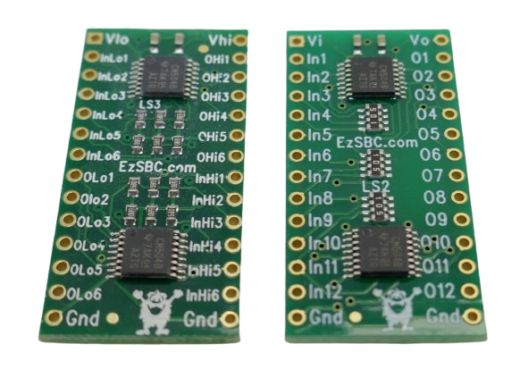
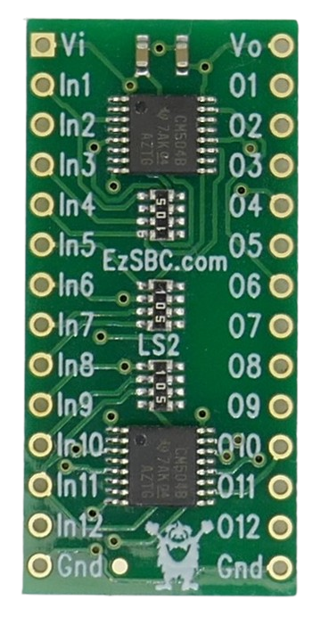
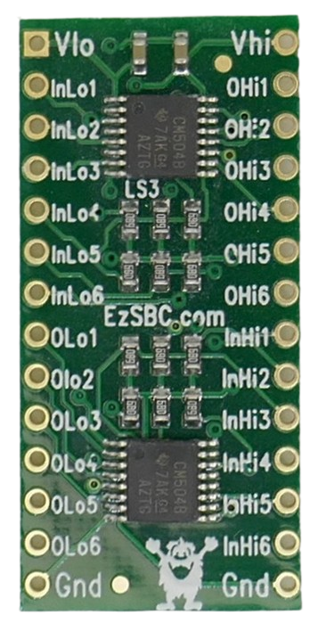

# EzSBC Unidirectional 12V Level Shifters

> Controlling 12V Electronics With 5V Or 3.3V Microcontrollers

The small company [EzSBC](https://ezsbc.shop/search?q=level+shifter) offers specialized **unidirectional** level shifters designed for microcontrollers to interact with systems up to *18V* (e.g., *12V* automotive electronics).

The maker claims this level shifter can ["easily translate a 1MHz signal"](https://news.ezsbc.com/new-level-shifter-buffer/).

## Overview

Most mainstream level shifters support only a limited voltage range, targeting microcontrollers and sensors running below *6V*.

The level shifters discussed here are based on [CD4504B](materials/cd4504b_datasheet.pdf) ICs and support a wide voltage range from *3.3-18V* on both sides. There are no restrictions on which side must have a higher voltage.

### Controlling Up To 18V Systems

*EzSBC*'s level shifters support *3.3-18V* inputs and outputs. Input voltage signals can be **higher or lower** than the output signals (however, *all inputs* must share the same voltage, and *all outputs* must share the same voltage). That is why pins on the board are marked *input* and *output*, not *low* and *high*.

For example:
- If you place the low-voltage microcontroller on the *input* side, it can *send* information to the high-voltage system.
- If you place the high-voltage system on the *input* side instead, the microcontroller can *receive* (read) information from the other system.

### Unidirectional

Communication is one-way (*unidirectional*): one side can always *send* (but not *receive*), and the other side can always *receive* (but never *send*).

### Semi-Bidirectional

If you need to *send* **and** *receive*—such as controlling external systems (*sending* commands) and also verifying their status (*receiving* GPIO state)—you must use *two* level shifters, with your microcontroller on the *input* side of one and the *output* side of the other.

Since this is cumbersome, EzSBC also offers a variant level shifter implementing 2x6 channels: six for inputs, six for outputs.

- **LS2:** 12 unidirectional channels
- **LS3:** 6 channels in one direction, plus 6 channels in the opposite direction

## LS2 – 12 Unidirectional Channels

The original **LS2** level shifter provides 12 channels for unidirectional data transfer between voltage domains:

| Pin         | Description                                    |
| ----------- | ---------------------------------------------- |
| `Vi`        | Positive voltage of input system (3.3-18V)     |
| `Vo`        | Positive voltage of output system (3.3-18V)    |
| `In1`-`In12`| 12 input channels                              |
| `O1`-`O12`  | 12 output channels                             |
| `Gnd`       | Common ground                                  |

The inputs have 500kΩ resistors to ground; unused inputs may be left unconnected. When the input is not driven high, the corresponding output pin will be low. The output swings close to ground and to the configured output voltage.

## LS3 – 2x6 Channels

The **LS3** variant works like **LS2** but offers six *inputs* and six *outputs* per voltage domain:

This board is organized around two voltage domains, labeled "low" and "high" (`Vlo` and `Vhi`). 

Both "low" and "high" support the *3.3-18V* range; either side can be connected to the higher or lower voltage.

| Pin            | Description                                    |
| -------------- | ---------------------------------------------- |
| `Vlo`          | Positive voltage of input system (3.3-18V)     |
| `Vhi`          | Positive voltage of output system (3.3-18V)    |
| `InLo1`-`InLo6`| 6 input channels on "low" voltage domain       |
| `OLo1`-`OLo6`  | 6 output channels on "low" voltage domain      |
| `OHi1`-`OHi6`  | 6 output channels on "high" voltage domain     |
| `InHi1`-`InHi6`| 6 input channels on "high" voltage domain      |
| `Gnd`          | Common ground                                  |

## What About LS1?

Is there also an **LS1** level shifter? Yes, [there was](https://www.tindie.com/products/ddebeer/i2c-bi-directional-level-shifter/). **LS1** was EzSBC's original design: an 8-channel **bidirectional** I2C level shifter, initially sold via *tindie.com*. Its main feature was broad voltage independence, supporting up to *12V*.

This product appears to be discontinued. [More background information](https://news.ezsbc.com/new-level-shifter-buffer/) is available from the original maker.

## How It Works

**LS2** and **LS3** use two CMOS [CD4504B](materials/cd4504b_datasheet.pdf) hex voltage level shifter ICs from Texas Instruments; each chip provides six channels to shift signals between different voltages.

**LS2** uses both chips for the same direction, giving 12 unidirectional channels. **LS3** uses one chip per direction, providing 6 channels in each direction.

According to the official [datasheet](materials/cd4504b_datasheet.pdf), the chip supply voltage is *5-18V*. However, this datasheet dates back to 2004 when *5V* microcontrollers were more typical. Recent discussion in Texas Instruments forums suggests [use at *3.3V* may be possible](https://e2e.ti.com/support/logic-group/logic/f/logic-forum/998473/cd4504b-can-i-use-for-3-3v-to-12v-voltage-shift), although threshold voltages and timing specs are not guaranteed below 5V.

In practice, for slow signal translation, these level shifters usually work fine at voltages even below *5V*, but optimal performance is not guaranteed in all scenarios.

## Materials

[CD4505B Data Sheet](materials/cd4504b_datasheet.pdf)

> Tags: 12V, 18V, EzSBC, Unidirectional Level Shifter, Voltage Level Translator, Car Electronics, Automotive Voltage, High Voltage Logic, CD4504B, LS1, LS2, LS3

[Visit Page on Website](https://done.land/components/signalprocessing/levelshifter/ezsbc?580150071922254412) - created 2025-07-21 - last edited 2025-07-21
