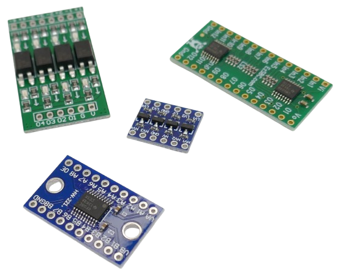
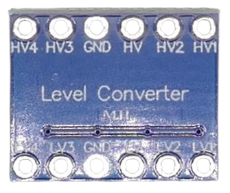
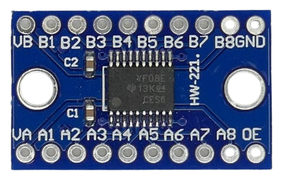
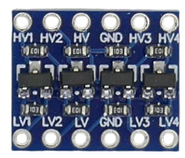
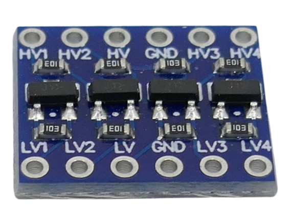

 

# Level Shifter

> Translating Logic Levels Between Different Voltages

Level shifters are electronic circuits used to interface components that operate at different voltage levels. Level shifters safely translate signal voltages from one logic level to another. For example, a microcontroller running at 3.3V needs to communicate with a device that requires 5V logic signals, or vice versa.

## Why Level Shifters Matter

Not all parts of a project may operate at the same voltage. For example, a microcontroller may run on *3.3V* but needs to interface with sensors that require higher (i.e. *5V*) or lower voltages (i.e. *1.6V*). Likewise, when controlling car system components, the voltage level of microcontrollers may need to be translated to *12V* or *24V*.

Directly connecting components with mismatched voltage standards can lead to malfunction, excessive current draw, or even permanent damage to sensitive devices. **Level shifters safely translate digital signals between different voltages.**

## Level Shifters vs. Resistors

Occasionally, hobbyists connect different voltages directly: 

When operating sensors at *5V*, they connect communication wires—e.g. for *I2C* interfaces—directly to a *GPIO* of a *3.3V microcontroller* (e.g. ESP32). 

Often, this seems to work, and even though not officially confirmed, ESP32 GPIOs are supposedly *5V tolerant*. You may get away with this; however, over-voltage on GPIO pins may not lead to immediate failure and in the long run can reduce the lifespan of the microcontroller.

More considerate hobbyists frequently use *resistors* to interface different voltage levels, utilizing the resistor as a simple voltage divider. For signals like analog or one-way digital outputs—where the direction is fixed and speed or reliability demands are modest—resistor dividers can suffice if the load and signal integrity requirements are understood and controlled.

However, resistor dividers have key limitations: they are only suitable for unidirectional voltage lowering, can degrade signal integrity due to loading effects, and do not support bidirectional communication well.

**Dedicated active level shifters** (e.g., transistor- or IC-based) offer better signal integrity, support for bidirectional signals (important in protocols like I2C), and protection for sensitive low-voltage devices.

> [!TIP]
> Often, you can eliminate the problem altogether: many sensors run happily in a wide voltage range (i.e. *3.3-5V*), so there may not be the need for voltage differences in the first place. Try and run sensors with the same microcontroller voltage wherever possible. 

## Level Shifter Types

There are two main types of logic level shifter boards available:

* **Chip-based:**  
  These use a specialized and highly integrated chip (e.g. *TXS0108E*, *TXB0108*, *74LVC245*, etc.).

  

* **Discrete MOSFET-based:**  
  These use dedicated *MOSFET* transistors (*BSS138* and similar).

  

### MOSFET-based Level Shifters

Level shifters with discrete MOSFETs work well for **specific use cases** due to the way they work:

* **Open-Drain/Open-Collector:**    
  Work well for open-drain or open-collector outputs such as *1-Wire* and *I2C*.
* **Bidirectional:**    
  Support bidirectional signals by design.
* **Voltage Crossing:**    
  May work even when `LV` (lower voltage side) is higher than `HV` (higher voltage side) due to the MOSFET *body diode effect*.
* **Low Speed:**    
  Typically work up to *400kHz* which suffices for *I2C* but is too slow for *WLED*.

## Wiring

Level shifters are designed to translate between two systems with **stable** (but different) voltages: one side of the level shifter connects to the *higher* voltage (often marked `HV`), whereas the other side connects to the *lower* voltage (often marked `LV`).

Level shifter wiring is simple:

* **LV:** Connected to the lower voltage supply  
* **HV:** Connected to the higher voltage supply 
* **Lx:** Signal line of lower voltage system (where *x* is a channel number) 
* **Hx:** Signal line of higher voltage system (where *x* is a channel number) 
* **`GND`:** Both sides must share a common ground

So to add a level shifter to your project, do this:

* Connect the positive rail of the lower voltage system to `LV`, and the positive rail of the higher voltage system to `HV`.
* Connect `GND` to the ground of both sides: ground needs to be shared across the two systems you want to interface.
* Depending on the number of channels provided by the level shifter, you connect the data lines to `LVx` and `HVx`, respectively, where "x" stands for the channel number.

> [!IMPORTANT]
> With most level shifter types, the lower voltage must always be lower than the higher voltage for guaranteed correct operation of all types.

## Selecting Appropriate Level Shifter

While all level shifters generally translate digital signals between two voltage domains, there are significant differences in **how** they do this, so level shifters should be carefully selected to match a given use case.

### 1-Wire 

*1-Wire* operates with minimal wiring (*one data wire* plus ground) and can often be powered parasitically through the bus line, simplifying installation. It is used to connect *simple sensors* to microcontrollers. 

One popular example use case are [Dallas Temperature Sensors](https://done.land/components/data/sensor/temperature/dallas/).

*1-Wire*...

* ...requires strong pull-down capability, especially across longer cables or capacitive busses. Chip-based level shifters can not always drive or sink enough current for 1-Wire devices.

* ...relies on fast and clean transitions with well-controlled timing. Some chip-based level shifters can cause slow edges, overshoot, or signal reflections, especially with long cables and capacitive loads, common in 1-Wire applications. This can cause bit errors or complete loss of communication

Here are recommended level shifters for *1-Wire*:

| Device / Chip                | Max Speed           | Typ. External Pullups                    | Significant Remarks                                                  |
|------------------------------|---------------------|-----------------------------------|---------------------------------------------------------------------|
| [BSS138 MOSFET (Discrete)](https://done.land/components/signalprocessing/levelshifter/bss138/)     | <100kHz (typical)   | 4.7kΩ–10kΩ | limited speed, low-cost solution, ESD-sensitive |
| MAX3394E                     | ≥400kHz             | 4.7kΩ–10kΩ | ESD protected; designed for 1-Wire; handles capacitive loads well; recommended by Maxim Integrated for 1-Wire. |
| LSF0102                      | Up to 1MHz (typical)| 4.7kΩ–10kΩ| Specifically recommended for 1-Wire; low power; open-drain compatible. |
| PCA9306                      | Up to 1MHz (I²C typical) | 4.7kΩ–10kΩ| Designed for I²C; often used for 1-Wire with correct external pullups. |

### I²C 

*I2C* is a common *two-wire* interface and bus system that is used to connect peripherals with *moderate data rates* to a microcontroller (i.e. sensors, monochrome displays, etc.). 

*I2C* level shifters...

* ...must support **bidirectional open-drain** signals. 
* ...requires to be **pulled up** 

Some level shifters come with built-in pullups while others require external pullups to be added. In any respect, make sure the pullup resistor value matches your requirements (lower resistor values with higher speeds and/or longer cable lengths).

Here is a selection of suitable *I2C Level Shifters:*

| Device Used On Board         | Max Speed                  | Built-In Pullups           | Significant Remarks                                              |
|-----------------------------|----------------------------|----------------------------|------------------------------------------------------------------|
| [BSS138 MOSFET (Discrete)](https://done.land/components/signalprocessing/levelshifter/bss138/)    | ~400kHz (I²C Fast-mode)    | 10kΩ                       | Simple, low-cost; needs correct pullups; ESD sensitive           |
| Pololu 4-Ch (BSS138 board)  | ~400kHz                    | 10kΩ                       | supports voltages of up to *18V*   |
| [TXS0108E](https://done.land/components/signalprocessing/levelshifter/txs0108e/)                    | 1.2Mbps (open-drain)       | 4kΩ                        | Auto direction; good ESD protection; handles open-drain           |
| PCA9306                     | Up to 400kHz (Fast-mode), 1MHz typical | None (external 10kΩ typical) | Explicitly designed for I²C/SMBus; very common on dev boards      |
| LSF0102                     | Up to 1MHz (typical)       | None (external 4.7–10kΩ)   | Specialized translator; TI/NXP recommended for I²C, robust drive  |
| TCA9517A                    | 1MHz (Fast-mode Plus)      | None (external typical)    | I²C buffer/repeater; tolerates heavy capacitive loads; bus recovery |
| NLSX4373                    | Up to 400kHz               | None (external typical)    | Compact IC, used in logic converter modules, robust open-drain support |

### WLED/NeoPixel/WS2812/Addressable LED

When a *5V* LED strips is controlled by *3.3V* microcontroller, a level shifter may be needed: 

Once the cable length to the first LED exceeds a certain threashols (i.e. > *1m*), the stip may start to flicker or show distored colors.

Addressable LED use a special *one-wire* protocol (do not confuse with **1-Wire**). It works **unidirectional** (from microcontroller to LED strip) at speeds of around *800kHz* (no clock line, fixed timing at 1.25μs per bit).

The protocol only requires the controller to actively drive the data line. Each WS2812 chip relays the remaining data downstream passively after latching its own data, but does not pull the line high and low in the active push-pull sense.

In terms of level shifting, the requirements are:

* **Speed:**   
  must support speeds of *800kHz*. Level shifters designed for I²C (open-drain) are usually too slow for WLED and can result in unreliable performance.
* **Current:**    
  Sufficient output current capability (strong drive) is needed to overcome capacitance on longer wires — especially for setups where the controller is more than 15–50cm from the first pixel of the LED strip
* **Clean Edges:**    
  Must support precise, fast edge transitions. It must propagate fast, clean edges to avoid glitches, color misfires, or strip flicker

While you occasionally see reports claiming that *I2C level shifters* work with *WLED*, such reports are often misconceptions: under **ideal circumstances** (short cable and/or strip lengths, no `GND` wire close to `DATA` wire), even sub-optimal level shifters may work.

For best performance, choose a level shifter that is recommended for *WLED signals*:

| Device / Chip    | Max Speed      | Built-In Pullups | Significant Remarks                                   |
|------------------|----------------|------------------|------------------------------------------------------|
| SN74AHCT125N     | >20MHz         | No               | Excellent for addressable LED signal translation; unidirectional buffer/line driver |
| SN74AHCT245      | >20MHz         | No               | Octal bus transceiver with direction control; good for LED data lines needing isolation or buffering |
| SN74HCT14        | >10MHz (typical) | No              | Hex Schmitt-trigger inverter; can be used as a signal conditioner for noisy or slow signals |
| SN74HCT04        | >10MHz (typical) | No              | Hex inverter; used similarly for signal conditioning; may invert LED data and needs additional logic |

### Simple GPIOs
In some projects, *GPIO* state needs to be translated between voltage domains. For example, you may want to control *12V car electronic* via a *3.3V* microcontroller.

* **Resistor May Suffice:**   
  If you need to read a GPIO value from a higher-voltage system, a simple resistor (acting as voltage divider) may suffice. If a lower-voltage system needs to control a GPIO on a higher-voltage system, you must use a level shifter to actively increase the signal voltage.
* **Push-Pull:**    
  GPIO state is typically controlled **actively** by the owner, driving its state actively to `high` or `low`. This is called **push-pull** and differs from **open-drain** (used by *I2C*, *1-Wire*, etc.)
* **Uncritical Timing:**     
  Speed and precise timings in the nano-second realm are not an issue with GPIO state translation.

You can basically use **any** level shifter for this simple scenario, and it is of greater concern to find level shifters that support the intended voltages (if you try and control car electric, etc.) as most typical level shifters are limited to low voltages around *5V*.

#### Caveats When Using I2C-Level Shifters for GPIOs
Any level shifter intended for *I2C* (open drain) bears the intrinsic risk of power waste or failure (overstressing, heat) if **both sides** try and drive the line **differently** at the same time.

In regular *I2C* communications, devices **always pull low**, and pullup resistors keep the line **high by default**. That's why *I2C level shifters* do not need to isolate both sides. 

When such level shifter are used with regular *GPIOs*, then when one side actively pulls the line up, and the other side actively pulls the line low, you essentially end up with a short circuit, limited only by the maximum current the participating GPIOs can sink and source.

This scenario isn't very likely, though, because typically **you control** at least one side; typically you want to either *read* or *set* the state of a GPIO in another voltage domain, so you can easily take precautions to avoid the mentioned scenario.

Still, using a dedicated *push-pull level shifter* adds additional  protection.

| Device / Chip                | Significant Remarks                                                                 | Safe  |
|-----------------------------|------------------------------------------------------------------------------------|-------|
| [BSS138 MOSFET (Discrete)](https://done.land/components/signalprocessing/levelshifter/bss138/)     | Simple; moderate GPIO speeds; common in DIY and commercial modules                 | ❌     |
| Pololu 4-channel board       | Bi-directional; handles 1.5V–18V; discrete MOSFET + pullups, suitable for GPIO, I²C| ❌     |
| BS170 MOSFET (Discrete)      | Similar to BSS138; supports up to 18V; suitable for level shifting and basic control| ❌     |
| CD40109B                     | 4-channel, CMOS; supports 3–18V operation; used in high-voltage GPIO applications  | ✅   |
| [EzSBC LS2/LS3](https://done.land/components/signalprocessing/levelshifter/ezsbc/)  | Unidirectional translation (3.3-18V) | ✅ |
| TXB0108/TXB0104              | Automatic direction sensing; high-speed push-pull signals; low drive capability    | ✅|
| [TXS0108E](https://done.land/components/signalprocessing/levelshifter/txs0108e/)/TXS0102             | Open-drain & push-pull; works for many GPIO applications (shorter lines preferred) | ✅     |
| SN74AHCT125 / SN74AHCT245    | Strong driver; robust, fast, not bidirectional; ideal for 3.3V→5V or 5V→3.3V shifts| ✅    |
| 74HCT14 / 74HCT04            | Hex inverter/Schmitt, signal cleanup; not a translator by itself, but improves edges| ✅    |
| Voltage Divider (Resistors)  | Ultra-simple, very low speed; for basic on/off state logic only                    | ❌     |

### UART 
*UART* (*Universal Asynchronous Receiver/Transmitter*) is the classic **serial interface** found on microcontrollers, many PC and industrial devices. 

It uses minimal wiring (*two wires*). It is a *1:1 communication line* that connects *two devices* (not a bus system).

*UART*...

* uses *two separate lines*, one for *sending* and one for *receiving*, so the communication **per data line** is **unidirectional**: information always flows from `TX` to `RX`.
* is  **actively driving** the `TX` pin, so this is a `push-pull output`. 
* does not require external pull-ups for faster transitions and better signal integrity

Because of this, *UART* requires level shifters **that work differently from I2C or 1-Wire**:

| Device / Chip              | Max Speed                                  | Built-In Pullups            | Significant Remarks                                                |
|----------------------------|--------------------------------------------|-----------------------------|-------------------------------------------------------------------|
| 2N7001T                    | Up to 30MHz+ (config dependent)            | None                        | High speed; good for UART; ESD robustness varies                  |
| [TXS0108E](https://done.land/components/signalprocessing/levelshifter/txs0108e/)                   | 110Mbps                                    | 4kΩ (`high`)/ 40kΩ (`low`)  | commonly used, readily available, and affordable       |
| TXB0108                    | 60Mbps (1:1), 20Mbps (30pF load)           | 50kΩ| sometimes chosen in industrial scenarios, *TXS0108E* is often more affordable and outperforms *TXB0108* though.    |
| SN74LVC2T45                | 420Mbps (1.8V–3.3V), 200Mbps (3.3V–5V)     | None  | Dual-channel, high speed, direction-control pin; robust for fast UARTs |
| 74LVC1T45                  | 420Mbps                                    | None                        | Unidirectional/bidirectional (direction-control pin); high speed; good for fast UARTs |
| TXS0102                    | 24Mbps                                     | 10kΩ  | Dual-channel; handles slower UART up to 8Mbps; open-drain support |

### SPI 

*SPI* is a high-speed bus system designed to connect peripherals with *high data rate* to a microcontroller (i.e. color displays, data drives like *SD cards*). 

It works similar to *UART* in the sense that always just *one* peripheral is active (controlled via its `CS` (chip select) pin), and that the data lines work **unidirectional** with actively controlled `high` and `low`.

Compared to *UART*, **SPI**...

* has very strict timing requirements (clocked, synchronous signals)
* has a much higher data rate and reach 10–50Mbps (sometimes more, especially with SD cards)	

This limits the level shifter selection and excludes i.e. chips like [TXS0108E](https://done.land/components/signalprocessing/levelshifter/txs0108e/) and certainly MOSFETs like [BSS138](https://done.land/components/signalprocessing/levelshifter/bss138/) for their insufficient speed.

Here is a list of commonly used level shifters for SPI:
| Device / Chip             | Max Speed                                  | Built-In Pullups                | Significant Remarks                                                                         |
|---------------------------|--------------------------------------------|---------------------------------|--------------------------------------------------------------------------------------------|
| TX**B**0108                   | 60Mbps (1:1), 20Mbps (30pF load)           | 50kΩ                            | Bidirectional, automatic sensing; optimized for push-pull |
| SN74LVC2T45               | 420Mbps (1.8V–3.3V), 200Mbps (3.3V–5V)     | None                            | Direction-control pin; very robust at SPI speeds |
| 74LVC1T45                 | 420Mbps                                    | None                            | Flexible direction with DIR pin, strong drive capability       |
| SN74LVC8T245              | 420Mbps                                    | None                            | 8-bit, direction-controlled; great for wide SPI buses and multi-signal translation.         |
| TX**B**0104                   | 100Mbps (typ)                              | 50kΩ                            | 4-channel variant of TXB series, push-pull only, ideal for short SPI buses.                |
| 2N7001T                   | 100Mbps                                    | None                            | Unidirectional; robust, simple, ESD rated, works reliably for high-speed SPI.   |

### RS232 

Industrial devices and PC often use a classic 9-pin **RS232** interface. Such interfaces work similar to *UART* however use a voltage range of up to *12V*, and not *TTL levels*.

To communicate, level shifters are needed that shift logic levels between TTL/CMOS (1.8V, 3.3V, 5V) and RS232 voltage domains.

| Device / Chip    | Max Speed         | Built-In Features        | Significant Remarks                                    |
|------------------|-------------------|-------------------------|--------------------------------------------------------|
| MAX232           | 120kbps           | Integrated charge pump, capacitors required | Classic RS232 ↔ TTL; operates at 5V; 2 drivers/receivers; robust and widely available        |
| MAX232A          | 230kbps           | Integrated charge pump, lower cap values   | Improved MAX232; faster, lower power, still needs 5V             |
| MAX3232          | 250kbps           | Integrated charge pump, 3.0–5.5V supply    | Supports 3.3V and 5V logic levels, suitable for modern MCUs; industry standard      |
| MAX3243          | 250kbps           | 8-channel (3 drivers, 5 receivers), ±15kV ESD | Allows full DE-9 pinout, handles flow control lines; supports 3.3–5V operation        |
| MAX233/233A      | 115/230kbps       | Internal charge pumps/capacitors           | Fully integrated (no external capacitors), more compact           |
| SP3232           | 250kbps           | Pin-compatible MAX3232 alternative         | Works at 3.0–5.5V; low power, robust ESD handling             |
| TRS3122E         | 1000kbps          | Low voltage, VL logic reference, ±15kV ESD | Operates at 1.8V–3.3V VL, fast option for specialized/modern MCUs|

## Galvanically Isolated Level Shifters

Conventional level shifters always require a *common ground* between voltage domains, and there is no true galvanic isolation: both voltage domains are electrically connected.

### Why Galvanic Isolation May Matter

While this is no issue for most use cases, there are exceptions where a galvanic isolation is desired:

* **Voltage Crossing:**    
  The lower-voltage side may occasionally exceed the higher-voltage side (as in battery management systems that often run on battery voltage level). In conventional level shifters, `LV` must never exceed `HV`, and the *body diode effect* in MOSFET level shifters is merely a workaround, not a robust and guaranteed solution.
* **Noise:**    
  In audio applications and other signal-sensitive use cases, unwanted noise and distortion may be introduced.
* **Safety:**
  In rare use cases, *leakage current interrupters* may trigger, or you need isolation from dangerously high voltages.

### Optocouplers Are Slow
Simple *optocouplers* can be used to galvanically separate signal lines, however these are typically *slow* and may not work for fast signal lines and interfaces.

### Specialized Level Shifter ICs
That's why *galvanically isolated level shifters* exist, often based on chips like *ISO1540* and *ISO1640*: their voltage domains are completely isolated, so either side can assume any voltage (within range), independently from the other voltage domain.

That's why such level shifters are often used in power management systems that deal with rechargeable batteries that have a wide voltage range which may overlap with the voltage range of a microcontroller.

## Common Pitfalls

- **Do not treat all level shifters the same,** and respect their design differences. Choose a level shifter based on its specs and your use case. 
- **Do not assume ESP32 or similar MCUs are always 5V tolerant.** Check official datasheets, and use a level shifter (or at least a protective resistor).
- **Do not rely on resistor dividers for protocols requiring bidirectionality (like I²C)** or for fast signal edges.
- **When using discrete MOSFET shifters, always assign LV and HV according to the expected voltage ranges** and minimize scenarios where LV > HV.

> Tags: BSS138, TXS0108E, Voltage Crossing, Body Diode Effect, MOSFET Level Shifter, I2C, Logic Level Converter, Voltage Divider, ESD Protection, Bidirectional, UART, SPI, Open-Drain, Pull-Up Resistor, IP5306, LiIon

[Visit Page on Website](https://done.land/components/signalprocessing/levelshifter?519094071721255105) - created 2025-07-20 - last edited 2025-07-22
