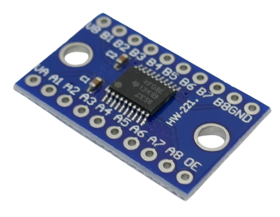
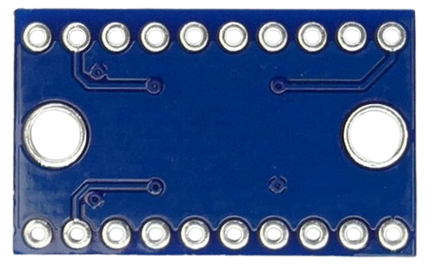
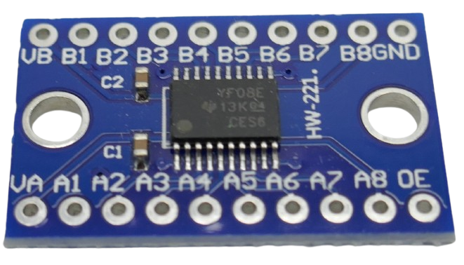
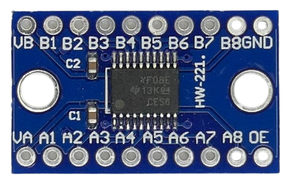

 
# TXS0108E Chip-Based Level Shifter

> **Fast Bidirectional 8-Channel Level Shifter**

*TXS0108E* from Texas Instruments is a popular 8-channel bidirectional level shifter IC, supporting speeds of up to *1.2Mbps* for open-drain protocols (i.e. *I2C*), and *110Mbps* for actively driven push-pull signals (such as *SPI*, *UART*, *WS2812/WLED*, etc.).

> [!IMPORTANT]
> **Do not confuse *TXS0108E*** with similar chips like **TXB0108E**! The latter supports push-pull only and cannot be used for open-drain protocols such as *I2C*.    

## Overview

*TXS0108E* is a fast and robust **general purpose level shifter** that works equally well with open-drain protocols (i.e. *I2C*) and push-pull (i.e. *SPI*, *UART*). It is *directionless* (bidirectional), so it translates signals from either side.

The low voltage side can be in the range of *1.4-3.6V*, and the high voltage side supports *1.65-5.5V*. Both sides must share the same ground, and the low voltage side **must never be higher** than the high voltage side (*LV <= HV*).

*TXS0108E* is not a good choice for *WLED*/*WS2812*/programmable LED projects. For this, use level shifters based on chips like `SN74AHCT125/245`, `SN74HCT14/04`, or similar fast, unidirectional logic chips.

### Special Features

The chip comes with *ESD* protection (protecting against static electricity). An *output enable* pin can be set to `low` to place all outputs in high-impedance state (disable the level shifter).

### Built-In Pullup Resistors
When the output is driving `low`, both voltage outputs have a 40kΩ pullup resistor. When the output is driving `high` (default idle state for i.e. *I2C*), the pullup resistor is 4kΩ which is sufficient for "fast" *I2C* (400kHz).

## Wiring

### `A`-Port: Low Voltage

The `A` port supports voltages in the range of *1.4-3.6V*:

| Pin | Description |
| --- | --- |
| `VA` | positive rail (connect positive voltage of **lower** voltage system) |
| `A1`- `A7` | signal pins (8 channel) of **lower** voltage system |

### `B`-Port: High Voltage

The `B` port supports voltages in the range of *1.65-5.5V*:

| Pin | Description |
| --- | --- |
| `VB` | positive rail (connect positive voltage of **higher** voltage system) |
| `B1`- `B7` | signal pins (8 channel of **higher** voltage system) |

### Common Ground

Support the common ground of both systems to `GND`.

### Enable Pin
When pin `OE` is pulled to `GND`, the level shifter can be disabled. Leave this pin floating to keep the device enabled.

## Materials

[BSS138 Data Sheet](materials/txs0108e_datasheet.pdf)

> Tags: TXS0108E, TXB0108E, I2C, One-Wire, SMBus, UART, SPI, HW221, HW-221

[Visit Page on Website](https://done.land/components/signalprocessing/levelshifter/txs0108e?523047071722255423) - created 2025-07-21 - last edited 2025-07-21
