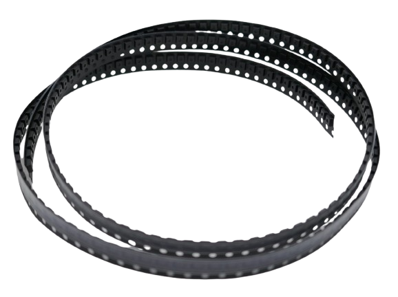
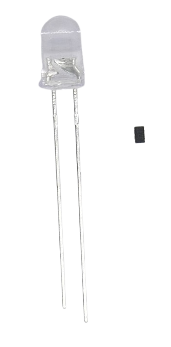
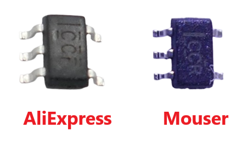
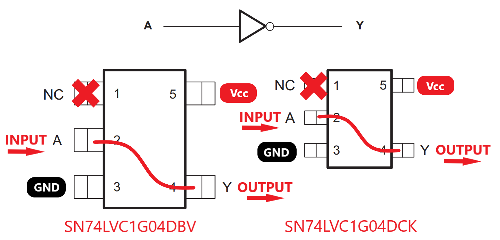

 
# Logic Inverters

> Turning High Into Low And Vice Versa

*Logic Inverter Gates* reverse the logic level: when inputting a *high* signal, they output *low*, and vice versa. 

Since *logic inverter gates* are often also capable of *sourcing* and *sinking* considerable currents, they can be used to add additional *GPIOs* that reverse hthe behavior of existing *GPIOs*: if i.e. you need to *open* one relais and at the same time *close* another relais, instead of using *two GPIOs*, you could use just *one*, and drive the second relais with a *logic inverter gate* chip.

## SN74LVC1G04 from Texas Instruments
The [SN74LVC1G04](materials/sn74lvc1g04_datasheet.pdf) is a *single inverter gate* IC from [Texas Instruments](https://www.ti.com/product/SN74LVC1G04) that's cheap, easily available, and popular among DIY makers:

* **Wide Voltage Level:** its voltage level (*1.65V-5.5V*) supports both *3.3V* and *5V* microcontrollers. It uses *input clamping diodes* as protection from voltage spikes and over-voltage.
* **Sinking And Sourcing:** it can *sink* and *source* up to *32mA* at *5V supply*, and *24mA* at *3.3V supply*. That is sufficient to drive small *LEDs* and any other outputs that would normally be driven directly by a *GPIO*.
* **Energy Efficient:** *LVC* (*low voltage CMOS*) has a low power consumption and supports fast operation.

Unfortunately, this chip is not available in through-pin *DIP* packages. The two largest packages are both designed for *surface mount* and require soldering skills when wiring them individually:

| Chip Model | Package |
| --- | --- |
| SN74LVC1G04**DBV** | *SOT-23* |
| SN74LVC1G04**DCK** | *DC-70* |

These IC are typically distributed as a *reel* (adding an *R* to the chip model number).

The *SMB chips* are tiny. Here is a side-by-side comparison with a *5mm LED* and a SN74LVC1G04**DCK**R chip:

When enlarging the *SN74LVC1G04DCKR*, you can see the *five pins* that would need to be soldered to wires when using these chips in manually-soldered circuits:

### Legit And Fake Chips
When enlarging the picture (or using a magnifying glass), you see the *chip markings*. The picture shows two *SN74LVC1G04DCKR* from different sources side by side: the left one came from an **untrusted vendor** at the *AliExpress* market place, and the right one was ordered by a **renown distributor** ([Mouser](https://eu.mouser.com/c/?q=SN74LVC1G04DCKR)).

Both markings look similar at most. They are *different*. Whether or not the dye inside the package is the same must be determined by a test.

> [!TIP]
> *Be aware* there **is a huge market for fake IC**. When ordering from untrusted sources, you may get chips that (a) work pretty much like the original (well-made clones), (b) in tests work as expected but with real loads and specs, fail (clones that use lower quality dyes with lower maximum specs),  (c) are in reality a lower-quality model (with lower specs), i.e. *inverters* that can *sink* and *source* much less current than the original, or *MosFET* that should be able to handle *30A* but burn up at *5A*, or (c) these chips were sorted out elsewhere and don't work at all, or show unexpected behavior. With untrusted sources, you aren't actually saving terribly much money compared to trusted distributors (just buy a certain minimum quantity and have your order exceed €50 to qualify you for free shipping). The worst issue with *fake components* is that they **mess up your curcuit**, and you **waste hours and days to find errors that simply do not exist** - in reality, your circuit failed because the components weren't the ones you thought they were.

### Pin-Out
All package types come with *five* pins:

## Materials

[SN74LVC1G04 Data Sheet](materials/sn74lvc1g04_datasheet.pdf)

> Tags: Inverter, SN74LVC1G04DCKR, Source, Sink, Fake

[Visit Page on Website](https://done.land/components/signalprocessing/logicics/inverter?776214091205242323) - created 2024-09-04 - last edited 2024-09-04
