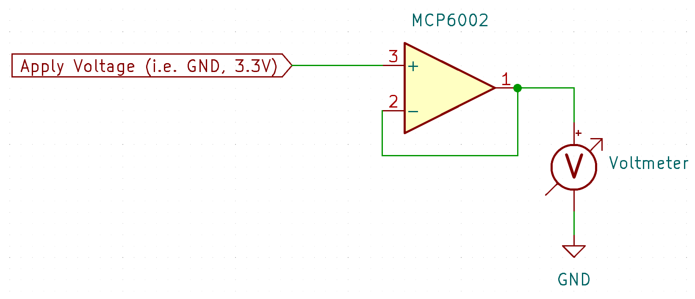

 
# Fake OpAmps

> Identifying Fake OpAmps That Do Not Work As Expected

*Operational Amplifiers* (*OpAmps*) are among the most commonly faked chips on the market. When you purchase these from *AliExpress* and other non-trustworthy sources, with sophisticated *OpAmps*, you almost inevitably get worthless copies that do not work at all as expected.

In this article, you learn what is commonly inside fake *OpAmp* chips, how they behave, and how you can identify them quickly.

## Why Fakes?

Chinese sources like *AliExpress* and similar sites are huge market places: the operator of such platforms isn't selling you anything. Instead, the platform brings buyers and sellers together, and you are faced with all kinds of "shops" that have no reputation. Because of this, there is minimal accountability, and when sellers send you fake items, they do not need to fear a public outcry. If their reputation is finally at a low, they simply open up a new shop with a different name.

> [!NOTE]
> Do not get me wrong: market places such as *AliExpress* can be great sources for cheap *and good* components, especially for *DIY makers* with a low budget. However, there are notorious items (such as *OpAmps*) that you better not buy there as they seem to be almost always falsified.

## How Fake Chips Work

Fake *OpAmps* often look indistinguishable from genuine parts. Inside the package, you find a wrong dye (if you had the means to open and investigate the chip under a microscope). The dye really is from a much cheaper and much more basic *OpAmp*, and just the internal wiring has been changed to match the pin layout of the faked *OpAmp*.

So fake *OpAmps* typically do work. However, you are really using a completely different *OpAmp* with much inferior specifications.

> [!IMPORTANT]
> It's not just the wasted money: when you accidentally use a fake *OpAmp* in good faith in your circuit, it might damage other parts, and you will be wasting a lot of time trying to find your error in a circuit that actually has no error, when the circuit isn't working. So if you do get *OpAmps* from untrusted sources, before using them, make sure you perform a basic test (see below).

## Identifying Fake OpAmps

The only way of identifying *fake OpAmps* without [opening them and examining their dye](https://www.eevblog.com/forum/projects/whats-inside-the-cheapest-and-fakest-jellybean-opamps/) is to *test* some key specs and see if they match.

A great way is testing *rail-to-rail capability* as this differentiates modern high quality *OpAmps* from cheap and old designs used in fake *OpAmps*.

For this test, you use a simple *voltage follower* circuit. Here is a sample for a *MCP6002*, one of the most popular and most commonly faked *OpAmp*:

> [!IMPORTANT]
> Do not forget to also supply the chip with power. *VSS* (MCP6002 pin 4) goes to *GND*, and *VDD* (MCP6002 pin 8) connects to the supply voltage, i.e. *3.3V*.

When you now connect a voltage to the *non-inverting input* (pin 3), your voltmeter at the *output pin* (pin 1) should measure close to this voltage. So when you apply *GND* to pin 3, the output should be *0V*, and likewise when you apply *3.3V*, the output should be close to *3.3V*.

Cheap *OpAmps* found in most fakes cannot output rail-to-rail voltages, so when you test a fake *OpAmp*, it most likely outputs *much less* voltage. When you i.e. apply *3.3V*, your voltmeter may measure just *1.7V*.

### Why Testing OpAmps Is Important
The simple *voltage follower test* from above is a good way to perform a basic test. If the *rail-to-rail* capabilities don't match the specifications, then all the other specifications will most likely be off as well.

A fake *OpAmp* may not just degrade your circuit, it may in fact cause damage or even fire hazards. Genuine *MCP6002 OpAmps* for example can *source* and *sink* around *20mA* whereas faked *OpAmps* can only handle a few *mA* (if at all).

## Recommendations

I am a great fan of market places like *AliExpress*: you can get competitively priced quality components, and the very same components would cost you up to ten times more on local market places such as *Amazon*. Especially when it comes to *LED* or *microcontroller boards*, the quality you get from *AliExpress* and others is typically acceptable.

Some components however should not be purchased there because they seem to be *routinely* faked. This includes *OpAmps* and *power transistors*.

Such components should always be purchased at *trusted sellers* such as [Mouser](https://www.mouser.com), [DigiKey](https://www.digikey.com/), and similar.

> [!TIP]
> Prices for components aren't *that* much different. What makes these distributors problematic is their shipping cost. Ordering small quantities is prohibitive once €20 shipping cost is added. That's why you should start a list, and add all the components you may want to stock. Maintain this list for a while until the volume of your order qualifies you for *free shipping*. At *Mouser*, for example, orders above €50 (€60 with included VAT) ship free.

> Tags: OpAmp, Fake, Voltage Follower

[Visit Page on Website](https://done.land/components/signalprocessing/operationalamplifier/fakeopamps?991347081329241500) - created 2024-08-20 - last edited 2024-08-28
