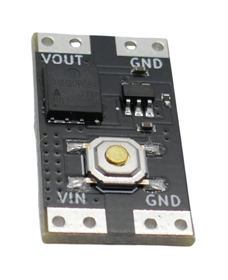

 
# Bistable Switch

> Electronic circuit that can toggle between two stable states, ON and OFF, and remains in its last state until externally triggered to change

A *bistable switch* is a circuit that has two stable states: ON and OFF. It stays in one state until an external action (like pressing a button) changes it to the other state. Essentially, it serves as an *electronic toggle button* that can be used to switch devices on or off, while typically consuming extremely low power in its *off* state.

There are *cheap, highly power-efficient, small and ready-to-use* breakout boards like the *XL-10AL*, or you can design and construct your own *bistable switch circuits* from a few transistors and resistors.

## Overview

With a *bistable switch*, you can turn basically add a *highly efficient sleep state* to any device or microcontroller, for example when you plan to run it off a battery or solar panel.

### Battery-Operated Microcontrollers
While most modern *microcontrollers* support built-in *deep sleep modes*, average development boards still consume around *300-800uA* in *deep sleep*. Even the most efficient *ESP32 development boards* consume around *12uA* which is close to the power consumption of the microcontroller.

An efficient *bistable switch* on the contrary consumes around *100nA* which is *12x* less than even the most efficient development board.

### Other Devices
The same goes for other devices (like flashlamps or tools): with a quiescent current draw of just *100nA*, no physical switch is needed, and the *bistable switch* makes sure the battery isn't drained even if the device is not in use for years.

### Wakeup Signal Required
A *bistable switch* needs a *signal* to change state. This can be a mechanical push button (i.e. controlling a torch), or it can be an external signal via *GPIO* (a microcontroller turning itself off, or a sensor like a door contact turning the microcontroller on).

## Caveats
There are a few caveats to keep in mind when considering adding a *bistable switch* to your device.

### Trigger
Most *bistable switches* are designed to *flip their state* on a single signal: when they are *on*, they switch to *off*, and vice versa. They are **toggle switches**.

This may introduce design challenges when you want to turn a device explicitly *on* or *off*, independently from its previous state. One example would be using *external sensor signals* to wake up a microcontroller. 

Let's assume you want to use a *door contact* to wake up the microcontroller and have it report the signal to *Home Assistant*, then have the microcontroller toggle the *bistable switch* again to turn itself off - until the door contact triggers again. Very power-efficient.

However, you would have to **guarantee** that under no circumstances the sensor can generate another signal *while the microcontroller is on*: if the door sensor would trigger once more **while the microcontroller is still busy** reporting the previous event, this new sensor signal would **toggle** the *bistable switch*, and since it was still *on*, it would be now turned *off*: the microcontroller would shut down prematurely.

In many scenarios, you can easily make sure that a sensor is not emitting multiple signals in the short time frame it takes for the microcontroller to do its job. Else, you would have to make sure that the sensor input would be disabled or routed to a different *GPIO* while the microcontroller is running. 

### No Timer
A *bistable switch* has no built-in timer, so it cannot turn itself *on* or *off* autonomously in regular intervals or at a certain time. 

If you require this, either attach a low-power external *real time clock*, use a development board with an efficient *deep sleep mode*, or use special low-power timers like the *TPL5110* that are made exactly for this scenario.

> Tags: Deep SLeep, Efficient, Low Power, RTC, Real Time Clock, TPL5110, Toggle

[Visit Page on Website](https://done.land/components/signalprocessing/switch/bistableswitch?619701101615241329) - created 2024-10-14 - last edited 2024-10-14
