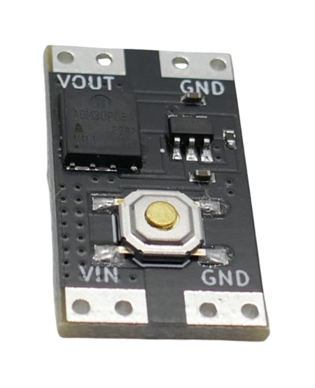
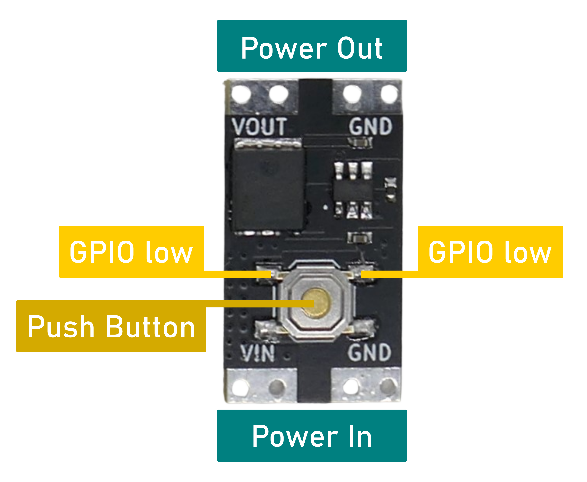
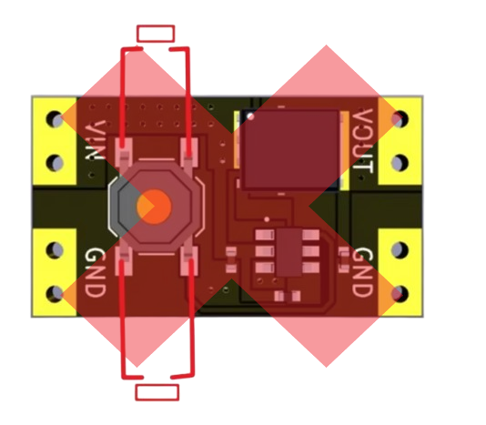

 
# XL-10AL

> Extremely Power-Efficient Bistable Switch With Quiescent Current Of Just 100nA That Works With 3.3V

The *XL-10AL* is a small *12.8x22.7mm* breakout board with a highly power-efficient *bistable switch* that works both with *3.3V* and *5V* microcontrollers at just *100-350nA* quiescent current.

> [!NOTE]
> The **10AL** in *XL-**10AL*** stands for **10A** and ***l**ow*, and there is also a *XL-10A**H***. The **H** stands for ***h**igh* and refers to the *voltage range*: it can handle voltages from *4.5-26V* (i.e. if you wanted to switch *12V car electric*) 

## Overview
The board comes with four solder pads: *Vin* and *GND* are connected to the power supply (i.e. a battery), and *Vout* and *GND* are connected to the device you want to control. The voltage you feed in is the voltage you get out.

A *push button* can be used to manually *toggle* the switch. 

When the built-in push button is pressed, it essentially pulls a pin in the circuitry to *low*. That's why you can toggle the switch via a *GPIO* or an external push button just as easily:

* **Programmatically:** pull down either one of the two marked solder pads **for a short period of time** with a microcontroller *GPIO*, simulating a button press.
* **External Button:** connect an external momentary push button (*normally open*) to *GND* and one of the two solder pads marked *GPIO low*.

### Caveat
The vendor has published instructions on how to connect external buttons and added this **misleading image** for illustration:

It appears as if you could *toggle* the *bistable switch* either by *pulling up* one pin, or by *pulling down* another pin. That's however not the case.

The labels *VIN* and *GND* in the image refer to the power connectors and do not relate to the push button. Both *left* push button contacts are interconnected, and both *right* push button contacts are interconnected as well.

So *both external push buttons* in this drawing do exactly the same and *short-circuit* the built-in push button.

Since the *left* side of the push button is connected to *GND*, *toggling* is performed by pulling the *right* side of the push button to ground - either by pressing the *built-in push button*, or by short-cutting the *built-in push button* with an external button, or by pulling either one of the right contacts to *low*.

## Voltage and Current

The vendor markets this *bistable switch* as *power switch* for *high currents* of up to *10A*, and the published **specs apply to this use case only** (*high currents*):

| Item | Value |
| --- | --- |
| **Current** | **max. *10A*** |
| Voltage | *3.5-5.4V* |
| Voltage Drop | max. *130mV* |
| Quiescent Current | *300nA* |

> For currents *>5A*, the voltage should be *>4V*, and an additional *heat sink* may be required.

### Microcontroller Use-Case
When you use this *bistable switch* with **low currents** (around *200mA*, as is common in microcontroller projects), the specs look quite differently:

| Item | Value |
| --- | --- |
| **Current** | **max. *200mA*** |
| Voltage | *2.8-5.4V* |
| Voltage Drop | none |
| Quiescent Current | *80-300nA* |

### 3.3V Microcontroller
Operating the *XL-10AL* with *3.3V* is officially *out of spec* but entirely possible: as long as you switch *small currents*, the MosFET works just fine. 

With currents around *200mA* (as is common in microcontroller projects),  voltages below *3V* perform well, and the quiescent current in *off* state is much smaller than *300nA* (around *130nA*). Another benefit is the absence of any noticeable *voltage drop*.

To verify, the graph below shows a measurement series at *2.98V* input voltage (simulating a nearly empty *LiIon battery*), and drawing a current of *200mA*:

The graph in the middle shows that *200mA* could be delivered ok in *on* state. In *off* state, the quiescent current is merely *120nA* in the average.

### High Currents
This board can switch surprisingly high currents of up to *10A*, however when current exceeds *a few Ampere*, the voltage must be higher than *4.5V*. 

At lower voltages, the *MosFET* can only handle *small* currents. If the *current* exceeds the transport capabilities of the *MosFET*, its *resistance* raises, and the *MosFET* heats up, causes a *voltage drop*, and can be destroyed.

> [!NOTE]
> There are enough electrons available in the *MosFET* to conduct *small currents*, even at very low *Vgs*: no heat is generated, no *voltage drop* occurs, and all is good. As current increases, more electrons need to be "pulled" into the channel to maintain conductivity. A higher *Vgs* enhances the electric field, which strengthens the channel and allows more current to flow. So if the *voltage* is **too low** to pull in enough electrons to carry the *current*, this increases *resistance*, which in turn produces *heat*, causes a *voltage drop*, and can eventually destroy the *MosFET*. That's why you get away with very small voltages in low-current microcontroller scenarios, and need a higher voltage with currents exceeding a few Ampere. 

> Tags: 3.3V, Bistable Switch, Low Power, Microcontroller, ESP32, Quiescent Current, Voltage Drop, MosFET, Vgs
