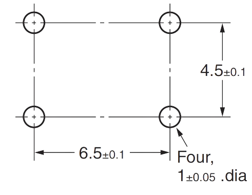
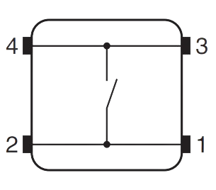

 
# Omron B3F

> Versatile PCB Push Buttons With Separately Available Multi-Color Push Buttons

The Japanese company [Omron](https://www.omron.com/global/en/) produces a wide variety of electrical components, including switches. Their *B3F* series of tactile switches is one of the most popular used world-wide, which is why these buttons are also readily available as cheap Chinese clones. 

*B3F switches* are available in *6x6mm* and *12x12mm*, plus in a multitude of configurations. They are rated for voltages up to *24V* and currents of up to *50mA*.

The picture shows a *B3F-compatible 12x12x7.3mm* push button with a corresponding **A14** snap-on button cap, including transparent cover:

> [!TIP]
> Great-looking push buttons with good haptics are typically fairly expensive. The *B3F series* is exceptionally versatile and economical: in combination with readily available colored button caps, they turn into sophisticated push buttons fit for direct user interaction. The ability to add a transparent cover for some of the button caps adds additional value, as it easily allows you to professionally label the buttons before snapping on the acryl cover. 

## Overview

The *B3F* series of tactile momentary buttons comes in two sizes (*6x6mm* and *12x12mm*) and multiple configurations.

### Without Button Caps
These buttons feature a black or yellow round or square button axis, available in different lengths. It can be directly used as a push button surface, however the small surface area and the "raw" looks encourages direct use only for internal configuration tasks that do not require regular interaction by end users.

### Using Button Caps
Button caps are available in many different colors that either slide onto the round button axis, or firmly snap onto the rectangular button axis.

#### Button Axis Types
A button cap turns the simple push button into a versatile *end-user ready* sophisticated input button that can be part of panels or user interfaces. Some button caps even come with transparent covers so that you can label the button cap before you snap on the transparent cover part.

Before you cann find button caps that fit your button, make sure you understand the different button axis types:

* **Round black axis:** these buttons were originally not designed to be used with button caps. The round black axis serves as a simplistic button all by its own. Smart sellers have nevertheless produced colored button caps that slide onto the round axis. Since no snapping mechanism secures the cap, and since there are no dimensional standards, you need to select the appropriate button cap inner diameter that fits your button axis, and/or the button cap might need some extra glue to be secured.
* **Square yellow axis:** the switch looks more like a *knob*, and has a round recess in the middle. This knob is not meant to be pressed directly by a user. Instead, it serves as a *snapping mechanism* where appropriate button caps can be firmly snapped onto the button. 

## Button Caps
When you purchase B3F switches, there are many different button sizes, button axis types, and button axis shapes to choose from.

Likewise, when you want to (separately) purchase colored button caps, there are many different shapes and sizes available as well. It can be redious to find button caps that snuggly fit your button type since many sellers do not publish exact dimensions.

Instead, sellers use a type system for button caps that starts with an *A*, followed by a number. It seems somewhat arbitrary. Here is a table to provide some orientation:

| Type | Button Size | Axis | Remarks |
| --- | --- | --- | --- |
| A14 | 12x12x7.,3mm | square | transparent cover available |
| A66 | 6x6x7.3mm | square | transparent cover available |
| A111 | 6x6mm | square | 2.4mm  |
| A29 | 6x6mm | round | 3.1/3.2/3.4mm |
| A30 | 6x6mm | round | 2.4mm  |
| A56/A101 | 6x6mm | round | 3.1/3.4mm  |

## Wiring
Most B3F switches come with *four pins* designed to be mounted on a *PCB* or soldered to a *prototyping board*. Here are the dimensions for the *6x6mm switches*:

Internally, the buttons use *one switch only*:

## Materials

[Omron B3F Push Button Datasheet](materials/b3f_datasheet.pdf)

> Tags: Momentary, Push Button, Omron, B3F, A14, A66, A111, A29, A30, A56, A101, Button Cap, Transparent Cover

[Visit Page on Website](https://done.land/components/signalprocessing/switch/momentarypushbutton/omronb3f?959613091229241408) - created 2024-09-28 - last edited 2024-09-28
