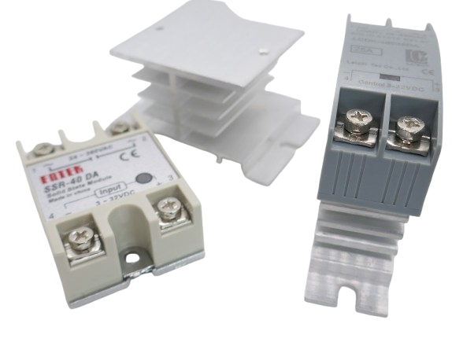

 
# Solid State Relais

> Semiconductor Relais Without Moving Parts

A *solid state relay* (*SSR*) is an electronic switch that uses semiconductor components to switch on or off when an external voltage is applied. Unlike traditional electromechanical relays, SSRs have no moving parts, resulting in faster switching times, greater reliability, and longer operational life. 

They are commonly used in applications where silent operation, low power consumption, and high durability are required.

## Overview

SSR relays can be especially useful for microcontroller projects:

* **GPIO Controlled:**    
  Unlike mechanical relays, many SSR relays can be driven directly from a GPIO pin, making them compatible with both *5V* and *3.3V* microcontrollers. Their power requirements can be as low as *5mA* (for *3.3V*) and *12mA* (for *5V*), both well within the current limits of typical GPIO pins.
* **Low Power Consumption:**    
  The low power consumption can be useful by itself when your project is battery-driven or otherwise sensitive to power consumption.

### Careful Selection

Using SSR relays requires careful planning to select the correct type:

* **AC or DC?**    
  Since SSR relays operate with solid-state components, they use *MOSFETs* for DC switching and *Thyristors* (or *Triacs*) for AC switching. You need to choose the correct type of SSR relay for your application. Typically:
  * An SSR relay designed to switch AC household appliances is labeled **DA** (*DC* control, *AC* switching).
  * An SSR relay designed to switch DC voltage is labeled **DD** (*DC* control, *DC* switching).

* **Maximum Current:**    
  Pay attention to the maximum *sustained* current an SSR relay can handle. With budget SSR relays, especially from unverified sources, apply a *400% safety margin*. For example, if you plan to switch *2000W* (*9A* at *220V AC*), use an SSR relay rated for at least **40A**. Exceeding the current rating, even momentarily, can permanently damage the relay. High loads can also cause SSR relays to [catch fire or explode](https://youtu.be/FV9t1GFVbhU?si=dvGa1x_2ezz8e6mw).

* **Heat Dissipation:**    
  SSR relays generate heat when operating near their maximum current rating. Ensure proper heat dissipation by using an appropriate heat sink or mounting the relay on a metal surface. Choosing a relay with a higher current capacity can also help reduce thermal stress.

* **Leakage Current:**    
  Unlike mechanical relays, SSR relays do not provide a perfect open circuit when turned off. They have a small leakage current, which can be enough to power low-wattage devices (e.g., LED bulbs may glow faintly even when "off"). If complete isolation is required, a mechanical relay might be a better choice.

* **Zero-Crossing vs. Random Turn-On:**    
  When switching AC loads, some SSR relays use *zero-crossing detection*, meaning they only switch on when the AC voltage crosses zero volts. This reduces electrical noise and extends the relay's lifespan. Others use *random turn-on* (phase control), which is useful for applications like dimming. Make sure to select the right type for your use case.

### SSR vs. Mechanical Relay – Pros and Cons

  | Feature            | SSR Relay | Mechanical Relay |
  |--------------------|----------|-----------------|
  | **Lifespan**      | Long (no moving parts) | Shorter (contacts wear out) |
  | **Switching Speed** | Fast | Slow |
  | **Silent Operation** | Yes | No (audible clicking) |
  | **Heat Generation** | Yes (requires heat sink at high currents) | Minimal |
  | **Leakage Current** | Yes | No |
  | **High Inrush Current Handling** | Poor | Good |

### Caveats

Affordable **DA** mini SSR relays, such as the [G3MB-202P](https://done.land/components/signalprocessing/switch/relais/solidstate/2ag3mb-202p/), are widely available on ready-to-use PCBs and are commonly used in DIY projects.

However, these SSR relays can handle only *2A* (*440W* at *220V*). While this may be sufficient for switching simple lamps, it is completely inadequate for most other applications. Exceeding the *2A limit*, even momentarily, will immediately destroy the relay.

Industrial SSR relays are often a much better choice. Chinese clones are available at similar prices and claim to handle up to *40A* (*16A* realistically). Even if you only need to switch lighter loads, these higher-rated relays provide a much greater safety margin and improved reliability.

## Basic Principle

A classic *electromagnetic* relais use a *magnetic field* to electrically separate the trigger circuit from the load circuit. The same electrical isolation is achieved in *SSR* by using light:

In a *SSR*, the trigger circuit operates an *optocoupler*: it turns on an internal LED. The light that is emitted by this LED is picked up by a photodiode, providing the *electrical isolation* of both circuits.

The *photodiode* in turn uses a semiconductor to switch the load.

### DA, DD, AD, AA
Depending on how a *SSR* is designed, it can switch *AC* or *DC*, and the trigger signal can be either *AC* or *DC*. *SSRs* are marked with two letters to indicate their design:

| Marking | Description |
| --- | --- |
| DA | a digital control signal (i.e. *GPIO*) controls an *AC* load |
| DD | a digital control signal (i.e. *GPIO*) controls a *DC* load (i.e. a motor or high-power LED) |
| AA | an *AC* signal controls an *AC* load |
| AD | an *AC* signal controls a *DC* load |

### Semiconductors
*SSR* use *solid-state components* to perform the actual switching. Since there are no moving parts involved, *SSRs* do not wear out easily, and they are completely silent.

The type of semiconductor depends on whether the *SSR* is designed to switch *AC* or *DC*:

* **MOSFET:** like anywhere else in electronics, *SSR* use traditional *MOSFET* to switch *DC* loads
* **Triac, Thyristor:** *Triacs* are most commonly used in *SSR* for switching *AC loads* as they can conduct *in both directions* which makes them ideal for *AC*. *Thyristors* are sometimes also used (in pairs back-to-back, since they only conduct in *one direction*).

## Advantages...
There are important advantages of *SSR* over classic *mechanical* relais:

* **Low Power Consumption:** a mechanical relais must maintain a magnetic field for the entire period of time it is switched *on* (which can require considerable power: mechanical relais typically can not be directly driven by a *GPIO*). *SSRs* are controlled *electronically* and only require a few *mA* that can be directly supplied by a *GPIO*.
* **Silent:** *SSRs* operate completely noise-free. There is no *clack* sound that is typically emitted by a switching mechanical relais.
* **No Sparks:** since there are no moving contacts, there are also no *sparks* (that can happen with mechanical relais when they switch high loads). In addition, *SSR* relais often use *Zero-Crossing Detection* to switch *AC loads* when the AC waveform crosses 0V. This further minimizes *EMR* and physical stress since the load is zero at the time where the switch takes place.
* **Less EMR:** *Zero-Crossing Detection* mechanical relais can create significant electrical *interference*: *EMR* and *radio noise*. Such *electro-magnetic* interference is caused by *sparks* and also the coils used in mechanical relais. *SSRs* do not produce this kind of interference.
* **No Flyback Diode:** since classic relais rely on *magnetic fields*, a *flyback diode* is needed to protect sensitive electronic parts from being hit by high momentary voltage spikes that can occur when the magnetic field of a classic relais collapses and releases its stored energy. *SSRs* do not use magnetic fields and thus do not need a *flyback diode* or can otherwise produce harmful voltage spikes that harm the trigger circuit.
* **Wear-Out:** like any *physical device* that uses moving parts, mechanical relais wear out over time. The *sparks* can corrode the switching contacts, and the relais may eventually fail to reliably switch.

## ...and Caveats
Despite the many advantages, *SSRs* have their own important caveats and risks that need to be carefully considered:

* **Heat Sink:** The resistance in mechanical switches is almost zero. *Solid state components* inside a *SSR* can introduce a *slightly higher resistance* and/or produce a slight *voltage drop*, all of which is turned into heat that must be *dissipated* or else *accumulates*. Switching small applicances in the range of *<400W* typically do not produce relevant heat that requires *heat sinks* or *active cooling*. When you switch more powerful appliances, i.e. a water heater or powerful motors, the *heat dissipation* of *SSRs* must always be taken into consideration: use a proper heat sink, and make sure the housing allows the dissipated heat to vent off. Lack of proper heat dissipation may lead to the destruction of the *SSR* and can eventually cause fires.

* **Fire Hazard:** Generally, *SSRs* do have an inherent risk of causing *house fires* when used improperly. Lacking *heat dissipation* (see above) is just one cause. Another avoidable fire hazard is *overloading SSRs*. Always keep in mind that *SSRs* use *solid state switches* that can explode or catch fire when loads are switched that exceed their specifications. As a rule of thumb, with *quality SSRs* from *known sources*, never switch loads that are higher than **80%** of the maximum *SSR rating*. With *cheap SSRs* from *unknown sources*, never switch loads that are higher than **30%** of the maximum *SSR rating* 

> [!CAUTION]
> *SSRs* from renown manufacturers are considerably more expensive than mechanical relais. Cheap generic *SSRs* (or fake *clones*) are available for a fraction of that price. These cheap **SSRs** regularly use inferior semiconductors, and the ratings printed on these *SSRs* are **not trustworthy**. Often, a *SSR* rated for *40A* contains semiconductors rated for *12A*. Likewise, a *SSR* rated for *10A* can only switch loads up to *3A*. Many people around the world successfully use cheap *SSRs*, however they add generous safety margins. Either do not exceed **30%** of *SSR ratings* with these cheap clones, or *disassemble one of them* and *check out the semiconductor used inside*. Never ever trust the printed ratings. 

> Tags: Relais, SSR, Solid State Relais, MosFET, Thyristor, Triac, Fire Hazard, Heat Sink

[Visit Page on Website](https://done.land/components/signalprocessing/switch/relais/solidstate?888119072031245401) - created 2024-07-30 - last edited 2024-07-30
