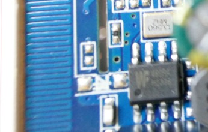

 
# RF Radio Relais

> Relais Controlled By License-Free Radio Signals

*RF-controlled relais* are available for less than €2 in a small and ready-to-use form factor. Unlike their *WiFi-controlled counterparts*, they do not contain a *microcontroller* and are never dependent on a *cloud service*.

> [!NOTE]
> Note the specs on the housing: this device is using *433MHz* radio frequency (so it is designed for *Europe*). In the US, other frequencies (i.e. *315/915MHz* are used).

## Overview

*RF-controlled* relais are controlled by radio signals:

* **Frequency:** make sure the device you purchase uses a radio frequency that is legal to use in your region. In Europe, such devices use *433MHz*.
* **Remote Control:** the device is a *RF receiver* only. To use it, you also need a (separately available) compatible *RF sender* (the remote control).

### Works Everywhere
Using radio signals to control makes this technique flexible: no *WiFi infrastructure* is needed, so this technique works also away from your home, in locations with poor *WiFi coverage*, or in cars, boats, or recreational vehicles.

### You must be close to the device
Since *RF control* is a *direct connection* between your remote control (sender) and the device (receiver), you need to be in close proximity of the device to control it.

This is typically no problem with use cases like *garage door openers* (as you want to *enter* the garage which you can't do when being far away). 

You will be unable to remote control such devices from great distance. If for example you took off from home but aren't sure whether the garage door was closed, you cannot close it from abroad.

> [!TIP]
> It doesn't take much to build a *WiFi-RF gateway*: take a *WiFi-enabled microcontroller* such as an *ESP32*, hook up a simple *RF sender* to it, and now can control *RF-controlled devices* from anywhere in the world, too. Before you consider this, make sure you understand the security implications (see below).

### Safety Concerns
The proximity requirement can be a valuable security feature: no hacker from the other end of the world can ever have access to the device.

However, since *RF* isn't confined to wires, and since *RF-controlled relais* do not use sophisticated wireless protocols with encryption and access protection, anyone who is *also* in close proximity can pick up the signal when you operate your remote control, record it, and play it back later.

> [!TIP]
> There are more sophisticated devices that use *rolling codes* (automatically changing code sequences that can't easily recorded, played back and reused by someone else). The true security risk depends on a number of factors. If you operate a security-critical entity like a *garage door*, and if you do this in a crowded rural area where other people can pick up your radio signal easily, there is a significant risk. If however you just control your bedside light, or your garage door is located on a large estate that keeps other people at distance, then it's a different ballgame.

### One-Way Communications
Unlike with *WiFi-controlled* devices, *RF* is a *one-way communication*: you can control the device, but the device cannot talk back to you. 

That's why *RF-controlled devices* are typically used for scenarios with *visual feedback*: when you open a *garage door*, you immediately see whether it is moving, and if it is currently open or closed.

*RF-controlled devices* cannot provide you with an electronic feedback though (that you might want use to operate a control lamp to visualize the current device state), so you cannot check whether the control signal was actually received by the device (other than by using your eyes and witness the effect).

## Hardware

The two-part housing is pushed together by four pins and can easily be opened with a screw driver:

### Relais

The *relais* is the predominant black part: its markings show the ratings: it is controlled by *5V* and can switch loads of up to *16A* at *220V*:

### RF Receiver and Antenna

This model uses a *PCB antenna* which can be seen in the picture below on the left side.

PCB antennas typically *perform poorly*: you either need a very strong *sender*, or you need to be *very close* to the device in order to control it. 

> [!TIP]
> Occasionally, reception is so bad that the *remote control* needs to be within a *1m* range to the device. By cutting the *PCB trace* to the antenna and replacing it with a *17.3cm* wire, reception performace improves dramatically.

### No Microcontroller

The circuit board has a rectangular elongated cutout, clearly seen on the above picture. 

This is where *WiFi*-enabled devices plug in a separate microcontroller board that takes care of communicating with *WiFi*.

*RF*-controlled boards like this one *do not need microcontrollers*. 

Instead, close to the *antenna* you find a *chip* that hosts the *radio receiver circuit*, and a *13.560MHz* crystal that tunes it to *433,92MHz*.

### Power Supply

The discussed device can be directly connected to *AC mains*. 

The majority of the remaining components on the board are resposible for supplying *DC* voltages to the electronic components, i.e. *diodes* for rectification, and the large *electrolytic capacitors* to *smoothen voltage ripple*.

> [!CAUTION]
> Note the *absence of a fuse*, and missing proper physical separation of *AC* and *DC* parts on the PCB.

In the upper right corner of the board, a commonly used *AMS1117* voltage regulator chip provides a stabilized *3.3V* and can deliver up to *800mA*.

### Button

On the backside, a *push button* is located. This is used to *pair* the *RF receiver* with the *remote control*. 

*Pairing* is required so that the *receiver* learns the unique hardware code sent by the remote control. After pairing, the device *specifically listens* to the remote control code(s) you paired it to.

Next to the button, you see an *LED*. It is used to provide *feedback*, i.e. to indicate whether a certain button press sequence has enabled *pairing mode*.

## Pairing Process
Since most *RF receivers* use the same *standard RF receiver chips*, pairing is performed in a similar manner for most devices:

1. **Reset:** most receivers require an initial *reset* that can be invoked by pressing the button *eight* times. The *LED* typically flashes on success.
2. **Enter Pairing:** to enter pairing mode, either press the button *once*, *twice*, or *three times* and watch the *LED*. It lights up constantly when in *pairing mode*. If short button presses do not work, try holding the button for *2-3s*.
3. **Pair Remote Control:** While in pairing mode (the *LED* lights constantly), press a button on the *remote control*. On success, the *LED* starts blinking or turns off. The *receiver* is now *paired to the remote control*.

> [!TIP]
> Some devices allow pairing with multiple remote controls. Repeat the pairing process to pair the device with another remote control. Perform a *reset* to clear all *paired remote controls* from the device.

## Datasheets

[BP2525 AC-to-DC converter](materials/bp2525_datasheet.pdf)   
[MB10 Bridge Rectifier](materials/mb10_datasheet.pdf)   
[AMS1117 3.3V Voltage Regulator](materials/ams1117_datasheet.pdf)   

> Tags: Relais, Remote Control, ASK, OOK, SRD

[Visit Page on Website](https://done.land/components/signalprocessing/switch/relais/wireless/rfradio?034194081301245115) - created 2024-07-31 - last edited 2024-07-31
