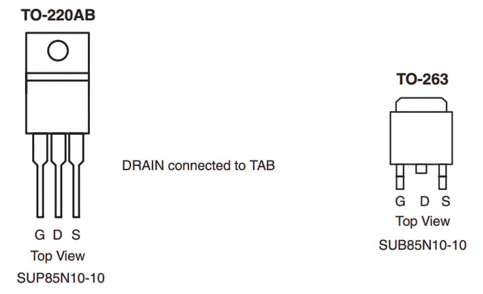

# MOSFET Transistors

> A Special Type of Transistor Especially Suited for Switching Applications

A **MOSFET** (*Metal-Oxide-Semiconductor Field-Effect Transistor*) is a transistor type ideal for switching loads. *MOSFETs* can switch at very high frequencies.

To act as an ideal switch, a MOSFET must become fully conductive when *on*. This requires a certain voltage at its *gate* pin. Most MOSFET types require much higher voltages than are available in logic level circuits. 

One of the most fundamental specs to look for is the *Rds(on)* for the voltage you can supply: this is the *on resistance* when this voltage is supplied.

## Overview
MOSFETs are **voltage-controlled** and draw almost no current. They use **electric fields** to control their state rather than direct current flow. 

This is why MOSFETs can *stay on (conductive)* when the voltage is removed from their *gate* pin: the electric field remains intact. *Gate pins* must be connected to a *defined state*, i.e. it may be necessary to *pull down* the controlling *GPIO* to ensure that the MOSFET turns off when the positive voltage is removed (for *P-Channel* MOSFETs it is the other way around, and the *gate* pin must be *pulled up*).

**BJT** (*Bipolar Junction Transistor*) transistors, for comparison, work differently: those are **current-controlled**, and a small current at the transistor *base* is *amplified* to control a larger current. When the current stops, then the *BJT* transistor *turns off*.

## MOSFET Pinout  

With the typical *TO-220* packages, when looking at the MOSFET **from the top** (so you can read its type), with the "legs" downwards, the pin order is (from left to right):

| Pin    | Description                                      |
|--------|--------------------------------------------------|
| Gate   | Control pin (apply voltage to increase conduction) |
| Drain  | Current flows *into* the MOSFET                  |
| Source | Current flows *out* of the MOSFET               |

The best way to determine the pin order is looking at the MOSFET datasheet though.




### Use Cases
Both **MOSFET** and **BJT** transistors can perform similar tasks, but each has distinct strengths and weaknesses due to their design:

- **Switching Applications**:  
  - MOSFETs require almost no control current, making them **faster** and more **efficient** as switches.  
  - MOSFETs are ideal for **high-frequency** applications, such as switching power supplies or **PWM dimming**.
  
- **Amplification Applications**:  
  - BJTs excel at **current amplification** and are commonly used in analog circuits.  
  - While they can be used as switches, they are typically favored for **low-frequency** applications.

Since digital electronics primarily rely on **on/off** signals, MOSFETs are now the **most widely used** transistor type. However, **BJTs** remain popular in DIY projects due to historical use, affordability, and ease of handling.

### Fake MOSFETs

MOSFETs from untrusted sources **may not meet specifications** and often have **high Rds(on)**, making them unreliable.

- Fake MOSFETs may initially function at low currents but **overheat or fail** under load.
- To verify authenticity, use a **component tester** to measure characteristics and compare them with the datasheet.

When you buy MOSFETs from platforms such as *Amazon*, *eBay*, or *AliExpress*, you almost certainly receive counterfeit and relabeled MOSFETs, not the types you ordered.

These MOSFETs may even work well for your use case. However, they almost never fulfill the specifications and will typically have high *Rds(on)* even at higher voltages, making them usable only for *very small currents*, if at all.

> [!TIP]  
> If you must buy MOSFETs from unknown sources, stick to **common, inexpensive** generic types—never pay for higher-cost logic-level MOSFETs as they are typically the same low-quality types, just with a new laser engraving claiming to be a shiny logic level or sophisticated MOSFET.
## Key Considerations

When selecting a MOSFET type, these are the four key considerations to focus on:

* **Control Voltage:** is the MOSFET *fully turned on* at the *gate* voltage you can provide? Else, it may act like a resistor, cause a voltage drop, and can get very hot.
* **Maximum Current:** how much current can the MOSFET handle? Can you use it to switch your load? Do you need a heat sink?
* **Package:** which package type does the MOSFET use, and is it suitable for your type of hobbyist project? Is it i.e. a *TO-220* package with legs that fit through-hole soldering? Or is it i.e. a tiny *SO-8* surface-mount package that needs tiny contacts, custom PCBs, and reflow soldering?
* **N- and P-Channel:** do you need a more common *N-Channel MOSFET* (`off` by default, controlled by positive voltage), or a less common *P-Channel MOSFET* (`on` by default, controlled by negative voltage)?

A common question is whether a MOSFET requires a protective resistor. This question is often asked by users familiar with *BJT transistors*:

* **BJT Transistors:** require a resistor at their control pin (*base*) because such transistors have a very low internal resistance. Without a protective resistor, they would act similar to a *LED*, and maximum current would quickly heat up and destroy it.
* **MOSFET Transistors:** *do not require* a resistor at their control pin (*gate*).    
  
  However, the circuit that is *driving* the *gate pin* may need one. MOSFETs have a *high resistance*, so no high (continuous) currents flow. 
  
  Larger MOSFETs can have a significant *capacitance*, leading to a very high momentary inrush current. It may last for just a few nanoseconds which can suffice to damage a microcontroller GPIO. 
  
  That's why for MOSFETs, too, protective resistors are recommended (at least for larger MOSFETs), just for a different reason.

## Finding Suitable MOSFET 

Picking an appropriate MOSFET model for a project is crucial. You can easily pick one that is completely unusable for your particular scenario.

Distributors offer [online databases](https://www.mouser.de/c/semiconductors/discrete-semiconductors/transistors/mosfets/?transistor%20polarity=N-Channel&vgs%20th%20-%20gate-source%20threshold%20voltage=3.3%20V) for preselection. Once you find MOSFET types that appear suitable, **always carefully manually review the datasheet** to see if it is really a fit. 

* The good news is: You can save all this time and effort if you plan to order MOSFETs at places like *Amazon*, *eBay*, or *AliExpress*. 

* The bad news is: that's because you almost certainly will receive counterfeit fake MOSFETs anyway. You probably won't get the MOSFET types you carefully selected. So save the time. Or, if you want your MOSFETs to work as expected, order at real prices at real distributors (like *Mouser* or *DigiKey*).
### Understanding MOSFET Data Sheets

Reading MOSFET datasheets is not trivial, especially for beginners: there are many specs that all describe how a MOSFET responds to certain circumstances:

| Label               | Name                           | Description                                                        | Why It Is Important                                          |
|---------------------|------------------------------|--------------------------------------------------------------------|-------------------------------------------------------------|
| **V_GS(th)**       | Gate Threshold Voltage       | Voltage at which the MOSFET just starts to turn on (typically at very low current). | Ensures the MOSFET can turn on fully at the desired voltage, i.e. *3.3 V*.   |
| **R_DS(on)**       | Drain-to-Source On-Resistance | The resistance between drain and source when the MOSFET is fully on. | Lower values mean less voltage drop and power dissipation.  |
| **V_GS (Drive Voltage)** | Gate Drive Voltage         | Voltage required at the gate to achieve low R_DS(on).              | Ensures R_DS(on) is low at desired voltage and not just at higher voltages. |
| **R_DS(on) vs. V_GS Curve** | Resistance vs. Gate Voltage | A graph showing how R_DS(on) decreases as V_GS increases.         | Helps verify if the MOSFET reaches low R_DS(on) at desired voltage.    |
| **Q_G**            | Gate Charge                  | The total charge required to switch the MOSFET on and off.        | Lower Q_G allows faster switching and reduces gate drive power. |
| **I_D**    | Drain Current        | Maximum current the MOSFET can handle at given voltage V_GS             | Ensures the MOSFET can carry enough current at low gate voltage. |
| **MOSFET Type**    | N-Channel or P-Channel       | Specifies whether the MOSFET is N-channel or P-channel.           | N-channel is preferred for low-side switching at 3.3V.      |

It is then your task to translate and adapt these specs to your own use case, and determine if it is a fit or not.

### Preselection

Distributors offer [distributor online databases](https://www.mouser.de/c/semiconductors/discrete-semiconductors/transistors/mosfets/) that you can use to **preselect** MOSFETs.

Most online databases allow you to set various filters, and you can select distinct properties (like package type) as well as ranges (*at minimum*, *at maximum*) using icons at the bottom of the selection lists.

Here are some useful filters for preselection:

* **MOSFET Type:** **N-Channel** versus **P-Channel**. For example, to search for a MOSFET that is *off* by default and uses a positive control voltage, set `Transistor Polarity = N-Channel`.
* **Package Type:** set `Mounting Style = Through Hole` if you want to use a regular soldering iron and standard *2.54 mm* pitch prototyping board, filtering out tiny surface mount packages.
* **Vgs(th):** make sure the MOSFET starts to conduct well below the voltage you are intending to use. When *Vgs(th)* is close to, or above your voltage, the MOSFET is not suited. For *3.3 V*, choose `Vgs(th) <= 1.2V`. 
  > Do not confuse *Vgs(th)* (which is a single voltage threshold) to *Vgs* (which is the allowable voltage range for *gate*).
* **Power:** Set **Id** (*drain current*) to the current the MOSFET needs to switch. For example, if you plan to switch *1 A* loads, set `Id >= 1.2 A`.
* **Channels:** If you are looking for single MOSFETs, set `Number of Channels = 1 Channel`.

> [!TIP]
> You may want to click *Apply Filters* after each new filter you set. If you set multiple filters at once, the online database may refuse to accept your choices.

After [applying all of the above filters](https://www.mouser.de/c/semiconductors/discrete-semiconductors/transistors/mosfets/?id%20-%20continuous%20drain%20current=1.2%20A~~220%20A&mounting%20style=Through%20Hole&number%20of%20channels=1%20Channel&transistor%20polarity=N-Channel&vgs%20th%20-%20gate-source%20threshold%20voltage=0%20V~~1.2%20V&rp=semiconductors%2Fdiscrete-semiconductors%2Ftransistors%2Fmosfets%7C~Vgs%20th%20-%20Gate-Source%20Threshold%20Voltage%7C~Id%20-%20Continuous%20Drain%20Current), this left me with a list **46 MOSFET types** for manual review.
## Manual Review

Before you order a MOSFET, **always carefully review its data sheet**. Never trust recommendations or online databases. They can point you to potentially interesting MOSFETs, but **you** must ultimately determine if a particular MOSFET is really a match **for your specific project**.

With a shortlist of MOSFETs, you now need to look at each MOSFET's data sheet and evaluate the fine print.

### On-State Resistance

A MOSFET **must turn on fully** when you apply a voltage to its *gate* pin. If it turns on only partially, it acts like a *resistor*, causing voltage drop and heat. The MOSFET could get extremely hot or even be damaged.

#### Why Low Resistance Is Crucial
In real life, no MOSFET has a true zero-ohm resistance when *on*, but it is important to be close to zero ohms, especially when switching high currents:

| Use Case                     | Maximum Acceptable Resistance |
|------------------------------|-------------------------------|
| High-power switching (≥10A load) | ≤10 mΩ                        |
| Medium-power switching (1A–10A load) | 10–50 mΩ                     |
| Low-power applications (<1A load) | 50–200 mΩ                    |

#### Rds(on) at Desired Gate Voltage
The *Rds(on)* value tells you the resistance a MOSFET has when you apply **a particular voltage** to its *gate* pin. *Rds(on)* **is different for different voltages**, and in the data sheet, you are looking for a **graph**, not a single number.

> [!IMPORTANT]
> A single *Rds(on)* value isn't helpful at all. It merely describes the minimum resistance the MOSFET can have under perfect conditions. Much higher voltages may be required, and at the voltage you are going to use, *Rds(on)* can be much worse.

The [online search](https://www.mouser.de/c/semiconductors/discrete-semiconductors/transistors/mosfets/?id%20-%20continuous%20drain%20current=1.2%20A~~220%20A&mounting%20style=Through%20Hole&number%20of%20channels=1%20Channel&transistor%20polarity=N-Channel&vgs%20th%20-%20gate-source%20threshold%20voltage=0%20V~~1.2%20V&rp=semiconductors%2Fdiscrete-semiconductors%2Ftransistors%2Fmosfets%7C~Vgs%20th%20-%20Gate-Source%20Threshold%20Voltage%7C~Id%20-%20Continuous%20Drain%20Current) returned a [SUP85N10-10-E3](https://www.google.com/search?q=SUP85N10-10-E3+datasheet&oq=SUP85N10-10-E3+datasheet). Let's see if it really is usable with a *3.3 V* microcontroller. Here is what its datasheet reveals:

- *Rds(on)* is specified as *0.0085Ω*, which is very low; however, at a gate voltage *Vgs=10V*, it is rated for *10 V*.
- At *4.5 V*, *Rds(on)* already raises to *0.01Ω*, which is still relatively low.

Unfortunately, most datasheets do not contain an *Rds(on)* **graph**. But they often provide a *Vgs Gate-to-Source Voltage* and label this *Transfer Characteristics*:


This graph reveals:

- At *3V*, the MOSFET is *off* and not suited.
- At *3.3V*, the MOSFET barely starts to conduct but still has a considerable resistance.
- When getting hot, the MOSFET isn't working at *3.3V* anymore.

So, even though the distributor database suggested the *SUP85N10-10-E3*, it turns out to be a great MOSFET for *5V*, but not suited at all for *3.3V*.


<details><summary>Deep Diving Into Datasheet Graphs</summary><br/>
You don't need to do the complex math, and as you have just seen, a rough glimpse at a graph can tell you whether a MOSFET may work for you or not.

If you'd like to still dive a bit deeper, let's relate the specs a bit and see if they add up.

The example graph shows a current of roughly *20 A* at *3.3 V*. Using Ohm's Law, *Rds(on)* at *3.3 V* can be calculated:


````
Vds / Id = Rds(on)
3.3 V / 20 A = 0.165Ω

# double-check with known Rds(on):

Vds / Rds(on) = Id
4.5V / 0.01Ω = 450 A
10V / 0.0085Ω = 1.176 A
````
Apparently, though, the double-checked *known* values do not fit: at *4.5 V*, according to the graph, the maximum current is just *100 A*, not *450 A*. However, at *10 V*, the *transfer characteristics* graph is open-ended, meaning the MOSFET is now fully on.

* **The absolute maximum current** a MOSFET can handle is capped and in the datasheet specified as `I_D`. For the `SUP85N10-10-E3`, it is `85 A` (at *25C* temperature), and a *pulsed* (momentary) current `I_DM` of `240 A`.
* The *Transfer Characteristics* graph shows that the MOSFET is fully *on* `>= 4.5 V`. At the desired voltage of *3.3 V*, it has a higher resistance and is still in its *resistive range*.

The *V_DS Drain-to-Source Voltage* (*Output Characteristics*) graph can help: it shows the current that flows through the MOSFET at different voltages when applying a specific *gate* voltage:


* At a *gate* voltage of *3V*, **no current flows** - the MOSFET is essentially *off*.
* At *4V*, a limited current flows, but the MOSFET stays in the resistive range.
* Even at *5V*, the MOSFET is still not fully turned on.
* Only at *>=6V* does the MOSFET act like a regular switch and shows a linear current with increasing voltage.

````
V_DS / I_D = Rds(on)

verifying data sheet known Rds(on) values:
-> 0.01Ω at 4.5V
-> 0.0085Ω at 10V
for 4V:
2.0 V / 55 A = 0.03Ω
4.0 V / 55 A = 0.07Ω
for 10V:
2.0 V / 235 A = 0.0085Ω
````

</details>

## Logic Level MOSFETs

Finding suited MOSFETs for low voltages like *3.3 V* can be hard. Most MOSFETs require much higher gate voltages.

Rather than trying to find a MOSFET that has a low *Rds(on)* at *3.3V*, you can also *increase* the gate voltage. That's a good approach if you have MOSFETs at hand that don't work well with logic levels.

* **MOSFET Driver:**    
  use a dedicated MOSFET driver IC. It accepts a logic level and outputs a higher voltage to drive the MOSFET gate.    
    
    MOSFET drivers operate a MOSFET in its perfect range but can be pricey.

* **Level Shifter:**  
  use a simple *level shifter breakout board* to raise the gate voltage at least from *3.3V* to *5V*. At *5V gate voltage*, the selection of MOSFETs is much bigger.

    Since level shifters are not designed as MOSFET drivers, they may or may not drive the MOSFET well enough. Level shifters designed for *I2C interfaces* may work fast enough even for high-frequency use cases but do not provide enough current for *high-capacity* MOSFETs.

* **BJT Transistor as Gate Driver:**     
  a simple **2N2222** NPN transistor with a **1kΩ** base resistor can supply a higher gate voltage (provided your circuit has higher voltages that can be used). It is **too slow for high-frequency switching**, though, so the use cases are somewhat limited.

## N-Channel

All prices are considered to be a rough classification and may vary greatly between sources and over time. Prices are for single MOSFETs. Bulk orders (>50) are significantly lower, typically at *50%*. 

| Model                 | 3.3V | 5V   | Cost (Single, €) | Remarks |
| --------------------- | ---- | ---- | ---------------- | ------- |
| **FDP5800**           | +    | ++   | 2.80             | 80A, 60V - Works at 3.3V, better at 5V. |
| **FDPF320N06L**       | -    | +    | 2.30             | 21A, 60V - Not good at 3.3V, works at 5V. |
| **HUF76423P3**        | +    | +++  | 1.55             | 20A, 60V - Works well at both 3.3V and 5V. |
| **IPPP80N03S4L-03**   | -    | ++   | 3.00             | 80A, 30V - Needs at least 5V gate drive. |
| **IRLB8743PBF**       | +    | ++   | 1.30             | 78A, 30V - Good at 3.3V, better at 5V. |
| **IRLI640GPBF**       | +    | ++   | 2.38             | 8A, 200V - Good at 3.3V, better at 5V. |
| **IRLIZ14GPBF**       | ++   | +++  | 2.10             | 6A, 60V - Great at 3.3V and 5V. |
| **IRLIZ44GPBF**       | -    | +    | 3.29             | 30A, 60V - Not good at 3.3V, works at 5V. |
| **NDP6060L**          | +    | ++   | 3.50             | 48A, 60V - Works at 3.3V, better at 5V. |
| **RX3G07CGNC16**      | +    | +++  | 2.30             | 70A, 40V - Good at 3.3V, excellent at 5V. |
| **STD12NF06L-1**      | -    | +++  | 0.97             | 12A, 60V - Not good at 3.3V, excellent at 5V. |
| **STP55NF06L**        | -    | ++   | 2.00             | 55A, 60V - Not good at 3.3V, works at 5V. |
| **STP80NF03L-04**     | +    | +++  | -                | 60A, 30V - Works at 3.3V, but **obsolete**. |
| **SUP85N10-10-E3**    | -    | ++   | 6.00             | 60A, 100V - Not good at 3.3V, works at 5V. |
| **SUP85N10-10-GE3**   | -    | +    | 6.00             | 85A, 100V - Not good at 3.3V, works at 5V. |
| **VN3205N3-G**        | -    | +    | 1.60             | 1.2A, 50V - Not good at 3.3V, works at 5V. |

### Disclaimer

- This table is a rough summary, and not all MOSFETs listed have been tested. There may be errors. Use this table as a **preselection** only, and always verify the **datasheets** yourself. 
- All information is provided **at your own risk**. No warranties or liabilities.  
- If you find discrepancies or would like to suggest a new MOSFET to add to this list, please use the **comment form** at the bottom of this page. Your help and feedback are greatly appreciated!  
- This list is a **work in progress** and is by no means exhaustive or complete.  


### Key Points


* **3.3V Compatibility:**     
  Most MOSFETs require at least *4.5V* for low Rds(on). You’ll notice that those marked as “+” or “++” typically work at *3.3V* with reasonable performance, but for optimal results, a *5V* gate drive is often better.

* **5V Compatibility:**    
   A larger selection of MOSFETs will work well at *5V*, and you can usually expect lower *Rds(on)* and higher current handling.

### Recommendations
* For *3.3V* logic level, you should aim for MOSFETs marked as “++” or “+++” and check the *Rds(on)* values at *3.3V* to confirm suitability.
* For *5V* logic level, you have a much wider range of options with lower Rds(on), which should work efficiently for switching.


(in progress)

## P-Channel

(todo)


> Tags: Transistor, Choice, Selection, Heat, Amplifier, Switch

[Visit Page on Website](https://done.land/components/signalprocessing/transistor/mosfet/selectingmosfettype?740715031924250457) - created 2025-03-23 - last edited 2025-03-23
