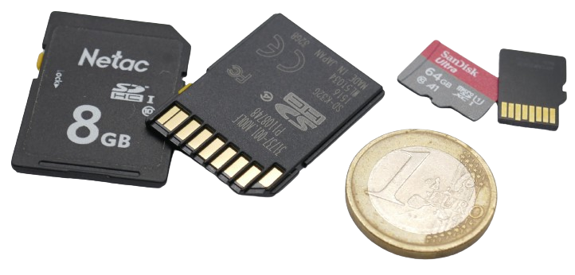
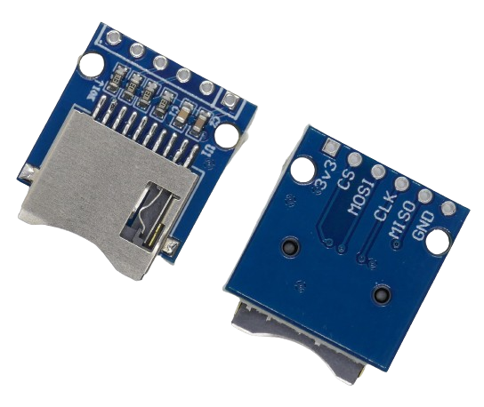
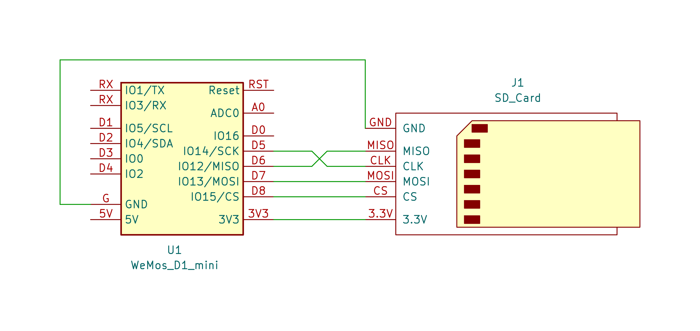
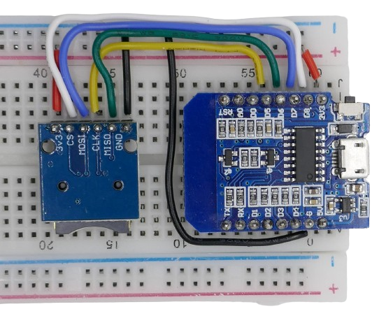
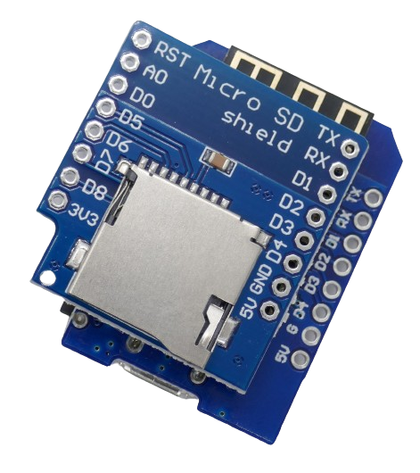
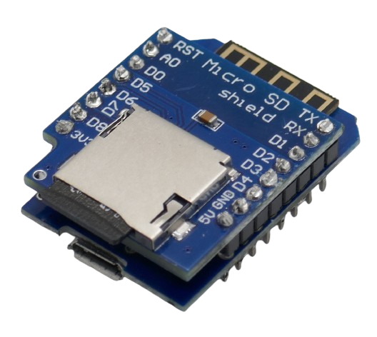
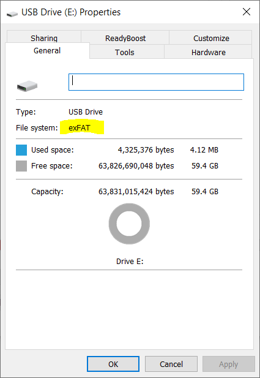
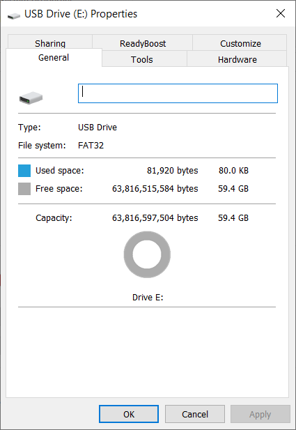

# Permanent Storage on SD Cards
:stopwatch: Reading time: 10 minutes.


## Overview

SD Cards (memory cards) can store large amounts of data permanently, and since SD cards can be removed, they are an excellent way of transferring data (i.e. sensor data) to a PC to do evaluations. 




### Life Span

There is no definite life span of SD Cards and they can probably last 10 to 30 years. 

SD cards use a special type of Flash memory called *NAND*. Flash memory in general has a finite number of write cycles. Saving, deleting, and re-writing data contributes to the wear of SD cards.

Modern SD cards employ advanced wear-leveling technology for even distribution of data across all memory cells. When you store relatively small amounts of data, the overall life-span is further extended.

> [!TIP]
> Flash memory (including SD cards) is not ideal for storing sensor data in high frequency. This increases the wear and tear of the card.
>
> That said, if you use SD cards to store sensor data in a measuring device, while it is in operation it may indeed stress SD cards. Typically though such devices are used only occasionally and for limited time. Using SD cards can be a cheap and reliable way of storing the data even for devices that log data in high frequency.
>
> If you need a more *resilient* way of permanent data store (and the data is relatively small), you may want to also look into the new *FRAM* storage which does not wear out.


### Speed

For typical data logging applications, read and write access times are no issue.

### Size

The initial SD cards stored up to *2GB*. Modern SD cards can store *128GB* and more.

Always make sure the **SD Card Module** *and* the libraries you intend to use support SD cards with the size you have. 

> [!NOTE]  
> *4GB* is the maximum amount of memory addresses that can directly be addressed by *32 bit*.


### Physical Dimensions

The *classic* SD cards are the largest with dimensions of 24x32x2.1mm. Newer *microSD* format is considerably smaller: 11x15x1mm. Many **SD Card modules** support only the *microSD* form factor.

## SD Card Modules

**SD Card Modules** are small breakout boards with a slot to fit in the **SD Card**. They read and write data and communicate with microcontrollers using **SPI** (4 GPIO pins).



There are also *Shields* available for *specific* microcontrollers such as the *Wemos D1 Mini*. *Shields* are breakout boards that are designed to be pin-compatible with a host board. *Shields* can be mounted directly on the microprocessor board and require no wiring:


Things to watch out for before choosing a **SD Card Module**:

* **Voltage:** Internally, **SD Card Modules** use 3.3V technology. Breakout boards may expose a *3.3V* pin, may have both a *3.3V* and *5V* pin and use an internal voltage regulator when needed, or seldomly just have a *5V* pin (in which case these modules do not work with *ESP8266* and other 3.3V microcontrollers unless you manually cut wires on the breakout board to disable the voltage regulator).
* **SD Card Format:** Most modules have slots for small *microSD* cards and do not support the bulky classic *SD Card* format any more.
* **SD Card Size:** Some modules impose restrictions on the maximum size of **SD Cards**. They handle a maximum size of *8GB*, *4GB* or even just *2GB*.

### Pin Layout

**SD Card Modules** come with at least six pins:

| Pin Label | ESP8266 (adjust pins for other microcontrollers accordingly) |
| --- | --- |
| VCC | 3.3V (may be 5V tolerant, check datasheet) |
| GND | Ground pin **G** |
| CS | D8 (adjustable)  |
| MOSI | D7 |
| CLK | D5 |
| MISO | D6  |

Some modules feature an additional *5V* pin and use a voltage regulator when this pin is used.

> [!NOTE]  
> Essentially, the pins resemble the *power supply* (**VCC** and **GND**) and *communications* via *SPI*.
>
> Different microcontrollers have different *SPI* pins. Most *SPI* pins are typically fixed and assigned to specific microcontroller pins. **CS** can be freely assigned to any suitable *GPIO* pin.
>
> If you plan to use a microcontroller other than *ESP8266*, look up the designated *SPI* pins for your model.

### Schematics

This is the schematics to connect a **SD Card Module** to a *ESP8266*:




### Breadboard

This is what the actual wiring on a breadboard looks like:



If you use a *Shield* instead, no wiring is required. Just make sure you stack the *Shield* on top of your microcontroller board in a pin-compatible orientation.




Then use header pins and solder or stick them together.



## Code

Code samples are downloadable for [platformio]() and [Arduino]().

Include the libraries *SPI.h* and *SD.h*. They are included in the *Arduino framework* by default.

The pins for the *SPI* connection are predefined by the microprocessor hardware. In the code, adjust the pin for *chipSelect*. In this example, **D8** is used. Make sure the baudrate for the serial output matches your *IDE* settings. The example uses a baudrate of 115200.

The sketch below illustrates the basic I/O operations: listing SD card contents, creating a file, writing to it, appending it, and reading it.

> [!CAUTION]
> Before you *build*, *upload* and *monitor* the sketch, make sure you insert a *SD Card*. The *SD Card Module* is only operational when a *SD card* is inserted and else will not respond.
>
> If things still don't work for you, please check the next paragraph on how to adequately *prepare* the *SD card*.

```c++
#include <Arduino.h>
#include <SPI.h>
#include <SD.h>

/*
 * D5 = CLK
 * D6 = MISO
 * D7 = MOSI
 * D8 = CS
*/

// CS (chip select) is freely configurable. In this example, D8 is used:
const int chipSelect = D8;
const String FILENAME = "samplefile.txt";

File myFile;

// helper function to dump folder content:
void printDirectory(File dir, int numTabs) {
   while(true) {
     File entry =  dir.openNextFile();
     if (! entry) {
       // no more files
       break;
     }
     for (uint8_t i=0; i<numTabs; i++) {
       Serial.print('\t');
     }
     Serial.print(entry.name());
     if (entry.isDirectory()) {
       Serial.println("/");
       printDirectory(entry, numTabs+1);
     } else {
       // files have sizes, directories do not
       Serial.print("\t\t");
       Serial.println(entry.size(), DEC);
     }
     entry.close();
   }
}  

// illustrates how to dump folder content recursively:
void listDriveContent() {
  // Demo 1: list content of inserted SD card
  File root;
  root = SD.open("/");

  printDirectory(root, 0);
}

void testFileExists(String filename) {
  if (SD.exists(filename)) {
    Serial.println("File exists.");
  }
  else {
    Serial.println("File doesn't exist.");
  }
}

// demonstrates how to create files and write text
void addTextToFile(String filename, String text) {
  // Only one file can be open at a time,
  // Make sure you ALWAYS close files after use as quickly as possible
  myFile = SD.open(filename, FILE_WRITE);

  if (myFile) {
    Serial.println("Writing text");
    myFile.println(text);
    myFile.close();

    Serial.println("File written.");
  } else {
    // on failure emit a message
    Serial.println("Error writing to file.");
  }
}

void readFile(String filename) {
  myFile = SD.open(filename, FILE_READ);
  if (myFile) {
    Serial.println("Reading file content:");
    // read character by character until end of file is reached:
    while (myFile.available()) {
      Serial.write(myFile.read());
      // small delay so you can see how the data is read char by char:
      delay(100);
    }
    myFile.close();
  } else {
    Serial.println("Unable to open file for reading.");
  }
}

void setup()
{
  // adjust baud rate to match your IDE or platformio.ini settings:
  Serial.begin(115200);

  Serial.print("Initializing SD card...");

  // make sure you inserted a SD card, and the inserted SD card matches the requirements
  // (i.e. FAT formatted, size within maximum size limits of SD card reader)

  // some modules will not initialize without inserted SD card
  if (!SD.begin(chipSelect)) {
    Serial.println("SD Card module not found. Make sure you inserted a SD card.");
    return;
  }

  Serial.println("SD Card module found.");
  
  listDriveContent();
  testFileExists("zumsel.abc");
  addTextToFile(FILENAME, "Hello World!");
  testFileExists(FILENAME);
  addTextToFile(FILENAME, "more text");
  readFile(FILENAME);
  
}

void loop() {
}
```

## Preparing SD Cards

To limit sources of faults, before you use a *SD card*, first try it on a *PC*. It is not uncommon for older *SD cards* to simply not work correctly anymore:

* Insert the SD card into your PC. If your PC has no SD card reader (many do), you might want to get a cheap USB card reader. After all, the whole point of using *SD cards* is to carry sensor and other data over from your DIY devices to your computer.
* Check whether the SD card is correctly identified by your PC. If the PC prompts you to format the SD card, do format it. Use the *FAT* filesystem.
* Open the *SD card drive* in *explorer*, and copy a few files on it.
* Eject the *SD card*, wait a minute, then re-insert the card. Check whether the card still works and whether you can retrieve the stored files.

> [!IMPORTANT]  
> *SD Card modules* can only read and write *SD cards* formatted with the *FAT32* filesystem. *SD cards* larger than *4GB* typically are formatted using the *exFAT* filesystem. Such *SD cards* will not work in *SD card modules*.
>
> You can find out the current filesystem by right-clicking the *SD card* drive in *Windows Explorer*. Choose *Properties*. The dialog shows the file system in use.
>
> If the dialog shows a filesystem other than *FAT32* (i.e. *exFAT* or *NTFS*), you need to convert it to *FAT32* before you can use it. See below for instructions.



Once your *SD card* has passed all checks, insert the *SD card* into your *SD card module* slot. Make sure the contacts face towards the board, and do not use force.

Some boards have a *snap* mechanism while others simply slide the card in and out without any lock. 

With *snap* mechanisms, you need to gently *push* the *SD card* to release them when you want to eject and remove them.


## Converting SD Card Media to FAT32

> [!IMPORTANT]  
> Before you format a SD Card, make sure it is not *write protected*: try and copy a file to it. If this fails, you need to remove the write protection. If there is no physical switch on the SD Card to remove write protection, the reason can also be your SD Card reader in your PC. Try rebooting the PC, and if this doesn't help, try using a USB external SD Card reader.


### Using Built-In Tools

*SD cards* smaller than *32GB* can be converted to *FAT32* using the built-in *Windows* tools:

1. Right-click the *SD card* drive in *Windows Explorer*, then choose *Format*.
2. In the *File System* dropdown list, choose *FAT32*. If you cannot see this option, the *SD card* is larger than *4GB*. You then need to do the format using the console command described below.
3. Check *Quick Format*, then click *Start*.


If the dialog does not list the *FAT32* file system, then use a more powerful console command:

1. Press `WIN+R`, then launch `cmd` or `powershell`. A console windows opens.
2. Enter this command: `format /FS:FAT32 e:`. Replace `e:` with the drive letter of your *SD card* drive.
3. Press `ENTER`. The process may take an hour.

### Using 3rd Party Tools for Big Drives 

If the command does not complete successfully and instead complains that the *SD card* is "too large", then it is probably larger than *32GB*. Microsoft has decided to not support formatting drives larger than *32GB* to *FAT32* even though this is technically possible, and most operating systems (including *Windows*) do support *FAT32* drives of up to *2TB*.

You then need the help of 3rd party tools. Most freeware tools for this purpose do not work in *Windows 10/11* anymore. [MiniTool Partition Wizard](https://de.minitool.com/downloadcenter/) still does, and its *free* and functionally limited version fortunately covers the file system conversion.

Once you downloaded and installed the *free* version, a window opens and shows all partitions of all disk drives in your computer. 


In the lower part of the window, identify the partition that represents your *SD card* drive, and right-click it. Choose *Format*. This time, the *Format* dialog offers all available file systems. Select *FAT32*, then click *OK*.


This adds the job to a task list. In the left lower section of the main window below *Operations Pending* you see the formatting job. Click *Apply* to actually perform the formatting.

The *SD card* is now running the *FAT32* file system and can be used with the *SD card module*. Its size hasn't changed. This way, you can now use *SD cards* with *64GB* in size (or more) with your *SD card module.




## Troubleshooting

A few thoughts when things don't work at first:

If the sketch above cannot even find the *SD card reader*, work your way through these items:

* Double-check your wiring. In the code, check that you defined the *chipSelect* pin correctly.
* If you do not use a *Wemos D1 Mini* microprocessor board (or compatible), make sure you connect the wires to the correct **SPI** pins. Remember: pin *labels* (like **D6**) and pin numbers (like **6**) are *not* the same.
* Make sure you fully inserted a *SD card* that you have tested on your PC before and that is working correctly. When no *SD card* is inserted or when the *SD card* is not working right, the sketch won't find the *SD card module* or can produce random errors.
* Make sure your *SD card* is using the **FAT** or **FAT32** filesystem, not **exFAT**. If your *SD card* is larger than *32GB*, manually re-format it with the **FAT32** filesystem (as described above). 
* If things still do not work for you, try using a *SD card* with a maximum size of *2GB*. They are hard to get but definitely available.

:eye:&nbsp;[Visit Page on Website](https://powershell.one/doneland_test/components/storage/permanent/onsdcards?443812020426240854) - last edited 2024-02-27
