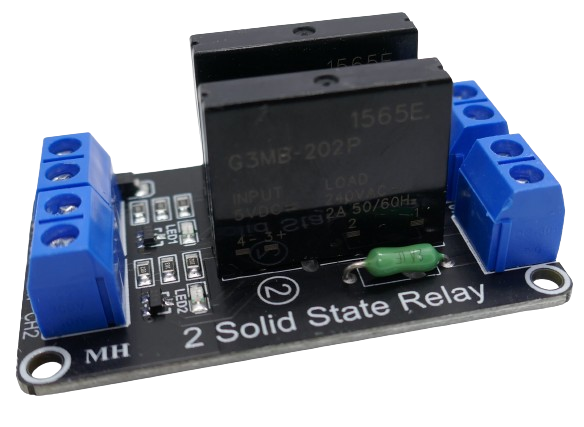
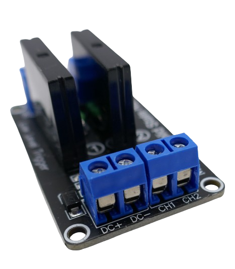

 
# 2A G3MB-202P

> Light-Weight Solid State Relais For AC Voltage

The *G3MB-202P* is a low-cost subminiature PCB-mounting solid state relais capable of switching AC loads of up to 2A.

> [!CAUTION]
> This SSR can be an excellent choice for switching light **AC** loads like *lamps* or *fans*. With its limit of *2A*, at *220V* this allows switching loads of less than *440W*. Considering tolerances and *current spikes* at turn-on, you should not use this SSR for loads in excess of *200W*.

## Overview
The *G3MB-202P* is a widely used *SSR* for switching *AC loads* in a very small form factor. Its relatively low switching capabilities of just *2A* make it a choice for switching very light loads such as *lamps* or *small fans*.

It is often used with *breakout boards* that can use a single *SSR*, or combine two, four, or even eight *SSR* on one board.

> [!CAUTION]
> This *SSR* is designed to switch **AC** loads. You cannot switch **DC** loads with it.

### Power Requirements
The *SSR* requires a basic *5V* power supply (**DC+**/**DC-**) and takes *12.5mA* per *SSR*. Triggering takes another *2mA* per *SSR* (**CH1**, **CH2**, etc.).

### Low/High Level Trigger
On *breakout boards*, the *SSR* can be operated in two different ways:

* **Low Level Trigger:** when the trigger signal is *low* (0-2.5V), the *SSR* is *on*. When the trigger signal is *high* (*3V* or above), it is *off*.
* **High Level Trigger:** opposite behavior: the trigger input must be *high* in order for the *SSR* to be *on*.

> [!NOTE]
> Regardless of trigger type, when you cut the power supply to the board, the *SSR(s)* turn off (become non-conductive): even a *low level trigger* board with *0V* at its trigger pin will cut the load once the power supply is removed from the board.

Microcontroller-based projects can work well with both trigger types. You may be able to tweak overall power consumption though: 

When the load you want to control is typically turned *on* most of the time, a *low level trigger* may save *2mA* per *SSR* by keeping the *SSR* in *on*-state via *0V*. When the load is turned off most of the time, it is the other way around.

## Wiring 
Breakout boards come with screw terminals on both sides of the board. 

### Power Supply And Triggering
One side controls power supply and the *SSR state*:

| Terminal | Description |
| --- | --- |
| DC+ | 5V in (4-6V DC) |
| DC- | GND |
| Ch1 | logic level for first SSR |
| Ch2 | logic level for second SSR |
| Chx | one *Chx* pin for each additional SSR |

> [!IMPORTANT]
> *G3MB-202* comes in *5V*, *12V*, and *24V* versions. Double-check the markings on the *SSR* to ensure you are using the correct version and supply voltage. This article covers the *5V* version.

The trigger pin takes a *logic level*:

* **Low:** *0V-1.5V*
* **High:** *2.5V-5V*

Depending on the *board type*, a *low level trigger* requires a *low* level to turn the *SSR* on, whereas a *high level trigger* requires a *high*.

> [!TIP]
> *Breakout boards* work well both with *5V Arduinos* and *3.3V ESP8266/32*. Just make sure you supply *5V* to **DC+**/**DC-**. The trigger pins can then be directly connected to a *GPIO* and require only *2mA*.

### Switching Loads

The screw terminals on the other side control the *AC load*:

| Terminal | Description |
| --- | --- |
| SW1 | two screw terminals become conductive when first *SSR* is turned *on* |
| SW2 | two screw terminals become conductive when second *SSR* is turned *on* |
| SWx | two screw terminals become conductive when additional *SSR* is turned *on* |

#### Zero Crossing
*Zero Crossing* is a technique by which a *SSR* switches an *AC* load when the alternating voltage crosses *0V*, minimizing the stress on the components.

*G3MB-202P* does not support *Zero Crossing* whereas *G3MB-202PL* does.

### Trigger Pins

The trigger pins (**Ch1**, **Ch2+**, ...) can be connected directly to a *GPIO*. 

These *input* pins are compatible with both *3.3V* and *5V* and do not require a level shifter. With just *2mA*, they can easily be serviced by a *GPIO output pin*: they essentially just drive the *LED* in the internal optocoupler.

### AC Load(s)

The load side (that connects the *AC load* that you want to switch) is using **dangerously high AC voltage**. Always take extreme care and use proper insulation.

The *PCB* is physically separated into the *low voltage control part* and the *high voltage switching part*. The *SSR* internally uses *optocouplers* to electrically separate both sides.

> [!IMPORTANT]
> The screw terminals on the load side must be tighly secured. These wires are connected to dangerous *AC current*. Make sure these wires cannot be *pulled* or slip out of the terminals in any other way. 

## Typical Wiring Scenario
The *SSR* can be destroyed when you exceed the allowable input voltage (the datasheet states an allowable input voltage of *4.0-6.0V*).

Here are your safe power options for connecting **DC+** and **DC-**:

* **USB Power:** if you power your microcontroller project via *USB*, the voltage is guaranteed to be within safe levels. Connect **DC+** directly to *USB 5V+* and bypass the internal microcontroller voltage regulator (if present).
* **External Power (4.0-6.0V):** when using an external power supply, if this supply is guaranteed to be in the *4.0-6.0V* range, you can again directly connect **DC+** to your external power.
* **External Power (>6.0V):** if your external power exceeds *6V* (or you cannot guarantee safe voltage levels), connect **DC+** to the *5V pin* on your microcontroller, and use its built-in voltage regulator to ensure a proper input voltage. 

> [!TIP]
> Some microcontroller boards (especially *ESP8266 D1 Mini*) come with weak voltage regulators that may not be able to provide the currents required. When you experience unexpected reboots, you may not be able to run **DC+** off the *5V pin*. In this case, use an appropriate external power supply or a separate distinct voltage regulator.

## Data Sheet
[G3MB](materials/g3mb_datasheet.pdf)

> Tags: SSR, Omron

[Visit Page on Website](https://done.land/components/switch/relais/solidstate/2ag3mb-202p?041242081801240746) - created 2024-07-31 - last edited 2024-07-31
